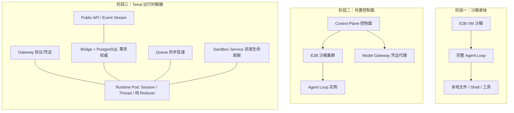
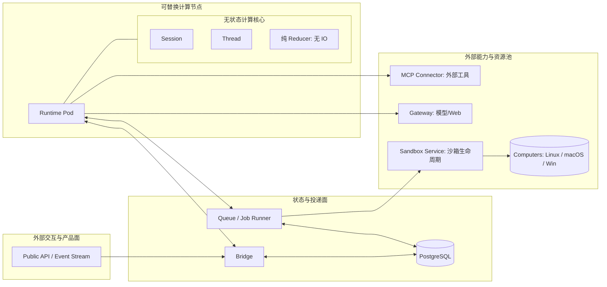
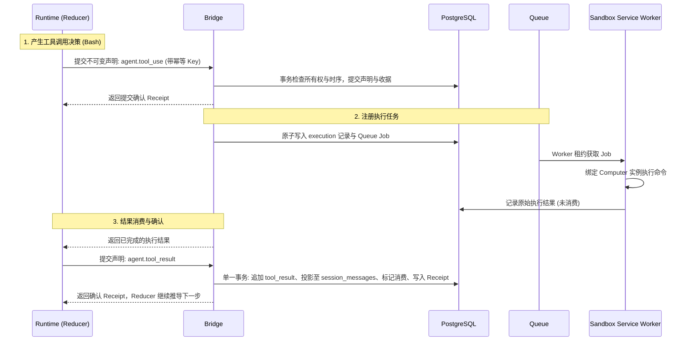
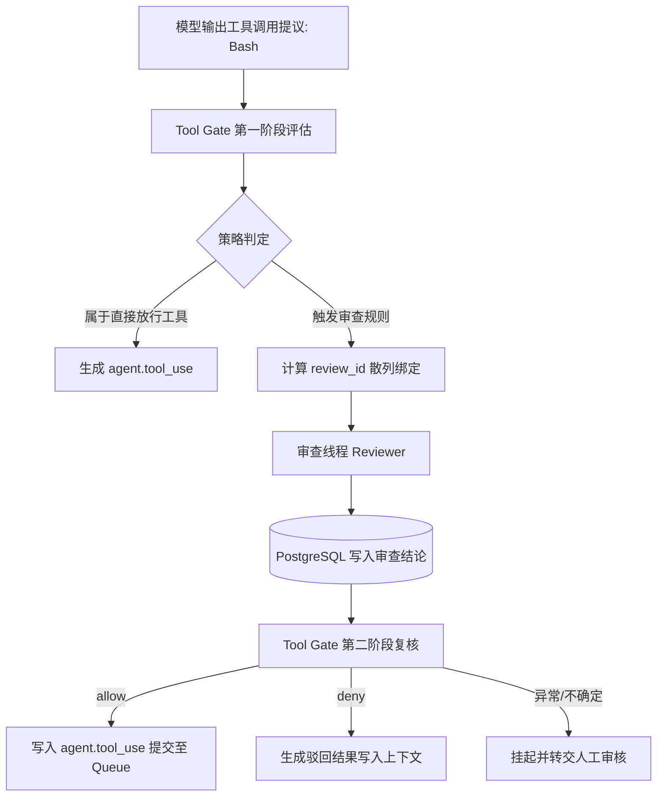

# Tetral Agent 运行时架构

## 问题

当本地 coding agent（如 Claude Code、Codex）向云端多租户系统扩展时，传统做法是将整个 agent loop 部署在虚拟化环境（如 E2B 虚拟机沙箱）内。这种「以沙箱作为容量单位」的模式，带来了沙箱生命周期抖动、调试依赖高特权私有环境、模型凭证难以管控以及扩展成本过高的问题。云原生 agent 基础设施应该如何划定运行时边界，使执行、状态、凭证和算力资源能够独立演进与水平扩展？

## 简答

Tetral 的核心洞察在于：**「计算机是被 agent 调用的外部资源，而不是 agent 居住的地方」（A computer should be something the agent calls, not somewhere the agent lives）。**

Tetral 将外部集成（Gateway）、状态持久化（Bridge + PostgreSQL）、异步调度（Queue）、计算沙箱（Sandbox Service）以及对外 API 彻底剥离出执行进程，仅保留无网络与无数据库 I/O 的纯函数 reducer 处理会话与线程状态。基于借用自 WAL 的 Write-Ahead Execution 机制，系统在派发任何外部操作前必须先提交确定性声明并获取幂等凭证（receipt），依托单一 PostgreSQL 事务权威保障状态自愈与崩溃恢复，并在工具执行前建立独立于凭证隔离的确定性授权（Tool Gate）。

## 架构演进与运行时边界

### 从单体沙箱到职责解耦

将本地 agent 迁移至云端通常经历三个阶段：



在阶段一与阶段二中，沙箱是扩缩容的原子单位。高频创建销毁沙箱不仅遭遇平台调度器瓶颈（如 Kubernetes Pod 或虚拟机调度延迟），且会话历史与鉴权密钥留在沙箱内，导致排错与安全治理受限。

Tetral 确立了清晰的进程与服务边界：



| 系统组件 | 独立职责 | 状态与调用约定 |
| --- | --- | --- |
| **Gateway** | 供应商模型请求标准化、流式协议转换、Workload Identity 认证与 OAuth 凭证无感刷新 | 无会话状态，纯无状态反向代理；真实凭证绝不流向 Runtime Pod 与 Sandbox |
| **Bridge** | 维护 PostgreSQL 数据库连接、强校验租户所有权与消息序列号、提交事务并颁发收据 | 作为数据库协议权威，隔离业务逻辑与 SQL 交互细节 |
| **Queue** | 任务排队、租约管理（Lease）、重试、死信与任务取消 | 基于 Transactional Outbox 机制与业务数据原子入库，`pg_notify` 仅作低延迟唤醒，轮询保障兜底 |
| **Sandbox Service** | 按需激活（复用/启动/创建/替换）、会话资源挂载（Materialization）与异常节点剔除 | 接受 Queue 调度，命令下发时绑定固定 Computer 实例标识与租约代数 |
| **Runtime Pod** | 加载线程检查点，运行纯 reducer 推导下一步转移，提出操作声明 | 无持久化状态；崩溃时由任意空闲 Pod 依据 PostgreSQL 检查点即时恢复重建 |

与 Cursor 采用 Temporal 驱动工作流并另设只写追加的会话存储方案不同，Tetral 选择以 PostgreSQL 单一事务引擎兼顾会话历史、上下文投影与队列状态，降低系统外部依赖复杂度。

## 核心机制设计

### 1. Write-Ahead Execution（预写式执行）

为了支持 Runtime Pod 崩溃后能被其他 Pod 任意替换且不产生重复外部副作用，Tetral 借鉴 WAL（Write-Ahead Logging）思想制定推进规则：**任何推进线程状态或产生外部操作的转移，必须在实际分发前提交至数据库并获得凭证（Receipt）。**



数据表设计承袭 OpenCode v2 的「事件日志与投影分离」原则：
- `session_events`：严格按递增序列排序的不可变事件日志（用户输入、模型请求区间、工具调用、工具结果、外部中断）。
- `session_messages`：提供给 LLM 上下文的投影。用户输入按序追加；Assistant 消息在流式请求中累积；压缩机制（Compaction）生成新的摘要检查点作为新加载起点，但原始 `session_events` 完整保留供溯源检索。
- `session_bridge_operations`：记录已提交声明的幂等标识与收据，防止重复执行。

### 2. Durable Delivery（持久化消息投递）

当外部输入到达时，系统采用 Transactional Outbox 模式：
1. **原子提交**：在同一个 PostgreSQL 事务中，将输入事件写入 `session_events`、创建目标线程的 `Inbox` 记录，并生成指向该记录的 `Queue` 任务。
2. **异步唤醒与投递**：提交后通过 `pg_notify` 触发 Bridge 的 Job Runner。若通知在网络异常中丢失，Job Runner 定期轮询机制会扫描未处理任务。
3. **隔离与栅障**：队列严格保证同一目标线程内的输入顺序推进；不同线程并行处理。会话级中断命令被视为栅障（Barrier），绕过常规输入队列优先处理。
4. **Fencing Token 防止脑裂**：利用 Pod UID 与绑定代数（Generation）作为隔离令牌。仅当 Kubernetes 确认旧 Pod 实例彻底终止后，超时的租约才允许重新释放并由新 Pod 接管。

### 3. 凭证隔离与模型调用

- **Workload Identity**：Runtime Pod 不存放任何平台 API Key 或 OAuth Token。发起模型请求时，Pod 仅携带 Kubernetes 身份证明及由 Bridge 签发的短期线程租约 Token。
- **网关接管鉴权**：Gateway 验证短期 Token 后，根据 Session 配置拉取对应凭据，注入请求头并转换为统一的 Vercel AI SDK 规范，通过 gRPC 返回标准化 `ProviderStreamEvent`。
- **Token 刷新防泄漏**：OAuth 刷新由 Gateway 在行锁保护下独立完成并写回存储。明文 Secret 全程不经过 Runtime Pod、Bridge、日志或沙箱。
- **MCP 连接规范**：MCP 工具定义由 Bridge 向 MCP Connector 预先抓取并固化版本。Runtime 仅持有工具名与入参 Schema；触发 MCP 工具时，声明经由 Bridge 记录，由 MCP Connector 注入鉴权凭证向远端发起调用。

### 4. 计算机资源化（Computers as Resources）

在 Tetral 中，沙箱并非随会话创建而静态绑定，而是作为一种算力资源被延迟分配（Lazy Allocation）：
- **状态感知激活**：当且仅当 agent reducer 提出需要操作系统交互的工具声明（如 Bash、文件读写）时，Sandbox Service 才为任务拉起沙箱或复用温热沙箱。
- **并发归并与排队**：若沙箱尚未就绪，执行任务在数据库中标记为 `waiting_activation`，并关联至一个 Activation 任务。多个并发执行请求可以共享同一次初始化，避免重复创建资源。
- **资源具象化（Materialization）**：环境准备就绪后，挂载工作区文件、配置与会话凭证，随后任务以新的 generation 重新入队派发执行。
- **防止陈旧 Worker 乱序写入**：下发命令前严格绑定具体的 Computer 实例标识与租约代数。已被替换或超时的旧 Worker 无法将结果写入新的容器实例。

### 5. 任务与上下文的两维扩展

为避免多任务并发竞态污染单一上下文，Tetral 区分两个扩展维度：

```
Workspace（存储资源、仓库文件、持久记忆、通用工具与技能）
  ├── Session A（独立业务任务，拥有专属配置、生命周期与历史）
  │     ├── Root Thread（主 Agent 核心上下文推进）
  │     ├── Child Thread 1（Subagent 独立上下文）
  │     └── Child Thread 2（审查 / 调研子线程）
  └── Session B（独立业务任务）
        └── Root Thread
```

- **子代理生成与 `fork_turns`**：父线程通过 `spawn_agent` 生成子线程时，显式指定继承策略：
  - `none`：不继承父线程历史，完全从干净上下文开始。
  - `all`：继承父线程当前全部保留历史。
  - `N`：仅截取最近 N 轮交互作为上下文基线。
- **线程通信解耦**：子线程的创建、`send_message` 及最终完成，全部通过 Bridge 的事务投递管道转化为标准事件与 Inbox 记录；不同线程间无法直接读写彼此的内存上下文。

### 6. 独立授权与 Tool Gate（工具网关）

凭证隔离仅能限制对服务接口的访问，无法决定具体的一次高危行为是否应当放行。为此，Tetral 构建了在执行前运行的确定性鉴权流水线：



- **确定性散列绑定**：审查凭证 `review_id` 由上下文要素确定性计算得出：
  $$\text{review\_id} = H(\text{workspace}, \text{session}, \text{thread}, \text{request}, \text{tool\_call}, \text{tool}, \text{action}, \text{policy})$$
  任何参数改动均会产生全新的审查对象，杜绝重放攻击与参数篡改。
- **证据与指令物理隔离**：审查器以独立线程运行，系统内置的防越狱/防注入安全策略与待审查的上下文材料分离，待审文本一律视为无执行权限的不可信证据。
- **安全失败原则（Fail-closed）**：任何格式错乱、审查超时或中间节点故障，均直接导致审查失败并回退至人工确认，确保**「不确定性永远不会自动转化为放行许可」**。

## 综合评估与工程约束

### 与其他方案的选型对比

| 架构维度 | 单体沙箱模式 (Manus / E2B) | 工作流引擎重放 (Cursor / Temporal) | 关系数据库事务权威 (Tetral) |
| --- | --- | --- | --- |
| **运行时驻留点** | 整体放进虚拟机沙箱内 | 运行在独立 Worker 进程中 | 运行在独立无状态 Pod，沙箱沦为纯外部资源 |
| **恢复机制** | 依赖沙箱快照与文件恢复 | 依赖 Temporal 重放 Event History 恢复调用栈 | 依赖 PostgreSQL 事件日志投影，由纯 Reducer 直接恢复检查点 |
| **外部通信可靠性** | 进程退出可能导致状态撕裂 | 由 Temporal 活动重试机制保障 | 由 Write-Ahead Execution 声明 + 幂等收据保障 |
| **多代理扩展边界** | 多沙箱通信成本与编排开销高 | 嵌套 Child Workflow | 统一会话下的多独立线程，通过 Outbox 投递通信 |
| **凭证治理** | 密钥易泄漏于沙箱内 | 外部服务提供，但常驻 Worker | Gateway 隔离，Workload Identity 短期授权，明文不落节点 |

### 周边基础设施的扩展瓶颈

Tetral 在实践中指出，当 agent 系统的逻辑复杂度解耦后，系统的瓶颈迅速向周边工具链转移：
1. **语言工具链吞吐与开销**：活跃线程高频触发编辑与类型检查，使得传统工具链成为延时大头。例如 TypeScript 转用 Go 重写、Bun 向 Rust 迁移，根本动力均来自于高并发下的内存与执行瓶颈。
2. **高频沙箱调度能力**：高频创建与销毁沙箱时，传统编排系统的串行化调度器（serialized scheduler）与 Pod 生命周期管理会迅速成为瓶颈，支撑百万级并发沙箱需要像 Modal 一样重构底层控制面。
3. **协作产物沉淀而非对话堆叠**：多 agent 协作的有效吞吐不能依赖无休止的消息广播（上下文爆炸），而应基于「经由独立审查后准入（Admitted）的产物版本（Artifacts）」，使得系统认知能够沿版本单向演进。

### 当前系统局限

Tetral 当前仍处于 Alpha 阶段，存在以下明确边界与限制：
- **调度感知不足**：当前基于个人 k3s 集群开发，缺乏基于 Runtime Pod 实际容量与算力负载的感知调度能力。
- **背压链条不完整**：API 准入控制、Queue 堆积压力与底层的 Worker 动态扩缩容之间尚未建立联动的背压机制。
- **热更新优雅退出**：新版本发布时，正在流式生成的请求会被强行中断为 `runtime_pod_lost`，尚未实现平滑排水与跨版本迁移。

## 相关页面

- [[wiki/topics/ai/agent-harness|Agent Harness]]
- [[wiki/topics/ai/agent-harness-design-tradeoffs|Agent Harness 设计取舍]]
- [[wiki/syntheses/ai/agent-loop-control-boundaries|Agent 循环工作流的控制边界]]
- [[wiki/syntheses/ai/persistent-agent-harness-design-patterns|持久化 Agent Harness 的设计模式]]
- [[wiki/syntheses/ai/agent-native-system-interface-design|Agent Native 系统接口设计]]
- [[wiki/topics/ai/agent-orchestration-platform|Agent Orchestration Platform]]
- [[wiki/syntheses/ai/openseek-architecture-overview|OpenSeek 项目架构总览]]

## 来源指针

- 原始素材文件：`raw/sources/2026-10-02-the-next-scaling-problem.md`
- 原文出处：[Tetral Blog: The Next Scaling Problem](https://tetral.ai/blog/the-next-scaling-problem/)
- 关联系统与论文先例：
  - Cursor: [Cloud Agent Lessons](https://cursor.com/blog/cloud-agent-lessons) & [Git at any scale](https://cursor.com/blog/git-at-any-scale)
  - Modal: [Scaling to 1 million concurrent sandboxes in seconds](https://modal.com/blog/scaling-to-1-million-concurrent-sandboxes-in-seconds)
  - OpenCode v2: [Event table schema](https://github.com/anomalyco/opencode) & [Compaction docs](https://opencode.ai/v2/docs/compaction)
  - OpenAI: [Hugging Face Incident](https://openai.com/index/hugging-face-incident-and-the-road-ahead/) & [Codex Auto-Review](https://developers.openai.com/codex/sandboxing/auto-review)
  - Anthropic: [Claude Code Auto Mode](https://www.anthropic.com/engineering/claude-code-auto-mode) & [Managed Agents API](https://platform.claude.com/docs/en/managed-agents/agent-setup)
