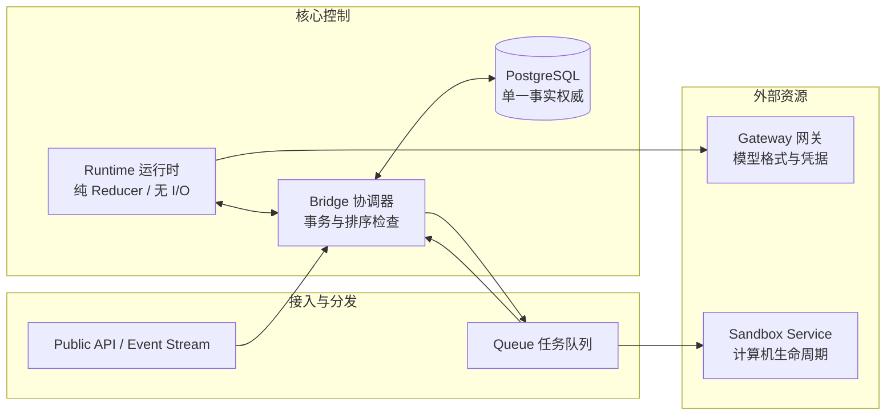

# 云端 Agent 运行时与系统边界

## 问题

把 agent 循环（loop）从传统虚拟机沙箱中拆出来后，云端多租户系统应该怎样划分模块边界、处理执行副作用与状态恢复，才能支撑高并发和长周期任务？

## 简答

将 agent 进程定位为纯 reducer 计算过程（即运行时），把模型集成、状态存储、消息分发、沙箱生命周期和公共接口完全剥离为独立服务。
状态以 PostgreSQL 事务为单一事实权威，采用类似 WAL 的提前写入执行（Write-Ahead Execution）策略，在发起任何外部调用或副作用前必须先落库声明。
将沙箱和计算机降级为按需延迟分配的被调用资源。
在权限层面解耦凭据分发与行为授权，通过两阶段工具门控（Tool Gate）和确定性哈希绑定的独立审查线程，确保未明确记录许可的行为绝不执行。

## 综合结论

### 1. 沙箱不作为容量单位：运行态与执行环境分离

在早期设计（如 Anoma 或将本地循环整体打包进 E2B）中，整个 agent loop 运行在虚拟机沙箱内部：
- **容量单位错位**：沙箱的启停、冷启动与销毁直接绑定了 agent 容量。沙箱是昂贵、易损且生命周期短暂的执行单元，而 agent 逻辑是长期演进的稳定服务。
- **状态与调试混杂**：会话历史滞留在用户环境内，排查故障需要直接接触含有用户私有数据的容器。
- **凭据暴露风险**：为了让沙箱内循环调用模型，必须在沙箱内注入或通过复杂网关中转 API 密钥。

Tetral 确立的核心分工是：**计算机（Computer）是 agent 调用的外部资源，而不是 agent 运行的宿主环境**。Linux、macOS、Windows 或不同类型的容器只是执行命令的一类外部工具。

### 2. 六大服务职责划分与运行时收敛

为让 Kubernetes 容器可以随时替换且不丢失状态，Tetral 将所有生命周期、扩展模式不同的职责从运行时进程剥离：



- **Gateway（模型网关）**：封装模型供应商格式、密钥注入、连接池与流式响应转换。自身不保留会话状态，支持独立水平扩展。
- **Bridge（存储与事务协调器）**：独占 PostgreSQL 协议和事务控制，在状态推进前负责校验归属、操作顺序与幂等回执。
- **Queue（任务队列）**：管理消息租约、超时重试、死信队列与取消逻辑，确保投递义务独立于生产端进程。
- **Sandbox Service（沙箱服务）**：负责底层虚拟机或容器的激活、复用、预热和销毁，承接具体的代码执行。
- **Public API & Event Stream**：接收外部 SDK 请求并对外暴露基于数据库有序记录的事件流，不参与内部执行逻辑。
- **Runtime（运行时进程）**：仅保留内存计算状态。它通过 Bridge 加载线程数据，运行纯 reducer 推导出下一个动作（请求模型、路由工具、等待输入或结束），自身不直接发起数据库或外部网络 I/O。

与 Cursor 选用 Temporal 配合独立对话追加日志不同，Tetral 倾向于将 agent 控制状态、恢复检查点和消息投影统一收敛到单一 PostgreSQL 事务边界内。

### 3. 提前写入执行（Write-Ahead Execution）与三表存储模型

计算节点随时可能崩溃重建，系统必须明确一项外部操作是否已经派发或完成。Tetral 借鉴数据库预写日志（WAL）的排序规则：**在执行任何外部副作用或推进线程前，必须先持久化操作声明并取得回执**。

存储设计借鉴 OpenCode v2 的事件与投影分离思路，由三张核心表构成：
1. `session_events`：按线程内顺序追加的执行事件总表（输入、调用边界、工具使用、工具结果、中断和结束）。
2. `session_messages`：面向模型上下文的投影表。请求过程中的文本、工具调用与结果实时累积；会话压缩（compaction）只更新未来请求载入的起点，不删除历史事件。
3. `session_bridge_operations`：记录操作声明的幂等回执。声明提交时携带稳定标识，重试相同标识直接返回已存回执，杜绝同一副作用执行两次。

在标准工具调用（如执行 Bash）中，系统执行完整的十步交互：
1. Runtime 声明工具调用需求（如 Bash #42）。
2. Bridge 校验归属与顺序，原子写入调用声明并返回回执。
3. Bridge 将执行记录与关联的 Queue 任务在同一事务中持久化。
4. 沙箱工作进程拾取任务，检查绑定的计算机状态。
5. 若计算机未就绪，将执行记录挂起为等待激活（`waiting_activation`）。
6. 生命周期进程完成计算机启动与工作目录挂载。
7. 该执行记录以新代际标识重新入队。
8. 工作进程在沙箱中执行 Bash，将原始结果写回暂存区。
9. Runtime 通过 Bridge 接收暂存结果，声明工具结果已产生。
10. Bridge 原子写入工具结果、更新消息投影、标记暂存结果已消耗并持久化回执，确认后 Runtime 的 reducer 才能计算下一步。

### 4. 事务出件箱与防裂脑投递

用户消息与外部输入采用事务出件箱（Transactional Outbox）模式处理：
- 接收消息时，在单次 PostgreSQL 事务中同时写入输入事件、目标线程的收件箱（Inbox）记录以及 Queue 投递任务。
- 事务提交后，数据库通过 `pg_notify` 唤醒 Bridge 的任务处理器。`pg_notify` 仅充当轻量唤醒信号，不承载任何实际数据；若通知丢失，轮询兜底仍能从 Queue 表拉取任务。
- **并发与顺序保证**：同一线程内的消息严格保序投递，后到的普通消息不能越过前一条处理中或重试中的消息；不同线程并行推进。全局中断信号则开辟特殊通道直达目标。
- **防裂脑与过期间隔防护**：网络超时不代表旧容器已停止。系统使用节点绑定代际（binding generation）与 Pod UID 构成屏蔽令牌（fencing token）。只有在 Kubernetes 确认旧 Pod 已彻底销毁后，Bridge 才会将收件箱任务重新释放给新 Runtime。

### 5. 凭据隔离与按需资源分配

- **工作负载身份与短时令牌**：Runtime 容器和沙箱内部均不保存 API Key 或用户 OAuth 凭据。Runtime 请求 Gateway 时，出示 Kubernetes 工作负载身份及 Bridge 签发的短周期会话令牌。
- **行级锁刷新**：OAuth 令牌刷新由 Gateway 在数据库锁定凭据行后完成，新令牌只在发往供应商的下游请求中注入，明文凭据绝不流入 Runtime 内存、Bridge 日志或沙箱。
- **MCP 访问控制**：会话初始化时由 Bridge 固化 MCP 工具定义版本。调用 MCP 工具时由独立连接器验证权限并注入凭据。
- **计算机延迟分配**：只有当模型实际触发需要操作系统的工具时，系统才为会话分配计算机实例，避免纯文本对话或 MCP 交互占用沙箱资源。

### 6. 两维扩展空间与子 Agent 隔离

系统在资源与状态上划分了两层隔离维度：

| 层级 | 职责与生命周期 | 共享边界 |
| --- | --- | --- |
| **Workspace（工作空间）** | 长期存在的资产（代码仓库、持久文件、记忆库、凭据库） | 跨 Session 共享持久资源 |
| **Session（会话）** | 单个持续性任务，固定 Agent 版本、配置与资源集合 | 会话内线程共享会话配置 |
| **Thread（线程）** | 独立的顺序执行路径，充当 Actor 级上下文隔离边界 | 拥有独立的上下文投影与顺序，不可跨线程直接修改上下文 |

衍生子 Agent（如后台审查、并行测试）通过创建子线程完成：
- **明确上下文分流**：使用 `fork_turns` 显式声明继承关系（`none` 不继承父历史、`all` 继承全部、或指定最近轮数），生成不可变的初始上下文快照。
- **受控消息通信**：创建子线程、消息投递（`send_message`）、等待完成（`wait_agent`）均视为有序输入，必须先落库生成收件箱任务再分发，杜绝内存通信丢失。

### 7. 授权与凭据解耦：两阶段 Tool Gate 与确定性哈希

控制凭据访问只解决“是否有连接能力”，不能保证“本次调用是否符合人类意图”。系统在执行前增设独立授权防线：
- **哈希绑定提案**：
  ```
  review_id = H(workspace, session, thread, request, tool_call, tool, action, policy)
  ```
  将审批决定严格锁定到单个具体提议上，任何参数或策略变动都会导致哈希改变，使原有批准失效。
- **两阶段评估**：
  1. **第一阶段**：模型输出工具调用后，Tool Gate 依据当前策略判定是否需要审核。若需要，并不向外派发工具调用，而是将提议连同父上下文输入派发给独立的审查线程（persistent/temporary reviewer thread）。
  2. **第二阶段**：审查线程输出判定后，Bridge 必须先将审查结果在 PostgreSQL 中落盘。Tool Gate 读取落盘结果进行第二轮评估。只有明确标记通过，才生成合法的公共 `agent.tool_use` 并推入执行队列。
- **宁失恢复，不给越权**：若在审查途中 Runtime 容器崩溃，未完成的提议直接标记为 Pod 丢失（`runtime_pod_lost`），系统放弃恢复该提议，要求重新发起，杜绝因状态模糊而误授权。

### 8. 制品中心协作 vs 对话流中心

在多 Agent 协同场景中，盲目在共享频道互发自然语言消息极易造成 Token 浪费与错误扩散。Tetral 倾向于以工作产物为中心的架构：
- 自由探索，严格合并：各 Agent 在独立 Session 或 Thread 中探索方案。
- 在进入共享工作空间前，候选产物必须通过其他 Agent 的对抗性审查（Adversarial Review）和人工确认。只有确认通过的制品（代码、文档、配置）才能作为后续探索的基线。

## 系统局限与未决问题

作为早期系统原型，该设计在实践中暴露出若干限制：
1. **调度与背压缺失**：Runtime 调度未充分感知宿主机实际负载，API 准入、Queue 堆积深度与节点自动扩缩容之间缺少联动的背压机制。
2. **多节点故障切换未充分验证**：多节点并发故障下的长事务与锁抢占仍需经过大规模生产流量检验。
3. **滚动更新中断在途会话**：部署新版本时缺少平滑切流与优雅等待（graceful draining）机制，导致运行中的推理轮次被意外截断。
4. **统一执行抽象仍在演化**：轻量级 Actor 运行时、微容器与完整操作系统沙箱之间，尚未形成完全一致的资源调度抽象。

## 相关页面

- [[wiki/topics/ai/agent-harness|Agent Harness]]
- [[wiki/topics/ai/agent-harness-design-tradeoffs|Agent Harness 设计取舍]]
- [[wiki/syntheses/ai/persistent-agent-harness-design-patterns|持久化 Agent Harness 的设计模式]]
- [[wiki/syntheses/ai/agent-native-system-interface-design|Agent Native 系统接口设计]]
- [[wiki/syntheses/ai/openseek-session-runtime-model|OpenSeek 会话与运行时模型]]
- [[wiki/comparisons/ai/agent-output-checks|Agent 输出检查]]

## 来源指针

- [[raw/sources/2026-10-03-the-next-scaling-problem|Tetral: The Next Scaling Problem 原文存档]]
- [Tetral 博客原文](https://tetral.ai/blog/the-next-scaling-problem/)
