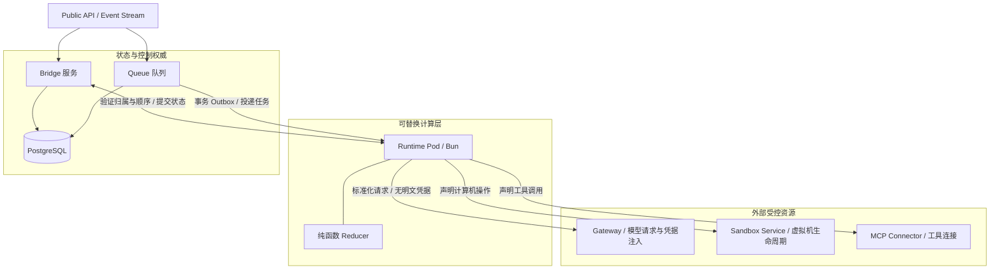
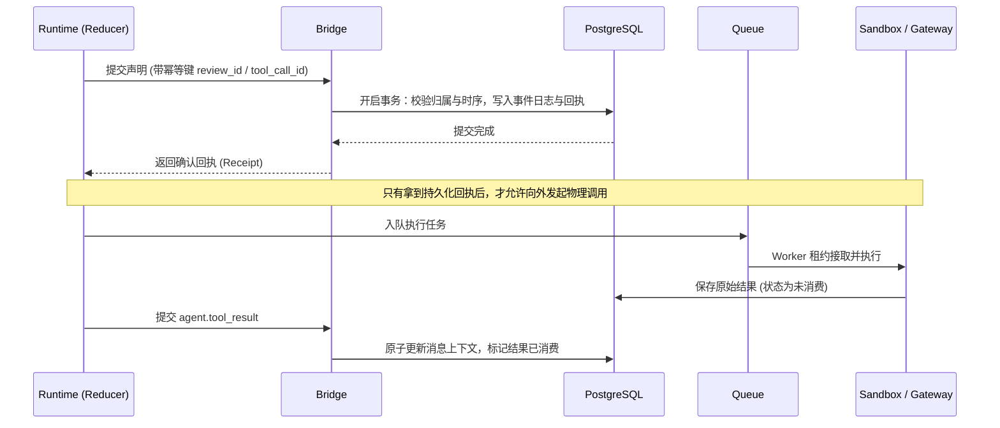

# Tetral

## 摘要

Tetral 是由 Yang Li（Anoma 作者）发起并开源（MIT 协议）的云原生 Agent 运行时与系统服务框架。其核心主张是**「计算机应当是 Agent 调用的外部资源，而不是 Agent 运行所在的宿主容器」**（A computer should be something the agent calls, not somewhere the agent lives）。Tetral 将传统将整个 Agent 循环塞入沙箱虚拟机（如 E2B）的重耦合模式拆解，抽离出无状态、可随时替换的纯计算运行时（Runtime Pod），由外部独立的 Gateway、Bridge、PostgreSQL、Queue 与 Sandbox Service 共同保障持久化交付、预写执行（Write-Ahead Execution）、凭据隔离与按需沙箱调度。

## 核心设计要点

### 1. 架构解耦与职责边界

Tetral 将传统单体 Agent 进程中的外部职责全部剥离出可替换的计算边界：

- **Runtime**：纯计算宿主。通过 Bridge 加载 Thread 状态，运行纯函数 Reducer 派生下一步转移（调用模型、执行工具、等待或结束），本身不持有长效持久化状态，也不直接做数据库与网络 I/O。
- **Bridge + PostgreSQL**：全局状态与事务权威。负责验证会话归属权与时序编号，原子提交状态转移并返回幂等回执（receipt）。
- **Queue**：基于 PostgreSQL 事务 Outbox 模式构建的任务投递通道，管理任务租约（leases）、重试、取消与死信。
- **Gateway**：模型协议适配与凭据隔离边界。基于 Vercel AI SDK 归一化多厂商流式协议，管理 API Key 与 OAuth 自动刷新；明文密钥从不流入 Runtime Pod 或沙箱。
- **Sandbox Service**：管理一次性执行环境（如 Daytona 驱动的虚拟机或微容器）的生命周期（创建、预热激活、挂载、销毁），按需懒分配。

### 2. 预写执行（Write Ahead of Execution）

为了在 Kubernetes 计算节点崩溃后避免丢失副作用或导致外部操作重复执行，Tetral 借鉴数据库 WAL（Write-Ahead Logging）机制：**在执行任何外部操作或推进状态前，必须先持久化提交操作声明**。

- 任何可能产生外部影响或状态转移的动作，均需生成稳定哈希的幂等标识。
- 若网络超时或 RPC 丢失，重试相同标识直接返回已有的持久化回执，避免重复执行。
- 节点崩溃时，替补 Pod 从 PostgreSQL 重建检查点状态，未提交的操作声明随故障进程作废，杜绝模糊状态默认转为已执行。

### 3. 可持久化投递（Durable Delivery）与栅栏机制

- **事务 Outbox 机制**：新输入（用户消息或 Agent 通信）到达时，在单次 PostgreSQL 事务中同时写入输入事件、目标 Thread 的 Inbox 记录和 Queue Job。提交成功即向调用端返回 200，随后异步调度。
- **状态三阶段**：Inbox 记录跟踪 `queued`（已排队）、`delivering`（投递中）、`accepted`（已接取）。
- **Pod 身份栅栏（Fencing Tokens）**：结合 Kubernetes Pod UID 与绑定代次。只有当集群确认旧 Pod 已彻底终结，Bridge 才会释放租约重新入队，防止脑裂状态下的重复消费。

### 4. 计算机作为按需资源（Computers as Resources）

- 会话创建时不预分配沙箱。仅当模型产出 Bash 或文件系统调用时，Sandbox Service 才按需激活计算机。
- 若沙箱处于冷态，执行任务挂起为 `waiting_activation`，沙箱生命周期 Worker 异步拉起环境与文件后，生成新一代（Generation）任务重新入队，避免多个并发调用启动竞态虚拟机。
- 执行与沙箱实例严格绑定，Worker 换代或失效不会将命令错发至新实例。

### 5. 双维度扩展与独立授权检查

- **双维度切分**：
  - **Thread**：单任务内的独立上下文执行流，具备 Actor 级别的有序处理，子 Agent 通过 `fork_turns` 派生独立上下文。
  - **Session**：跨任务的独立单元，拥有独立根 Agent、生命周期与权限凭据，共享底层 Workspace（代码库、记忆、文件）。
- **独立审查验证（approve_for_me）**：
  - 工具调用提案必须先经由确定性检查条件（Tool Gate）与平台级 Reviewer 线程进行审查。
  - 审查上下文与被审查内容严格分离（防御 Prompt 注入）。
  - 审查判定结果必须先提交至 PostgreSQL 落地，经由 Tool Gate 二次验证通过后，方可提交为正式的 `agent.tool_use`，任何不确定状态均不作为授权凭证。

## 相关页面

- [[agent-harness]]
- [[agent-orchestration-platform]]
- [[persistent-agent-harness-design-patterns]]
- [[wiki/syntheses/ai/cloud-agent-runtime-and-system-boundaries|云端 Agent 运行时与系统架构边界]]
- [[obelisk]]

## 来源指针

- `raw/sources/2026-09-06-the-next-scaling-problem.md`
- https://tetral.ai/blog/the-next-scaling-problem/
