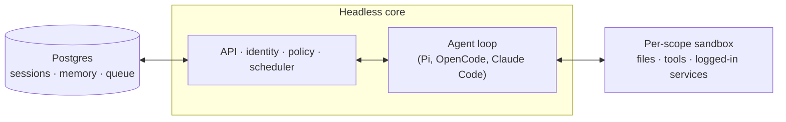

<!--
source: https://github.com/yc-software/qm
type: repo
fetched: 2026-08-26
-->

# yc-software/qm 仓库

## 目录结构

```
qm/
  .env.example
  .gitignore
  AGENTS.md
  CLAUDE.md
  CONTRIBUTING.md
  LICENSE
  README.md
  SECURITY.md
  deployment.md
  eslint.config.mjs
  knip.json
  package-lock.json
  package.json
  tsconfig.contract.json
  tsconfig.json
  test/
    ack-emoji-pick-store.test.ts
    acl-conditional-replace.test.ts
    acl-membership-manage.test.ts
    acl-resource-prefix.test.ts
    acl-revoke-authz.test.ts
    admin-agent-capability.test.ts
    admin-artifact-pages.test.ts
    admin-egress.test.ts
    admin-grant-store.test.ts
    admin-grants.test.ts
    admin-impersonate.test.ts
    admin-keychain.test.ts
    admin-metrics.test.ts
    admin-observability.test.ts
    admin-resources.test.ts
    admin-retention.test.ts
    admin-sandbox-migrate.test.ts
    admin-scopes-directory.test.ts
    admin-slack-mirror.test.ts
    admin-users.test.ts
    admin-whoami.test.ts
    advisory-lock.test.ts
    agent-api-discovery.test.ts
    agent-api-parity.test.ts
    agent-computer-profile.test.ts
    agent-conversations-route.test.ts
    agent-deployment-fetch.test.ts
    agent-files-route.test.ts
    agent-projects-route.test.ts
    ambient-judge.test.ts
    ambient-judgment-store.test.ts
    api-validation.test.ts
    audience-floor.test.ts
    audit-log.test.ts
    auth-broker-claim.test.ts
    auth-gate.test.ts
    aws-deploy-provider.test.ts
    aws-microvm-api.test.ts
    aws-role-broker.test.ts
    aws-sandbox.test.ts
    background-exec-broker.test.ts
    background-tool-context.test.ts
    base-model-serviceability.test.ts
    blob-capability-auth.test.ts
    blob-endpoints.test.ts
    blob-transfer.test.ts
    branding.test.ts
    browser-session-store.test.ts
    budget.test.ts
    cache-observability.test.ts
    capability-routes.test.ts
    capability-secret-isolation.test.ts
    capability-token.test.ts
    channel-header-pin-default.test.ts
    claude-harness-turn.test.ts
    claude-harness.test.ts
    cli-scope-storage-key.test.ts
    codex-harness.test.ts
    command-policy-route.test.ts
    command-policy.test.ts
    compact-transcript.test.ts
    config-store-org.test.ts
    config.test.ts
    connector-byo-route.test.ts
    connector-client-store.test.ts
    connector-default-slot.test.ts
    connector-invariants.test.ts
    connector-skill-filter.test.ts
    connector-status.test.ts
    connectors.test.ts
    context-compaction.test.ts
    context-policy-routes.test.ts
    control-service.test.ts
    control-tool-context.test.ts
    credential-broker.test.ts
    cron-queue.test.ts
    cron-schedule-guardrails.test.ts
    cron-scheduler.test.ts
    cron-scope-shared.test.ts
    cron-store.test.ts
    custom-provider-boot-wiring.test.ts
    custom-provider-e2e.test.ts
    custom-provider-route.test.ts
    custom-providers.test.ts
    delivery-drain-claim.test.ts
    delivery-store-contract.ts
    delivery-store.test.ts
    deploy-access-token.test.ts
    deploy-app-shell.test.ts
    deploy-artifact-image.test.ts
    deploy-concurrency.test.ts
    deploy-core-image.test.ts
    deploy-createdin-manage.test.ts
    deploy-directory-doc.test.ts
    deploy-drain.test.ts
    deploy-git-remote.test.ts
    deploy-git-rw.test.ts
    deploy-logs-route.test.ts
    deploy-proxy-headers.test.ts
    deploy-publish-gate-parity.test.ts
    deploy-reap.test.ts
    deploy-rename-display.test.ts
    deploy-restore.test.ts
    deploy-store.test.ts
    deploy-subdomain-reach.test.ts
    deploy-subdomain-signin.test.ts
    deploy-warming-page.test.ts
    deployment-layer-load.test.ts
    deployment-layer-routes.test.ts
    deployment-layer-store.test.ts
    deployment-skill.test.ts
    dev-canary-pick.test.ts
    dev-cli-lib.test.ts
    dev-supervisor-child.test.ts
    device-flow-cutover.test.ts
    device-flow-persist.test.ts
    directory-resolve.test.ts
    directory-store.test.ts
    dm-relay.test.ts
    docker-deploy-provider.test.ts
    durable-map-jsonb.test.ts
    durable-process-sessions.test.ts
    durable-stores.test.ts
    dynamic-openrouter-model.test.ts
    egress-authz.test.ts
    egress-policy.test.ts
    egress-proxy-config.test.ts
    emoji-route.test.ts
    emoji-upload-service.test.ts
    entry-search.test.ts
    environment-facts.test.ts
    environment-routes.test.ts
    environment-store.test.ts
    exec-kill.test.ts
    exec-process-session.test.ts
    exec-timeout.test.ts
    execute-scratch.test.ts
    exemplar-bystander-addressing.test.ts
    exemplar-piratey-standing-order.test.ts
    exemplar-topic-scope.test.ts
    external-slack-participants.test.ts
    file-artifact-store.test.ts
    file-channel-share.test.ts
    file-share.test.ts
    file-sharing.test.ts
    file-store-population.test.ts
    files-http.test.ts
    finalize-on-reply-ready.test.ts
    fly-deploy-provider.test.ts
    frontmatter.test.ts
    gateway-context.test.ts
    git-cli-smoke.test.ts
    git-http-broker.test.ts
    gmail-mime.test.ts
    goal-tools.test.ts
    goal.test.ts
    google-workspace-read-smoke-command.test.ts
    group-dm-open.test.ts
    harness-adapter.test.ts
    history-search.test.ts
    idempotency-store.test.ts
    identity-offboarding.test.ts
    identity.test.ts
    image-downscale.test.ts
    ingest.test.ts
    interactive-fast-mode.test.ts
    keychain-ask.test.ts
    keychain.test.ts
    leader-lease.test.ts
    local-sandbox.test.ts
    mcp-connectors.test.ts
    member-edit-authz.test.ts
    memory-agent-routes.test.ts
    memory-bench.test.ts
    memory-capture-async.test.ts
    memory-cc-personal.test.ts
    memory-file-routing.test.ts
    memory-history-agent-routes.test.ts
    memory-http.test.ts
    memory-strategy-agent-only.test.ts
    memory-strategy-consolidation.test.ts
    memory-strategy-per-turn.test.ts
    memory-strategy-scratch-promote.test.ts
    memory-tool.test.ts
    memory.test.ts
    metrics-sink.test.ts
    migrate-principals.test.ts
    model-credential-route.test.ts
    model-gateway.test.ts
    model-registry.test.ts
    monitor-broker.test.ts
    monitor-poller.test.ts
    monitor-store.test.ts
    normalize.test.ts
    notebook.test.ts
    oauth-consent-bridge.test.ts
    oauth-routes.test.ts
    oauth.test.ts
    onboarding.test.ts
    opencode-harness.test.ts
    opencode-plugin-source.test.ts
    orchestrator.test.ts
    pack-fetcher.test.ts
    persistence-init-retry.test.ts
    person-identity.test.ts
    pg-ca-options.test.ts
    pg-pool.test.ts
    pi-dependency-security.test.ts
    pi-harness-cache-split.test.ts
    pi-harness-empty-ending.test.ts
    pi-harness-fast-mode.test.ts
    pi-harness-freshness.test.ts
    pi-harness-oneshot.test.ts
    pi-harness-output-guard.test.ts
    pi-harness-step-gap.test.ts
    pi-harness-wall-clock.test.ts
    pi-models.test.ts
    pi-tools.test.ts
    portal-identity-gate.test.ts
    portal-identity.test.ts
    portal-plugin.test.ts
    postdeploy-smoke.test.ts
    postgres-admin-grants.test.ts
    postgres-audit-log.test.ts
    postgres-budget.test.ts
    postgres-config-store.test.ts
    postgres-credential-usage-sink.test.ts
    postgres-delivery-store.test.ts
    postgres-directory-store.test.ts
    postgres-egress-audit-sink.test.ts
    postgres-error-log.test.ts
    postgres-file-artifact-store.test.ts
    postgres-grant-store.test.ts
    postgres-instance-registry.test.ts
    postgres-map.test.ts
    postgres-memory-service.test.ts
    postgres-metrics-sink.test.ts
    postgres-rate-limiter.test.ts
    postgres-replay-dedupe.test.ts
    postgres-run-activity-store.test.ts
    postgres-store.test.ts
    postgres-surface-cache.test.ts
    postgres-task-store.test.ts
    postgres-toolcalls-migration.test.ts
    predeploy-db-snapshot.test.ts
    process-poll.test.ts
    process-reaper.test.ts
    process-registry.test.ts
    process-run.test.ts
    prod-deploy-guard.test.ts
    project-trigger-auth.test.ts
    projects.test.ts
    prompt-modes.test.ts
    prompt-tool-names.test.ts
    provider-endpoints.test.ts
    public-architecture-docs.test.ts
    publish-audience.test.ts
    publish-default-audience.test.ts
    publish-primitive.test.ts
    qm-brand.test.ts
    rate-limiter.test.ts
    reach-denied-notifier.test.ts
    reach-deployment.test.ts
    reach-files.test.ts
    reach-thread.test.ts
    reach.test.ts
    refusal-admin-link-integration.test.ts
    refused-session-uuid.test.ts
    release-workflows.test.ts
    replay.test.ts
    resident-auth.test.ts
    resident-paths.test.ts
    resolution.test.ts
    resource-ref.test.ts
    route-auth-conformance.test.ts
    route-table.test.ts
    run-activity-store.test.ts
    run-result-delivery.test.ts
    run-signal-route.test.ts
    run-signal-store.test.ts
    run-stale.test.ts
    run-store.test.ts
    run-trigger-home-scope.test.ts
    run-trigger.test.ts
    runtime-selection.test.ts
    safe-cut.test.ts
    sandbox-base-image.test.ts
    sandbox-migrate.test.ts
    sandbox-migration-runner.test.ts
    sandbox-noninteractive.test.ts
    sandbox-routing.test.ts
    scope-reach.test.ts
    scope-resources-authz.test.ts
    scoped-event-sink.test.ts
    secret-drop.test.ts
    secret-key-migration.test.ts
    secret-masking.test.ts
    secret-schema-conformance.test.ts
    secret-schema-drift.test.ts
    secret-source.test.ts
    security-docs.test.ts
    security-posture.test.ts
    security-screener.test.ts
    service-credential-route.test.ts
    service-credential-store.test.ts
    session-fork.test.ts
    session-metadata-authz.test.ts
    session-search.test.ts
    session-state-bus.test.ts
    session-state-events.test.ts
    session-store.test.ts
    session-tape.test.ts
    session-title.test.ts
    session-view-patch.test.ts
    sessions-awaiting-input.test.ts
    sessions-background-activity.test.ts
    sessions-empty.test.ts
    sessions-working.test.ts
    share-deployment.test.ts
    share-verb.test.ts
    signed-token.test.ts
    skill-archive.test.ts
    skill-bundle.test.ts
    skill-collision.test.ts
    skill-conformance.test.ts
    skill-grant-autoload.test.ts
    skill-last-used.test.ts
    skill-pack-store.test.ts
    skill-packs-routes.test.ts
    skill-sync-engine.test.ts
    skills-callable.test.ts
    skills-http.test.ts
    skills-lazy-read-seam.test.ts
    skills-materialize.test.ts
    skills-seed.test.ts
    skills-visible.test.ts
    slack-ack-emoji.test.ts
    slack-agent-pin.test.ts
    slack-agent-requests.test.ts
    slack-approval-cards.test.ts
    slack-approval-context.test.ts
    slack-attachments.test.ts
    slack-conversation.test.ts
    slack-deferred-ack.test.ts
    slack-deliveries.test.ts
    slack-delivery.test.ts
    slack-dev-introspection.test.ts
    slack-forwards.test.ts
    slack-http-events.test.ts
    slack-identity.test.ts
    slack-index.integration.test.ts
    slack-manifest.test.ts
    slack-message-gating.test.ts
    slack-mrkdwn.test.ts
    slack-presenters.test.ts
    slack-principal-thread-delivery.test.ts
    slack-reactions.test.ts
    slack-refusals.test.ts
    slack-runtime.test.ts
    smolmachines-sandbox.test.ts
    source-auth-sign-vendored.test.ts
    source-auth-sign.test.ts
    source-auth.test.ts
    sprites-sandbox.test.ts
    surface-cache-ambient.test.ts
    surface-cache-ingest-mapper.test.ts
    surface-cache.test.ts
    surface-context-puller.test.ts
    surface-context.test.ts
    surface-post-files.test.ts
    surface-read-tools.test.ts
    surface-spine-routing.test.ts
    sweeper.test.ts
    system-prompt-order.test.ts
    tape-fold.test.ts
    tape-image-loader.test.ts
    tape-nudge-continuation.test.ts
    tar.test.ts
    task-store.test.ts
    transcript-window.test.ts
    trigger-consent.test.ts
    trigger-store.test.ts
    turn-metrics-route.test.ts
    turn-options.test.ts
    turn-origin.test.ts
    turn-outcome.test.ts
    turn-resume.test.ts
    turn-stream.test.ts
    turns-union-guard.test.ts
    ui-state-http.test.ts
    util-async.test.ts
    util-crypto.test.ts
    util-shell.test.ts
    util-text.test.ts
    visibility.test.ts
    wake-envelope.test.ts
    wake-route.test.ts
    wake-steering.test.ts
    wake-sweep.test.ts
    web-context.test.ts
    web-contexts.test.ts
    web-ui-body-cap.test.ts
    web-ui-crons.test.ts
    web-ui-memory.test.ts
    web-ui-shared-threads.test.ts
    web-ui-sse.test.ts
    web-ui-webhooks.test.ts
    webhook-receiver.test.ts
    webhook-routes.test.ts
    webhook-store.test.ts
    webhook-verifiers.test.ts
    webui-model-allowlist.test.ts
    worker-reaper.test.ts
    live-slack/
      actors-verify.ts
      arga-provision.ts
      arga.ts
      cdp.ts
      core.ts
      gallery.ts
      harness.ts
      qa-driver.manifest.json
      run.ts
      scenarios-multiuser.ts
      scenarios-twin.ts
      scenarios.ts
      screenshots.ts
      slack.ts
      fixtures/
        gen-taylor-selfie.mjs
        taylor-selfie.png
    support/
      auto-fake-sprites.ts
      fake-docker.ts
      fake-microvm.ts
      fake-smolmachines.ts
      fake-sprites.ts
      settle.ts
      test-config.ts
    memory-bench/
      conversations/
        inference-bait.json
        long-project-arc.json
        noise-heavy-debugging.json
        preferences-and-identity.json
        secrets-exclusion.json
        stale-fact-supersession.json
    e2e/
      http.e2e.test.ts
      pi-harness.e2e.test.ts
  fly/
    Dockerfile
    README.md
    fly.toml
    tools/
      x-api
  plugins/
    portal/
      README.md
      package-lock.json
      package.json
      tsconfig.json
      test/
        apps-subdomain-signin.test.ts
        broker-proxy.test.ts
        client-ip.test.ts
        entry.test.ts
        local-auth-bypass.test.ts
        oidc.test.ts
        onboarding-redirect.test.ts
        playground.test.ts
        proxy-errors.test.ts
        router.test.ts
        session.test.ts
      src/
        index.ts
        oidc.ts
        proxy.ts
        session.ts
    auth/
      README.md
      package-lock.json
      package.json
      tsconfig.json
      test/
        config.test.ts
        email.test.ts
        flow.test.ts
        helpers.ts
        smtp.test.ts
      src/
        config.ts
        email.ts
        index.ts
        keys.ts
        pages.ts
        server.ts
        smtp.ts
        tokens.ts
    web-ui/
      .env.example
      .gitignore
      README.md
      index.html
      package-lock.json
      package.json
      tsconfig.json
      tsconfig.server.json
      tsconfig.test.json
      vite.config.ts
      test/
        active-run-discovery-route.test.ts
        admin-navigation-source.test.ts
        ambient-policy-server-route.test.ts
        ambient-policy-source.test.ts
        api-body-parsing.test.ts
        approval-refusal-feedback.test.ts
        archive-closes-pane.test.ts
        auth-mode-dev.test.ts
        auth-mode-portal.test.ts
        blob-upload-server-route.test.ts
        branding.test.ts
        channel-header-source.test.ts
        chat-settled-row-cache.test.ts
        composer-no-scrollbar.test.ts
        composer-source.test.ts
        connector-link-strip.test.ts
        context-model-source.test.ts
        contexts-source.test.ts
        continuable.test.ts
        core-bridge-idle.test.ts
        core-bridge-retry.test.ts
        core-wire-contract.ts
        cron-format.test.ts
        crons-deep-link.test.ts
        css-vars.test.ts
        deep-link.test.ts
        density.test.ts
        deploy-notices.test.ts
        deploy-open-proxy.test.ts
        deploy-view.test.ts
        deployment-preview-sandbox.test.ts
        deployments-server-route.test.ts
        deploys-source.test.ts
        dialog-focus.test.ts
        drafts.test.ts
        error-banner.test.ts
        field-select-source.test.ts
        file-content-portal-identity.test.ts
        file-content-sandbox.test.ts
        file-list.test.ts
        folder-drop.test.ts
        fork-cut.test.ts
        fork-remount-preserves-show.test.ts
        fork-transcript-anchor.test.ts
        group-dm-label.test.ts
        history.test.ts
        keychain-flow.test.ts
        layout-thrash.test.ts
        lazy-libs.test.ts
        list-page.test.ts
        loading-pane-centered.test.ts
        markdown-dollars.test.ts
        markdown-sanitize.test.ts
        markdown-tilde.test.ts
        marked-dedupe.test.ts
        model-options.test.ts
        open-session-view-switch.test.ts
        openrouter-turn.test.ts
        pane-approval-overflow.test.ts
        pane-composer-source.test.ts
        pane-focus.test.ts
        paste-text.test.ts
        permissions.test.ts
        pi-models.test.ts
        project-interactions.test.ts
        project-slack-channel-source.test.ts
        projects-server-route.test.ts
        queue-by-default.test.ts
        responsive-source.test.ts
        run-follow-cross-instance.test.ts
        runtime-config-handoff.test.ts
        sandbox-link-download.test.ts
        session-cap-replay.test.ts
        session-list.test.ts
        sessions-patch-server-route.test.ts
        sidebar-rail-source.test.ts
        signed-identity.test.ts
        skill-actions.test.ts
        skill-edit-review.test.ts
        skill-registry.test.ts
        skills-flow.test.ts
        split-canvas-entry.test.ts
        split-drop-legitimacy.test.ts
        split-layout.test.ts
        split-single-header.test.ts
        split-tiles-and-titles.test.ts
        steer-recovery-source.test.ts
        streaming-markdown.test.ts
        tab-switch-scroll-snap.test.ts
        timeline.test.ts
        ui-copy.test.ts
        work-fold-source.test.ts
        working-dot.test.ts
      server/
        index.ts
      src/
        ambient-policy.ts
        channel-header.ts
        chat.ts
        composer.ts
        connector-link.ts
        connectors.ts
        context-model.ts
        contexts.ts
        conv-types.ts
        conversations.ts
        core-bridge.ts
        cron-format.ts
        crons.ts
        deep-link.ts
        density.ts
        deploy-notices.ts
        deploy-view.ts
        deploys.ts
        dialog-focus.ts
        drafts.ts
        error-banner.ts
        file-list.ts
        files.ts
        folder-drop.ts
        fork-origin.ts
        group-dm-label.ts
        hljs-lang-stub.ts
        keychain-state.ts
        lazy-hljs.ts
        lazy-katex.ts
        lazy-shims.d.ts
        list-page.ts
        main.ts
        markdown-dollars.ts
        markdown-sanitize.ts
        marked-dedupe.ts
        memory.ts
        model-options.ts
        pane-focus.ts
        paste-text.ts
        pi-models.ts
        search.ts
        session-list.ts
        session-scope.ts
        sessions.ts
        shell-state.ts
        shell.css
        shell.ts
        skill-actions.ts
        skill-edit-review.ts
        skill-registry.ts
        skills-mutation.ts
        skills-refresh.ts
        skills.ts
        split-layout.ts
        split.ts
        streaming-markdown.ts
        timeline.ts
        tooltip.ts
        ui.ts
        webhooks.ts
        working-dot.ts
    chassis/
      package.json
      src/
        branding.ts
        claims.ts
        core-client.ts
        env.ts
        errors.ts
        http.ts
        portal-identity.ts
        router.ts
        security-quarantine.ts
        source-auth-sign.ts
    admin/
      README.md
      package-lock.json
      package.json
      tsconfig.json
      test/
        branding.test.ts
        crons.test.ts
        default-view.test.ts
        environments.test.ts
        files-download.test.ts
        grants.test.ts
        gzip.test.ts
        memory.test.ts
        onboarding-view.test.ts
        scopes.test.ts
        skill-packs.test.ts
        whoami.test.ts
      public/
        index.html
      src/
        index.ts
    onboarding/
      README.md
      skills/
  deploy/
    README.md
    portal/
      Dockerfile
      fly.toml
    stacks/
      README.md
      demo.json
      broker/
        qm.config.jsonc
      acme/
        .env.example
        qm.config.jsonc
        slack-app-manifest.yml
    core/
      Dockerfile
      fly.toml
    layers/
      README.md
    auth/
      Dockerfile
      fly.toml
    web-ui/
      Dockerfile
      fly.toml
    admin/
      Dockerfile
      fly.toml
    egress-proxy/
      Dockerfile
      envoy.yaml
      fly.toml
      start.sh
    egress-proxy-pub/
      fly.toml
    sandbox/
      fly.toml
  .claude/
    settings.json
    skills/
      dev-instance/
        SKILL.md
        dev-instance.sh
      upstream-pr/
        SKILL.md
      update-qm/
        SKILL.md
  skills-seed/
    email-draft-in-voice/
      SKILL.md
    memory/
      SKILL.md
    google-drive-sheets/
      SKILL.md
    interactive-login/
      SKILL.md
    cloud-cli/
      SKILL.md
    linear/
      SKILL.md
    admin/
      SKILL.md
    connect-apps/
      SKILL.md
    github-gitlab/
      SKILL.md
    publish/
      SKILL.md
    slack-drafts/
      SKILL.md
      scripts/
        slack_drafts.py
    google-workspace/
      SKILL.md
      scripts/
        gmail.py
    popular-web-designs/
      SKILL.md
      templates/
        airbnb.md
        airtable.md
        apple.md
        bmw.md
        cal.md
        claude.md
        clay.md
        clickhouse.md
        cohere.md
        coinbase.md
        composio.md
        cursor.md
        elevenlabs.md
        expo.md
        figma.md
        framer.md
        hashicorp.md
        ibm.md
        intercom.md
        kraken.md
        linear.app.md
        lovable.md
        minimax.md
        mintlify.md
        miro.md
        mistral.ai.md
        mongodb.md
        notion.md
        nvidia.md
        ollama.md
        opencode.ai.md
        pinterest.md
        posthog.md
        raycast.md
        replicate.md
        resend.md
        revolut.md
        runwayml.md
        sanity.md
        sentry.md
        spacex.md
        spotify.md
        stripe.md
        supabase.md
        superhuman.md
        together.ai.md
        uber.md
        vercel.md
        voltagent.md
        warp.md
        webflow.md
        wise.md
        x.ai.md
        zapier.md
    dropbox/
      SKILL.md
    use-shared-credential/
      SKILL.md
    browse/
      SKILL.md
      providers/
        anchor.md
        browserbase.md
        kernel.md
    taste-skill/
      LICENSE
      SKILL.md
      references/
        tasteskill.md
    morning-digest/
      SKILL.md
    email-voice-profile/
      SKILL.md
      scripts/
        fetch_sent.py
  docs/
    deploy-directory.md
    getting-started.md
    screenshots/
      web-ui-hero.png
  cli/
    .gitignore
    LICENSE
    README.md
    manifest.json
    package-lock.json
    package.json
    tsconfig.build.json
    tsconfig.json
    test/
      auth-broker.test.ts
      aws.test.ts
      check.test.ts
      cli-dispatch.test.ts
      config.test.ts
      contract.test.ts
      deployment-layer.test.ts
      dev-ci-routing.test.ts
      docker-secrets.test.ts
      doctor.test.ts
      fly-deploy-phases.test.ts
      fly-derive.test.ts
      fly-logs.test.ts
      fly-sandbox.test.ts
      fly-timing.test.ts
      fly-up.test.ts
      infra-image.test.ts
      infra-task-definitions.test.ts
      init.test.ts
      layer-wiring.test.ts
      manifest-template.test.ts
      microvm-dockerfile.test.ts
      outputs.test.ts
      package.test.ts
      plugins.test.ts
      preflight.test.ts
      providers.test.ts
      sandbox-build.test.ts
      sandbox-publish.test.ts
      secrets.test.ts
      setup.test.ts
      slack-manifests.test.ts
      stack-configs.test.ts
      terraform.test.ts
      tool-descriptor.test.ts
      util.test.ts
      fixtures/
        imagefrom-stack.json
      e2e/
        README.md
        check.e2e.test.ts
        dev.e2e.test.ts
        docker-lifecycle.e2e.test.ts
        fly.e2e.test.ts
        harness.ts
        identity.e2e.test.ts
        init.e2e.test.ts
        meta.e2e.test.ts
        plan.e2e.test.ts
        sandbox-build.e2e.test.ts
    bin/
      qm.ts
    templates/
      slack-manifest.json
      slack-sso-manifest.json
      fly/
        admin.toml
        auth.toml
        core.toml
        portal.toml
        web-ui.toml
      deployment/
        SKILL.md
        deployment.md
      aws/
        main.tf
        outputs.tf
        variables.tf
        versions.tf
    src/
      aws-lease.ts
      cli.ts
      config.ts
      contract.d.ts
      contract.ts
      deployment-layer.ts
      log.ts
      manifest.ts
      plugins.ts
      preflight.ts
      provider-scaffold.ts
      providers.ts
      sandbox-layer.ts
      scope-storage-key.ts
      secrets.ts
      services.ts
      slack-manifests.ts
      state.ts
      target-env-defaults.ts
      terraform.ts
      util.ts
      backends/
        aws.ts
        dev-ci.ts
        docker.ts
        doctor.ts
        fly.ts
        registry.ts
        types.ts
      commands/
        check.ts
        conformance.ts
        infra.ts
        init.ts
        outputs.ts
        sandbox.ts
        setup.ts
  local/
    Dockerfile
  .codex/
    skills/
      dev-instance/
        SKILL.md
      upstream-pr/
        SKILL.md
      deploy-qm/
        SKILL.md
      update-qm/
        SKILL.md
  scripts/
    api-livetest.ts
    aws-build-sandbox-image.ts
    aws-deploy-smoke.ts
    aws-litestream-smoke.ts
    aws-sandbox-smoke.ts
    backfill-session-tape.ts
    dev-instance.sh
    git-cli-smoke.ts
    google-oauth-smoke.ts
    google-workspace-read-smoke-command.ts
    local-sandbox-build.sh
    local-sandbox-smoke.ts
    memory-bench.ts
    migrate-principals-to-email.d.mts
    migrate-principals-to-email.mjs
    mine-slack-scenarios.ts
    monitor-smoke.ts
    pi-smoke.ts
    predeploy-db-snapshot.sh
    prod-deploy-guard.sh
    run-root-test-shard.mjs
    send-mention.sh
    service-credential-livetest.ts
    skills-materialize-smoke.ts
    slack-user-token.ts
    smoke-surface-image.sh
    dev/
      cli.ts
      twin-instance.ts
      twin-pump.ts
      lib/
        canary.ts
        client.ts
        deps.ts
        envctx.ts
        lease.ts
        orphans.ts
        pool.ts
        postgres.ts
        proc.ts
        sandbox.ts
        types.ts
        util.ts
      test-helpers/
        fake-child.mjs
      commands/
        doctor.ts
      supervisor/
        children.ts
        main.ts
        specs.ts
  .github/
    workflows/
      cicd.yml
      publish-cli.yml
      release-package.yml
      release.yml
  adrs/
  aws/
    microvm-agent/
      Dockerfile
      agent.mjs
  src/
    config.ts
    egress-authz-main.ts
    index.ts
    types.ts
    wiring.ts
    connectors/
      background-exec-broker.ts
      browser-session-store.ts
      connector-client-store.ts
      consent-link.ts
      emoji-upload-service.ts
      oauth.ts
    insights/
      reach-denied-notifier.ts
    monitors/
      monitor-broker.ts
      monitor-poller.ts
      monitor-store.ts
    tasks/
      memory-task-store.ts
      postgres-task-store.ts
      task-store.ts
    tools/
      primitives.ts
    core/
      approval-id.ts
      attachments.ts
      environment-facts.ts
      gateway-context.ts
      image-downscale.ts
      orchestrator.ts
      turn-error.ts
      turn-options.ts
      turn-origin.ts
      turn-outcome.ts
      turn-resume.ts
      wake-envelope.ts
      orchestrator/
        compaction.ts
        prompt-blocks.ts
        sandboxes.ts
        security-screen.ts
        surface-tools.ts
        turn-helpers.ts
        types.ts
    memory/
      bench.ts
      memory-service.ts
      notebook.ts
      policy.ts
      postgres-memory-service.ts
      strategy.ts
      strategies/
        agent-only.ts
        consolidation.ts
        per-turn.ts
        scratch-promote.ts
    classify/
      scope-classifier.ts
    identity/
      identity-service.ts
    util/
      async.ts
      bytes.ts
      crypto.ts
      errors.ts
      http-proxy.ts
      message-tag.ts
      network.ts
      safe-regex.ts
      scope-storage-key.ts
      shell.ts
      sweeper.ts
      text.ts
      tokens.ts
    security/
      secret-masking.ts
      security-posture.ts
      security-screener.ts
    auth/
      aws-role-broker.ts
      capability-token.ts
      portal-identity.ts
      replay-dedupe.ts
      signed-token.ts
      source-auth-sign.ts
      source-auth.ts
    triggers/
      consent-notice.ts
      edit-notice.ts
      keychain-ask.ts
      provenance.ts
      run-trigger.ts
      trigger-store.ts
    deploy/
      access-token.ts
      app-shell.ts
      aws-deploy-provider.ts
      deploy-fs.ts
      deploy-git-store.ts
      deploy-provider.ts
      deploy-service.ts
      deploy-store.ts
      docker-deploy-provider.ts
      fly-deploy-provider.ts
      viewer-session.ts
    environments/
      environment-store.ts
    processes/
      process-reaper.ts
      process-registry.ts
      reconcile.ts
    projects/
      project-store.ts
    workspace/
      workspace-store.ts
    admin/
      admin-grant-store.ts
      admin-service.ts
      attribution.ts
      credential-usage-sink.ts
      egress-audit-sink.ts
      error-log.ts
      metrics-sink.ts
      postgres-admin-grant-store.ts
      postgres-audit-log.ts
      postgres-credential-usage-sink.ts
      postgres-egress-audit-sink.ts
      postgres-error-log.ts
      postgres-metrics-sink.ts
      retention.ts
      scoped-event-sink.ts
      users.ts
    surface-cache/
      ack-emoji-pick-store.ts
      ambient-judge.ts
      ambient-judgment-store.ts
      channel-policy-store.ts
      surface-cache.ts
      types.ts
    idempotency/
      idempotency-store.ts
    mcp/
      mcp-client.ts
      mcp-server-store.ts
      mcp-tool-service.ts
    directory/
      directory-store.ts
      person.ts
      postgres-directory-store.ts
      visibility.ts
    wake/
      engaged-registry.ts
      sweep.ts
      wake.ts
    ratelimit/
      budget.ts
      postgres-budget.ts
      postgres-rate-limiter.ts
      rate-limiter.ts
    harness/
      claude-harness.ts
      codex-app-server.ts
      codex-harness.ts
      context-compaction.ts
      goal.ts
      grind.ts
      harness-router.ts
      harness.ts
      mock-harness.ts
      opencode-harness.ts
      opencode-plugin.ts
      pi-harness.ts
      pi-tools.ts
      replay.ts
      tape-fold.ts
    sessions/
      entry-search.ts
      history-search.ts
      memory-session-store.ts
      postgres-session-store.ts
      session-store.ts
    resolution/
      audience-floor.ts
      branding.ts
      config-store.ts
      context-filter.ts
      egress-policy.ts
      prompt-vars.ts
      publish-audience.ts
      resolution-service.ts
      scope-membership.ts
      scope-reach.ts
      protocols/
        mode-autonomous.md
        mode-conversation.md
        mode-fallback.md
        shared-core.md
    audit/
      audit-log.ts
    sandbox/
      await-process-exit.ts
      aws-microvm-api.ts
      aws-sandbox.ts
      docker-exec.ts
      exec-file-ops.ts
      exec-kill.ts
      exec-process-session.ts
      local-sandbox.ts
      process-poll.ts
      ro-layers.ts
      sandbox-env.ts
      sandbox-migrate.ts
      sandbox-migration-runner.ts
      sandbox-routing.ts
      sandbox.ts
      smolmachines-sandbox.ts
      sprites-sandbox.ts
      tar.ts
    deployment/
      deployment-layer-store.ts
      deployment-layer.ts
      load-layer.ts
      postdeploy-smoke.ts
      secret-schema.ts
    persistence/
      advisory-lock.ts
      blob-transfer.ts
      durable-map.ts
      leader-lease.ts
      pg-pool.ts
      s3.ts
    model/
      custom-provider-store.ts
      custom-providers.ts
      model-catalog.ts
      model-credential-store.ts
      model-gateway.ts
      pi-models.ts
      provider-endpoints.ts
    delivery/
      delivery-store.ts
      postgres-delivery-store.ts
      run-result-delivery.ts
    files/
      durable-byte-store.ts
      file-artifact-store.ts
      postgres-file-artifact-store.ts
    api/
      agent-api-catalog.ts
      app-ambient.ts
      app-deployments.ts
      app-helpers.ts
      app-messaging.ts
      app-sessions.ts
      app-skills.ts
      app-turn.ts
      app-types.ts
      app.ts
      artifact-share.ts
      capability-destination.ts
      contract.ts
      control-service.ts
      credential-broker.ts
      deps.ts
      expiry.ts
      git-http-broker.ts
      http.ts
      server.ts
      slack-core-client.ts
      surface-context-puller.ts
      user-scoped-routes.ts
      web-context.ts
      routes/
        admin-resources.ts
        admin.ts
        auth-broker.ts
        blobs.ts
        connectors.ts
        context-policy.ts
        context.ts
        credentials.ts
        crons.ts
        deployment-layer.ts
        deployments.ts
        directory.ts
        egress-audit.ts
        emoji.ts
        environments.ts
        index.ts
        keychain.ts
        projects.ts
        reach.ts
        route.ts
        secret-drop.ts
        session-state.ts
        shared.ts
        skill-packs.ts
        surface-cache.ts
        surface.ts
        turns.ts
        webhooks.ts
    slack/
      README.md
      ack-emoji.ts
      agent-requests.ts
      approval-cards.ts
      approval-context.ts
      approvals.ts
      attachments.ts
      config.ts
      conversation-view.ts
      conversation.ts
      core-bridge.ts
      deferred-ack.ts
      deliveries.ts
      delivery.ts
      dev-introspection.ts
      directives.ts
      directory.ts
      emoji-map.ts
      events.ts
      forwards.ts
      http-events.ts
      identity.ts
      index.ts
      lib.ts
      manifest.json
      message-gating.ts
      messaging.ts
      mirror.ts
      mrkdwn.ts
      presenters.ts
      reactions.ts
      refusals.ts
      safe-cut.ts
      surface-context.ts
      turn-handler.ts
      util.ts
    surfaces/
      slack-installation.ts
      slack-manifest.ts
      slack-runtime.ts
      ui-state.ts
    skills/
      frontmatter.ts
      ingest.ts
      materialization-paths.ts
      materialize.ts
      normalize.ts
      pack-fetcher.ts
      seed.ts
      skill-bundle-store.ts
      skill-collision.ts
      skill-name.ts
      skill-pack-store.ts
      skill-store.ts
      skill-sync-engine.ts
    webhooks/
      verifiers.ts
      webhook-receiver.ts
      webhook-store.ts
    reach/
      reach.ts
    runs/
      drain.ts
      instance-registry.ts
      memory-run-store.ts
      postgres-run-activity-store.ts
      postgres-run-signal-store.ts
      postgres-run-store.ts
      postgres-session-state-bus.ts
      reaper.ts
      run-activity-store.ts
      run-signal-store.ts
      run-store.ts
      session-state-bus.ts
      task-protection.ts
      tool-ledger.ts
      turn-stream.ts
      worker-main.ts
      worker.ts
    acl/
      acl-store.ts
      postgres-grant-store.ts
      resource-ref.ts
    onboarding/
      onboarding.ts
    policy/
      command-policy.ts
    cron/
      cron-fire-store.ts
      cron-store.ts
      job-queue.ts
      schedule.ts
      scheduler.ts
    credentials/
      connector-status.ts
      connector-token.ts
      device-flow-cutover.ts
      device-flow-persist.ts
      keychain.ts
      paths.ts
      resident-auth.ts
      resident-paths.ts
      secret-drop.ts
      secret-source.ts
```

## README.md

```
# qm

A multiplayer agent harness for work. In Slack and on the web.


## Setup

Tell your coding agent of choice `Let's deploy https://github.com/yc-software/qm`. From here, it should follow the deployment guide in this repo.

## What is QM?

Most agents are designed like personal assistants. You can make one work for a whole
company, but it quickly gets complex. QM is designed for startups. Employees each get
their own isolated workspace and work independently without affecting each other, and
they can also collaborate with the agent in channels, group messages, and projects.

Each person and each room has its own scoped memory, files, keychain view, permissions,
crons, web apps, and durable sandbox.

It's built with open source in mind. Pick your own harness and model and switch between
them — Pi, OpenCode, Codex, and Claude Code all drive the same core, so a deployment
isn't tied to any single vendor.

## Features

- **Personal and shared scopes.** People customize the agent to be _theirs_, and still
  work with it collaboratively in Slack channels and projects.
- **Slack and web.** The same identity and configuration carries between Slack and the
  web app.
- **Admin control.** Set org-level configuration, a security posture, and which
  harnesses and models are available.
- **Web apps.** Spin up custom internal apps and publish them to the right people.
- **Shared skills.** Skills are scope-owned and shareable by grant, with admin-gated
  promotion to the whole org and skill packs imported from git repositories.
- **Background work.** Crons, watches, and inbound webhooks run work while nobody's
  watching.

## What you can do with it

- Search internal notes, email, documents, databases, and the web together
- Retrieve information from your company brain
- Build internal apps, publish them to the right people, and keep their data current
- Learn your writing voice from past sends, then triage your inbox on a schedule —
  labels and reply drafts included
- Work in an existing repository: run tests, open PRs, monitor CI, check system logs
- Track a project in a shared channel and post updates and follow-ups

## Architecture



Every turn runs through a central core, which can use a variety of models and harnesses
to generate the response. A Postgres persistence layer holds user data, session history,
and other durable state. The agent has a small, fixed tool surface; one of those tools is
`execute`, which runs commands in the scope's own isolated sandbox — its durable computer,
where installed tools stay installed. The web UI, the admin panel, and the public portal
are optional plugins over the core's HTTP API;
Slack is an optional in-process plugin that core starts
and supervises through a direct service client.

The core runs TypeScript directly on Node and uses Fastify for HTTP. The Slack plugin
uses Bolt; the web UI builds with Vite and renders with Lit.

The core itself is generic. Everything specific to one company — org config, custom tools
and skills, sandbox image, infrastructure — lives in a **deployment directory** that the
[`qm` CLI](./cli/README.md) validates and deploys. Every substrate (harness, session
store, sandbox, memory) sits behind an interface, so production implementations swap in
via one wiring file.

## Security and secrets

QM's approach follows local coding agents like OpenCode, Codex, and Claude Code: the
agent acts as the person it's working for, with their credentials and permissions, and
everything it does is audited. An org picks one security posture, which narrower scopes
can only tighten:

- **Strict** — every harness tool call pauses for human approval, except the two
  no-effect turn enders.
- **Auto** (default) — a classifier screens provenance-labelled external data and tool
  results before they reach the model; a deployment can point that at its own screening
  proxy.
- **Dangerous** — no content screening, no pauses between tool calls.

The predeclared command policy — approval rules and hard denials for things like
recursive deletes or destructive SQL — applies in every posture, Dangerous included.

[`SECURITY.md`](./SECURITY.md) has the threat model, the operator assumptions, and the
known limitations.

## Deploy it for your org

Create an organization-owned deployment repository that depends on `@yc-software/qm`:

```bash
npm exec --yes --package=@yc-software/qm@latest -- \
  qm init . --org <slug> --target <fly-or-aws>
npm install
```

Initialization materializes a deployment skil
... (truncated)
```

## package.json

```
{
  "name": "qm",
  "version": "0.1.0",
  "private": true,
  "license": "MIT",
  "type": "module",
  "description": "Headless core for the shared org agent (managed-agents architecture).",
  "engines": {
    "node": ">=24.15.0",
    "npm": ">=11.10.0"
  },
  "scripts": {
    "start": "node --env-file-if-exists=.env src/index.ts",
    "dev": "SHUTDOWN_DRAIN_MS=2000 node --env-file-if-exists=.env --watch src/index.ts",
    "dev-instance": "bash scripts/dev-instance.sh up",
    "dev-instance:no-slack": "bash scripts/dev-instance.sh up --no-slack",
    "dev-instance:status": "bash scripts/dev-instance.sh status",
    "dev-instance:down": "bash scripts/dev-instance.sh down",
    "worker": "node --env-file-if-exists=.env src/runs/worker-main.ts",
    "test": "node --experimental-test-module-mocks --test test/*.test.ts",
    "test:root:shard": "node scripts/run-root-test-shard.mjs",
    "test:root:shard:check": "node scripts/run-root-test-shard.mjs --check --shards 5",
    "test:e2e": "node --test test/e2e/*.test.ts",
    "live-e2e": "node test/live-slack/run.ts",
    "gallery:shots": "node test/live-slack/screenshots.ts",
    "gallery:shots:login": "node test/live-slack/screenshots.ts --login",
    "test:all": "node --experimental-test-module-mocks --test 'test/**/*.test.ts'",
    "smoke:pi": "node scripts/pi-smoke.ts",
    "smoke:monitor": "node scripts/monitor-smoke.ts",
    "smoke:git-cli": "node scripts/git-cli-smoke.ts",
    "smoke:google-oauth": "node scripts/google-oauth-smoke.ts",
    "smoke:service-cred": "node scripts/service-credential-livetest.ts",
    "smoke:aws-sandbox": "node scripts/aws-sandbox-smoke.ts",
    "smoke:local-sandbox": "node scripts/local-sandbox-smoke.ts",
    "build:aws-image": "node scripts/aws-build-sandbox-image.ts",
    "sandbox:local:build": "bash scripts/local-sandbox-build.sh",
    "deploy:fly-image": "flyctl deploy --remote-only --build-only --push --image-label latest --app \"${FLY_SANDBOX_APP_NAME:?Set FLY_SANDBOX_APP_NAME to your operator-owned app}\" -c fly/fly.toml --dockerfile fly/Dockerfile . --yes",
    "test:pg": "node --test --test-concurrency=1 test/postgres-store.test.ts test/postgres-grant-store.test.ts test/postgres-admin-grants.test.ts test/postgres-file-artifact-store.test.ts test/postgres-directory-store.test.ts test/postgres-map.test.ts test/cron-queue.test.ts test/postgres-metrics-sink.test.ts test/postgres-error-log.test.ts test/postgres-audit-log.test.ts test/postgres-budget.test.ts test/postgres-rate-limiter.test.ts test/postgres-credential-usage-sink.test.ts test/postgres-config-store.test.ts test/postgres-delivery-store.test.ts test/postgres-replay-dedupe.test.ts test/postgres-egress-audit-sink.test.ts test/postgres-memory-service.test.ts test/run-signal-store.test.ts test/postgres-run-activity-store.test.ts test/leader-lease.test.ts test/advisory-lock.test.ts test/persistence-init-retry.test.ts test/migrate-principals.test.ts test/postgres-surface-cache.test.ts test/postgres-instance-registry.test.ts",
    "livetest": "node scripts/api-livetest.ts",
    "bench:memory": "node --env-file-if-exists=.env scripts/memory-bench.ts",
    "typecheck": "tsc --noEmit",
    "typecheck:contract": "tsc -p tsconfig.contract.json",
    "format": "prettier --write --ignore-unknown .",
    "format:check": "prettier --check --ignore-unknown .",
    "lint": "eslint .",
    "lint:ox": "oxlint --deny-warnings src plugins scripts cli test",
    "dev-instance:doctor": "bash scripts/dev-instance.sh doctor",
    "lint:knip": "knip"
  },
  "dependencies": {
    "@anthropic-ai/claude-agent-sdk": "0.3.211",
    "@anthropic-ai/tokenizer": "^0.0.4",
    "@aws-crypto/sha256-js": "^5.2.0",
    "@aws-sdk/client-s3": "^3.1061.0",
    "@aws-sdk/client-secrets-manager": "^3.1089.0",
    "@aws-sdk/client-sts": "^3.1075.0",
    "@aws-sdk/credential-provider-node": "^3.972.70",
    "@earendil-works/pi-ai": "0.82.0",
    "@earendil-works/pi-coding-agent": "https://github.com/yc-software/pi/releases/download/qm-pi-coding-agent-0.82.0-security.3/earendil-works-pi-coding-agent-0.82.0-qm-security.3.tgz",
    "@fly/sprites": "0.0.1",
    "@openai/codex": "0.144.5",
    "@opencode-ai/plugin": "1.17.18",
    "@opencode-ai/sdk": "1.17.18",
    "@slack/bolt": "^4.7.3",
    "@slack/socket-mode": "^2.0.7",
    "@slack/web-api": "^7.19.0",
    "@smithy/signature-v4": "^5.6.6",
    "croner": "^10.0.1",
    "emoji-datasource": "^16.0.0",
    "fastify": "^5.10.0",
    "jose": "^6.2.3",
    "lru-cache": "^11.5.2",
    "opencode-ai": "1.17.18",
    "pg": "^8.13.1",
    "pg-boss": "^12.26.1",
    "tar-stream": "^3.2.0",
    "typebox": "^1.1.38",
    "zod": "4.4.3"
  },
  "overrides": {
    "@hono/node-server": "2.0.10",
    "hono": "4.12.34",
    "@fastify/ajv-compiler": {
      "fast-uri": "3.1.5"
    },
    "ajv": {
      "fast-uri": "3.1.5"
    },
    "brace-expansion": "5.0.9",
    "fast-json-stringify": {
      "fast-uri": "4.1.2"
    },
    "protobufjs": "7.6.5"
  },
  "devDependencies": {
    "@eslint
... (truncated)
```

## CLAUDE.md

```
# qm

To run and test, see [`README.md`](./README.md).

## Working on the code

Two habits that keep task-focused changes from scarring the rest of the repo:

- **Fix every instance, not just the reported one.** When you find a bug or a pattern
  worth changing, grep the whole repo (`src/`, `plugins/`, `test/`, `scripts/`) for the
  same pattern and fix all of it in the same change. One autocorrected call site with
  five untouched siblings is a regression waiting to be rediscovered.
- **Fixes should make the system simpler, not more complex.** Prefer removing or
  consolidating code over adding a new layer, flag, or special case. If a fix grows the
  system's surface area, look for the version that shrinks it.
- **Never leave comments in the repo.** The standard is zero comments: no explanatory
  comments or docblocks, TODO/FIXME notes, lint/type suppression directives, or commented-out
  code. Express intent through names, structure, and tests; put rationale in commit messages or
  PR descriptions. Interpreter shebangs are executable directives, not comments.
- **Solve at the layer all paths flow through.** Before patching a call site, ask
  whether the fix belongs in the shared helper, the store interface, or the base
  module instead. Check for an existing helper before writing a new one-liner.
  The helper homes: `src/util/errors.ts` (errMessage/swallow), `src/util/async.ts`
  (sleep, createKeyedQueue), `src/util/sweeper.ts` (periodic loops),
  `src/sandbox/process-poll.ts` (process polling/liveness), `src/memory/notebook.ts`
  (memory line grammar). Plugins are separate packages and keep their own local
  copies rather than importing core code — the one exception is the shared
  `plugins/chassis` package (the sanctioned home for the plugin↔core plumbing:
  source-auth signer, signed core-client, node:http helpers, error helpers, CORE_*
  env), imported by relative path and never importing core. The bar cuts both ways:
  don't manufacture an abstraction for a pattern with one caller.
- **Never merge to `main` without a fresh-context pass that tries to break the change.**
  Not a blessing — hunt for the bug, the missed edge case, the unstated assumption, the
  thing that regresses. Always dispatch `/code-review` or an independent review agent that
  did not watch you write the change: the context that produced a diff already believes it
  is correct, and that belief is the bias review exists to defeat. Never self-review in the
  authoring context, however small the diff; a green CI run is not review either. What
  scales with risk is how deep the reviewer goes — a change with a narrow blast radius
  warrants one reviewer at modest effort scoped to the diff, while core control flow, auth
  and credentials, data loss or migrations, concurrency and retry logic, spend, public API
  contracts, the shared helpers above that every path flows through, or a diff too large to
  hold in your head warrant high effort and several reviewers with distinct lenses. Judge
  blast radius by checking callers, not by counting files — a one-line edit to a helper with
  fifty importers is not a small change. The reviewer, not the author, has the last word on
  depth: a modest pass that spots risk it wasn't scoped for escalates on its own initiative
  rather than staying in its lane. Resolve what they find before merging.
- **Verify locally with the affected tests, not the whole suite.** Run the tests covering
  what you changed plus typecheck and lint, then push and let CI be the full gate — CI
  shards the suite across parallel runners, and reproducing that serially costs several
  times the wall clock for the same signal. Judge "affected" by callers rather than by diff
  size, for the same reason as above; run everything locally when you can't tell what a
  change reaches.
- **Verify non-trivial behavior changes in a live dev instance before opening a PR.**
  When a change is substantial enough that unit tests alone won't prove it works
  end-to-end — new or changed agent behavior, or anything touching the Slack/web
  surfaces, orchestrator, directory, or cron flows — boot this worktree with the
  `/dev-instance` skill and exercise it through a browser against the configured Slack
  development workspace before opening a PR. Do this Slack QA in **Firefox**, never the
  Slack Mac app, and don't ask permission first — do it on your own; don't wait to be
  asked. Skip it for trivial refactors, docs, config, or pure-logic changes already
  covered by tests.
- **Demo every front-end change in the PR.** Anything an operator or user sees
  rendered — admin/web/portal UI, Slack surfaces, emails — ships with a way for a
  reviewer to see the result without booting it. Prefer a link to a live demo app
  (e.g. the built UI served against a small mock API, published internally) so the
  reviewer can click around the real thing; note in the PR what's mocked. Fall back
  to screenshots only when a live demo isn't practical (e.g. Slack su
... (truncated)
```

## AGENTS.md

```
# qm

To run and test, see [`README.md`](./README.md).

## Working on the code

Two habits that keep task-focused changes from scarring the rest of the repo:

- **Fix every instance, not just the reported one.** When you find a bug or a pattern
  worth changing, grep the whole repo (`src/`, `plugins/`, `test/`, `scripts/`) for the
  same pattern and fix all of it in the same change. One autocorrected call site with
  five untouched siblings is a regression waiting to be rediscovered.
- **Fixes should make the system simpler, not more complex.** Prefer removing or
  consolidating code over adding a new layer, flag, or special case. If a fix grows the
  system's surface area, look for the version that shrinks it.
- **Never leave comments in the repo.** The standard is zero comments: no explanatory
  comments or docblocks, TODO/FIXME notes, lint/type suppression directives, or commented-out
  code. Express intent through names, structure, and tests; put rationale in commit messages or
  PR descriptions. Interpreter shebangs are executable directives, not comments.
- **Solve at the layer all paths flow through.** Before patching a call site, ask
  whether the fix belongs in the shared helper, the store interface, or the base
  module instead. Check for an existing helper before writing a new one-liner.
  The helper homes: `src/util/errors.ts` (errMessage/swallow), `src/util/async.ts`
  (sleep, createKeyedQueue), `src/util/sweeper.ts` (periodic loops),
  `src/sandbox/process-poll.ts` (process polling/liveness), `src/memory/notebook.ts`
  (memory line grammar). Plugins are separate packages and keep their own local
  copies rather than importing core code — the one exception is the shared
  `plugins/chassis` package (the sanctioned home for the plugin↔core plumbing:
  source-auth signer, signed core-client, node:http helpers, error helpers, CORE_*
  env), imported by relative path and never importing core. The bar cuts both ways:
  don't manufacture an abstraction for a pattern with one caller.
- **Never merge to `main` without a fresh-context pass that tries to break the change.**
  Not a blessing — hunt for the bug, the missed edge case, the unstated assumption, the
  thing that regresses. Always dispatch `/code-review` or an independent review agent that
  did not watch you write the change: the context that produced a diff already believes it
  is correct, and that belief is the bias review exists to defeat. Never self-review in the
  authoring context, however small the diff; a green CI run is not review either. What
  scales with risk is how deep the reviewer goes — a change with a narrow blast radius
  warrants one reviewer at modest effort scoped to the diff, while core control flow, auth
  and credentials, data loss or migrations, concurrency and retry logic, spend, public API
  contracts, the shared helpers above that every path flows through, or a diff too large to
  hold in your head warrant high effort and several reviewers with distinct lenses. Judge
  blast radius by checking callers, not by counting files — a one-line edit to a helper with
  fifty importers is not a small change. The reviewer, not the author, has the last word on
  depth: a modest pass that spots risk it wasn't scoped for escalates on its own initiative
  rather than staying in its lane. Resolve what they find before merging.
- **Verify locally with the affected tests, not the whole suite.** Run the tests covering
  what you changed plus typecheck and lint, then push and let CI be the full gate — CI
  shards the suite across parallel runners, and reproducing that serially costs several
  times the wall clock for the same signal. Judge "affected" by callers rather than by diff
  size, for the same reason as above; run everything locally when you can't tell what a
  change reaches.
- **Verify non-trivial behavior changes in a live dev instance before opening a PR.**
  When a change is substantial enough that unit tests alone won't prove it works
  end-to-end — new or changed agent behavior, or anything touching the Slack/web
  surfaces, orchestrator, directory, or cron flows — boot this worktree with the
  `/dev-instance` skill and exercise it through a browser against the configured Slack
  development workspace before opening a PR. Do this Slack QA in **Firefox**, never the
  Slack Mac app, and don't ask permission first — do it on your own; don't wait to be
  asked. Skip it for trivial refactors, docs, config, or pure-logic changes already
  covered by tests.
- **Demo every front-end change in the PR.** Anything an operator or user sees
  rendered — admin/web/portal UI, Slack surfaces, emails — ships with a way for a
  reviewer to see the result without booting it. Prefer a link to a live demo app
  (e.g. the built UI served against a small mock API, published internally) so the
  reviewer can click around the real thing; note in the PR what's mocked. Fall back
  to screenshots only when a live demo isn't practical (e.g. Slack su
... (truncated)
```
