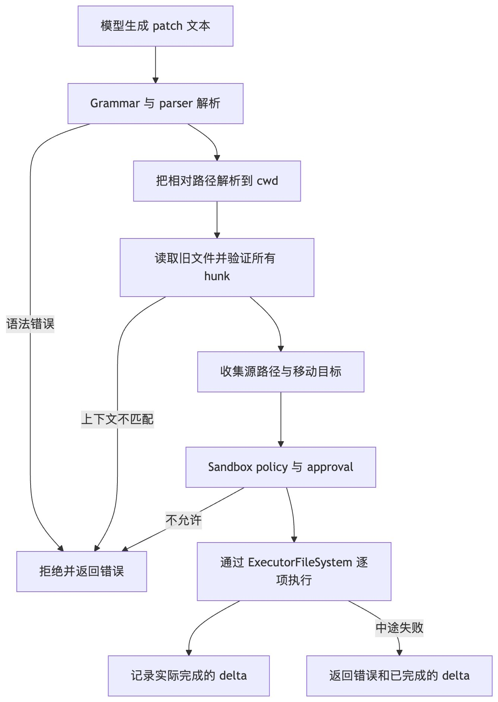

# Codex 怎样用 apply_patch 实现编辑文件工具？

来源时间：2026-09-13（抓取于 2026-09-15）

## 来源

- X 长文：https://x.com/i/article/2098935884049461253
- 推文入口：https://x.com/verysmallwoods/status/2098936857731985419
- 作者：VerySmallWoods（https://www.verysmallwoods.com）
- 文中引用的源码固定在该 commit：https://github.com/openai/codex/tree/70eb36203dbb8c75d006b39cdfae74bd04e18a65/codex-rs
- 流程图：`raw/assets/2026-09-13-codex-apply-patch-pipeline.jpg`

抓取方式说明：x.com 直连被 Cloudflare 拦截，本文正文通过 fxtwitter API（`api.fxtwitter.com`）取得，图片取自 pbs.twimg.com。正文与原文一致，仅做了 Markdown 结构还原（代码块、表格、链接），未改写措辞。

---


前一篇文章比较了几种 Coding Agent 写文件、改文件的方式。Codex 的编辑文件工具的设计和实现颇有看点。这一期我们就来看看 Codex 的 apply_patch。

表面上，它只是一个编辑文件工具：模型给出修改，工具把修改写进文件。真正拆开以后，中间至少隔着五层：模型先生成一种 patch 语言描述的修改计划；解析器把文本转化成结构化的 hunk；验证阶段读取旧文件并计算新内容；安全层收集所有受影响的路径；执行器才按顺序把变化交给文件系统。

这套设计值得 agents 开发者朋友们学习与参考：大模型擅长生成文本，文件系统只接受确定的读、写、删操作，两者之间应该用什么语言衔接呢？

## Patch 到底是什么

先把几个容易混在一起的词拆开。

**diff** 通常指两个版本之间的差异，也可以指生成这种差异的程序。**patch** 是一份可以用来重现修改的变更描述，也可以指把这份描述应用到原始文件的动作。**hunk** 则是 patch 中一块连续的修改区域，其中既有被删除和新增的行，也常带有修改位置附近没有变化的上下文。

例如，传统 unified diff 中的一个 hunk 大致长这样：

```diff
--- a/src/greet.ts
+++ b/src/greet.ts
@@ -1,3 +1,3 @@
 export function greet(name: string) {
-  return `Hello ${name}`
+  return `Hello, ${name}!`
 }
```

- 开头的是旧版本中要移除的行，+ 开头的是新版本中要加入的行，空格开头的是上下文。@@ -1,3 +1,3 @@ 记录旧文件和新文件中的行号范围。[GNU Diffutils 对 unified format 的定义](https://www.gnu.org/software/diffutils/manual/html_node/Detailed-Unified.html)也使用这套结构。

hunk 可以理解为“带着现场快照的一小段修改”。只说“删掉第 27 行”很脆弱，因为文件前面增加一行后，原来的第 27 行就移动了。hunk 同时带上周围没有变化的内容，应用 patch 的程序便可以用这些上下文重新找到位置。

开发者朋友们是不是对这个概念无比熟悉呢？

它是不是行业标准

需要分两层回答。

“用 patch 描述源代码变化”是软件工程里长期使用的通用办法。unified diff 也已经形成广泛兼容的事实格式：GNU diff -u 可以生成，GNU patch 可以应用；Git 的 diff -p 仍以 unified diff 为主体，再增加 diff --git、文件 mode、rename、对象哈希等扩展头。[Git 官方文档](https://git-scm.com/docs/diff-generate-patch)也明确说，它生成的 patch text 与传统 diff 格式“略有不同”。

但“patch”并不指唯一、不可扩展的一套标准。不同工具可以在共同观念上设计自己的语法。

| 内容 | 通用程度 | Codex 的做法 |
| :--- | :--- | :--- |
| 用 `+`、`-`、空格表示新增、删除、上下文 | unified diff 中的通行约定 | 沿用 |
| 用 hunk 表示一块连续修改 | 通行概念 | 沿用 |
| `---`、`+++` 文件头和带行号的 `@@` | 传统 unified diff 格式 | 不要求 |
| `*** Begin Patch`、`*** Update File` | 不是 unified diff 标准 | Codex 自定义 |
| 在一份变更中增加、删除、更新、移动文件 | 多种 patch 格式都能表达 | Codex 用自己的指令表达 |

所以更准确的说法是：Codex 借用了 patch、hunk 和 diff 行前缀这些成熟概念，但 apply_patch 接收的是一门为 Agent 工具调用设计的自定义 patch 语言，不是把 git diff 原样交给 git apply。

## Codex 的 patch 语言

Codex 把 apply_patch 注册为 freeform tool。它的参数不是 JSON 对象，而是一段必须符合 Lark grammar 的文本。[工具定义与 grammar 接入](https://github.com/openai/codex/blob/70eb36203dbb8c75d006b39cdfae74bd04e18a65/codex-rs/core/src/tools/handlers/apply_patch_spec.rs#L1-L27)

一份最小的更新如下：

```diff
*** Begin Patch
*** Update File: src/greet.ts
@@
 export function greet(name: string) {
-  return `Hello ${name}`
+  return `Hello, ${name}!`
 }
*** End Patch
```

完整语法支持四种文件级意图：

- *** Add File: path 新建文件，后续内容每行以 + 开头
- *** Delete File: path 删除文件
- *** Update File: path 更新已有文件
- Update 后跟 *** Move to: new-path，在更新内容的同时移动文件
一份 patch 可以包含多个文件操作；一个 Update 也可以包含多个 hunk。Codex 的 grammar 很短，核心规则只有十几行，因此模型能够稳定生成，解析器也能明确拒绝不合法输入。[`apply_patch.lark`](https://github.com/openai/codex/blob/70eb36203dbb8c75d006b39cdfae74bd04e18a65/codex-rs/core/assets/tools/apply_patch.lark#L1-L17)

这里的 @@ 与标准 unified diff 也有区别。传统格式在 @@ 中携带新旧行号；Codex 可以只写一个 @@，也可以在后面放一行上下文提示，例如函数、类或方法声明：

```diff
@@ class UserService
@@ async function loadUser(id: string)
```

它不是强制行号，而是一条用来缩小查找范围的上下文线索。真正决定能否修改的，仍是 hunk 中的旧行和上下文行能否在当前文件里按顺序找到。

## 一次编辑怎样走完整条链路

从模型发出工具调用到文件变化，可以把 apply_patch 分成六个阶段。



用伪代码表达，大致是这样：

```text
function applyPatch(rawPatch, cwd, environment):
    hunks = parse(rawPatch)

    action = verify(hunks):
        reject duplicate resolved paths
        for each hunk:
            path = resolve(cwd, hunk.path)
            if Add:
                remember new content
            if Delete:
                read and remember old content
            if Update:
                old = read(path)
                new = applyChunksInMemory(old, hunk.chunks)
                remember old, new, diff and optional move target

    paths = collectSourceAndDestinationPaths(action)
    permissions = evaluate(paths, sandboxPolicy)
    approveIfRequired(permissions)

    delta = []
    for each hunk in original order:
        commitThroughExecutorFileSystem(hunk)
        delta.append(the change that actually completed)

    return delta
```

这里最重要的分界是 parse、verify 和 commit。解析只回答“这段文本是不是合法的 patch”；验证回答“它能不能应用到当前文件”；执行才真正改变文件系统。把三件事分开，可以在写入发生以前暴露大部分语法错误、路径冲突和上下文漂移。

## 解析器把文本变成什么

Parser 最终产生一组 Hunk。文件级 hunk 分成 AddFile、DeleteFile 和 UpdateFile；移动操作是 Update 上的可选 move_path。[`Hunk` 数据结构](https://github.com/openai/codex/blob/70eb36203dbb8c75d006b39cdfae74bd04e18a65/codex-rs/apply-patch/src/parser.rs#L64-L82)

Update 内部又拆成若干 UpdateFileChunk。每个 chunk 保存：

- 可选的 change_context
- 旧内容 old_lines
- 修改后内容 new_lines
- 哪些行来自上下文
- 是否要求贴着文件末尾匹配
解析器并不读取文件，也不判断 old_lines 是否真的存在。换句话说，一个 patch 可以语法完全正确，却因为目标文件已经变化而无法应用。这种失败留给下一阶段处理。[Parser 的职责说明](https://github.com/openai/codex/blob/70eb36203dbb8c75d006b39cdfae74bd04e18a65/codex-rs/apply-patch/src/parser.rs#L1-L25)

Codex 当前还保留了一定的输入容错，用来处理 heredoc 包装和模型偶尔产生的边界空白问题。这种容错发生在“识别 patch 文本”这一层，不代表它会随意猜测文件中的修改位置。

## Hunk 怎样找到修改位置

验证 Update 时，Codex 先读取原文件，再为每个 chunk 寻找旧行序列。搜索从上一个 chunk 命中的位置之后继续，因此多个 hunk 按文件中的顺序向前推进，而不是每次都从头搜索。

匹配分四轮，容错逐步提高：

1. 每一行完全相等
1. 忽略每一行末尾的空白
1. 忽略每一行开头和末尾的空白
1. 在去掉两端空白后，把常见的 Unicode 破折号、弯引号和特殊空格统一成对应的 ASCII 字符
实现找到第一轮能够匹配的位置就停止，不会给所有候选计算“相似度”再挑一个最像的地方。[`seek_sequence`](https://github.com/openai/codex/blob/70eb36203dbb8c75d006b39cdfae74bd04e18a65/codex-rs/apply-patch/src/seek_sequence.rs#L1-L113)

这是一种有边界的容错。它能处理模型常见的行尾空格、缩进和弯引号差异，但不会忽略变量名、关键字或代码结构的变化。如果旧行最终找不到，整个验证失败，文件不会进入执行阶段。

*** End of File 还有一层特殊含义：工具会优先从文件尾部尝试匹配，适合明确修改最后几行。若没有这个标记，搜索从当前游标向后进行。

找到每个 chunk 后，Codex 记录一组 replacement，最后从后向前替换。反向应用很关键，也很好理解：先改文件靠后的片段，前面片段的行号和下标就不会被后面的增删改影响。[replacement 的计算与应用](https://github.com/openai/codex/blob/70eb36203dbb8c75d006b39cdfae74bd04e18a65/codex-rs/apply-patch/src/file_update.rs#L84-L245)

```text
replacements = []
cursor = 0

for chunk in chunks:
    if chunk.changeContext exists:
        cursor = find(changeContext, atOrAfter=cursor)

    start = find(chunk.oldLines, atOrAfter=cursor)
    if start not found:
        fail("expected lines not found")

    replacements.append(start, oldLength, newLines)
    cursor = start + oldLength

for replacement in reverse(replacements):
    lines.splice(replacement.start,
                 replacement.oldLength,
                 replacement.newLines)
```

文件换行也在这一层处理。当前实现可以把内容统一为 LF，也可以保留原文件的行尾风格；在保留模式下，未修改的上下文会尽量继续使用原来的换行符。于是 patch 描述的是“哪些行变化”，不必要求模型准确复制整份文件的 CRLF 或混合换行细节。

## 为什么要在写入前验证整份 patch

try_verify_apply_patch_args 会先把路径按当前工作目录解析，再检查同一个解析后路径是否在一份 patch 中被操作多次。Add 直接记录新内容；Delete 先读取旧内容；Update 则在内存中把所有 chunk 应用到旧内容，提前得到 new_content 和用于展示的 unified diff。[patch 验证](https://github.com/openai/codex/blob/70eb36203dbb8c75d006b39cdfae74bd04e18a65/codex-rs/apply-patch/src/invocation.rs#L179-L295)

这一步带来三个结果。

第一，工具还没有写文件，就知道 patch 在当前快照上能否成立。模型抄错上下文、目标文件不存在或同一路径重复操作，都会直接触发失败，终止编辑操作。

第二，安全层能够提前看到整份操作的范围。它不只知道“模型调用了编辑工具”，还知道具体会写、删、移动哪些文件。

第三，界面和事件系统可以展示实际的文件差异，而不是只展示模型提交的原始文本。Codex 自定义 patch 不是标准 unified diff，但验证通过后，Update 会计算出用于展示和记录的 unified diff。

不过，这不是并发控制。验证读取文件与执行再次读取或写入之间仍有时间间隔，别的进程可能在中间改动目标文件。公开实现会在执行 Update 时重新根据 chunk 读取和推导内容，因此变化可能导致执行失败；它并没有把“验证时的整份工作区快照”锁定成一个跨文件事务。

## 路径、Sandbox 与审批

验证完成后，handler 会收集所有受影响路径。普通 Add、Delete、Update 包含源路径；Move 还要加入目标路径。随后它根据当前 sandbox policy、已有权限和审批策略，计算这次操作是否可以直接执行，还是需要请求额外授权。[受影响路径与权限计算](https://github.com/openai/codex/blob/70eb36203dbb8c75d006b39cdfae74bd04e18a65/codex-rs/core/src/tools/handlers/apply_patch.rs#L223-L338)

这个顺序很重要。审批面对的不是一句含糊的“允许编辑文件吗”，而是一组在解析、验证后已经确定的路径。移动文件的目的地也在集合里，避免只检查旧路径却漏掉新路径。

安全评估通过以后，handler 才创建 ApplyPatchRequest，交给 runtime 执行。Runtime 取得当前 environment 对应的 ExecutorFileSystem 和文件系统 sandbox context，再调用真正的 apply 逻辑。[handler 的执行入口](https://github.com/openai/codex/blob/70eb36203dbb8c75d006b39cdfae74bd04e18a65/codex-rs/core/src/tools/handlers/apply_patch.rs#L547-L625) apply patch runtime

ExecutorFileSystem 是这里的关键边界。patch 算法不直接绑死在本机文件 API 上，而是通过统一接口读文件、写文件、删除和创建目录。这样，本地执行环境、远程执行环境或带 sandbox 的文件系统可以共用同一套 patch 语义，具体的路径隔离与底层写入能力则由所选 environment 提供。

## 真正写入时发生什么

执行器按 patch 中的 hunk 顺序逐项处理：

- Add 会在需要时创建缺失的父目录，然后写入内容
- Delete 会确认目标不是目录，再删除文件
- Update 会重新读取文件，根据 chunks 推导新内容，然后写回
- Move 会先把新内容写到目标路径，再删除原路径
每完成一项，执行器都会向 AppliedPatchDelta 追加一条记录。这个 delta 描述的不是“原计划做什么”，而是“文件系统中确定已经发生了什么”。它保存旧内容、新内容和移动目标等信息，方便上层在成功或失败时准确报告变化。[逐项执行与 delta 记录](https://github.com/openai/codex/blob/70eb36203dbb8c75d006b39cdfae74bd04e18a65/codex-rs/apply-patch/src/lib.rs#L460-L626)

再看看 Move 操作。它不是底层一次不可分割的 rename：实现先写目的文件，再删源文件。如果目的文件写成功而删除源文件失败，调用会报错，但目的文件可能已经存在。因此 delta 必须能够描述这类部分完成状态。

同样，单个 write_file 是否通过临时文件、rename 或其他机制保证原子发布，不由 patch 语法本身保证，而由实际的 ExecutorFileSystem 后端决定。讨论 apply_patch 时，不能把“先验证完整 patch”“一个文件的写入原子性”和“多个文件组成事务”混成一件事。

## 一份多文件 patch 不是事务

Codex 会在写入前验证整份 patch，这让它有很强的“先算清楚再动手”特征，但执行阶段仍是顺序提交：第一个 hunk 成功后，第二个才开始。如果第三个失败，前两个已经完成的修改不会自动回滚。

```text
验证阶段
  A ✓  B ✓  C ✓
        ↓
执行阶段
  A ✓  B ✓  C ✗
        ↓
结果
  返回失败 + A、B 已完成的 delta
```

源码里的 ApplyPatchFailure 专门携带失败前已经提交的 delta；写入失败时，因为底层有可能先截断文件再报告磁盘空间不足，delta 还会标记自己是否能够精确描述现场。[失败与已提交变化](https://github.com/openai/codex/blob/70eb36203dbb8c75d006b39cdfae74bd04e18a65/codex-rs/apply-patch/src/lib.rs#L245-L329)

要做到真正的跨文件原子事务，系统需要在提交前准备所有临时结果，再用支持事务的存储层一次切换，或者在失败时可靠回滚每个文件。普通文件系统的跨目录、跨设备、删除与移动操作很难统一满足这些条件，复杂度会高很多。

Codex 选择的是另一种工程化取舍：尽可能在执行前发现错误；执行时记录真实进度；一旦出现部分失败，把已经发生的变化如实交给上层和 Agent，由后续检查、修复或重试处理。

## 为什么这种工具适合 Coding Agent

如果只修改一个短字符串，replace(old, new) 比 patch 简单得多。Codex 仍然选择 patch，是因为 Coding Agent 经常需要同时完成一组有结构的变化：改函数签名、更新调用方、新增测试、删除旧文件，甚至移动模块。

Patch 在模型与文件系统之间提供了一层很合适的中间表示：

- 它比输出整份新文件更紧凑，模型只需表达变化和必要上下文
- 它比只给行号稳健，文件轻微移动后仍可能靠上下文定位
- 它把旧内容写进请求，相当于附带一部分前置条件，文件已经不同就会失败
- 它可以在一次调用中表达多个文件和多个修改点
- 它天然适合生成人类熟悉的 diff，便于审查和审批
代价也很明确：系统需要维护一门语法、一个有容错边界的匹配器、换行处理、路径解析、安全评估和部分失败报告。Patch 没有消除文件编辑的复杂度，它只是把复杂度集中到一层可测试、可审计的基础设施里。

---

这就是 Codex 的 edit_file 工具的技术细节，希望对你我他她它都有所帮助。

