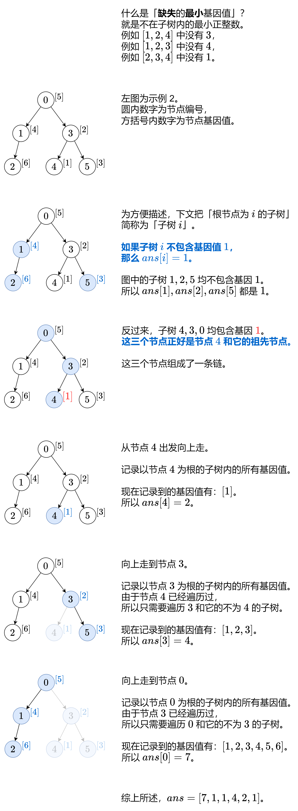

- https://leetcode.cn/problems/smallest-missing-genetic-value-in-each-subtree/description/
	- 
	- ```cpp
	  class Solution {
	  public:
	      vector<int> smallestMissingValueSubtree(vector<int>& parents, vector<int>& nums) {
	          int n = parents.size();
	          vector<int> ans(n, 1);
	          auto it = find(nums.begin(), nums.end(), 1);
	          if (it == nums.end()) {
	              return ans;
	          }
	  
	          vector<vector<int>> g(n);
	          for (int i = 1; i < n; ++i) {
	              g[parents[i]].push_back(i);
	          }
	  
	          unordered_set<int> vis;
	          function<void(int)> dfs = [&](int x) -> void {
	              vis.insert(nums[x]);
	              for (int son: g[x]) {
	                  if (!vis.count(nums[son])) {
	                      dfs(son);
	                  }
	              }
	          };
	  
	          int mex = 2;
	          int node = it - nums.begin();
	          while (node >= 0) {
	              dfs(node);
	              while (vis.count(mex)) {
	                  mex++;
	              }
	              ans[node] = mex;
	              node = parents[node];
	          }
	          return ans;
	      }
	  };
	  ```
-