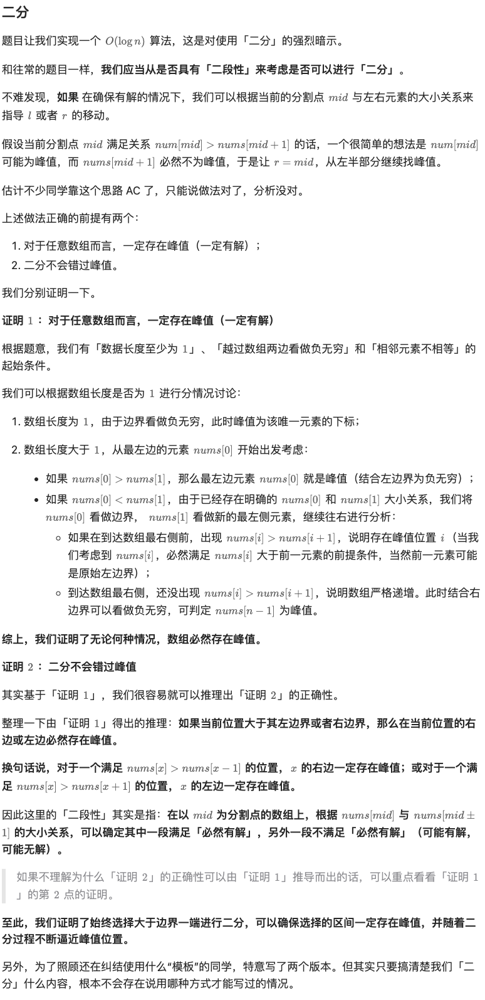
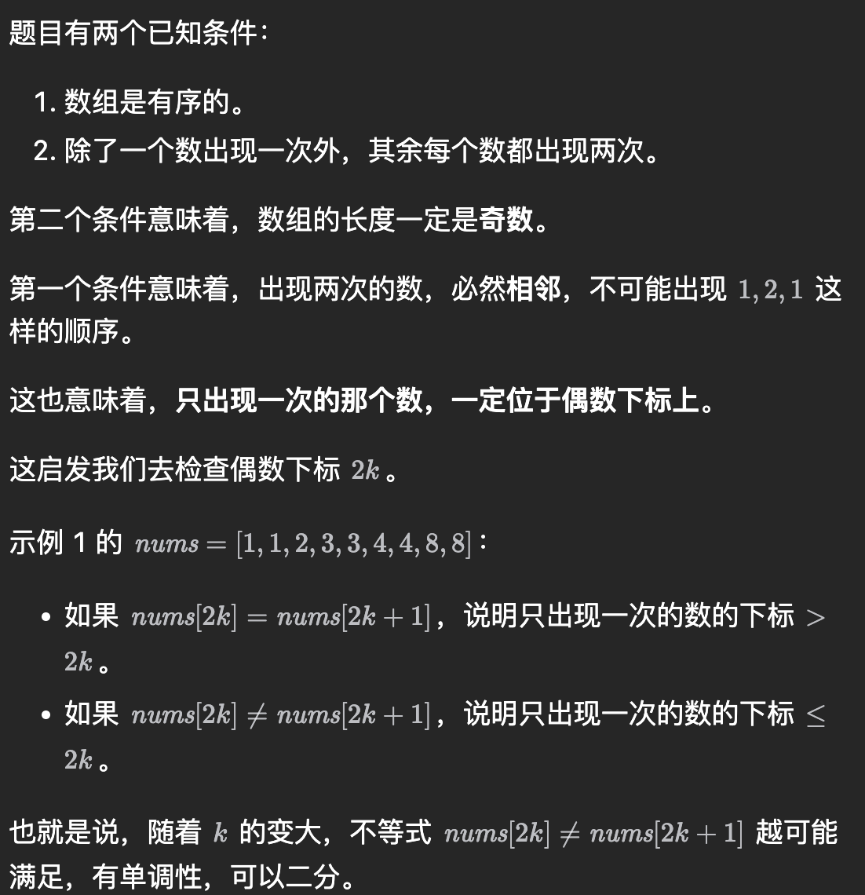

- https://leetcode.cn/problems/find-peak-element/description/
	- 二分的本质是「二段性」而非「单调性」，而经过本题，我们进一步发现「二段性」还能继续细分，不仅仅只有满足 **01** 特性（满足/不满足）的「二段性」可以使用二分，满足 **1?** 特性（一定满足/不一定满足）也可以二分。
	- 
	- ```cpp
	  class Solution {
	  public:
	      int findPeakElement(vector<int>& nums) {
	          int n = nums.size();
	          int l = 0, r = n - 1, ans = 0;
	          nums.push_back(INT_MIN);
	          while (l <= r) {
	              int mid = l + ((r - l) >> 1);
	              if (nums[mid] > nums[mid + 1]) {
	                  ans = mid;
	                  r = mid - 1;
	              } else {
	                  l = mid + 1;
	              }
	          }
	          return ans;
	      }
	  };
	  ```
- https://leetcode.cn/problems/single-element-in-a-sorted-array/
	- 
-