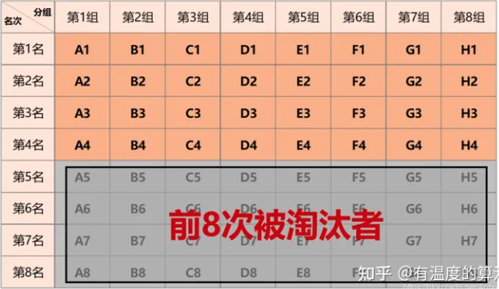
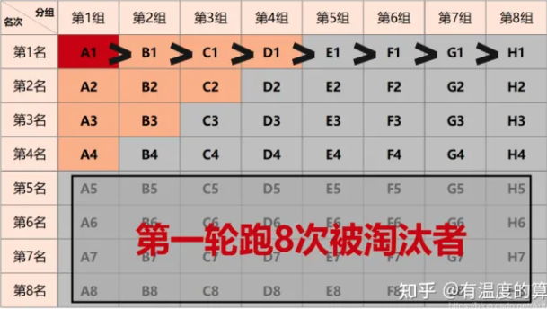
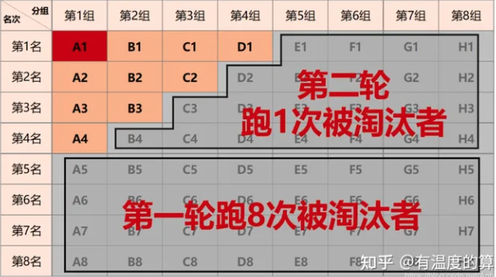
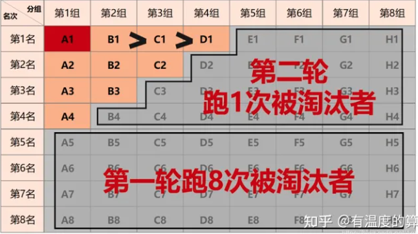

- 面试题 https://juejin.cn/post/7004638318843412493
- https://lucifer.ren/fe-interview/#/?id=浏览器
- https://lgwebdream.github.io/FE-Interview/react/#介绍-react-设计思路，它的理念是什么？
- 64 匹马，8 个赛道，找出前 4 名最少比多少场
	- 先跑 8 场，每场淘汰 4 匹马，因为我们只要前 4 名
		- 
	- 然后把 8 组中每组第一名的马进行比赛，按名次排序
		- 
		- 这时 A1 为全场最快，直接晋级。同时知道 A1 > B1 > C1 > D1 > E1 > F1 > G1 > H1，并且由第一轮的结果可知 D1 > D2 > D3 > D4。
		- 因为总共需要选出 4 匹，综上可得出 A1 > B1 > C1 > D1 > D2 > D3 > D4，所以 D2、D3、D4 一定被淘汰。同理，B4、C3 -4 、D2 - 4、E1 - 4、F1 - 4、G1 - 4、F1 - 4 被淘汰。
		- 
	- 一场或两场
		- 目前已知 A1 为全场最快，已经晋级。现在需要在 A2 - 4、B1 - 3、C1 - 2、D1 这 9 匹马(只有 8 条跑道)中选择最快的 3 匹，同时知道 B1 > C1 > D1。这时 D1 是最危险的，因为已经知道有两匹马比它快，我们选择除了 D1 之外的 8 匹马进行比赛。
		- 
		- 如果 C1 以第二名的成绩晋级（除 D1 比赛中的第二名，已知 B1 > C1，所以 C1 不可能是第一名），那么最终第三名（除 D1 比赛中的第三名）在 A2 - 4、B2 - 3、C2 中产生，并不能知道 D1 与它们的快慢，所以需要 D1 与 A2 - 4、B2 - 3、C2 共 7 匹马再进行一次比赛，第一名进入 TOP4（是总成绩中的第四名）。
		- 如果 C1 以第三至七名的成绩完赛（除 D1 的比赛，已知 C1 > D1，所以 C1 不可能是第八名），那么除 D1 这 8 匹马中的前三名就直接进入TOP4（总成绩中的第二、三、四名），无需进行加赛。
	- 在前两轮后我们知道 B1 > C1 > D1，也知道 A2 > A3 > A4。同理，我们也可以将 A4 排除，让 A2 - 3、B1 - 3、C1 - 2、D1 这 8 匹马进行比赛，再以 A3 的排名进行分情况讨论。
- https://zhuanlan.zhihu.com/p/24375080