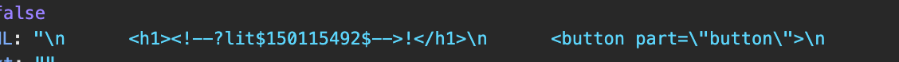
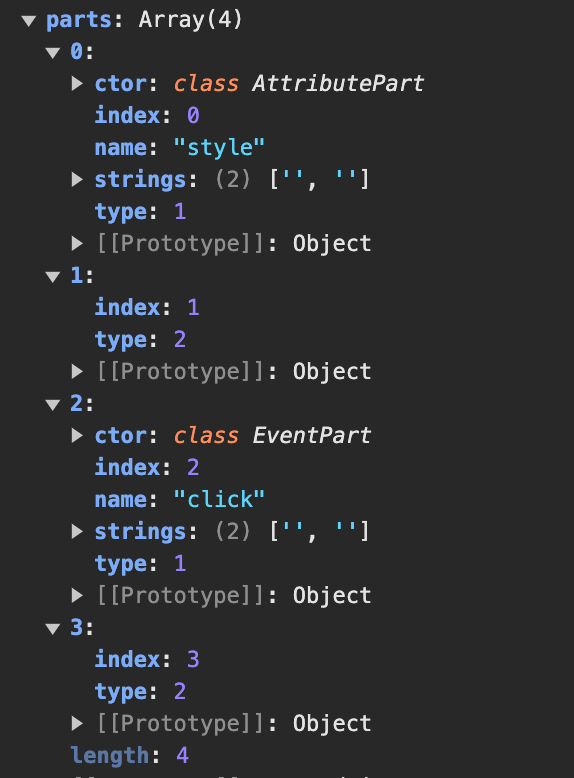
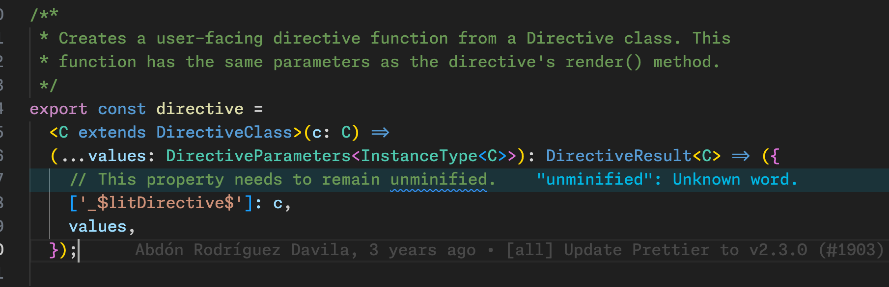

- 更新时间复杂度是基于动态变化的数量的，O(expr)
- 本身抽象了一个 Reactivity Element，基于 Web Component，实现了 batch update，用微任务队列批量处理，数组 / 对象 attribute 到属性的映射，还有各种生命周期的钩子的暴露（render， update），也做了基于装饰器的一些封装，比如响应式的 property，还有注册 Web Component
	- 还有一个跟 UI 分离的可复用的逻辑组件 controller，也融合进了Reactivity Element
- 再用 lit-html 实现了一个高性能的模版更新引擎，基于动态变化的数量
- 继承了 Reactivity Element，再结合 lit-html 来实现 Lit Element，就做完了
- lit-html 本身的思想就是只更新动态的部分，动态的部分怎么获取？利用 [tagged templates](https://developer.mozilla.org/en-US/docs/Web/JavaScript/Reference/Template_literals#tagged_templates) 把静态和动态的部分分离出来，然后先把静态的拼起来，动态部分用占位符表示，用正则表达式匹配各种状态，去组装成一个 template，走一遍这个 template 的 DOM，识别动态的部分并将其实例化成一个个类，每个动态的部分能够存储对应的 nodeId
	- 
	- 
- 然后结合 Lit Element，到真的要渲染的时候实例化这个 Template，这时候遍历 Part 数组，同时深度遍历这个实例化后的 DOM，这些信息都会绑定到一个 TemplateInstance 上
	- 因为上文已经说到每个 Part 我们记录了对应 DOM 的 nodeId，所以对每个 Part 索引的 Id，我们可以通过不断遍历实例化后的 DOM 找到对应的 node，这时候会再实例化应该更具体的 Part（比如属性，就是直接 set 对应 DOM 的属性，事件监听就是重新绑定监听事件），这个 Part 会绑定 DOM 节点，这之后更新的时候就能直接更新这个 DOM 节点上的信息了
	- 跟动态 children 的绑定就是靠 ChildPart，如果这个是一个 Template，就会继续遍历 TemplateInstance 上的所有 Part ，递归调用下去
	- 静态的 slot 不会继续递归，靠你实际赋值的时候再去渲染，相当于 slot 也是一个分界线
- Lit 为了实现一些高级的指令，比如 repeat，classMap 等，又抽象了一个 directive 的概念，同时和 Part 绑定，directive 最终会 render 一个结果，这个结果也可以是一个 directive，在 Part 实例里会不断的 parse，有点像不断的解包一个多层嵌套的 Promise
	- 高级的指令实现也很有意思，表面上你实现了一个 Directive 类
	- 但是实际 call 的时候实现包装成了一个函数，这个函数就只是返回一个对象，然后在 Part 设置 value 的时候再不断调用，有种延迟调用的感觉
		- 
- 这样保证了 lit-html 的核心很简洁，同时开放了一个 directive 的机制，这样我们也可以自定义我们自己的 directive
- 后续更新的时候也直接用 Part 更新就好了
- 总的来说感觉 Lit 的实现很小巧，很好的保留的核心的实现，也暴露了一定的扩展能力给到外部的开发者，controller 的实现也很精妙，UI 与逻辑分离
-