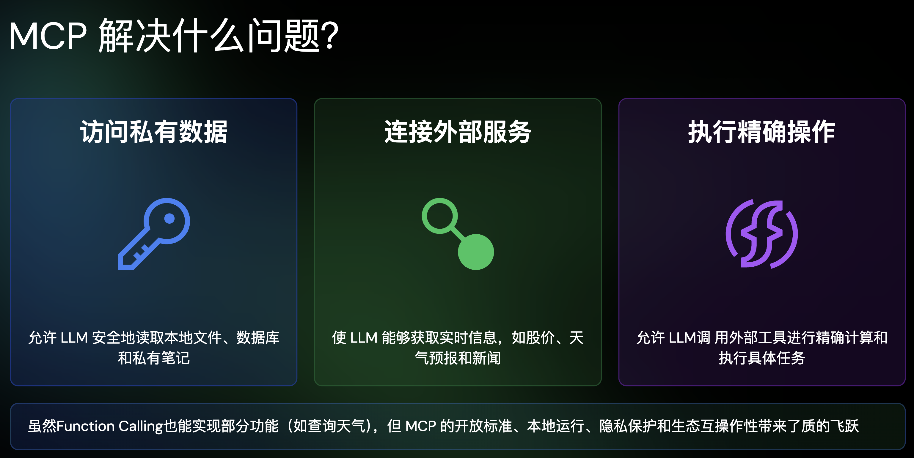

- https://github.com/ComposioHQ/composio
- 介绍 MCP 的 slide： https://talks.ayaka.io/nekoayaka/2025-04-13-what-is-mcp-and-how-it-helps/#/1
- 
	- 感觉这个私有性也不是很说的通，毕竟 FC 应该也能实现吧（也写死用 stdio 来通信就行了应该），我感觉最大的价值还是有了一个标准的协议
- 好用的 MCP 收集：
	- https://github.com/wrale/mcp-server-tree-sitter
- https://mp.weixin.qq.com/s?__biz=MzI1MzYzMjE0MQ==&mid=2247516461&idx=1&sn=ce4917a4ab56c2c136290e20c5ba79f5&poc_token=HEU_vWijo0oCrhmjt2qVAlM4teQ4khEUbS98qphk
	- [[OAuth]] 授权下带来的风险：
		- **恶意客户端通过授权码拦截窃取用户令牌**：由于任何应用都能动态注册为合法客户端，攻击者可以构建一个功能与正常应用类似的恶意 MCP 客户端，并通过各种渠道（如钓鱼邮件、非官方应用市场）诱导用户下载安装。
		- **恶意服务端利用“Confused Deputy”问题窃取令牌**：即便 MCP 客户端本身是可信的，如果用户在客户端中添加了一个恶意的 MCP 服务端地址，风险同样存在。这在安全领域被称为**“Confused Deputy Problem”**。
			- 可能是因为 MCP Client 是三方的，所以带来了可以授权任意页面，但是我们正常的一方页面就不会有这个问题，我们发起的授权应用都是可控的，不然感觉现在一方的也会有问题？
		- 解决方案：
			- **授权前二次确认**作为第一道防线，主动防范钓鱼攻击。
			- **令牌身份隔离**作为核心举措，极大限制了风险半径，防止危害横向扩散。
			- **API 级别权限管控**遵循最小权限原则，为潜在的未知风险提供了最终的安全保障。
-