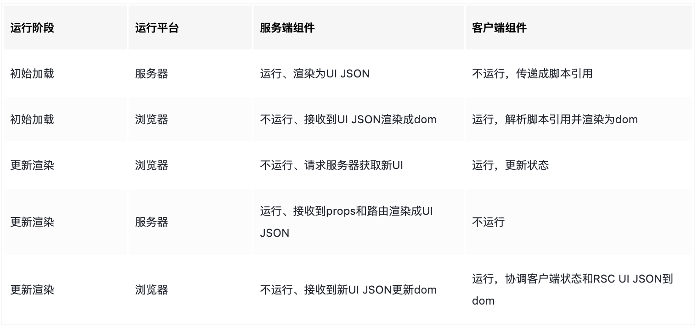

- React 在服务端会把 Client Component 会被渲染成脚本的引用，Server Component 会被流式渲染成类JSON UI。引用和 JSON 再会传到浏览器中进行协调和视图更新。
- 虽然客户端组件不能直接 import 服务端组件，但是可以把服务端组件以 children 方式。比如可以写这样的代码`<ClientTabBar><ServerTabContent/></ClientTabBar>`。从客户端组件的角度来看，它的子组件将是一个已经渲染好的树，比如 `ServerTabContent`的输出。这意味着服务器和客户端组件可以在任何层级上嵌套和交错。
- 
- 一些 Lib：
	- https://github.com/devongovett/rsc-html-stream
		- Inject an RSC payload into an HTML stream and read it back
- 实际尝试下来渲染还是一起上屏的，然后 RSC 字符串的顺序是没关系的，流式的部分应该在它处理 RSC 字符串的（不过含有客户端组件没有尝试，估计也还是要等客户端组件回传回来才会上屏，不然树是不完整的）： https://stackblitz.com/edit/vitejs-vite-11my8t?file=package.json,src%2Fmain.tsx,index.html&terminal=dev
- 1. 生成 RSC 协议字符串。
	- 比如我们有个组件树，App -> Foo。调 RSDWS（react-server-dom-webpack/server） 渲染 App 即可得到 RSC 协议的字符串。
		- ```js
		  import rsdws from "react-server-dom-webpack/server";
		  const { renderToPipeableStream } = rsdws;
		  import { App } from "./app/App.js";
		  renderToPipeableStream(<App />).pipe(process.stdout);
		  // 输出
		  // J0:["$","div",null,{"children":[["$","h1",null,{"children":"App"}],["$","p",null,{"children":"Foo"}]]}]
		  ```
	- 现在来加一个 Client 组件 Bar，注意 Client 组件在 RSC render 时不会引真实文件，而是被替换成 `{ $$typeof, filepath, name }` 的格式。这一步通常由框架或构建工具来做。然后 renderToPipeableStream 时加上 bundle 相关配置，webpack 的场景下需要 id、name 和 chunks 字段。
		- ```js
		  const Bar = {
		    $$typeof: Symbol.for("react.module.reference"),
		    filepath: "Bar.tsx",
		    name: "Bar",
		  };
		  renderToPipeableStream(<App />, { 'Bar.tsx': { Bar: { id: 'Bar.tsx', name: 'xxx', chunks: [] } } }).pipe(process.stdout);
		  
		  // 输出
		  // M1:{"id":"Bar.tsx","name":"xxx", "chunks":[]}
		  // J0:["$","div",null,{"children":[["$","h1",null,{"children":"App"}],["$","p",null,{"children":"Foo"}],["$","@1",null,{}]]}]
		  ```
	- 其中 `Mx` 表示模块，而 `["$","@1",null,{}]` 表示使用 M1 模块。
- 2. 消费 RSC 协议字符串
	- 消费是通过 RSDWC（react-server-dom-webpack/client）。RSDWC 有 browser、node、edge 等实现，提供 createFromFetch、createFromReadableStream 等不同的消费方法。createFromXXX 方法会产出一个处理 RSC 协议字符串的 Promise，最终通过 `use()` 使用，产生 JSX。
		- 比如 Browser 侧消费的例子：
			- ```js
			  import React, { use } from "react";
			  import { createFromFetch } from "react-server-dom-webpack/client";
			  import ReactDOM from "react-dom/client";
			  
			  const chunk = createFromFetch(fetch('/path/to/.'));
			  function Container() {
			    return use(chunk);
			  }
			  ReactDOM.createRoot(root).render(<Container />);
			  ```
		- 由于使用的是 react-server-dom-webpack，意味着加载方式遵循 webpack 的规范。如果你的实现不基于 webpack，需要对 `__webpack_require__` 和 `__webpack_chunk_load__` 打补丁。
			- ```js
			  globalThis.__webpack_chunk_load__ = async (chunkId: string) => {};
			  globalThis.__webpack_require__ = (moduleId: string) => {};
			  ```
- https://overreacted.io/how-imports-work-in-rsc/
	- 从模块划分的角度，为了让后端代码不引入前端代码，前端代码不引入后端代码，引入了 'use client' 和 'use server' 两个指令，同时为了让一份代码能够同时运行，服务端引入客户端组件的时候需要引入构建工具，让引入的客户端组件一个 ref，到客户端环境的时候才能真正的被消费，客户端组件引入服务端 action 同理
	- 这样就是一份代码，两个系统都能跑，跨越了系统的边界
-