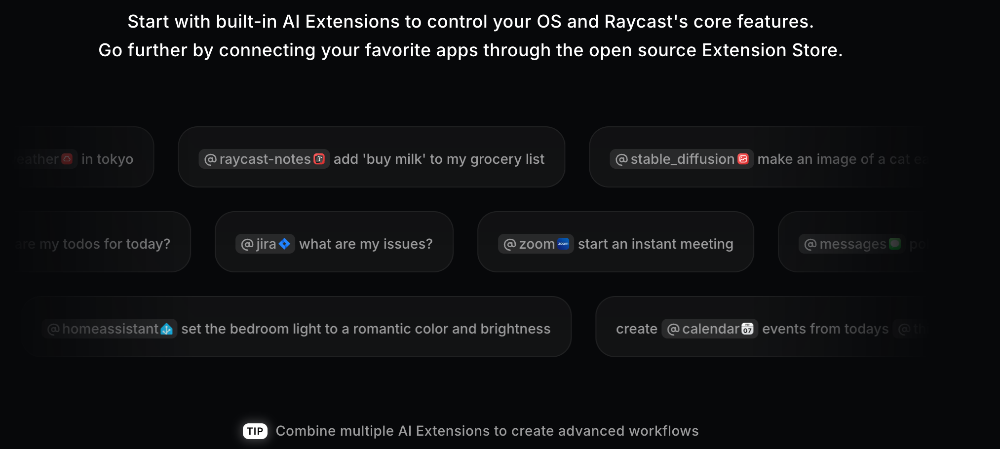

- 窗口管理：
	- 把一个程序挪到另一个显示屏
	- 快速左半屏幕，右半屏幕
- 常用工具：查看 ip / 测速 / 颜色提取 / 翻译 / 时区转换 / 货币转换
- quicklink 可以帮你快速打开一个网站，比如设定 bilibili 搜索某个关键词，直接从 raycast 发起
- snippet 还没用过，应该可以创建一些算法模版代码啥的
- 可以给常用的再加快捷键，把用的多的添加到 favorite
- raycast AI 看着很不错，需要用一下，深度集成了
	- 可以用自然语言 at 应用去做一些事情
		- 
- 需要防止读文件夹读到一些关键 key
-