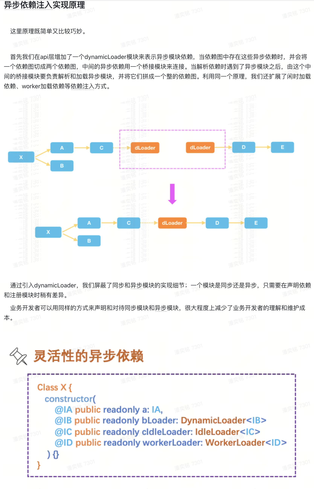
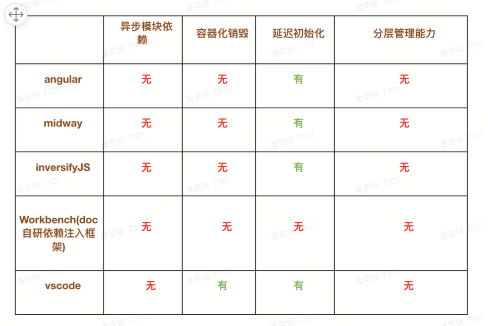
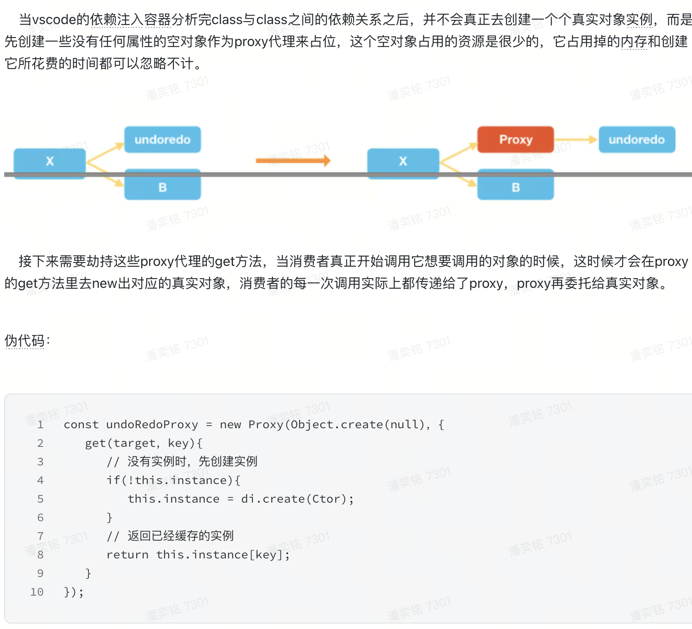
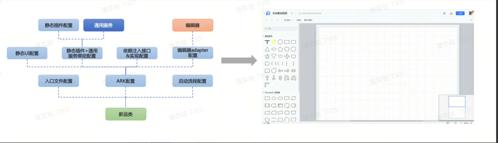

- 登录模块例子：
	- 一开始工具栏，sheetbar，右键菜单直接依赖登录组件的登录状态来控制是否禁用
	- 演进成工具栏，sheetbar，右键菜单，登录组件依赖一个新的权限模块，解耦
	- 然而权限状态变化时仍然会影响底下的组件
	- 仔细思考，工具栏，sheetbar，menu 状态改变的原因其实是页面是只读还是/可编辑状态，如果是只读态，那就让这些按钮灰显和不可点击，如果是可编辑态，那就让这些按钮变得可以点击，不管业务中将来会存在多少种权限，文档都只有两种状态，要么是只读状态，要么是可编辑状态。至于只读-可编辑态和这些权限之间的映射关系到底是怎样，那是别人应该关心的事情
	- 最终新增一个文档状态模块，表示当前页面是只读还是可编辑的状态，让工具栏，sheetbar，menu 依赖文档状态模块。当权限模块改变的时候让权限模块去修改文档状态模块。此时工具栏，sheetbar，menu 变成了更稳定的模块
- 设计规律：
	- 将抽象而稳定的代码放在系统高层
	- 将具体而不稳定的的代码放在系统低层
	- 复用性越强的模块放在系统高层，反之，不太需要复用的模块放在系统低层
	- 根据业务模块加载优先级，对性能要求越高的模块放在系统高层
	- **总而言之，当我们在设计一些模块时，需要不停去思考，这里的业务需求在将来有可能会如何发生变化？当这些变化来临时，这些模块是需要被修改、被替换还是被删除？我们付出的代价是否足够小？**
- 原则：单向依赖原则
- 稳定与不稳定：
	- 稳定程度是 核心业务逻辑 < 通用业务模块 < 工具类
- 创建对象和对象使用应该分开，使用对象不应该关心对象是如何被创建出来的（使用依赖注入分离） #[[Dependency Injection]]
	- 依赖注入的思路是引入一个容器类，让容器去统一管理对象的创建。容器会自动解析类与类之间的依赖映射关系，并将这些映射关系存放在容器内部。在消费者需要的时候，容器再按需动态创建相应的对象提供给消费者使用。
	- 在线文档需要更强大的依赖注入
		- 支持异步模块依赖
			- 
		- 支持容器化销毁和复用：保持内存在一个低水平线
		- 支持对象延迟初始化：异步加载以后等使用到的时候再初始化
		- 帮助构建单向依赖系统：创建多个容器，容器和容器可以分层依赖
		- 
		- 延迟初始化实现思路：
			- 
			- 这样一来，业务逻辑里就不用再关心这些对象的创建时机，它们会在真正需要的时候才被创建出来，用这种proxy代理的方式，既提高了页面性能，又能保证核心业务逻辑不受污染，对业务开发者也是完全透明的。
- UI 需要和逻辑分离
	- UI 和逻辑无法单独被复用
	- UI 和逻辑需求迭代频率不一致
	- UI 和逻辑运行环境不一样
	- 自动化测试都不方便编写
- 分歧虽然不会消失，但我们可以尝试将这些分歧挪到更容易修改的位置，用更简单的方式来表达和维护。当分歧发生时，我们为了解决分歧而付出的代价，至少比堆砌 if、else、或者复制粘贴要来的更小一些。
	- 可以尝试按下面几步来解决问题：
		- 分别寻找各个品类 & 租户之间的共同抽象特性和细节分歧
		- 将这些共同抽象特性封装起来，放置在系统的高层位置
		- 将细节分歧提取到系统低层，用各种更加简单的方式来表达和维护
		- 让低层细节分歧去依赖高层抽象共性，遵循单向依赖原则，保证在处理细节分歧时，不会影响到高层抽象共性
- 多端差异屏蔽：
	- 用多态的思路，设置统一的 interface
	- 为每个端提供不同的入口，在入口处就给它们分配不同的 service 实现，各个 service 之间的依赖关系都是通过 interface 联系起来的，而这些 service 都运行在各自终端环节下，永远不会交叉
	- 不同端具有不同操作，抽象一个更稳定的字段和代码，然后各端的表现通过配置映射关系来表达
		- ```js
		  if (showBtn) {
		    loginbtn.show();
		  } else {
		    loginbtn.hide();
		  }
		  
		  const config = {
		    showBtn: {
		      pc: true，
		      mobile: true，
		      app: false，
		      wx: false
		    }
		  }
		  ```
		- 复杂度和分歧其实并没有被消灭，当增加或者减少一个终端时，我们还是得作出相应的处理。当这些分歧被我们从业务逻辑里转移到了**配置文件**中，业务逻辑变成了和终端无关
- 
-