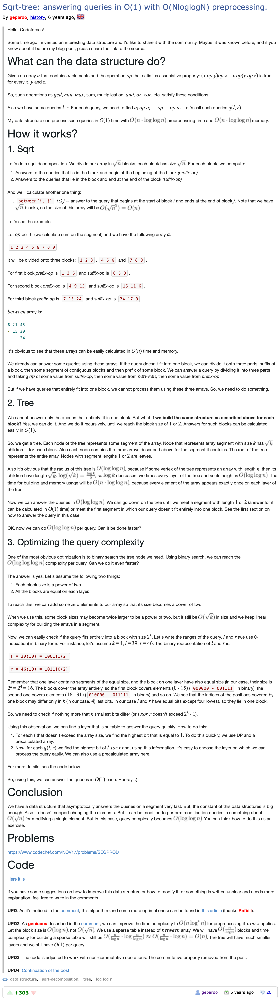

- https://codeforces.com/blog/entry/57046
- https://oi-wiki.org/ds/sqrt-tree/
- O(1) 查询，O(nloglogn) 预处理，不支持修改（可以支持，暂时不会）
	- 感觉 ST 表已经够了？
- [[Sqrt Tree Diagram]]
- https://www.codechef.com/problems/SEGPROD
- https://github.com/PerfectPan/Algorithm-Competition/commit/217474dab5515520496f25bee021d724c69c675e
- 主要思想就是在分块的基础上，继续对每个块递归分块，然后基于位运算直接确认是出于第几层
- 
- ```cpp
  int op(int a, int b);
  
  inline int log2Up(int n) {
  	int res = 0;
  	while ((1 << res) < n) {
  		res++;
  	}
  	return res;
  }
  
  class SqrtTree {
  	private:
  		int n, lg;
  		vector<int> v;
  		vector<int> clz;
  		vector<int> layers;
  		vector<int> onLayer;
  		vector< vector<int> > pref;
  		vector< vector<int> > suf;
  		vector< vector<int> > between;
  		
  		void build(int layer, int lBound, int rBound) {
  			if (layer >= (int)layers.size()) {
  				return;
  			}
  			int bSzLog = (layers[layer]+1) >> 1;
  			int bCntLog = layers[layer] >> 1;
  			int bSz = 1 << bSzLog;
  			int bCnt = 0;
  			for (int l = lBound; l < rBound; l += bSz) {
  				bCnt++;
  				int r = min(l + bSz, rBound);
  				pref[layer][l] = v[l];
  				for (int i = l+1; i < r; i++) {
  					pref[layer][i] = op(pref[layer][i-1], v[i]);
  				}
  				suf[layer][r-1] = v[r-1];
  				for (int i = r-2; i >= l; i--) {
  					suf[layer][i] = op(v[i], suf[layer][i+1]);
  				}
                  // [l, r] 区间继续递归分块
  				build(layer+1, l, r);
  			}
  			for (int i = 0; i < bCnt; i++) {
  				int ans = 0;
  				for (int j = i; j < bCnt; j++) {
  					int add = suf[layer][lBound + (j << bSzLog)];
  					ans = (i == j) ? add : op(ans, add);
                      // 每个块内算，可以见图示的文字解释
  					between[layer][lBound + (i << bCntLog) + j] = ans;
  				}
  			}
  		}
  	public:
  		inline int query(int l, int r) {
  			if (l == r) {
  				return v[l];
  			}
  			if (l + 1 == r) {
  				return op(v[l], v[r]);
  			}
  			int layer = onLayer[clz[l ^ r]];
  			int bSzLog = (layers[layer]+1) >> 1;
              // 块数是 2^bCntLog 个
  			int bCntLog = layers[layer] >> 1;
  			int lBound = (l >> layers[layer]) << layers[layer];
  			int lBlock = ((l - lBound) >> bSzLog) + 1;
  			int rBlock = ((r - lBound) >> bSzLog) - 1;
  			int ans = suf[layer][l];
  			if (lBlock <= rBlock) {
  				ans = op(ans, between[layer][lBound + (lBlock << bCntLog) + rBlock]);
  			}
  			ans = op(ans, pref[layer][r]);
  			return ans;
  		}
  		
  		SqrtTree(const vector<int>& v)
  			: n((int)v.size()), lg(log2Up(n)), v(v), clz(1 << lg), onLayer(lg+1) {
  			clz[0] = 0;
  			for (int i = 1; i < (int)clz.size(); i++) {
  				clz[i] = clz[i >> 1] + 1;
  			}
  			int tlg = lg;
  			while (tlg > 1) {
                  // onLayer 表示指数为 x 的在第几层
  				onLayer[tlg] = (int)layers.size();
                  // 当前层长度是多少
  				layers.push_back(tlg);
                  // 这里其实对应了上一层后面分的块大小，对应上面的 bSzLog
  				tlg = (tlg+1) >> 1;
  			}
              // 因为是不连续的，所以我们要取 max，这样能找到对应的层，比如在长度为 20 的情况下
              // 5 和 4 是一层的
  			for (int i = lg-1; i >= 0; i--) {
  				onLayer[i] = max(onLayer[i], onLayer[i+1]);
  			}
  			pref.assign(layers.size(), vector<int>(n));
  			suf.assign(layers.size(), vector<int>(n));
  			between.assign(layers.size(), vector<int>(1 << lg));
  			build(0, 0, n);
  		}
  };
  ```
-