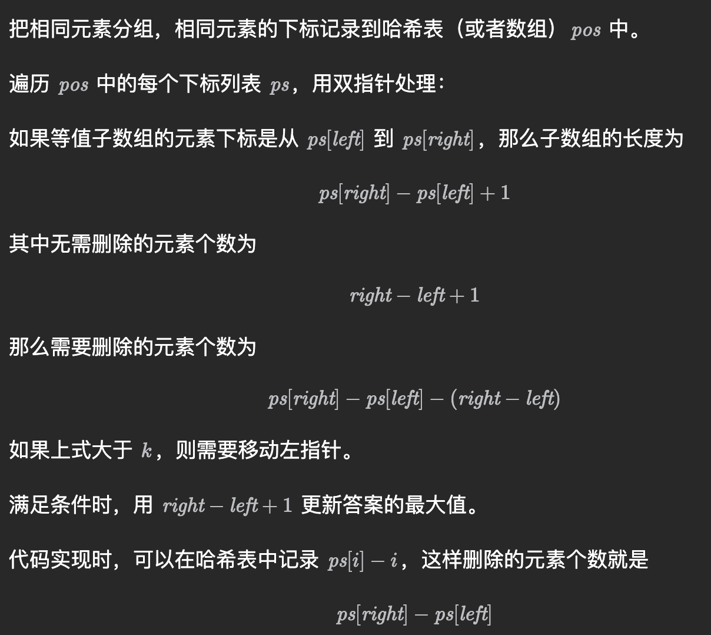
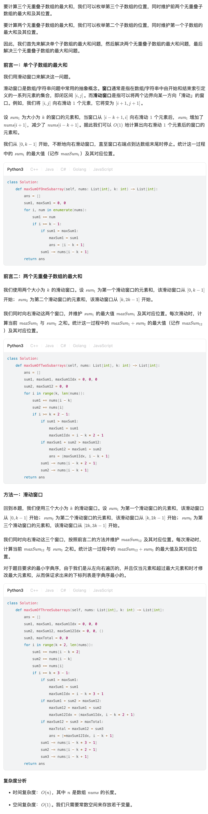

- https://leetcode.cn/problems/find-the-longest-equal-subarray/?envType=daily-question&envId=2023-09-01
	- 
	- ```cpp
	  class Solution {
	  public:
	      int longestEqualSubarray(vector<int> &nums, int k) {
	          int n = nums.size(), ans = 0;
	          vector<vector<int>> pos(n + 1);
	          for (int i = 0; i < n; i++)
	              pos[nums[i]].push_back(i - pos[nums[i]].size());
	          for (auto &ps: pos) {
	              if (ps.size() <= ans) continue;
	              int left = 0;
	              for (int right = 0; right < ps.size(); right++) {
	                  while (ps[right] - ps[left] > k) // 要删除的数太多了
	                      left++;
	                  ans = max(ans, right - left + 1);
	              }
	          }
	          return ans;
	      }
	  };
	  
	  ```
- https://leetcode.cn/problems/maximum-sum-of-3-non-overlapping-subarrays/description/
	- 
-