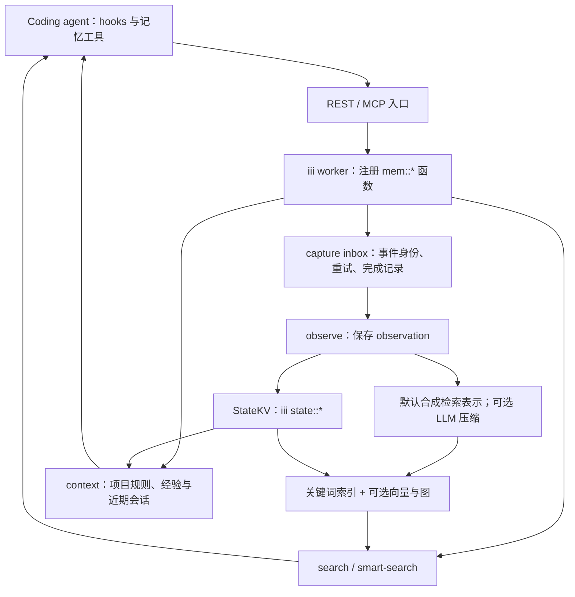
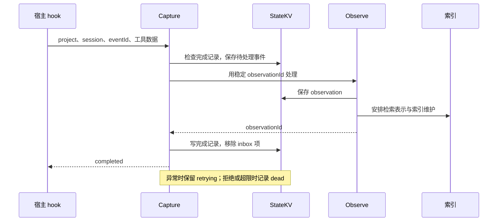

# agentmemory：开发会话采集与本地召回的架构

- 访问日期：2026-10-07。
- 官网：<https://www.agent-memory.dev/>。
- 官网指向的仓库：<https://github.com/rohitg00/agentmemory>。
- 固定提交：`007a1a7fe8646a03d8652eb0712400cc6f0fcca3`。
- 范围：只读源码、README 与评测报告；未运行服务、采集会话或复现评测。

## 这是什么

agentmemory 给 coding agent 增加一个共享的本地记忆服务。它从 hook、显式工具调用或导入的会话中收集开发过程，把工具操作和发现保存成 observation，再通过检索工具和会话上下文返回给 agent。它还定义长期 Memory、项目画像、经验和会话摘要等对象，因此不只是把聊天记录写到一个文本文件。

整体由 Node/TypeScript worker、iii 运行时、状态存储、搜索索引及 REST/MCP 接口组成。默认不依赖生成式模型逐条压缩，语义检索、压缩和整理可以按配置增加。不同能力要分开判断是否启用。依据是下表的入口、数据类型与 README。

## 系统架构

状态保存与搜索索引承担不同职责：

- `StateKV` 提供状态读写接口。
- `SearchIndex`、`VectorIndex` 与 `HybridSearch` 负责找到相关结果。

两者需要分别考虑恢复。MCP 工具注册成功只说明有调用入口，还要验证宿主是否发送 hook 事件，以及召回内容是否真正进入下一次模型请求。

## 从一次工具调用到可检索记录

捕获记录包含 project、session、eventId、目标 observationId、尝试次数和状态。project/session/eventId 一起决定事件身份。相同内容的两次真实操作与同一个事件的重试不应混为一谈。

`capture.attempt` 调用 `mem::observe` 后，根据结果更新状态：

- 拿到 observationId，记录为完成。
- 处理异常，保存下次重试时间。
- 明确拒绝或超过尝试次数，进入 dead 状态。

因此，`accepted + retrying` 只表示事件已被接收、等待处理，不能报告为“记忆已经保存并可召回”。[capture.ts][capture]

图表示主要成功路径，不声称 KV 与索引共享单一事务。实际磁盘持久化还依赖 iii 状态 backend 和运行配置，mock 测试不能替代真实进程中断后的恢复验证。

## 记忆记录保存了什么

| 对象 | 关键字段 | 说明 |
| --- | --- | --- |
| `CompressedObservation` | sessionId、type、facts、files、source、captureKey | 描述一次开发活动及其来源，即使没有启用 LLM 压缩也会有检索表示 |
| `Memory` | content、sourceObservationIds、version、supersedes、isLatest、forgetAfter | 将可长期使用的知识与产生它的活动关联，保留修订或到期信息 |
| `Session` 及摘要 | 项目与会话身份、时间、摘要 | 组织近期工作与交接 |
| `ProjectProfile`、Lesson | 项目惯例、经验等 | 用于会话上下文组装 |

前两者的接口见下表 `types.ts`，后两者的使用见 [context.ts][context]。字段存在不证明每条采集路径都会填齐来源或自动解决冲突，应通过具体调用检查。

## 主动检索与自动注入是两条路径

`HybridSearch` 可组合三类检索结果：

- BM25 关键词结果。
- 向量结果，前提是模型服务与向量索引可用。
- 图关系结果，前提是已经有相应图数据。

它按排名融合候选。一个分支不可用时，其他分支仍可能返回结果，所以查询成功不等于所有检索能力都已启用。[hybrid-search.ts][hybrid]

`mem::context` 按项目收集已固定内容、画像、经验和会话信息，再按预算选择片段。这里有两项限制：

- token 数用字符长度估算。接入具体模型时，仍应观察实际用量。
- 会话查询有 agent scope 处理，隔离模式缺少身份时会拒绝查询。但这不能替代其他数据对象和访问入口的授权检查。

实现见 [context.ts][context]。

这说明“已经可以调用 memory_recall”与“新会话自动得到恰当的上下文”不是同一验收项。前者测索引与工具，后者还要测 hooks、宿主事件支持和注入位置。

## 数据、扩展与运行代价

hook/REST/MCP 是采集或调用扩展面，模型服务 决定模型执行位置，worker 函数组织存储、检索与维护。增加一个宿主不能仅复制 MCP 配置，还要验证该宿主实际发出的事件及日志格式。

`privacy.ts` 会递归检查选定写入函数收到的字符串，并清理匹配的敏感内容。

仍需注意两条数据路径：

- 模式匹配无法识别所有秘密，应先控制采集范围。
- 本地记录被召回后会进入宿主模型请求。启用云 embedding 或其他云模型服务，还会增加向外发送内容的路径。

依据见 [privacy.ts][privacy] 与 README。

主要维护成本来自本地服务可用性、索引恢复、旧会话清理与宿主版本兼容。与只维护少量 Markdown 相比，它更适合需要自动积累开发过程的场景。这是根据组件职责作出的判断，并非性能排名。

## 入口、模型与数据流

| 证据 | 核对结果 |
| --- | --- |
| [src/index.ts](https://github.com/rohitg00/agentmemory/blob/007a1a7fe8646a03d8652eb0712400cc6f0fcca3/src/index.ts) | 注册 iii worker、采集与检索函数、REST/MCP、viewer，组装 KV 与索引。 |
| [src/types.ts](https://github.com/rohitg00/agentmemory/blob/007a1a7fe8646a03d8652eb0712400cc6f0fcca3/src/types.ts) | `CompressedObservation` 关联 session、事实、文件和来源；长期 `Memory` 有版本、supersedes、sourceObservationIds 等字段。 |
| [capture.ts](https://github.com/rohitg00/agentmemory/blob/007a1a7fe8646a03d8652eb0712400cc6f0fcca3/src/functions/capture.ts) | capture inbox 保存待处理事件；调用 observe，按事件身份去重，失败可以进入 retrying/dead 状态。 |
| [observe.ts](https://github.com/rohitg00/agentmemory/blob/007a1a7fe8646a03d8652eb0712400cc6f0fcca3/src/functions/observe.ts) | 保存 observation；逐条生成式压缩需显式启用，默认生成不调用 LLM 的检索表示。 |
| [state/kv.ts](https://github.com/rohitg00/agentmemory/blob/007a1a7fe8646a03d8652eb0712400cc6f0fcca3/src/state/kv.ts) | `StateKV` 经 iii `state::get/set` 等调用管理状态，支持 file/redis 配置；不能把它概括成纯 Markdown 文件库。 |
| [search.ts](https://github.com/rohitg00/agentmemory/blob/007a1a7fe8646a03d8652eb0712400cc6f0fcca3/src/functions/search.ts) | 主召回存在关键词和可选向量路径；索引维护与记忆记录是不同职责。 |
| [hybrid-search.ts](https://github.com/rohitg00/agentmemory/blob/007a1a7fe8646a03d8652eb0712400cc6f0fcca3/src/state/hybrid-search.ts) | 混合检索可组合 BM25、向量与图；效果取决于 模型服务、向量和图数据是否存在。 |

## 默认与评测

[README](https://github.com/rohitg00/agentmemory/blob/007a1a7fe8646a03d8652eb0712400cc6f0fcca3/README.md) 区分了两种配置：

- 未配置模型 API 密钥时，从关键词召回开始。
- 显式启用本地 embedding 后，首次使用会下载 `all-MiniLM-L6-v2`，之后在本机推理。

MCP 接入、hook 自动采集和会话启动注入是不同能力，需要分别验证。

[LongMemEval 报告](https://github.com/rohitg00/agentmemory/blob/007a1a7fe8646a03d8652eb0712400cc6f0fcca3/benchmark/LONGMEMEVAL.md) 的 95.2% 是 500 道题上的 `recall_any@5`：前五个结果中是否出现任一 gold session。报告使用 BM25 与本地向量，没有答案生成或 judge，因此不能解读为端到端问答准确率，也不是默认未配置模型 API 密钥时的成绩。

## 验证入口与限制

阅读 `test/capture-durable.test.ts` 的重复事件、并发和重启重放案例，测试用 mock KV。定位到 `test/hybrid-search.test.ts`、`test/agent-isolation-search.test.ts`。未运行这些测试，未验证实际崩溃后的磁盘恢复。

本地存储与不向外发送内容是不同问题：配置云模型服务 后，相关调用可能出网。被召回到 coding agent 的内容还会进入该 agent 的模型请求。自动采集也需要另行确定项目范围、保留时间、脱敏和删除行为。

测试中，相同 eventId 的重放只保留一个 observation，并发重送也检查去重。不同事件即使正文一样仍分别保存。这里使用 mock KV，能说明事件身份约定，不能证明断电时已刷盘。生产验收应分别中断 hook 投递、observe 执行和索引保存，再检查重新启动后的重复、遗漏与召回结果。

[capture]: https://github.com/rohitg00/agentmemory/blob/007a1a7fe8646a03d8652eb0712400cc6f0fcca3/src/functions/capture.ts
[hybrid]: https://github.com/rohitg00/agentmemory/blob/007a1a7fe8646a03d8652eb0712400cc6f0fcca3/src/state/hybrid-search.ts
[context]: https://github.com/rohitg00/agentmemory/blob/007a1a7fe8646a03d8652eb0712400cc6f0fcca3/src/functions/context.ts
[privacy]: https://github.com/rohitg00/agentmemory/blob/007a1a7fe8646a03d8652eb0712400cc6f0fcca3/src/functions/privacy.ts
