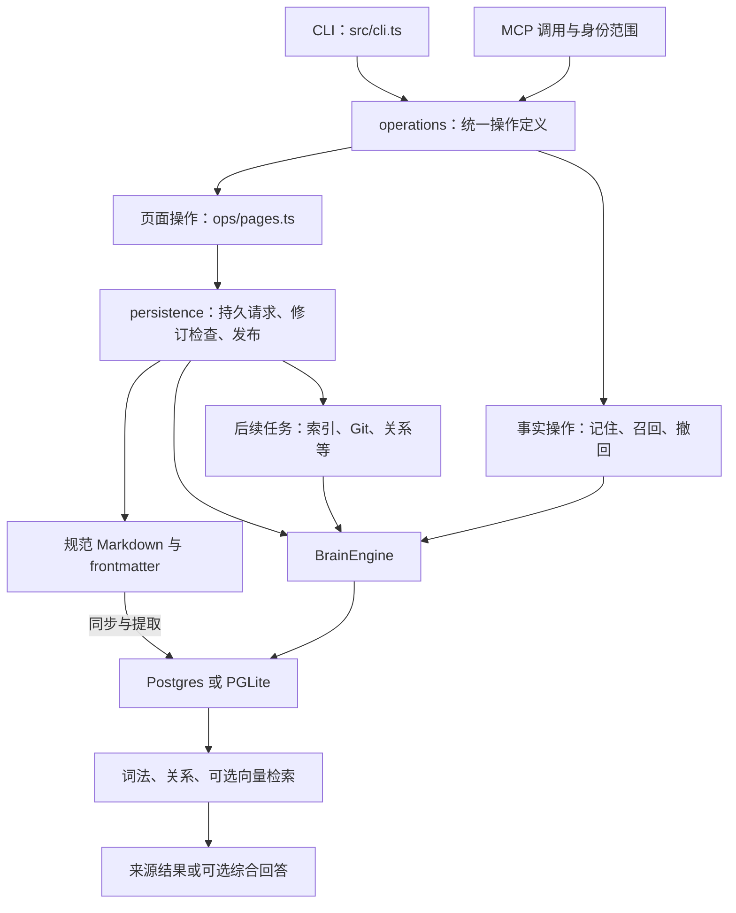
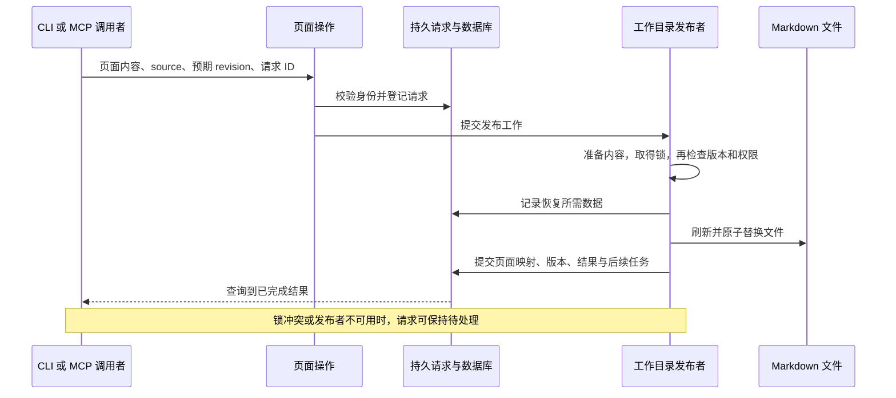

# gbrain：长期知识库的架构与源码分析

- 访问日期：2026-10-07。
- 仓库：<https://github.com/garrytan/gbrain>。
- 固定提交：`5b5891069413b28b2fe3a50675116d67d5a1e145`。
- 范围：只读源码和文档；未安装、配置模型、导入真实记忆或运行上游测试。

## 这是什么

gbrain 是给现有 agent 使用的知识存储与检索系统。输入可以是明确要记住的事实，也可以是会议、笔记等来源页面；它把页面、事实、人物或组织关系、时间线组织起来，通过 CLI 和 MCP 提供查询及更新。配置模型后还可以提取事实和综合回答。因此它承担的是一套持续维护的知识库工作，宿主 agent 仍负责当前任务与自身权限。

其复杂度主要来自三个同时存在的要求：人能直接读写 Markdown，多个调用者能操作数据库，并且撤回、版本和后台任务在中断后仍可恢复。下面的架构依据固定提交中的 `operations.ts`、`engine-factory.ts`、页面写入模块以及 system-of-record 文档。

## 系统架构

图中数据库不只是搜索缓存。文件所表达的知识可以重建部分索引，但写入请求、版本、撤回记录和数据库独有知识仍需备份。`createEngine` 只选择 Postgres/PGLite；调用方通过 `BrainEngine` 使用统一接口，不能从“本地运行”推断其底层是 SQLite。

## 写入一页时实际发生什么

`ops/pages.ts` 的 `put_page` 先确定目标 source，再调用 `submitPageMutation`。source 必须唯一，远程调用不能越过当前写入授权。更新既有页面需要观察到的 revision 或明确的强制覆盖选项；一次请求也有持久身份，供重试查回结果。[页面操作][pages]、[提交入口][mutations]

官方存储文档把后续处理描述为以下过程。图刻意区分“接受请求”和“发布完成”：调用者得到待处理状态时，应继续查询同一请求，而不能认定文件已经更新。

这不是文件系统和 SQL 自动共享一个事务。代码与文档通过恢复记录、锁、修订检查和持久结果协调两者；后续 embedding 等工作也不等于同步写入本身。借鉴时最重要的是先定义可观察的成功状态，而不是照搬全部模块。[system-of-record][record]

## 查询如何找到事实

`hybridSearch` 的主链先解析范围、查询模式和模型配置，运行词法检索与关系检索。没有 embedding 或明确选择关键词模式时走无向量分支；有向量能力时再加入查询向量、结果融合、关系扩展、去重和重排。空结果、模型不可用与没有图数据是不同情况，不能统一当作“没有这条知识”。入口与分支见下表的 `search/hybrid.ts`。

检索返回的来源与模型生成的综合答案也是两个结果：召回到相关页面，不足以证明综合出的每个判断正确；综合过程仍应保留来源和信息缺口。这里未测中文检索、实体消歧和实际 provider 故障。

## 撤回为何需要修改多个对象

`recordFactWithdrawal` 展示了比“删一条向量”更完整的处理：

1. 在事务中锁定 source，读取可见事实的正文、指纹和 subject。
2. 按 source、可见性、事实指纹与 subject 检查是否已撤回，找到受影响页面。
3. 写入 `fact_withdrawals`，让匹配事实到期；同一句话属于另一个主体时不必一起撤回。
4. 更新受影响页面的知识 revision，清空文本映射版本和 embedding signature，并删除旧分块。
5. 按配置登记后续审查或镜像更新工作，让数据库决定先生效，文件和索引再跟进。

依据是下表的 `facts/withdrawal.ts`。这是明确撤回与派生内容失效的路径，不证明任意同义改写都会被准确识别；原始来源和备份也可能仍含原文。

## 模块边界与值得借鉴的取舍

| 边界 | 解决的问题 | 代价或限制 |
| --- | --- | --- |
| operation 与 engine 分开 | 同一知识操作可供 CLI/MCP 使用，不把 SQL 直接暴露为 agent 工具 | 不同入口仍需分别检查授权与返回内容 |
| 文件与 DB 职责明确 | 可读文件和结构化查询可以并存 | 必须维护两者的同步与完整恢复方案 |
| 持久请求与后台任务 | 接受操作后可以查询、恢复和重试 | 待处理与已完成必须让调用者区分 |
| 来源、修订与撤回 | 纠错能影响后续召回，而非仅修改显示文本 | 关系、分块、缓存、历史需要逐项考虑 |

以上是根据已读实现提炼的设计判断。扩展 engine、operation 或模型 provider 时，应沿用同一来源范围与修订约束；直接修改底层表可能绕过这些处理。

## 入口、数据与调用链

| 证据 | 核对结果 |
| --- | --- |
| [package.json](https://github.com/garrytan/gbrain/blob/5b5891069413b28b2fe3a50675116d67d5a1e145/package.json) | CLI 入口是 `src/cli.ts`；库公开 engine、operations、search 等接口；许可证标为 MIT。 |
| [engine-factory.ts](https://github.com/garrytan/gbrain/blob/5b5891069413b28b2fe3a50675116d67d5a1e145/src/core/engine-factory.ts) | `createEngine` 选择 Postgres 或 PGLite；不支持 SQLite。 |
| [engine.ts](https://github.com/garrytan/gbrain/blob/5b5891069413b28b2fe3a50675116d67d5a1e145/src/core/engine.ts) | `BrainEngine` 统一页面、分块、来源、图关系、时间线等数据库能力。 |
| [operations.ts](https://github.com/garrytan/gbrain/blob/5b5891069413b28b2fe3a50675116d67d5a1e145/src/core/operations.ts) | 页面 CRUD 与 remember/recall/forget 分属 operation 模块；CLI/MCP 不等于直接读写 Markdown。 |
| [search/hybrid.ts](https://github.com/garrytan/gbrain/blob/5b5891069413b28b2fe3a50675116d67d5a1e145/src/core/search/hybrid.ts) | `hybridSearch` 运行词法与关系检索；按配置加入向量、融合、去重和重排；无 embedding 时有独立返回路径。 |
| [facts/withdrawal.ts](https://github.com/garrytan/gbrain/blob/5b5891069413b28b2fe3a50675116d67d5a1e145/src/core/facts/withdrawal.ts) | `recordFactWithdrawal` 在事务内登记撤回并处理受影响的派生内容，不只是删一个文本文件。 |

## 存储与成本边界

[memory-boundaries.md](https://github.com/garrytan/gbrain/blob/5b5891069413b28b2fe3a50675116d67d5a1e145/docs/guides/memory-boundaries.md) 说明：持久偏好与事实可以共享，当前任务状态和凭据不应进入共享记忆；自动采集需启用；关键词查询不需要模型 API，但 embedding、reranking、提取、综合回答可向配置的 provider 发送文本。宿主模型也会看到被召回的内容。

[system-of-record.md](https://github.com/garrytan/gbrain/blob/5b5891069413b28b2fe3a50675116d67d5a1e145/docs/architecture/system-of-record.md) 区分可从 Markdown 重建的知识、派生索引，以及数据库独有状态。撤回记录、部分事实、版本、授权和任务数据需要数据库备份，Markdown export 不等于完整备份。

同一边界文档明确：远程访问有 source/operation grants 与 visibility 过滤；共享本地文件或数据库凭据的调用者，不会仅因不同 source 而隔离。`forget` 撤回活动召回，不保证清除原始资料、历史和备份。

## 验证入口

阅读了 `test/withdrawal-bounded-safety.test.ts` 的测试构造：它创建受影响、无关及私有页面，设置分块与 embedding 标记，并为撤回操作建立写入请求。测试可使用 PGLite 或隔离的 Postgres；还定位到后续写入与崩溃场景测试。它们说明维护者在验证哪些状态，不代表本次已经执行通过。

真正采用前应补做：同一请求重试、两个 writer 基于同一 revision 修改、撤回后重新导入旧文件、数据库与 Markdown 分别恢复，以及远程身份跨 source 访问。README 的规模和评测数字未独立复现。

[pages]: https://github.com/garrytan/gbrain/blob/5b5891069413b28b2fe3a50675116d67d5a1e145/src/core/ops/pages.ts
[mutations]: https://github.com/garrytan/gbrain/blob/5b5891069413b28b2fe3a50675116d67d5a1e145/src/core/persistence/page-mutations.ts
[record]: https://github.com/garrytan/gbrain/blob/5b5891069413b28b2fe3a50675116d67d5a1e145/docs/architecture/system-of-record.md
