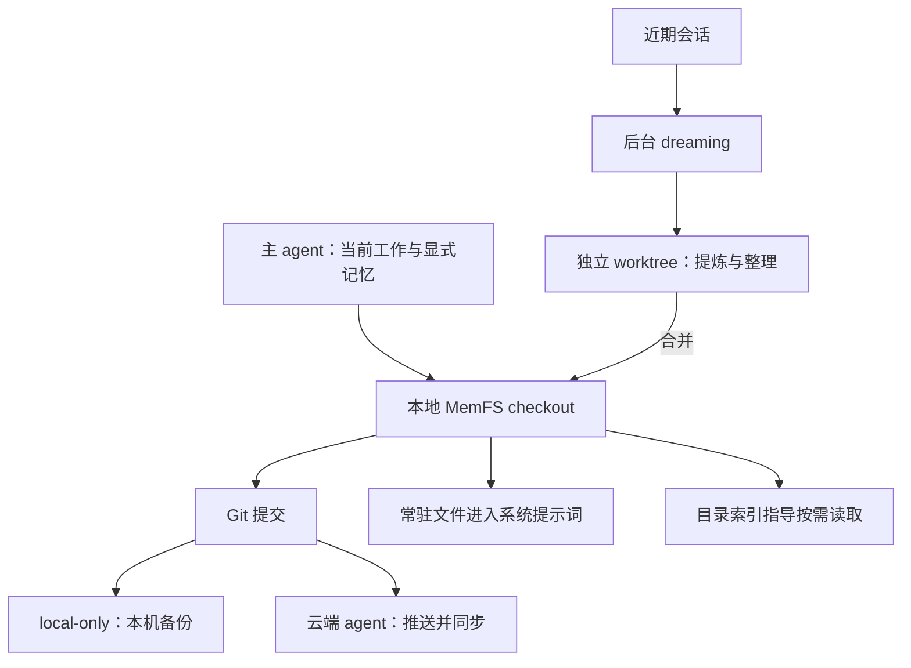

# Letta Context Repositories 文档核对

- 访问日期：2026-10-07。
- 输入：[Introducing Context Repositories](https://www.letta.com/blog/context-repositories/)，文章标注 2026 年 2 月。
- 补充：[MemFS](https://docs.letta.com/concepts/memfs)、[Memory & dreaming](https://docs.letta.com/configuration/memory)。
- 范围：官方文章与当前文档；未运行 Letta Code、同步或冲突合并测试。

## 文章的核心设计

Context Repository 是 agent 可直接读写的 Git 记忆仓库，包含三种机制：

- 文件名、目录和 frontmatter 描述帮助 agent 定位后再读取内容。
- Git 保存记忆变更的版本。
- 后台任务在独立 worktree 中整理，完成后再合并。

文章把 `system/` 定义为总是进入系统提示词的内容，并用初始化、反思和整理三个例子说明如何维护记忆。它提供了设计动机，但安装命令和目录规则不能直接当作当前规范。

## 为什么选 Git 文件

这套设计把“记忆如何组织”交给已有文件工具：agent 可以列目录、搜索、读取和编辑，后台任务则用 worktree 隔离尚未完成的修改。Git 提供版本与合并机制，减少为每一种记忆编辑动作设计专用工具的需要。这个判断来自原始博客的程序化上下文管理思路。

图中的三类操作分别负责：

- worktree：隔开并行编辑中的修改。
- commit：记录哪些变化已经保存。
- 同步与备份：根据云端或本地部署方式处理。

图中没有默认向量检索，因为当前 MemFS 文档不以内置向量索引为前提。

## 一条经验怎样影响下一次任务

例如用户明确纠正项目命令后：

1. agent 把经验写入合适的文件并提交。
2. 重要且经常适用的内容可以常驻，详细背景放在按需读取目录。
3. 后续任务先读取常驻内容与索引，再决定是否打开详细记录。
4. 后台 dreaming 回顾近期工作，合并重复内容或整理目录。

这样可以避免把全部历史长期放进上下文。

这里决定召回的因素包括文件名、目录、描述和 agent 的读取行为。Git 确保有历史，并不自动确保组织合理或每次都读到所需文件。这些是采用时要另外评测的部分。

## 与当前文档的差异

| 位置 | 当前说明 |
| --- | --- |
| MemFS / Memory structure | 根目录文件每回合进入系统提示词；旧 agent 使用 `system/`；子目录以 `MEMORY.md` 索引按需读取。 |
| MemFS / Semantic and vector search | 默认不附带语义或向量索引，使用普通文件搜索；可选 MemFS Search mod 扩展搜索。会话历史搜索是另一项能力。 |
| MemFS / Versioning and synchronization | 云端 agent 的仓库由 Letta 托管，本地 checkout 提交并推送后同步；local-only agent 在本机提交并自行备份。 |
| MemFS / Shared memory | 每个 agent 默认有自己的 MemFS；多 agent 共享是另一个配置场景，不能把单 agent 跨会话同步称为任意 agent 共享。 |
| Memory & dreaming / Dreaming | 后台子 agent 回顾会话并更新记忆；可按完成步骤数或压缩事件触发；“Agent reviews before applying”是 agent 复核，不是人工审批。 |

## 判断

Git 能追踪文本变更、恢复版本并处理合并，不能验证事实真假，也不能自动判定两条互相矛盾的记忆谁正确。删除当前文件也不等于抹除 Git 历史或远程备份。以上是对其存储方式的工程判断，未声称 Letta 已提供这些额外保证。
