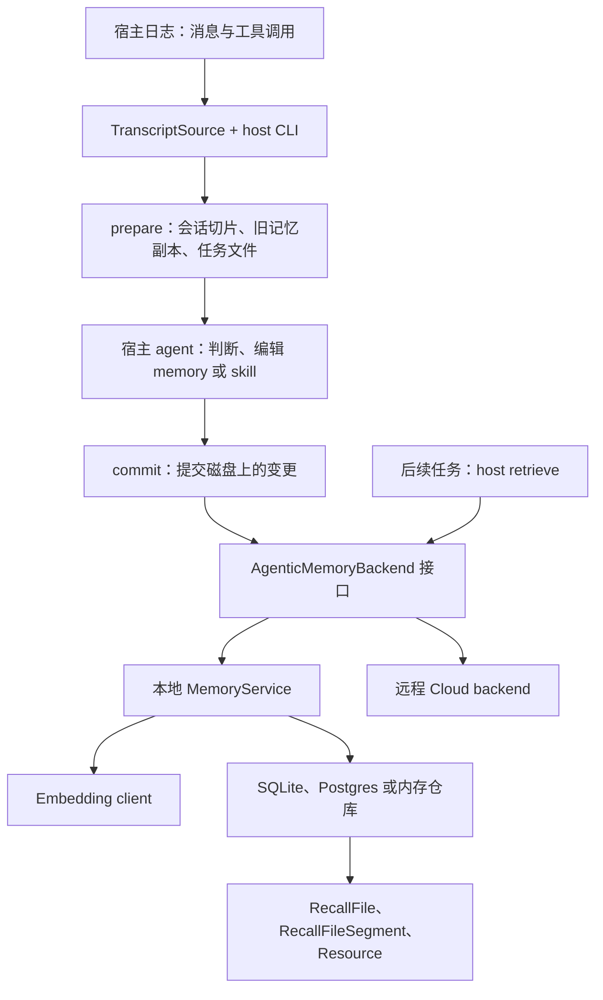
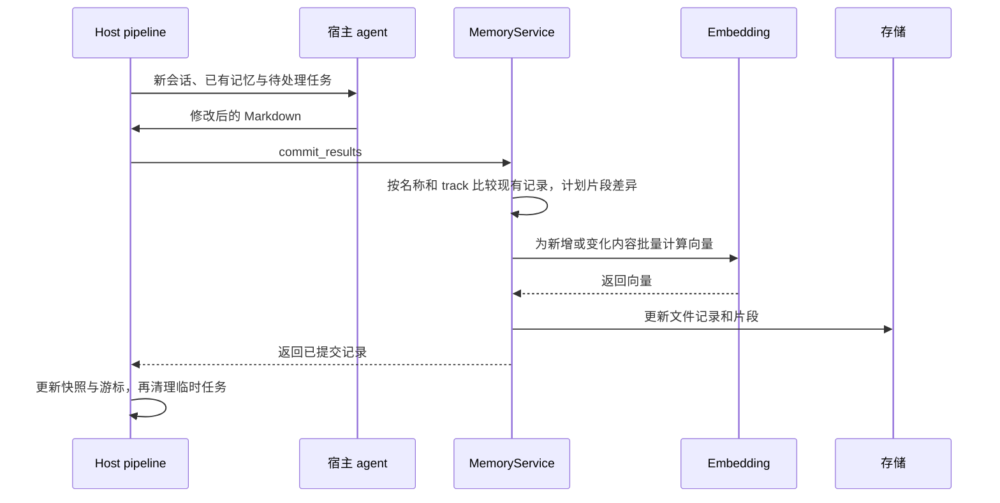

# memU：宿主提炼记忆、服务负责存取的实现

- 访问日期：2026-10-07。
- 官网：<https://memu.pro/>；[官方开源说明](https://memu.pro/oss-memory-infrastructure-llms)。
- 仓库与固定提交：<https://github.com/NevaMind-AI/memU/tree/2c050bc9681a4c0aff1af211a000e73d14f33356>。
- 范围：只读源码和文档；未安装 adapter、创建后台任务或连接 Cloud。

## 这是什么

memU 把已有 coding agent 的会话变成可共享的 memory 和 skill。它不要求为记忆提炼另建一个持续对话的模型服务：宿主 agent 阅读会话与旧记忆，生成或修改 Markdown；Python 服务保存结果、生成 embedding，并在未来任务中检索。官网的 Cloud 与本地部署通过同一组 backend 能力对接 adapter。

这种分工把“内容是否值得保留”留给已经理解任务的 agent，把存取机制放到较小的服务里。代价是自动提炼与召回是否真正发生，依赖每个宿主的日志、定时任务和指令接入；只跑通 Python service 不代表整条流程已经工作。[README][readme]

## 架构与运行位置

`AgenticMemoryBackend` 只要求列出记忆、提交结果和检索三个能力。`MemoryService` 组合数据库与 embedding client；Cloud 的传输细节可以在另一实现中处理，host adapter 不必知道 SQL。[backend 接口][backend]、下表的 `service.py`。

## 一次提炼如何变成持久记录

`prepare` 按宿主日志格式找出新会话，生成 agent 可读取的工作文件，并分页取回已有记忆到本地。它保留上次成功提交的快照，把本次扫描游标先存为待确认状态。agent 可以不写、修改旧文件，或生成新文件。

`commit` 比较本地结果与已提交快照，将差异转成 `recall_files` 和资源记录，调用 backend；成功后才更新快照和会话游标，最后清理工作文件。中断前没有提交成功的结果仍能在下次处理，避免只因“已扫描”就跳过尚未保存的知识。[bridging/pipeline.py][pipeline]

服务先做 planning 和 embedding，再进入写入步骤。相同文本复用向量请求；未变的内容无需重新 embedding。这个顺序避免 embedding 失败造成半批写入，但每个 repository 操作各自提交，存储中途失败仍可能留下部分更新；源码没有把整个流程包装成一个数据库事务。[agentic.py][agentic]

## 数据对象与更新语义

| 对象 | 关键字段与身份 | 用途 |
| --- | --- | --- |
| `RecallFile` | scope 下的 `track + name`，以及 description、content | 可读 memory/skill 正文及摘要 |
| `RecallFileSegment` | `recall_file_id`、track、text、embedding | 真正参与片段召回的搜索单元 |
| `Resource` | scope 下的 URL/path、caption、embedding | 指向工作资料，不等于把资料全文复制进记忆 |

`_plan_segments` 比较新旧片段文本：消失的片段删除，新出现的片段计算向量，未变片段保留。因此修改正文不仅是更新显示内容，也需要让旧搜索单元失效。相同批次里的重复 `track + name` 以最后一条为准，这是批内整理行为，不是多人并发编辑的冲突解决协议。[agentic.py][agentic]、下表的领域模型。

## 检索实际做了哪些步骤

`progressive_retrieve(query, where)` 校验查询与 scope，对 query 做一次 embedding，然后：

1. 按相似度返回 `RecallFileSegment`，可按 memory/skill track 缩小范围。
2. 只读取这些片段所属的文件，以命中片段的最高分作为文件分数。
3. 查询 workspace track 的资源，返回片段、文件和资源三组结果。

这条路径没有让 LLM 多轮判断是否继续搜索，也没有独立对整份文件再次排名。SQLite 的 segment repository 使用 Python 范围扫描和余弦相似度；Postgres 可以使用 pgvector。二者接近的是接口语义，不应推断大数据量下性能相同。[agentic.py][agentic]、[segment 接口][segments]、[SQLite 实现][sqlite]

## 扩展与适用边界

新增宿主主要实现 `TranscriptSource` 的发现、读取与分类，再接入共享 pipeline；新增存储实现相应 repository；替换 embedding 则通过 client 配置。库配置默认可以是内存存储，CLI 与 host 安装另有默认配置，使用库时必须明确选持久 backend。[settings.py][settings]

可读文件、范围过滤和 Cloud 跨设备共享是三个不同能力：文件内容方便审阅；`where` 只约束查询；谁能代表某个用户读写，仍要由调用层保证。对于需要显式撤回历史事实、审核后台改写或处理并发修订的应用，还需检查这些规则如何在宿主与 backend 间实现，不能仅由 `commit_results` 接口推断它们存在。

## 当前实现

| 证据 | 核对结果 |
| --- | --- |
| [README](https://github.com/NevaMind-AI/memU/blob/2c050bc9681a4c0aff1af211a000e73d14f33356/README.md) | host adapter 读取会话，prepare 生成任务，宿主 agent 提炼 memory/skill，commit 写入公共 backend；召回依赖宿主指令和 adapter。 |
| [app/service.py](https://github.com/NevaMind-AI/memU/blob/2c050bc9681a4c0aff1af211a000e73d14f33356/src/memu/app/service.py) | `MemoryService` 组合数据库与 embedding client；服务不做生成式 LLM/chat 调用。 |
| [app/agentic.py](https://github.com/NevaMind-AI/memU/blob/2c050bc9681a4c0aff1af211a000e73d14f33356/src/memu/app/agentic.py) | `commit_results` 接收外部准备的内容，先批量 embedding，再写存储；`progressive_retrieve` 对 query embedding 一次，检索 segment、汇总文件、检索 resource。不是多轮 LLM 判断是否继续检索。 |
| [database/models.py](https://github.com/NevaMind-AI/memU/blob/2c050bc9681a4c0aff1af211a000e73d14f33356/src/memu/database/models.py) | 主要对象为 `RecallFile`、`RecallFileSegment`、`Resource`；`track` 区分 memory 与 skill。Markdown 内容可以存在数据库字段中。 |
| [hosts/base.py](https://github.com/NevaMind-AI/memU/blob/2c050bc9681a4c0aff1af211a000e73d14f33356/src/memu/hosts/base.py) | `TranscriptSource` 定义宿主日志发现、读取和分类扩展点。 |
| [hosts/bridging/pipeline.py](https://github.com/NevaMind-AI/memU/blob/2c050bc9681a4c0aff1af211a000e73d14f33356/src/memu/hosts/bridging/pipeline.py) | prepare/commit 分开；backend 提交成功后才推进会话处理状态。 |

## 容易误读的地方

- 当前版本不应套用早期“服务内部再跑一个记忆提炼 LLM”的介绍；判断工作发生在宿主 agent。
- 不做 chat 调用不代表没有模型调用：embedding 仍是写入与检索的一部分；宿主提炼也消耗模型资源。
- 可读 Markdown 是内容形式，不代表复制一个目录就能恢复完整数据库。
- `commit_results` 把 embedding 失败移到写入之前，但源码明确没有为整个批量存储提供统一回滚，不能称为完整原子事务。
- Cloud 和自托管的数据路径不同；自托管 SQLite/Postgres 仍需核对 embedding provider。`where` 是 scope 过滤接口，不能单凭此接口证明多租户鉴权。

## 验证入口

阅读 `tests/test_agentic.py` 的重新提交后 segment 更新案例；还定位了 embedding 失败不写入、scope 校验等案例。测试使用替代 embedding，未在本次运行。README 的 adapter 支持表存在平台差异，不能从 CLI 可用推断任意桌面 agent 都已自动召回。

具体回归例子把 `likes coffee` 改成 `likes tea`，再检查召回片段不包含旧文本；另有测试确认正文和描述均未变时不重复 embedding。这些验证针对单次服务行为；并发提交、跨设备同步和真实宿主主动检索仍需另外验收。

[readme]: https://github.com/NevaMind-AI/memU/blob/2c050bc9681a4c0aff1af211a000e73d14f33356/README.md
[backend]: https://github.com/NevaMind-AI/memU/blob/2c050bc9681a4c0aff1af211a000e73d14f33356/src/memu/agentic_backend.py
[pipeline]: https://github.com/NevaMind-AI/memU/blob/2c050bc9681a4c0aff1af211a000e73d14f33356/src/memu/hosts/bridging/pipeline.py
[agentic]: https://github.com/NevaMind-AI/memU/blob/2c050bc9681a4c0aff1af211a000e73d14f33356/src/memu/app/agentic.py
[segments]: https://github.com/NevaMind-AI/memU/blob/2c050bc9681a4c0aff1af211a000e73d14f33356/src/memu/database/repositories/recall_file_segment.py
[sqlite]: https://github.com/NevaMind-AI/memU/blob/2c050bc9681a4c0aff1af211a000e73d14f33356/src/memu/database/sqlite/repositories/recall_file_segment_repo.py
[settings]: https://github.com/NevaMind-AI/memU/blob/2c050bc9681a4c0aff1af211a000e73d14f33356/src/memu/app/settings.py
