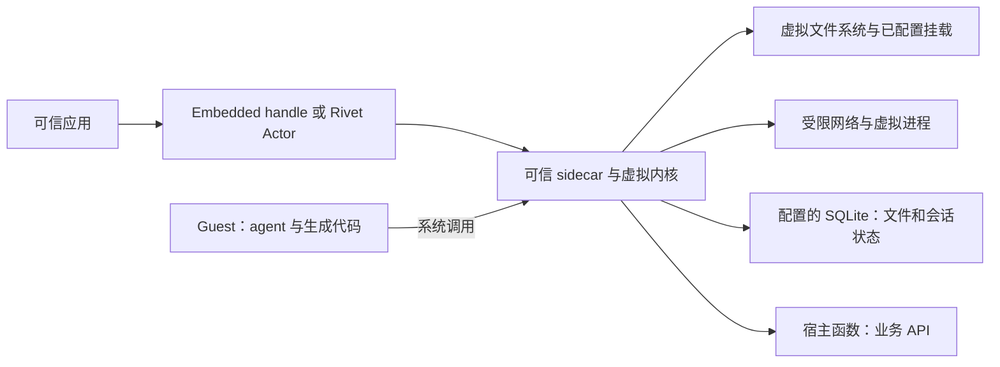

# Rivet agentOS 文档核对

- 访问日期：2026-10-07。
- 输入：<https://rivet.dev/agentos/docs/>。
- 范围：官方文档阅读记录；未运行 SDK、故障恢复测试或隔离测试。
- 以下是改写后的事实笔记，不是原文快照；不保存导航和宣传指标。

## 它交付什么

agentOS 为 coding agent 和生成代码提供受控环境。应用先创建 VM，配置软件、文件挂载、网络与宿主能力，再打开 session 发送 prompt。

两种入口共用 VM 能力，但责任不同：

- 嵌入式入口由应用管理身份和生命周期。
- Actor 入口由 Rivet 提供持久状态、休眠唤醒和客户端连接。

## 组件怎样协作

这个图来自下表 Architecture 与 Security Model，属于官方文档架构，不是本次源码审计。关键是 guest 只请求能力，由 sidecar 检查和执行。client 传入的挂载、凭据与权限配置属于可信输入，应用仍需限制谁能配置它们。

## 一次会话跨休眠继续的条件

会话的主要处理顺序是：

1. 保存完整用户输入，再交给 adapter。
2. 将已完成消息写入持久事件流。
3. 休眠时结束 VM、进程与实时增量。
4. 唤醒后重建 VM，读取持久文件和历史。
5. 只读历史时不必启动 adapter，继续 prompt 时才按需恢复它。

投递结果不确定时，文档不承诺自动重发。

由此可见，恢复时需要区分两件事：

- 系统恢复的是已保存状态，不是原进程内存。
- embedded 未配置持久数据库时，不能套用 Actor 的默认恢复行为。

实际 adapter 的恢复效果仍需逐个验证。

## 扩展的代价

Host function 将输入定义映射为 guest CLI 或 JavaScript 调用，但 `execute()` 在宿主权限下运行。因此应暴露具体业务操作，而不是把任意宿主命令作为通用函数。外部沙箱 能补充完整 Linux 工作负载，同时增加另一套文件一致性、连接和生命周期问题。以上分别依据 Host Functions 与 Limitations，未验证具体沙箱集成。

## 核对位置

| 来源 | 位置 | 核对到的事实 |
| --- | --- | --- |
| [Architecture](https://rivet.dev/agentos/docs/architecture/) | The big picture / Anatomy of a Linux VM | client 配置 VM；sidecar 持有虚拟内核；executor 运行 guest；JS 使用 V8，shell/coreutils 使用 WASM。 |
| [Embedded quickstart](https://rivet.dev/agentos/docs/quickstart-embedded/) | Choosing between Actors and embedded | embedded 不依赖 Rivet Actors，身份、持久化和生命周期由应用管理；Actor 模式自动注入 SQLite。 |
| [Persistence & Sleep](https://rivet.dev/agentos/docs/persistence/) | What persists / Reading durable state after sleep | `/home/agentos`、会话目录和已完成历史保留；进程、shell、未完成流式增量和 VM 内 cron 定义不保留；唤醒创建新 VM，adapter 按需恢复。 |
| [Sessions & Persistence](https://rivet.dev/agentos/docs/architecture/sessions-persistence/) | Session event log / Trusted plaintext storage | 完整用户输入先提交再发送；已提交事件再发布；投递不确定的 prompt 不会自动重发；运行数据库可能明文保存环境变量、MCP 凭据和工具内容。 |
| [Security Model](https://rivet.dev/agentos/docs/security-model/) | Trust model / The security boundary | 安全边界是可信 sidecar 与不可信 executor；client 配置被视为可信输入；产品处于 beta，安全审查仍在进行。 |
| [Custom Host Functions](https://rivet.dev/agentos/docs/host-functions/) | Getting started / Security | Zod 输入定义生成 CLI 和 guest JS 调用入口；`execute()` 在宿主环境执行，需要宿主约束其权限。 |
| [Limitations](https://rivet.dev/agentos/docs/limitations/) | Software registry / Lightweight Linux kernel | 不支持任意 Linux 二进制、apt/yum、Docker、inotify/fs.watch 或 GPU；完整 Linux 工作负载需外部沙箱。 |

## 判断与待验证项

采用前应在目标 adapter 上验证 sleep/wake、进程中断、权限请求恢复、prompt 投递不确定时的处理，以及外部沙箱 挂载后的文件一致性。性能宣传和安全性均未独立复现。
