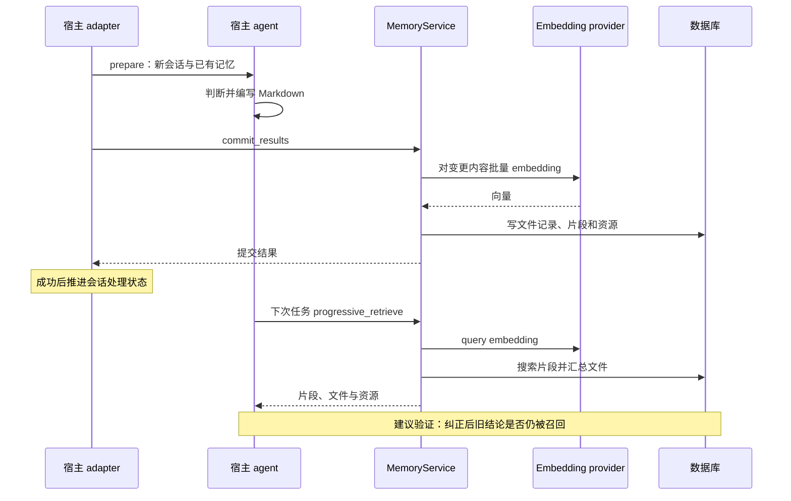
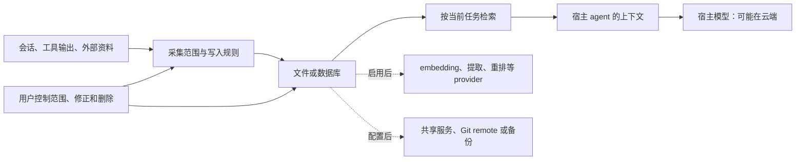

# Agent 记忆方案对比：gbrain、memU、agentmemory 与 Letta

## 当前结论

四者都保留跨会话信息，但主要分歧是**谁决定记什么、记录以什么为准、如何取回，以及谁负责纠错**。选择应从信息来源与维护方式出发，而不是只比较向量数据库或宣传的召回率。

以下是基于 2026-10-07 文档与源码的采用判断，未安装产品或进行同条件评测：

| 主要需求 | 优先评估 | 理由 |
| --- | --- | --- |
| 长期积累人物、组织、会议、事实及关系 | gbrain | 知识库、来源、图关系与后台整理覆盖面广，也承担更多状态维护工作 |
| 多个现有 agent 共享提炼后的记忆与技能 | memU | 宿主 agent 负责理解，统一 backend 负责保存和检索 |
| 自动记录开发会话，查回做过什么、接着完成任务 | agentmemory | hooks、session、observation 和本地检索直接围绕 coding 工作流 |
| 用文件和 Git 管理可编辑的长期上下文 | Letta Context Repositories / MemFS | 普通文件操作、按需读取、版本与 worktree 是主要组织方式 |

[[wiki/topics/ai/rivet-agentos|Rivet agentOS]] 属于另一个层次：运行代码、限制权限和恢复会话。它可以与记忆系统组合，保存会话本身并没有完成知识提炼。

## 阅读范围与版本

| 对象 | 本次证据 |
| --- | --- |
| gbrain | `garrytan/gbrain` 提交 `5b5891069413b28b2fe3a50675116d67d5a1e145`；入口、engine、operation 注册、检索、撤回和存储说明 |
| memU | `NevaMind-AI/memU` 提交 `2c050bc9681a4c0aff1af211a000e73d14f33356`；service、领域模型、prepare/commit、检索与测试案例 |
| agentmemory | `rohitg00/agentmemory` 提交 `007a1a7fe8646a03d8652eb0712400cc6f0fcca3`；worker、采集、KV、检索、测试与评测定义 |
| Letta | 2026 年 2 月 Context Repositories 博客，加访问日的 MemFS、Memory & dreaming 文档；未读完整实现 |

前三项的链接与具体文件位置保存在页末的源码核对记录。文档声明与静态源码能确认设计和分支，不能证明真实宿主中的自动采集、恢复和召回已经生效。

## 架构差异：记忆从哪里来

```mermaid
flowchart TB
    subgraph G["gbrain：长期知识库"]
        G1["显式事实与来源页面"] --> G2["知识写入与后台整理"]
        G2 --> G3["Markdown + Postgres 或 PGLite"]
        G3 --> G4["关键词、关系、可选向量与综合回答"]
    end
    subgraph M["memU：宿主提炼，共享服务"]
        M1["adapter 读取会话"] --> M2["宿主 agent 编写 memory 或 skill"]
        M2 --> M3["commit_results：embedding 与存储"]
        M3 --> M4["progressive_retrieve 返回片段与文件"]
    end
    subgraph A["agentmemory：开发会话采集"]
        A1["hooks、MCP、REST"] --> A2["采集 inbox 与 observation"]
        A2 --> A3["本地状态与搜索索引"]
        A3 --> A4["会话注入或主动召回"]
    end
    subgraph L["Letta：Git 记忆文件"]
        L1["主 agent 或后台整理"] --> L2["checkout 或独立 worktree"]
        L2 --> L3["Git 提交；按部署方式同步"]
        L3 --> L4["常驻文件与按需读取"]
    end
```

图概括的是主要路径，各自也有可选功能。依据见下文对应源码与文档；不能从某个产品有“图”或“向量”就推断默认路径已经启用它。

### gbrain：知识管理覆盖面广，备份不止文件

`createEngine` 支持 Postgres 与 PGLite；`BrainEngine` 包含页面、分块、来源、关系和时间线。`hybridSearch` 先取得词法与关系结果，再根据配置加入向量、融合与重排。模型生成的综合回答属于另一个可选能力。[engine-factory.ts][g-engine]、[hybrid.ts][g-search]

关键取舍是**文件可读与数据库必要性同时存在**：一部分知识可由 Markdown 重建，但数据库也保存未在文件中表达的事实、历史、授权、撤回与任务状态。只导出 Markdown 会丢失这部分恢复能力。[存储说明][g-record]

它适合把显式事实、资料和关系长期积累起来；自动采集与后台增强需要单独配置。关键词查询可以不配置模型 API，embedding、提取与综合则可能增加调用成本。`forget` 表示退出活动召回，不代表所有原始资料和备份已擦除。[记忆边界][g-boundary]

### memU：提炼在宿主，服务不生成总结

当前 `MemoryService` 只组合存储和 embedding。adapter 将新会话准备成任务，由现有 agent 决定忽略、修订或新增 Markdown；`commit_results` 接收结果；下次任务通过 adapter 召回。生成式模型成本发生在宿主，不能把“服务不调用 chat”理解为整个流程不用模型。[service.py][m-service]、[README][m-readme]

`progressive_retrieve` 这个名字容易误导：本次源码对 query 做一次 embedding，搜索片段，汇总命中的文件，并检索资源；没有多轮 LLM 判断“信息够不够”。模型对象是 `RecallFile`、`RecallFileSegment` 与 `Resource`，所以“Wiki / Markdown”描述的是可读内容形式，不代表底层只有文件。[agentic.py][m-agentic]、[models.py][m-models]

提交前先完成 embedding，可避免 provider 失败后留下部分写入；但后续多条存储操作没有统一事务回滚。评估批量更新时要区分这两个保证。[commit_results][m-agentic]

### agentmemory：先捕获过程，再组织召回

hooks 产生的事件进入 capture inbox，再调用 observe 保存会话 observation；重复事件与重试有单独状态。长期 `Memory` 还记录来源 observation、版本和替代关系。运行时通过 iii 的 `StateKV` 管理状态，不是直接维护一套 Git Markdown。[capture.ts][a-capture]、[types.ts][a-types]、[kv.ts][a-kv]

默认逐条 observation 处理使用不调用生成式模型的表示；生成式压缩需要启用。keyless 配置以关键词召回为起点，本地 embedding 需另行启用并首次下载模型；配置和数据具备后可以使用向量、图等检索方式。[observe.ts][a-observe]、[README][a-readme]、[search.ts][a-search]

**95.2% 不是回答准确率。** 项目报告测量 `recall_any@5`，只要求前五个结果出现任一正确来源会话；使用 BM25 加本地向量，没有生成答案或评判答案。它既不能证明多来源推理正确，也不能代表默认 keyless 配置。[评测定义][a-eval]

### Letta：普通文件操作与 Git 版本管理

Context Repositories 的设计让 agent 用终端和文件工具维护记忆，通过目录与描述先定位、再读取。后台整理可在独立 worktree 中修改后合并。[原始博客](https://www.letta.com/blog/context-repositories/)

当前 MemFS 文档与博客有一处值得保留的区别：**新结构把根目录文件常驻到系统提示词，旧 agent 使用 `system/`**；子目录用 `MEMORY.md` 索引按需读取。默认没有语义或向量索引；可选搜索扩展与会话历史搜索是另外的能力。[MemFS](https://docs.letta.com/concepts/memfs)

云端 agent 的仓库由 Letta 托管，本地副本通过提交和推送同步；local-only agent 自行备份。每个 agent 默认有自己的 MemFS，跨会话保留不等于任意 agent 共享。后台 dreaming 的 agent 复核也不是人工审批。[MemFS](https://docs.letta.com/concepts/memfs)、[Memory & dreaming](https://docs.letta.com/configuration/memory)

## 生命周期：保存成功不等于下次用得对

下面以 memU 的已核对路径说明几个独立阶段；最后的纠错验证是本文建议，不是产品自动保证。

依据：[bridging/pipeline.py][m-pipeline]、[agentic.py][m-agentic]。这里的 commit 是 memU 的写入操作，不应与 Letta 的 Git commit 混为一谈。

## 所有权、扩展和维护成本

| 维度 | gbrain | memU | agentmemory | Letta |
| --- | --- | --- | --- | --- |
| 运行位置与控制权 | 自管内容、数据库和 provider；远程 MCP 可共享 | 自托管 SQLite/Postgres，或 memU Cloud；宿主负责提炼 | 本地服务与状态；可配置外部 provider | 本地 checkout；云端仓库托管或 local-only |
| 核心维护循环 | 写入资料/事实 → 索引与整理 → 召回/综合 → 修正 | prepare → 宿主编辑 → commit → retrieve | 捕获 → 去重与组织 → 索引 → 注入/查询 | 编辑/反思 → 提交/合并 → 常驻或按需读取 |
| 扩展面 | CLI/MCP、engine、operation、模型 provider | TranscriptSource、host adapter、存储与 embedding provider | hooks、MCP/REST、provider、worker 函数 | 文件工具、记忆 skills、worktree、可选搜索 mod |
| 主要成本 | DB 与后台任务运维；可选模型调用 | 宿主提炼、embedding、backend；Cloud 条款另核对 | 采集与索引资源；可选压缩/模型；宿主集成维护 | 主 agent 与 dreaming token；同步与仓库维护 |
| 迁移与锁定风险 | 只迁 Markdown 会漏掉 DB 独有状态 | 可读正文仍需迁移记录、资源引用和配置 | observation、session、索引与集成需一起处理 | Git 内容易读；自动同步与上下文装载仍依赖运行时 |

运行与扩展信息来自上文源码和官方文档；成本、迁移风险是基于组件依赖的工程判断。本次没有核实套餐报价，也不比较账单金额。

## 数据边界：本地保存之后，内容还会去哪里

这是对四种方案共同数据路径的归纳，并非每种产品都启用所有箭头。gbrain 的[记忆边界][g-boundary]明确区分本地存储、云 provider 与宿主模型；memU 的 service 与 agentmemory 的 provider 配置也支持这个区分。

具体需要区分三件事：

1. **记录有来源，不等于事实正确。** 模型可能误读来源；召回时仍要核对时间、修订和适用项目。
2. **逻辑分类，不等于访问隔离。** gbrain 的 source 不能隔离共享本地文件或数据库凭据的调用者；memU 的 scope 过滤也不能替代服务认证。[gbrain 边界][g-boundary]、[memU service][m-service]
3. **撤回召回，不等于彻底删除。** 原始日志、Git 历史、远程副本和备份是独立对象；这是由各自存储方式推得的治理要求，不声称它们已经统一实现擦除。

## 对文件优先 Wiki 的启发

对已经使用 Markdown、frontmatter、来源指针和 PR 的知识库，最直接的启发来自 Letta 的按需读取与 memU 的职责划分：**agent 负责理解资料，知识正文保持可读，索引负责找到内容**。这不要求立即接入完整记忆产品。

采用判断如下：先保留 Wiki 为长期知识记录，按需要改善目录摘要和检索；若主要缺口是 coding 历史，评估 agentmemory；若要跨宿主共享自动提炼的结果，评估 memU；若要管理人物、会议和关系并长期后台整理，评估 gbrain。Letta 的文件组织方法可以借鉴，实际采用其自动维护则需要接受对应运行时。此建议来自上面的维护与迁移成本比较。

[[wiki/syntheses/ai/auditable-local-agent-memory-architecture|可审计的本地 Agent 记忆架构]] 中“文件事实层 + 可重建索引”是一种设计目标，不能直接套到所有产品：本次 gbrain 和 agentmemory 的实现都有需要独立保存的数据库状态。

## 结论与证据对照、尚未验证的行为

| 结论 | 证据位置 | 置信度或限制 |
| --- | --- | --- |
| gbrain 有无 embedding 的不同召回分支 | `hybridSearch`；[源码][g-search] | 已读源码；未测实际 provider 降级 |
| Markdown 不是 gbrain 完整备份 | [system-of-record][g-record] 与 [memory-boundaries][g-boundary] | 官方明确；未恢复数据库 |
| memU 由宿主提炼，服务仅 embedding 与存储 | `MemoryService`、`commit_results`；[源码][m-service] | 已读实现；未验证宿主定时任务 |
| memU 当前检索不是多轮生成式判断 | `progressive_retrieve`；[源码][m-agentic] | 已读分支与结果结构 |
| agentmemory 的采集与召回是不同阶段 | capture/observe/search；[源码][a-capture] | 已读实现和 mock 测试案例；未测真实进程崩溃 |
| 95.2% 是来源会话召回，不是 QA | [LongMemEval 报告][a-eval] / Setup、Methodology | 指标定义明确；未独立复现 |
| Letta 常驻目录规则已区别新旧 agent | [MemFS](https://docs.letta.com/concepts/memfs) / Memory structure | 当前官方文档；未测迁移 |

没有统一数据集、相同模型、相同 token 预算和相同隐私约束下的四方结果，因此不作效果排名。真正试用时应检查：新会话自动召回、中文与混合语言查询、旧事实修正、跨项目误召回、撤回后的索引一致性，以及完整备份恢复。安装命令成功或某次 CLI 查询命中，都不能替代这些结果。

## 来源记录与相关页面

- [[raw/sources/2026-10-07-gbrain]]
- [[raw/sources/2026-10-07-memu]]
- [[raw/sources/2026-10-07-agentmemory]]
- [[raw/sources/2026-10-07-letta-context-repositories]]
- [[wiki/topics/ai/rivet-agentos|Rivet agentOS：执行环境与持久会话]]
- [[wiki/syntheses/ai/auditable-local-agent-memory-architecture|可审计的本地 Agent 记忆架构]]
- [[wiki/syntheses/ai/agent-proactive-context-management|Agent 主动上下文管理]]
- [[wiki/topics/ai/obelisk|Obelisk]]

[g-engine]: https://github.com/garrytan/gbrain/blob/5b5891069413b28b2fe3a50675116d67d5a1e145/src/core/engine-factory.ts
[g-search]: https://github.com/garrytan/gbrain/blob/5b5891069413b28b2fe3a50675116d67d5a1e145/src/core/search/hybrid.ts
[g-record]: https://github.com/garrytan/gbrain/blob/5b5891069413b28b2fe3a50675116d67d5a1e145/docs/architecture/system-of-record.md
[g-boundary]: https://github.com/garrytan/gbrain/blob/5b5891069413b28b2fe3a50675116d67d5a1e145/docs/guides/memory-boundaries.md
[m-readme]: https://github.com/NevaMind-AI/memU/blob/2c050bc9681a4c0aff1af211a000e73d14f33356/README.md
[m-service]: https://github.com/NevaMind-AI/memU/blob/2c050bc9681a4c0aff1af211a000e73d14f33356/src/memu/app/service.py
[m-agentic]: https://github.com/NevaMind-AI/memU/blob/2c050bc9681a4c0aff1af211a000e73d14f33356/src/memu/app/agentic.py
[m-models]: https://github.com/NevaMind-AI/memU/blob/2c050bc9681a4c0aff1af211a000e73d14f33356/src/memu/database/models.py
[m-pipeline]: https://github.com/NevaMind-AI/memU/blob/2c050bc9681a4c0aff1af211a000e73d14f33356/src/memu/hosts/bridging/pipeline.py
[a-readme]: https://github.com/rohitg00/agentmemory/blob/007a1a7fe8646a03d8652eb0712400cc6f0fcca3/README.md
[a-capture]: https://github.com/rohitg00/agentmemory/blob/007a1a7fe8646a03d8652eb0712400cc6f0fcca3/src/functions/capture.ts
[a-types]: https://github.com/rohitg00/agentmemory/blob/007a1a7fe8646a03d8652eb0712400cc6f0fcca3/src/types.ts
[a-kv]: https://github.com/rohitg00/agentmemory/blob/007a1a7fe8646a03d8652eb0712400cc6f0fcca3/src/state/kv.ts
[a-observe]: https://github.com/rohitg00/agentmemory/blob/007a1a7fe8646a03d8652eb0712400cc6f0fcca3/src/functions/observe.ts
[a-search]: https://github.com/rohitg00/agentmemory/blob/007a1a7fe8646a03d8652eb0712400cc6f0fcca3/src/functions/search.ts
[a-eval]: https://github.com/rohitg00/agentmemory/blob/007a1a7fe8646a03d8652eb0712400cc6f0fcca3/benchmark/LONGMEMEVAL.md
