# Agent 记忆方案对比：gbrain、memU、agentmemory 与 Letta

## 当前结论

四者都保留跨会话信息，但各自侧重不同：

- **Letta：文件与 Git。** agent 直接编辑记忆文件，用版本记录和按需读取组织上下文。
- **agentmemory：开发会话采集。** 从工具调用和会话中保存开发过程，再组织召回。
- **memU：由宿主提炼。** 已有 agent 判断记什么，服务负责存储和检索。
- **gbrain：功能完整的知识库。** 围绕资料、事实、关系和后台整理持续积累知识。

以下是基于 2026-10-07 文档与源码的采用判断，未安装产品或进行同条件评测：

| 主要需求 | 优先评估 | 理由 |
| --- | --- | --- |
| 长期积累人物、组织、会议、事实及关系 | gbrain | 知识库、来源、图关系与后台整理覆盖面广，也承担更多状态维护工作 |
| 多个现有 agent 共享提炼后的记忆与技能 | memU | 宿主 agent 负责理解，统一 backend 负责保存和检索 |
| 自动记录开发会话，查回做过什么、接着完成任务 | agentmemory | hooks、session、observation 和本地检索直接围绕 coding 工作流 |
| 用文件和 Git 管理可编辑的长期上下文 | Letta Context Repositories / MemFS | 普通文件操作、按需读取、版本与 worktree 是主要组织方式 |

## 阅读范围与版本

| 对象 | 本次证据 |
| --- | --- |
| gbrain | `garrytan/gbrain` 提交 `5b5891069413b28b2fe3a50675116d67d5a1e145`；入口、engine、operation 注册、检索、撤回和存储说明 |
| memU | `NevaMind-AI/memU` 提交 `2c050bc9681a4c0aff1af211a000e73d14f33356`；service、领域模型、prepare/commit、检索与测试案例 |
| agentmemory | `rohitg00/agentmemory` 提交 `007a1a7fe8646a03d8652eb0712400cc6f0fcca3`；worker、采集、KV、检索、测试与评测定义 |
| Letta | 2026 年 2 月 Context Repositories 博客，加访问日的 MemFS、Memory & dreaming 文档；未读完整实现 |

前三项的链接与具体文件位置保存在页末的源码核对记录。文档声明与静态源码能确认设计和分支，不能证明真实宿主中的自动采集、恢复和召回已经生效。

## 架构差异：记忆从哪里来

```mermaid
flowchart TB
    subgraph G["gbrain：长期知识库"]
        G1["显式事实与来源页面"] --> G2["知识写入与后台整理"]
        G2 --> G3["Markdown + Postgres 或 PGLite"]
        G3 --> G4["关键词、关系、可选向量与综合回答"]
    end
    subgraph M["memU：宿主提炼，共享服务"]
        M1["adapter 读取会话"] --> M2["宿主 agent 编写 memory 或 skill"]
        M2 --> M3["commit_results：embedding 与存储"]
        M3 --> M4["progressive_retrieve 返回片段与文件"]
    end
    subgraph A["agentmemory：开发会话采集"]
        A1["hooks、MCP、REST"] --> A2["采集 inbox 与 observation"]
        A2 --> A3["本地状态与搜索索引"]
        A3 --> A4["会话注入或主动召回"]
    end
    subgraph L["Letta：Git 记忆文件"]
        L1["主 agent 或后台整理"] --> L2["checkout 或独立 worktree"]
        L2 --> L3["Git 提交；按部署方式同步"]
        L3 --> L4["常驻文件与按需读取"]
    end
```

图概括的是主要路径，各自也有可选功能，依据见下文对应源码与文档。不能从某个产品有“图”或“向量”就推断默认路径已经启用它。

### gbrain：知识管理覆盖面广，备份不止文件

gbrain 将存储、检索和生成答案分开：

- **存储**：`createEngine` 支持 Postgres 与 PGLite。`BrainEngine` 管理页面、分块、来源、关系和时间线。[engine-factory.ts][g-engine]
- **检索**：`hybridSearch` 先做关键词文本检索和图关系检索，再根据配置加入向量、融合与重排。[hybrid.ts][g-search]
- **生成答案**：可以额外启用模型，对检索结果作综合回答。[记忆边界][g-boundary]

备份时要同时考虑两部分数据：

- Markdown 已表达的知识，可以用来重建相应索引。
- 数据库独有的事实、历史、授权、撤回和任务状态，需要单独备份。

只导出 Markdown 无法恢复全部状态。[存储说明][g-record]

它适合长期积累明确的事实、资料和关系，自动采集与后台增强需要单独配置。关键词查询可以不配置模型 API，embedding、提取与综合回答则可能增加调用成本。

`forget` 使事实不再参与后续召回，不代表原始资料和备份都已擦除。[记忆边界][g-boundary]

### memU：提炼在宿主，服务不生成总结

当前 `MemoryService` 只负责存储和 embedding。一次记忆更新按以下顺序完成：

1. adapter 把新会话准备成待处理任务。
2. 现有 agent 判断是否忽略、修订或新增 Markdown。
3. `commit_results` 接收并保存结果。
4. 下次任务通过 adapter 召回。

生成式模型成本发生在宿主。“服务不调用 chat”不代表整个流程不用模型。[service.py][m-service]、[README][m-readme]

`progressive_retrieve` 会对查询做一次 embedding，然后搜索片段、汇总命中的文件，并检索资源。它没有让 LLM 多轮判断“信息够不够”。[agentic.py][m-agentic]

服务存储的是 `RecallFile`、`RecallFileSegment` 和 `Resource` 等数据对象。“Wiki / Markdown”描述的是内容形式，不能据此推断底层只有文件。[models.py][m-models]

批量提交有两个不同的失败边界：

- embedding 在写入前完成，模型服务失败时不会留下部分写入。
- 后续存储操作没有统一事务回滚，存储中途失败仍可能留下部分更新。

这两个保证需要分开评估。[commit_results][m-agentic]

### agentmemory：先捕获过程，再组织召回

agentmemory 分别保存开发过程、长期记忆和处理状态：

- hooks 产生的事件先进入待处理队列（capture inbox），再由 observe 保存为会话记录（observation）。重复事件和重试另有状态记录。[capture.ts][a-capture]
- 长期 `Memory` 记录来源 observation、版本和替代关系。[types.ts][a-types]
- 底层微服务引擎（iii 运行时）提供状态存储，`StateKV` 是调用它的键值读写接口。它不是一套直接用 Git 管理的 Markdown 文件库。[kv.ts][a-kv]、[iii 介绍](https://github.com/iii-hq/iii#what-is-iii)

启用哪些能力取决于配置：

- 默认处理 observation 时不调用生成式模型，生成式压缩需要单独启用。[observe.ts][a-observe]
- 未配置模型 API 密钥时，默认从关键词召回开始。
- 本地 embedding 需要另行启用，并在首次使用时下载模型。[README][a-readme]
- 配置和数据具备后，可以使用向量、图等检索方式。[search.ts][a-search]

**95.2% 是来源会话检索命中率，不是回答准确率。** 这份报告的条件是：

- 指标为 `recall_any@5`，前五个结果出现任一正确来源会话就算命中。
- 使用 BM25 加本地向量检索。
- 没有生成答案，也没有评判答案。

因此，这个成绩既不能证明多来源推理正确，也不是默认未配置模型 API 密钥时的成绩。[评测定义][a-eval]

### Letta：普通文件操作与 Git 版本管理

Context Repositories 的设计让 agent 用终端和文件工具维护记忆，通过目录与描述先定位、再读取。后台整理可在独立 worktree 中修改后合并。[原始博客](https://www.letta.com/blog/context-repositories/)

当前 MemFS 文档区分了两种内容加载方式：

- **常驻内容**：新结构把根目录文件放进系统提示词，旧 agent 使用 `system/`。
- **按需读取**：子目录通过 `MEMORY.md` 索引引导 agent 读取。

默认没有语义或向量索引。可选搜索扩展与会话历史搜索属于另外的能力。[MemFS](https://docs.letta.com/concepts/memfs)

同步与备份也取决于部署方式：

- 云端 agent 的仓库由 Letta 托管，本地副本通过提交和推送同步。
- local-only agent 在本机保存，由使用者负责备份。

每个 agent 默认有自己的 MemFS，跨会话保留不等于任意 agent 共享。后台 dreaming 的 agent 复核也不是人工审批。[MemFS](https://docs.letta.com/concepts/memfs)、[Memory & dreaming](https://docs.letta.com/configuration/memory)

## 所有权、扩展和维护成本

下表中的模型服务可以在本地运行，也可以由云厂商提供。

| 维度 | gbrain | memU | agentmemory | Letta |
| --- | --- | --- | --- | --- |
| 运行位置与控制权 | 自管内容、数据库和 模型服务；远程 MCP 可共享 | 自托管 SQLite/Postgres，或 memU Cloud；宿主负责提炼 | 本地服务与状态；可配置外部 模型服务 | 本地 checkout；云端仓库托管或 local-only |
| 核心维护循环 | 写入资料/事实 → 索引与整理 → 召回/综合 → 修正 | prepare → 宿主编辑 → commit → retrieve | 捕获 → 去重与组织 → 索引 → 注入/查询 | 编辑/反思 → 提交/合并 → 常驻或按需读取 |
| 扩展面 | CLI/MCP、engine、operation、模型服务 | TranscriptSource、host adapter、存储与 embedding 服务 | hooks、MCP/REST、模型服务、worker 函数 | 文件工具、记忆 skills、worktree、可选搜索 mod |
| 主要成本 | DB 与后台任务运维；可选模型调用 | 宿主提炼、embedding、backend；Cloud 条款另核对 | 采集与索引资源；可选压缩/模型；宿主集成维护 | 主 agent 与 dreaming token；同步与仓库维护 |
| 迁移与锁定风险 | 只迁 Markdown 会漏掉 DB 独有状态 | 可读正文仍需迁移记录、资源引用和配置 | observation、session、索引与集成需一起处理 | Git 内容易读；自动同步与上下文装载仍依赖运行时 |

运行与扩展信息来自上文源码和官方文档。成本与迁移风险是基于组件依赖的工程判断。本次没有核实套餐报价，也不比较账单金额。

## 结论与证据对照、尚未验证的行为

| 结论 | 证据位置 | 置信度或限制 |
| --- | --- | --- |
| gbrain 有无 embedding 的不同召回分支 | `hybridSearch`；[源码][g-search] | 已读源码；未测模型服务 降级 |
| Markdown 不是 gbrain 完整备份 | [system-of-record][g-record] 与 [memory-boundaries][g-boundary] | 官方明确；未恢复数据库 |
| memU 由宿主提炼，服务仅 embedding 与存储 | `MemoryService`、`commit_results`；[源码][m-service] | 已读实现；未验证宿主定时任务 |
| memU 当前检索不是多轮生成式判断 | `progressive_retrieve`；[源码][m-agentic] | 已读分支与结果结构 |
| agentmemory 的采集与召回是不同阶段 | capture/observe/search；[源码][a-capture] | 已读实现和 mock 测试案例；未测真实进程崩溃 |
| 95.2% 是来源会话召回，不是 QA | [LongMemEval 报告][a-eval] / Setup、Methodology | 指标定义明确；未独立复现 |
| Letta 常驻目录规则已区别新旧 agent | [MemFS](https://docs.letta.com/concepts/memfs) / Memory structure | 当前官方文档；未测迁移 |

没有统一数据集、模型、token 预算和隐私约束下的四方结果，因此不作效果排名。试用时至少检查：

- **日常召回**：新会话是否自动取回所需内容，中文与混合语言查询是否有效。
- **纠错与隔离**：旧事实修正是否生效，是否误取其他项目的记忆。
- **撤回与恢复**：撤回后索引是否一致，完整备份能否恢复。

安装成功或某次 CLI 查询命中，都不能替代这些验证。

## 来源记录与相关页面

- [[wiki/syntheses/ai/agent-memory-implementation|如何实现 Agent Memory]]：综合这些方案的写入、检索、纠错与验收方法。
- [[raw/sources/gbrain]]
- [[raw/sources/memu]]
- [[raw/sources/agentmemory]]
- [[raw/sources/letta-context-repositories]]
- [[wiki/syntheses/ai/auditable-local-agent-memory-architecture|可审计的本地 Agent 记忆架构]]
- [[wiki/syntheses/ai/agent-proactive-context-management|Agent 主动上下文管理]]
- [[wiki/topics/ai/obelisk|Obelisk]]

[g-engine]: https://github.com/garrytan/gbrain/blob/5b5891069413b28b2fe3a50675116d67d5a1e145/src/core/engine-factory.ts
[g-search]: https://github.com/garrytan/gbrain/blob/5b5891069413b28b2fe3a50675116d67d5a1e145/src/core/search/hybrid.ts
[g-record]: https://github.com/garrytan/gbrain/blob/5b5891069413b28b2fe3a50675116d67d5a1e145/docs/architecture/system-of-record.md
[g-boundary]: https://github.com/garrytan/gbrain/blob/5b5891069413b28b2fe3a50675116d67d5a1e145/docs/guides/memory-boundaries.md
[m-readme]: https://github.com/NevaMind-AI/memU/blob/2c050bc9681a4c0aff1af211a000e73d14f33356/README.md
[m-service]: https://github.com/NevaMind-AI/memU/blob/2c050bc9681a4c0aff1af211a000e73d14f33356/src/memu/app/service.py
[m-agentic]: https://github.com/NevaMind-AI/memU/blob/2c050bc9681a4c0aff1af211a000e73d14f33356/src/memu/app/agentic.py
[m-models]: https://github.com/NevaMind-AI/memU/blob/2c050bc9681a4c0aff1af211a000e73d14f33356/src/memu/database/models.py
[a-readme]: https://github.com/rohitg00/agentmemory/blob/007a1a7fe8646a03d8652eb0712400cc6f0fcca3/README.md
[a-capture]: https://github.com/rohitg00/agentmemory/blob/007a1a7fe8646a03d8652eb0712400cc6f0fcca3/src/functions/capture.ts
[a-types]: https://github.com/rohitg00/agentmemory/blob/007a1a7fe8646a03d8652eb0712400cc6f0fcca3/src/types.ts
[a-kv]: https://github.com/rohitg00/agentmemory/blob/007a1a7fe8646a03d8652eb0712400cc6f0fcca3/src/state/kv.ts
[a-observe]: https://github.com/rohitg00/agentmemory/blob/007a1a7fe8646a03d8652eb0712400cc6f0fcca3/src/functions/observe.ts
[a-search]: https://github.com/rohitg00/agentmemory/blob/007a1a7fe8646a03d8652eb0712400cc6f0fcca3/src/functions/search.ts
[a-eval]: https://github.com/rohitg00/agentmemory/blob/007a1a7fe8646a03d8652eb0712400cc6f0fcca3/benchmark/LONGMEMEVAL.md
