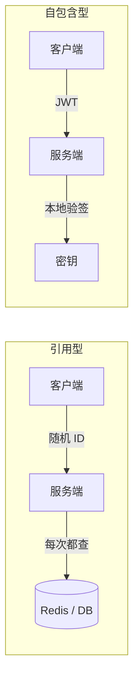
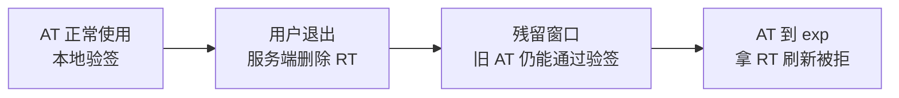

# Session vs JWT vs 双 Token

## 当前结论

- 内部系统、后台管理、需要立刻踢人：**Session + Redis**，或单个随机 token 存 Redis。最简单，失效最可控。
- 对外、高流量、App / 小程序：**短期 JWT 做 access_token + 服务端存 refresh_token**（双 token）。绝大多数请求不碰存储，退出后旧 access_token 还能用几分钟。
- **不要用长寿命的单个 JWT**，哪怕没有退出登录的需求：被偷后只能等它过期。
- 多个服务都要自己验身份：JWT 用非对称算法（RS256 / ES256），授权中心持私钥。

## 备选项

- **Session**：客户端只拿一个随机 ID，身份和过期时间都在服务端存储里。
- **单个 JWT**：身份写在 token 里，服务端验签即可，不存记录。
- **双 Token**：短期 access_token（通常是 JWT）+ 长期 refresh_token（服务端有记录）。

## 先分清两类凭证

所有凭证都能归到两类，后面的取舍都来自这个区别：

| | 引用型（Session ID、opaque token） | 自包含型（JWT） |
| --- | --- | --- |
| 身份信息在哪 | 服务端存储 | token 里 |
| 每次请求 | 查一次存储（或调一次 [[OAuth]] 内省接口） | 本地计算 |
| 立刻作废 | 删记录 | 做不到，除非另存黑名单 |
| 续期 | 改记录的过期时间 | 只能签新 token |

## 取舍分析

| 方案 | 普通请求查存储 | 退出登录 | 续期 | 被偷后 | 适用场景 |
| --- | --- | --- | --- | --- | --- |
| Session + Redis | 每次 | 立刻失效 | 服务端改 TTL（滑动） | 删记录止损 | 后台、内部系统、强安全要求 |
| 单 JWT，什么都不存 | 不查 | 做不到 | 只能重新签 | 只能等 exp | 很短寿命的一次性凭证 |
| 单 JWT + jti 黑名单 | 每次查黑名单 | 立刻失效 | 只能重新签 | 拉黑止损 | 已经在用 JWT、又必须立刻失效 |
| 双 Token（RT 存服务端） | 不查，只有刷新时查 | 删 RT；旧 AT 最多残留一个 AT 寿命 | 客户端拿 RT 换新 AT | AT 损失有上限；RT 要轮换 | 对外高流量、App、小程序 |

## 常见疑问

### 1. 双 Token 是有状态的，是因为没用 Cookie 吗？

不是。**服务端有没有存记录**决定有没有状态；Cookie 和 `Authorization` 头只是把 token 带过去的方式。

| | 放 Cookie | 放 Authorization 头 |
| --- | --- | --- |
| 服务端存了记录 | 传统 Session | 双 Token（RT 存 Redis） |
| 服务端不存 | JWT 放 Cookie | 纯 JWT |

RT 也做成 JWT、服务端不存时，整套仍是无状态，但退出后 RT 还能继续换 AT，等于没法退出。线上几乎都会把 RT 存下来。

### 2. 都要存 Redis 了，为什么不只用一个 token 存 Redis？

区别在**多少请求要碰 Redis**：

- 单 token 存 Redis：每个请求都查（开滑动续期还要每次写）。
- 双 Token：AT 有效期内只本地验签，只有 AT 过期拿 RT 换新时查一次。

流量不大时单 token 存 Redis 完全够用，而且更简单。

### 3. 单个 JWT 自带 exp，没过期就不查存储，不也一样吗？

平时一样，区别在**退出登录**。JWT 签出去就改不了，要让它提前失效只有两条路：每次请求查黑名单（又回到每次查存储），或者不查（退出后 token 一直能用到 exp）。双 Token 选的是第三条：接受"退出后旧 AT 还能用一小段时间"，换来普通请求不查存储。

### 4. 没有退出登录的需求，单个 JWT 能设长 exp 吗？

不能。退出登录是业务需求，token 被偷是安全事件，两者无关。纯 JWT 被偷后服务端没有任何止损手段，只能等 exp；用户改密码也作废不了它。

"有效期短"、"用户不用频繁登录"、"能主动作废"三件事，纯 JWT 最多同时满足两件。三件都要，就得在服务端存一点东西。

### 5. 为什么不在服务端给 AT 自动续期？

主要原因是 **JWT 的 exp 在签名范围内，改不了**，所谓续期只能签一个新的。如果在普通接口里每次返回新 JWT：所有接口的返回都要带 token；并发请求各返回一个新 token，客户端不知道存哪个；旧 token 还没过期，作废又得上黑名单。所以单独做一个刷新接口，客户端在 AT 快过期时主动调用。

Session 可以原地续期，因为记录在服务端，key 不变，改 TTL 即可。

### 6. RT 被偷怎么办？这和单个 token 被偷不是一回事吗？

是一回事，RT 本身不防盗。区别在于：

| 存放位置 | JS 能读到 | 主要风险 |
| --- | --- | --- |
| localStorage | 能 | XSS 直接读走 |
| HttpOnly + Secure + SameSite Cookie | 不能 | XSS 读不走；靠 SameSite 防 CSRF |
| 小程序本地存储 | 能 | 没有 HttpOnly 机制 |
| 本机加密文件 + 系统钥匙串（CLI） | 需解锁钥匙串 | 本机被控制时拦不住 |

缓解手段：RT 轮换（每次刷新发新的、作废旧的，检测到旧 RT 被再用就作废整条授权）；缩短 RT 寿命；把 RT 绑定到客户端密钥（DPoP 等）；刷新时比对设备信息（客户端可伪造，只能辅助）。RFC 9700 要求对公开客户端至少做轮换或绑定之一。

### 7. OAuth 和这些是什么关系？

OAuth 规定怎么拿到 token，不规定 token 格式；它发出的 access_token 可以是随机字符串，也可以是 JWT。只做自己系统的登录不需要 OAuth。详见 [[OAuth]] 和 [[JWT]]。

## 推荐理由

选型的核心问题只有一个：**能不能接受"每个请求都查一次存储"**。

- 能接受（流量不大、要立刻失效）：直接用 Session，不必引入 JWT 的复杂度。
- 不能接受：用双 Token，把"查存储"压缩到刷新接口，同时用短 AT 限制泄露损失。
- 纯 JWT 只适合寿命极短、不需要作废的场景。

另外，用了 JWT 但每个请求仍去查存储（黑名单、会话记录），效果上和 Session / 内省接口相同，JWT 在这里主要起防伪造作用。这是合理的选择，但要清楚没有拿到"不查存储"的好处。

## 相关页面

- [[JWT]]
- [[OAuth]]
- [[SSO]]

## 来源指针

- RFC 7519 JSON Web Token：https://www.rfc-editor.org/rfc/rfc7519
- RFC 8725 JWT Best Current Practices：https://www.rfc-editor.org/rfc/rfc8725
- RFC 6749 OAuth 2.0（refresh_token 定义见 §1.5）：https://www.rfc-editor.org/rfc/rfc6749
- RFC 7662 Token Introspection：https://www.rfc-editor.org/rfc/rfc7662
- RFC 9700 OAuth 2.0 Security BCP（refresh_token 保护见 §4.14）：https://www.rfc-editor.org/rfc/rfc9700
- MDN HTTP Cookies（HttpOnly / Secure / SameSite）：https://developer.mozilla.org/en-US/docs/Web/HTTP/Cookies
