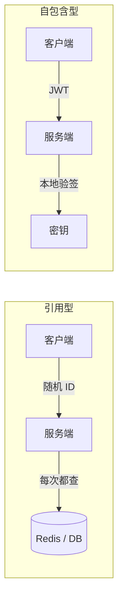
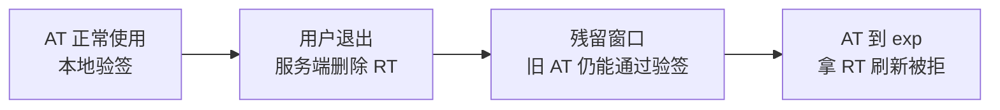

# Session vs JWT vs 双 Token

## 当前结论

- 需要集中管理登录状态、及时撤销会话时，可优先评估服务端 Session。存储可用 Redis 或数据库，实际失效时间取决于查询与缓存策略。
- 需要多个服务独立验证访问凭证时，可评估短期 JWT access_token 与可撤销的 refresh_token。只做本地验证时，撤销 RT 不会自动使已发出的 AT 立即失效；窗口由 AT 有效期决定。
- 对不检查撤销状态的 Bearer JWT，应限制有效期；不能仅因为没有退出功能就忽略泄露风险。
- 多个服务都要自己验身份：JWT 用非对称算法（RS256 / ES256），授权中心持私钥。

## 备选项

- **Session**：客户端只拿一个随机 ID，身份和过期时间都在服务端存储里。
- **单个 JWT**：token 包含 claims；本页比较的是仅本地验证签名与 claims、不查询会话状态的实现。JWT 本身不要求无状态。
- **双 Token**：access_token 与 refresh_token 分别用于访问和刷新。它们不限定格式；本页重点比较 JWT AT 配合服务端管理 RT 状态的实现。

## 先分清两类凭证

本页按资源服务器如何取得验证信息，比较以下两种常见实现；JWT 也可以结合状态查询使用：

| | 引用型（Session ID、opaque token） | 自包含型（JWT） |
| --- | --- | --- |
| 身份信息在哪 | 服务端存储 | token 里 |
| 每次请求 | 查一次存储（或调一次 [[OAuth]] 内省接口） | 本地计算 |
| 提前作废 | 更新记录；生效速度取决于缓存 | 需要额外的撤销机制；仅本地验证不能获知单个 token 已撤销 |
| 续期 | 改记录的过期时间 | 只能签新 token |

## 取舍分析

| 方案 | 普通请求查存储 | 退出登录 | 续期 | 被偷后 | 适用场景 |
| --- | --- | --- | --- | --- | --- |
| Session + Redis | 每次，或查询缓存 | 撤销会话，注意缓存传播 | 可滑动续期 | 撤销被盗会话 | 需要集中管理登录状态 |
| 单 JWT，仅本地验证 | 不查会话状态 | 无法按 token 立即撤销 | 重新签发 | 存在有效期窗口 | 可接受该窗口的短期凭证；一次性使用还需防重放机制 |
| 单 JWT + jti 撤销列表 | 查询撤销状态 | 取决于状态传播与缓存 | 重新签发 | 撤销被盗 token | 需要 JWT claims 与提前撤销 |
| 双 Token（AT 仅本地验证） | 验证 AT 不查，刷新时查 RT 状态 | 撤销 RT；旧 AT 可用至过期 | 用 RT 换新 AT | 限制 AT 可用窗口，保护 RT 并处理重放 | 需要独立验证与持续登录的场景 |

## 常见疑问

### 1. 双 Token 是有状态的，是因为没用 Cookie 吗？

不是。**服务端有没有存记录**决定有没有状态；Cookie 和 `Authorization` 头只是把 token 带过去的方式。

| | 放 Cookie | 放 Authorization 头 |
| --- | --- | --- |
| 服务端存了记录 | 传统 Session | 双 Token（RT 存 Redis） |
| 服务端不存 | JWT 放 Cookie | 纯 JWT |

是否有状态与传输方式无关，上表只是组合示例。如果 RT 也只做本地验证且没有撤销机制，清除客户端副本不会使泄露的 RT 失效。服务端可以保存 RT 摘要、会话或轮换关系，不一定保存原文。

### 2. 都要存 Redis 了，为什么不只用一个 token 存 Redis？

在 AT 仅本地验证的前提下，区别之一是**多少请求需要查询会话存储**：

- 单 token 存 Redis：每个请求读取会话状态；缓存与滑动续期的写入频率由实现决定。
- 双 Token：AT 有效期内只本地验签，刷新时查询 RT 状态；业务鉴权仍可能需要其他查询。

流量不大时单 token 存 Redis 完全够用，而且更简单。

### 3. 单个 JWT 自带 exp，没过期就不查存储，不也一样吗？

平时一样，区别在**退出登录**。已签名 JWT 的内容不能直接修改。按 token 提前撤销需要资源服务器取得额外状态，例如撤销列表、会话版本或内省结果。双 Token 可以选择让 AT 仅本地验证，接受旧 AT 在撤销 RT 后仍可用至过期；也可以增加 AT 撤销检查。

### 4. 没有退出登录的需求，单个 JWT 能设长 exp 吗？

应根据泄露风险确定有效期。退出需求与泄露后的处理是不同问题；如果验证方不检查撤销或用户状态，修改密码不会自动让已签发 token 失效。停用签名密钥虽能使一批 token 失效，却会影响其他会话。

持续登录需要续签依据，提前撤销需要状态传播；这两项能力不能仅由 JWT 的编码格式提供。

### 5. 为什么不在服务端给 AT 自动续期？

**JWT 的 exp 在签名范围内**，延长有效期需要签发新 token，但可以由服务端在普通响应中返回。这样做需要定义续签条件、并发响应处理和旧 token 的有效期；只凭被盗 AT 就能持续续签，会延长攻击者的访问时间。独立刷新接口便于分别管理访问凭证与续签依据，并非唯一实现方式。

Session 可以原地续期，因为记录在服务端，key 不变，改 TTL 即可。

### 6. RT 被偷怎么办？这和单个 token 被偷不是一回事吗？

是一回事，RT 本身不防盗。区别在于：

| 存放位置 | JS 能读到 | 主要风险 |
| --- | --- | --- |
| localStorage | 能 | XSS 直接读走 |
| HttpOnly + Secure + SameSite Cookie | 不能直接读取 Cookie | XSS 仍可能代发请求；SameSite 减少跨站发送，仍需按流程设计 CSRF 防护 |
| 小程序本地存储 | 能 | 没有 HttpOnly 机制 |
| 本机加密文件 + 系统钥匙串（CLI） | 需解锁钥匙串 | 本机被控制时拦不住 |

缓解手段：RT 轮换（每次刷新发新的、作废旧的，检测到旧 RT 被再用时撤销该轮换关系中当前有效的 RT）；缩短 RT 寿命；把 RT 绑定到客户端密钥（DPoP 等）；刷新时比对设备信息（客户端可伪造，只能辅助）。RFC 9700 要求对公开客户端至少做轮换或绑定之一。

### 7. OAuth 和这些是什么关系？

OAuth 规定怎么拿到 token，不规定 token 格式；它发出的 access_token 可以是随机字符串，也可以是 JWT。只做自己系统的登录不需要 OAuth。详见 [[OAuth]] 和 [[JWT]]。

## 推荐理由

选型需要同时考虑**撤销时效、客户端存储、服务间验证方式、请求成本和实现复杂度**。下列建议针对本页比较的实现，不是按客户端类型划分的固定规则：

- 能接受（流量不大、要立刻失效）：直接用 Session，不必引入 JWT 的复杂度。
- 需要独立验证：评估短期 JWT AT 与 RT，并确认能接受多长的撤销延迟；不要假定双 Token 会消除所有业务查询。
- 仅本地验证的 JWT：明确有效期、权限范围与泄露后的处理方式。

另外，用了 JWT 但每个请求仍去查存储（黑名单、会话记录），效果上和 Session / 内省接口相同，JWT 在这里主要起防伪造作用。这是合理的选择，但要清楚没有拿到"不查存储"的好处。

## 相关页面

- [[JWT]]
- [[OAuth]]
- [[SSO]]

## 来源指针

- RFC 7519 JSON Web Token：https://www.rfc-editor.org/rfc/rfc7519
- RFC 8725 JWT Best Current Practices：https://www.rfc-editor.org/rfc/rfc8725
- RFC 6749 OAuth 2.0（refresh_token 定义见 §1.5）：https://www.rfc-editor.org/rfc/rfc6749
- RFC 7662 Token Introspection：https://www.rfc-editor.org/rfc/rfc7662
- RFC 9700 OAuth 2.0 Security BCP（refresh_token 保护见 §4.14）：https://www.rfc-editor.org/rfc/rfc9700
- MDN HTTP Cookies（HttpOnly / Secure / SameSite）：https://developer.mozilla.org/en-US/docs/Web/HTTP/Cookies
