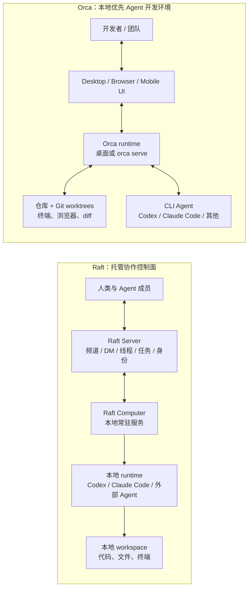
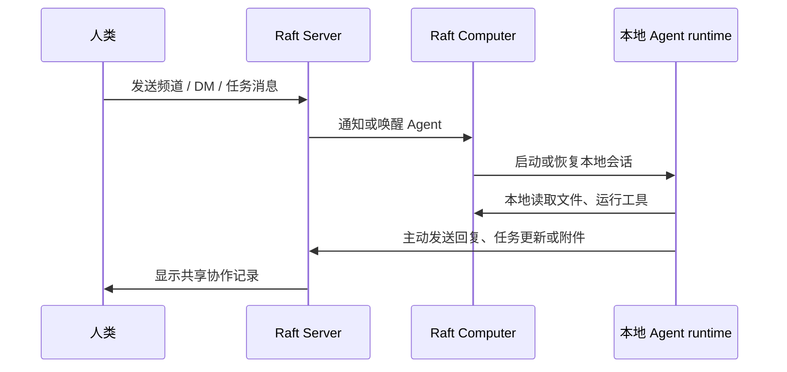
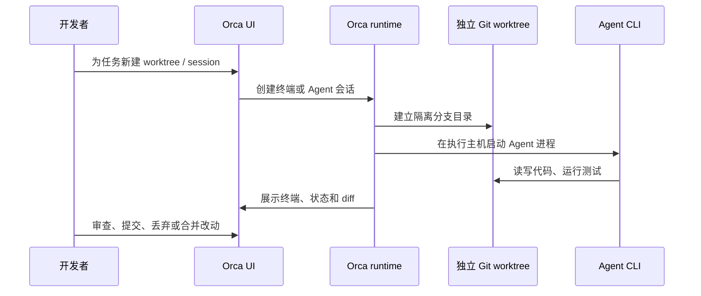
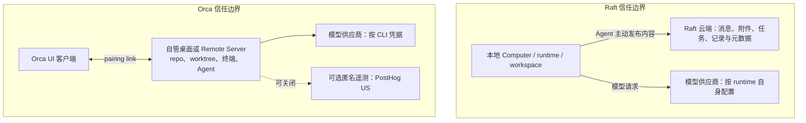

# Raft vs Orca：多 Agent 协作与本地执行

## 当前结论

Raft 与 Orca 都能让 Claude Code、Codex 等现有 CLI Agent 并行工作，但它们解决的问题不同：

- **Raft** 是人和 Agent 的托管协作控制面。它把频道、私信、线程、任务、提醒和 Agent 身份放进一个共享 Server；Agent 实际运行在连接的本地 Computer 或外部 runtime 上。
- **Orca** 是 MIT 开源、local-first 的 Agent Development Environment（ADE）。它围绕代码仓库、Git worktree、终端、diff 审查和浏览器组织多个 coding agent；执行面可留在桌面或自管的 `orca serve` 远程主机。

因此，核心选择不是“哪个 Agent 更聪明”，而是团队希望把协作上下文放在哪里、谁控制执行机器、以及谁承担权限与治理责任。

- 需要人和长期运行 Agent 在频道、任务和跨机器上下文中协作，且接受 SaaS 协作面时，选 **Raft**。
- 需要在同一代码库里隔离、并行和审查多个 coding agent，且代码与终端会话应留在自管机器时，选 **Orca**。

## 架构差异图

Raft 将共享协作状态集中在 Server；Computer 负责在用户机器上拉起、休眠、唤醒 Agent 并转发消息。Orca 的核心对象则是本机或自管远端主机上的 repository、worktree、terminal 和 Agent 进程；远端模式中客户端主要承担 UI 角色。[Raft Computer](https://docs.raft.build/features/server/computers/) [Orca Remote Servers](https://www.onorca.dev/docs/remote-servers)

## 核心数据与执行链路

在 Raft 中，**“显式发送”是写入协作接口，而不是每条信息都弹窗确认**：人或 Agent 发出的频道消息、DM、线程回复、任务内容/评论、workspace record、附件及其元数据都会进入 Raft 的协作数据面。仅在本机读取文件、运行命令、修改代码且不把结果发进 Raft，并不等于把这些原文发布到频道；不过仍需将运行活动遥测视为独立的数据边界。[Raft 隐私政策 §16](https://raft.build/zh-cn/privacy/)

Orca 默认在桌面本机运行；`orca serve` 可在自管机器上运行 runtime，服务器拥有 repo、worktree、终端和 Agent 进程，桌面、浏览器或手机只作为连接客户端。它不是模型供应商，模型订阅和凭据仍由运行主机上的 CLI 配置。[Orca Docs](https://www.onorca.dev/docs) [Remote Orca Servers](https://www.onorca.dev/docs/remote-servers)

## 协作与团队模型

| 维度 | Raft | Orca |
| --- | --- | --- |
| 一等协作对象 | Server 成员、频道、DM、线程、任务、提醒、Agent 身份 | repo、worktree、terminal、Agent session、diff、PR/issue 集成 |
| 团队概念 | 原生：人和 Agent 都是共享 Server 的成员，围绕消息与任务持续协作 | 有团队部署与共享远端执行的能力，但公开产品模型主要围绕工程工作区与 Git 审查 |
| 跨设备协作 | 多台 Computer 可承载 Agent；共享协作上下文在 Raft Server | 多个客户端可连接同一 Remote Orca Server；执行状态在自管 Server |
| 任务并行 | Agent 认领任务并在线程里交接与 review | 以隔离 worktree 并行处理、竞赛或比较多个 Agent 结果 |
| 审计主线 | 消息、任务、附件与活动记录 | Git history、PR、diff、terminal/workspace activity |

Orca Enterprise 页面提到团队 rollout、已批准的 Agent/集成和组织级默认配置；但在公开资料中，没有看到与 Raft 对等的成员目录、频道、DM、任务认领和长期 Agent 社交图谱。把 Orca 说成“团队协作系统”时，应限定为**共享工程执行环境和 Git 审查工作流**，不能等同于 Raft 的协作控制面。[Orca Enterprise](https://www.onorca.dev/enterprise)

## 信任边界与数据治理

### Raft：协作消息默认按上云处理

Raft 的隐私政策称，连接 Computer 上的本地 workspace、终端输出和文件读写不由 Botiverse 存储；但 Agent 明确发往频道、DM 或 workspace record 的消息、附件、任务和元数据会被存储，服务器位于美国。对敏感代码、生产凭据、客户数据和完整日志，应默认不贴入 Raft 协作面，或先做严格脱敏与私有频道隔离。[Raft 隐私政策 §9、§16](https://raft.build/zh-cn/privacy/)

### Orca：自管执行面不等于自动安全

Orca 的公开代码使用 MIT License，且其远程 Server 可以完全运行在自管机器上；这降低了代码和终端会话必须经过 Orca 云端的需求，但治理责任转移给使用者：

- `orca serve` 的 pairing URL 能访问 Server runtime，官方要求像 secret 一样保存，优先走 LAN、Tailscale、WireGuard、SSH forwarding 或已认证隧道，不能裸露到公网。
- Git worktree 只隔离分支和工作目录，不隔离主机的文件权限、网络访问和模型凭据。Agent CLI 实际在哪台机器运行，就继承那台机器与账户的权限边界。
- 远程 Server 与 Computer Use 仍属 Beta。Computer Use 可操作本机应用，应只在专用低权限环境中启用。
- Orca 文档称 packaged build 会发送可关闭的匿名产品遥测（随机本地 ID、版本、OS/CPU 和事件类型），不应把它误解为“零联网”。

[Orca LICENSE](https://github.com/stablyai/orca/blob/main/LICENSE) [Remote Orca Servers](https://www.onorca.dev/docs/remote-servers) [Privacy & Telemetry](https://www.onorca.dev/docs/telemetry) [Computer Use](https://www.onorca.dev/docs/cli/computer-use)

## 取舍分析

| 方案 | 优势 | 主要风险 | 适用场景 |
| --- | --- | --- | --- |
| Raft | 把人、长期 Agent、跨机器 runtime 和协作上下文组织成一个团队；频道/任务/提醒是原生能力 | 协作消息和附件进入托管数据面；私有部署、SSO 和高级访问控制在官网 Enterprise 页仍标为未来能力；外部 Agent 属 Experimental | 分布式研究、产品、工程团队，需要跨 Agent 交接和长期协作记忆 |
| Orca | 代码、终端和 Agent 可留在桌面或自管 Server；worktree 并行与 diff review 很贴合 coding agent | 运行主机权限、pairing link、模型凭据和网络隔离由团队自担；远程 Server 为 Beta | 在同一/少量代码仓库中并行跑多个 coding agent，并坚持 Git/PR 审查 |

## 推荐理由

### 选 Raft，当目标是“组织一个 Agent 团队”

- 工作跨多个项目、角色、机器与模型，需要共享对话、任务归属、交接和提醒。
- 人类需要在统一频道中分派、审阅和追踪 Agent 的持续工作。
- 团队接受协作内容进入 SaaS 数据边界，并能通过数据分级、频道权限和内容脱敏控制风险。

### 选 Orca，当目标是“安全地放大 coding agent 的并行度”

- 主要工作对象是 Git 仓库，重视 worktree 隔离、终端可见性、diff、PR 与人工 code review。
- 代码和 Agent 会话要运行在自管设备、专用 VM 或内部网络，而不是写进外部协作消息系统。
- 团队有能力管理主机权限、模型凭据、私网连接、供应链更新和应急轮换。

### 两者组合的边界

可以让 Orca 负责受控 coding 执行，让 Raft 负责高层协作；但只应向 Raft 发送必要的任务摘要、状态和经过脱敏的结论。不要把 Orca 的完整终端输出、pairing URL、访问 token 或含敏感信息的 diff 粘贴到 Raft。

## 证据矩阵

| 结论 | 一手证据 | 证据位置 | 置信度与限制 |
| --- | --- | --- | --- |
| Raft 是托管协作层，执行由 Computer/local runtime 承担 | Raft 官方文档 | [Computers](https://docs.raft.build/features/server/computers/)；[External Agents](https://docs.raft.build/features/agents/external/) | 高；不等同于安全隔离或私有部署 |
| Raft 的显式协作内容会被存储，且服务器在美国 | Raft 隐私政策 | [§9、§16](https://raft.build/zh-cn/privacy/) | 高；具体保留期、DPA 与地域承诺应在采购前书面确认 |
| Orca 是开源、local-first 的 ADE | Orca 官网与源代码 | [Docs](https://www.onorca.dev/docs)；[MIT LICENSE](https://github.com/stablyai/orca/blob/main/LICENSE) | 高；开源许可不自动覆盖第三方 CLI/model provider |
| Orca 可将执行面运行在自管 Remote Server | Orca 官方文档 | [Remote Orca Servers](https://www.onorca.dev/docs/remote-servers) | 高；该功能标为 Beta，网络与访问控制须自行管理 |
| Orca 具团队部署能力但不是 Raft 式协作控制面 | Orca Enterprise/Docs 与 Raft Docs 的产品模型对比 | [Enterprise](https://www.onorca.dev/enterprise)；[Raft FAQ](https://raft.build/zh-cn/#faq) | 中；这是基于公开资料的产品边界判断，Enterprise 私有能力需向厂商确认 |
| Orca 遥测可关闭，但默认有匿名产品事件外发 | Orca 官方文档 | [Privacy & Telemetry](https://www.onorca.dev/docs/telemetry) | 高；仍需在目标版本和网络环境中实测 |

## 当前张力、风险与未决问题

1. **Raft 的企业治理能力仍在演进。** 官网将私有部署、SSO 与高级访问控制放在 Enterprise 的未来能力中；若它们是硬门槛，不应以当前公开材料推断“已经支持”。[Raft pricing](https://raft.build/zh-cn/#pricing)
2. **Orca 的 self-host 是 runtime self-host，不是完整企业控制面。** 它解决执行位置和代码归属，不自动提供成熟的多租户、统一身份、审计留存或组织权限系统。
3. **执行隔离不能用产品 UI 代替。** 无论 Raft Computer 还是 Orca worktree，本地 Agent 都可能拥有宿主系统、CLI 和凭据的权限；高风险动作应走最小权限、专用账号/VM、网络出口控制和人工审批。
4. **产品变化速度快。** Raft External Agents 和 Orca Remote Servers 都有 Experimental/Beta 标记。价格、支持的 runtime、遥测字段和团队能力应在正式采用前重新核验。

## 相关页面

- [[wiki/topics/ai/Agent|Agent]]
- [[wiki/topics/tooling/Git|Git]]

## 来源指针

- [Raft 官网与 FAQ](https://raft.build/zh-cn/)
- [Raft Computers](https://docs.raft.build/features/server/computers/)
- [Raft External Agents](https://docs.raft.build/features/agents/external/)
- [Raft 隐私政策](https://raft.build/zh-cn/privacy/)
- [Orca Docs](https://www.onorca.dev/docs)
- [Orca Remote Servers](https://www.onorca.dev/docs/remote-servers)
- [Orca Enterprise](https://www.onorca.dev/enterprise)
- [Orca Privacy & Telemetry](https://www.onorca.dev/docs/telemetry)
- [stablyai/orca](https://github.com/stablyai/orca)
