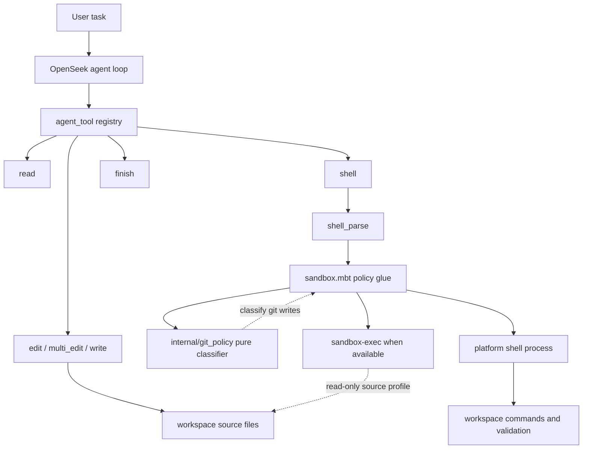
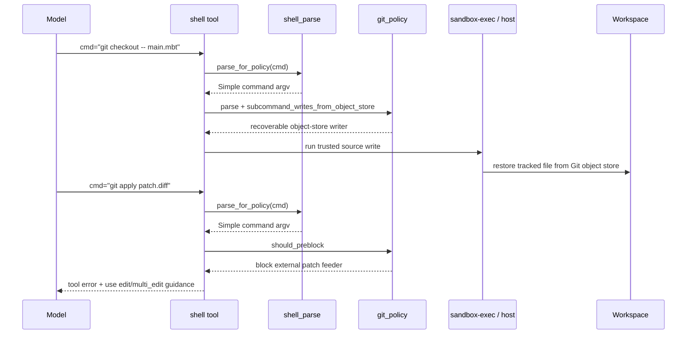
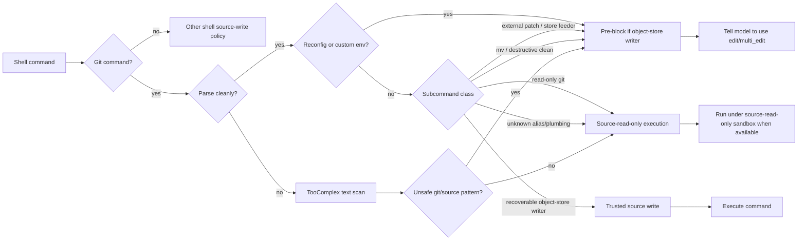

# Coding Agent Shell 与 Git 权限边界

## 问题

Coding agent 必须能运行 shell 和 Git，否则它很难像真实工程师一样验证、回滚、切分和修复代码。但 shell 又是最大的副作用入口：一旦允许 agent 用脚本、重定向、`sed`、`git apply` 或 Git plumbing 改源文件，审阅边界就会从“可解释的工具调用”退回到“模型在终端里想办法绕”。这里的问题是：怎样让 agent 正常使用 Git，同时不把源文件修改权交给不透明 shell？

## 简答

更稳的设计不是简单禁掉 shell，也不是完全相信 sandbox，而是把源文件修改权收敛到专用工具，把 shell 定位为分析和验证通道。对 Git 这类介于“验证”和“写源文件”之间的工具，应按写入来源分类：来自 Git object store、可恢复、可审阅的写入可以放宽；来自外部 patch、stdin、工作区任意字节、重配置仓库或不可恢复删除的写入要阻断。

## 源码事实

本页基于 `moonbitlang/openseek` 仓库和 PR #273 的源码阅读。`openseek` 是 MoonBit 写的 DeepSeek-backed coding agent，标准工具包括 `shell`、`read`、`edit`、`multi_edit`、`write` 和 `finish`。PR #273 将 shell 里的 Git 权限策略重构成 `agent_tool/shell/internal/git_policy`，把原先较大的启发式检测拆成纯命令行分类器加 sandbox glue。

PR #273 的核心改动不是“信任 Git”，而是把 Git 写源文件拆成两类：

- 可恢复 object-store 写入：`checkout`、`switch`、`restore`、`reset`、`stash`、`rm`。这些写入来自 HEAD、index、commit、tree 或 stash，或者删除可由 Git 恢复的 tracked file。
- 不可信或不可恢复写入：`apply`、`am`、`update-index`、`read-tree`、`fast-import`、`mv`、非 dry-run `clean`、带重配置选项或自定义环境的 object-store writer、可能从其他 tree clobber untracked file 的 checkout/restore/switch 形态。

## 架构图

这个结构里，`shell` 不是无条件的万能写接口。它先经过 shell parser、静态 pre-block、trusted command classification，再决定是否以 source-read-only sandbox 或 trusted source-write 方式执行。

## 执行链路

关键点在于同样是 Git，`git checkout -- main.mbt` 和 `git apply patch.diff` 的风险不一样。前者把 Git 已知对象恢复到工作区，后者把外部 patch 内容引入源文件。对 agent 来说，这个差异比“是不是 Git 命令”更重要。

## Trust Model

这个 trust model 的边界是“工程 guardrail”，不是完整安全证明。源码和 PR body 都承认 residual risk：`.git` 可写时，足够刻意的 Git plumbing 仍可能污染 object store；macOS 之外也缺少同等强度的 runtime sandbox。

## 综合结论

- Shell 权限边界不能只靠“禁止危险命令”。模型会遇到构建、测试、Git 回滚、批量检查等真实需求，完全禁 shell 会把 agent 变成只能聊天的助手。
- 更稳的分层是：源文件修改走 `edit` / `multi_edit` / `write` 这类结构化工具；shell 主要负责观察、验证和运行已有工程命令；少量确需写源文件的命令必须有明确 trust class。
- Git 的判断标准不应是命令名，而应是写入来源和可恢复性。来自 Git object store 的 tracked-file 恢复，和来自外部 patch/stdin/工作区任意字节的写入，不应该放在同一个权限桶里。
- Runtime sandbox 和 static pre-block 要配套。`sandbox-exec` 这类机制能提供更硬的本机约束，但平台相关；静态 pre-block 给跨平台提供最低保护，也能给模型更清楚的错误提示。
- Policy classifier 应该尽量纯。`openseek` 把 Git grammar 和 classification 抽成无 filesystem 依赖的 `git_policy`，这使策略可以被黑盒测试、审阅和迭代，而不是埋在大段 sandbox glue 里。
- 错误提示也是控制面。阻断危险 shell 时，提示必须告诉模型“不要绕过”，并指出正确替代路径。否则模型可能把 block 当成需要用另一条 shell 技巧绕开的临时障碍。
- 测试应覆盖绕路形态，而不只覆盖正常命令。PR #273 的测试覆盖了 `git apply`、`git mv`、`git clean`、重配置 Git、自定义环境、glob/TooComplex 路径、强制 checkout、source tree move、masked redirect 等绕路入口。

## 证据矩阵

| 结论 | 证据来源 | 证据位置 | 置信度 / 限制 |
| --- | --- | --- | --- |
| `openseek` 是 MoonBit coding agent 基础设施，不只是单个 CLI | 仓库 README | `README.md` 的 package overview | 高；基于仓库文档和目录结构 |
| 标准工具把 shell 与 edit/multi_edit/write 分开 | 仓库 README 与 `agent` README | `README.md`、`agent/README.mbt.md`、`agent_tool/README.mbt.md` | 高；工具注册顺序和工具职责明确 |
| PR #273 将 Git 策略抽成纯 `git_policy` 包 | PR #273 与源码 | `agent_tool/shell/internal/git_policy/git_policy.mbt` | 高；源码可见 |
| 可信 Git 写入以 object store 可恢复性为核心 | PR #273、shell README、源码注释 | `agent_tool/shell/README.mbt.md`、`git_policy.mbt`、`sandbox.mbt` | 高；多处一致 |
| `git apply`、`git am`、`update-index` 等外部/存储注入路径被 pre-block | `git_policy` 和测试 | `should_preblock`、`git_policy_test.mbt`、`sandbox_wbtest.mbt` | 高；测试列举了具体命令 |
| macOS runtime sandbox 是强约束，但跨平台仍依赖静态 pre-block | PR #273、`sandbox.mbt` | `/usr/bin/sandbox-exec` probe 与 pre-block 注释 | 中高；未在本地重跑测试 |
| 该策略不是完整安全边界 | PR #273 与源码注释 | PR residuals、`git_preblock_target` 注释 | 高；作者显式承认 residual channel |

## 当前张力 / 风险 / 未决问题

- **可用性与安全性**：放宽 `checkout`、`reset`、`stash` 能显著提升 agent 的工程可用性，但每个放宽项都需要解释“写入来源”和“恢复路径”。否则 allowlist 会慢慢膨胀成不透明规则。
- **Git object store 不是绝对可信域**：只要 `.git` 可写，攻击面就没有完全关闭。把 object store 当作可信来源是工程折中，不是沙箱级隔离。
- **跨平台执行不对称**：macOS 有 `sandbox-exec`；Linux / Windows 更依赖静态 pre-block 和工具协议。长期看，真正的跨平台方案可能需要更一致的 filesystem sandbox 或容器化执行层。
- **TooComplex 路径不可证明完整**：一旦 shell 使用 glob、变量、heredoc、xargs、嵌套脚本，静态解析就会退化。`openseek` 通过文本扫描堵常见绕路，但这不是 shell 语义证明。
- **模型会学习绕路**：安全策略必须把“不要绕过这个限制”写进工具反馈，否则模型可能把阻断理解成失败后需要换一种命令。
- **策略需要持续回归测试**：PR #273 的多轮 review 暴露了 `git mv`、`clean`、`-C`、custom env、`--pathspec-from-file`、clustered `-f` 等细节。Git 命令表面积太大，策略很难一次写完。

## 对我们可复用的原则

1. 源码变更默认走结构化编辑工具，而不是 shell。
2. Shell 可以保留，但它的职责要偏向观察、验证和调用既有工程命令。
3. 对“会写源文件”的 CLI 进行语义分类：写入来源、可恢复性、是否可审阅、是否可由专用工具替代。
4. Runtime sandbox 负责硬边界，static pre-block 负责跨平台最低边界和可解释错误。
5. 安全策略要从 glue code 中抽出来，变成可测试、可审阅的纯分类器。
6. Block message 是产品协议的一部分，要告诉 agent 正确替代动作。
7. 对每个放宽项都保留 residual risk，而不是把 guardrail 写成 security guarantee。

## 相关页面

- [[OpenSeek 项目架构总览]]
- [[OpenSeek 会话与运行时模型]]
- [[OpenSeek 工具协议与评测体系]]
- [[Code Agent]]
- [[Agent]]
- [[Git 与 Agent 协作的摩擦点和演进方向]]
- [[Sandbox]]
- [[Shell]]

## 来源指针

- `raw/sources/2026-07-01-openseek-shell-git-policy.md`
- `https://github.com/moonbitlang/openseek`
- `https://github.com/moonbitlang/openseek/pull/273`
