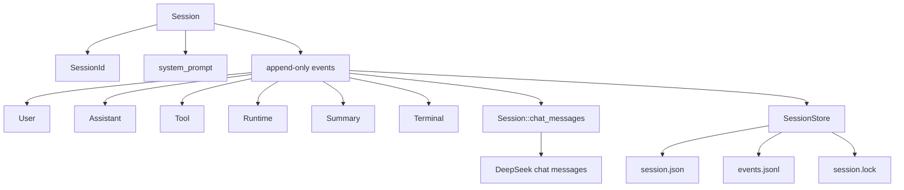
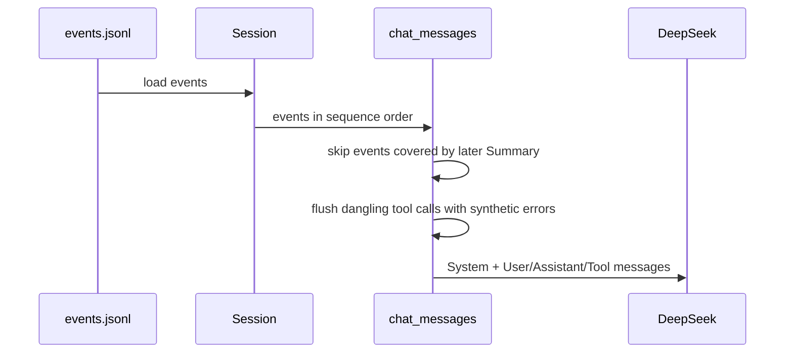
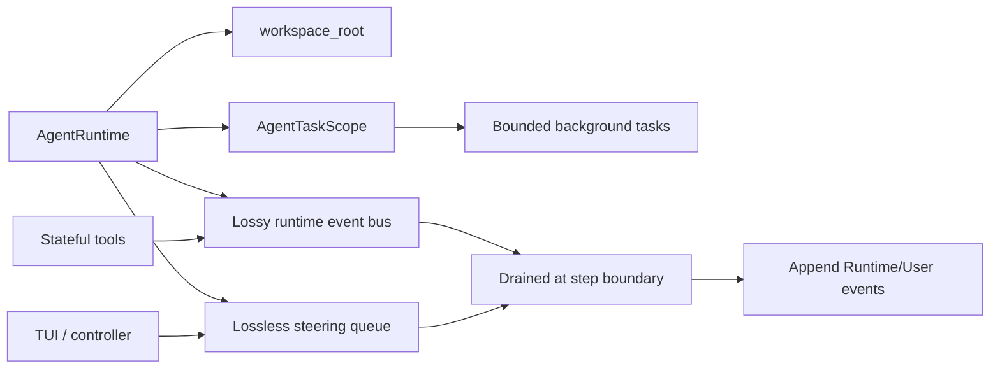

# OpenSeek 会话与运行时模型

## 问题

一个 coding agent 如果要支持恢复、TUI、长任务、watcher 更新、中途用户 steering 和 context compaction，应该把状态放在哪里？OpenSeek 的答案是把对话事实做成 append-only session，把临时运行态放进 runtime，把 UI 控制通过 JSONL serve 协议接入。

## 简答

OpenSeek 把“可重放事实”和“运行中协调”拆开：`agent_session` 记录 durable event log，`agent_runtime` 管理 step boundary 上的 runtime update 和 steering，`cmd/openseek --serve` 提供长生命周期 engine，TUI 通过 JSONL 命令控制这个 engine。这个模型的好处是可恢复、可分析、可 compaction；代价是事件语义、投影修复和控制面同步都要写得很细。

## 会话模型



`Session` 是不可变值，append 会返回新 session。`SessionStore` 负责把 header 和 JSONL event log 落盘，并校验 session id、sequence 和 event log。Compaction 不删除旧事件，而是追加 `Summary`，投影时再用 summary 替代被覆盖范围。

## 投影链路



投影层有一个重要细节：如果 assistant 事件里有 tool call，但后续没有对应 tool result，`chat_messages` 会补 synthetic tool error。这个设计把“进程中途退出”的破损会话修复成协议合法的 replay，而不是让下一次模型调用因为 dangling tool call 直接失败。

## Runtime 与 Steering



Runtime event 和 steering 不放在同一个队列里，这是 OpenSeek 的一个关键选择：

- runtime event 是有损队列，容量默认 32，适合 watcher 进度和状态更新；
- steering 是无损队列，用户中途输入不能被 watcher 噪音挤掉；
- agent loop 在 step boundary 先处理 steering，再处理 runtime update。

## Serve / TUI 生命周期

```mermaid
sequenceDiagram
  participant TUI as cmd/tui
  participant Engine as openseek --serve
  participant Loop as agent loop
  participant Store as SessionStore

  TUI->>Engine: JSONL {"command":"prompt","text":"..."}
  Engine->>Loop: run_turn_in_scope(shared runtime/tools)
  Loop->>Store: append User/Assistant/Tool/Terminal
  Loop-->>Engine: JSONL progress events
  Engine-->>TUI: streamed JSONL events

  TUI->>Engine: JSONL {"command":"steer","kind":"prompt","text":"..."}
  Engine->>Loop: queue_steer
  Loop->>Store: append steer as User at step boundary

  TUI->>Engine: JSONL {"command":"compact"}
  Engine->>Loop: wait active work, generate Summary
  Loop->>Store: append Summary
```

TUI 自己不跑 agent。它管理一个长生命周期 serve engine，向 stdin 写 prompt / steer / compact / cancel，读 stdout JSONL 事件。engine 死掉后，TUI 可以重启 engine，靠 durable session 恢复上下文。

## 综合结论

- OpenSeek 的 session 设计适合调试和复盘。所有关键动作都是 event，而不是散落在日志、stdout 和 UI 状态里。
- `Runtime` 没有取代 `Session`。它只处理运行时协调：工作区、后台事件、中途输入和 task group 生命周期。
- `Summary` 是 append-only compaction，不是破坏性压缩。这让原始事件仍然可审计，同时降低模型 replay 成本。
- serve mode 是把 agent 从“一次性 CLI”推进到“可交互 engine”的关键。TUI 不需要嵌入 agent，只要遵守 JSONL 控制协议。
- 这个模型的复杂度不低。尤其是 finish 与 steering 竞争、tool call 修复、serve command 排序、engine crash 恢复，都需要明确协议，否则 TUI 很容易出现“看到了但没入会话”的状态错觉。

## 证据矩阵

| 结论 | 证据来源 | 证据位置 | 置信度 / 限制 |
| --- | --- | --- | --- |
| Session 是 append-only immutable event log | 源码 | `agent_session/types.mbt` | 高 |
| Projection 修复 dangling tool calls | 源码 | `agent_session/projection.mbt` | 高 |
| Store 使用 header + JSONL event log | 源码 | `agent_session/store/store.mbt` | 高 |
| Compaction 追加 Summary，不删除原事件 | 源码 | `agent_session/compact/compact.mbt`、`agent_session/types.mbt` | 高 |
| Runtime event 有损，steering 无损 | 源码 | `agent_runtime/runtime.mbt` | 高 |
| TUI 通过 serve engine 和 JSONL 控制 | 文档/源码 | `cmd/tui/README.md`、`cmd/openseek/serve.mbt`、`cmd/tui/engine_client.mbt` | 高 |
| 运行验证缺失 | 本地环境限制 | 未安装 `moon` CLI | 中 |

## 当前张力 / 风险 / 未决问题

- **事件完整性 vs 上下文成本**：append-only 很利于追踪，但长会话会膨胀。Summary 能缓解，但 summary 质量本身需要评估。
- **runtime event 有损**：适合进度，不适合关键事实。工具作者必须知道哪些信息必须落 session。
- **TUI/engine 协议需要严格排序**：prompt、steer、cancel、compact 如果不经同一个 ordered queue，用户中途输入很容易落到错误 turn。
- **崩溃恢复不是零成本**：projection 能修复 dangling tool call，但无法恢复未落盘的工具副作用说明。
- **serve 模式让状态更强，也让生命周期更复杂**：长生命周期工具 registry 能保留 watcher，但也需要处理 engine 重启、task group 关闭和 pending work。

## 相关页面

- [[OpenSeek 项目架构总览]]
- [[OpenSeek 工具协议与评测体系]]
- [[Coding Agent Shell 与 Git 权限边界]]
- [[Agent]]
- [[Code Agent]]

## 来源指针

- `raw/sources/2026-07-01-openseek-project-architecture-review.md`
- `https://github.com/moonbitlang/openseek`
