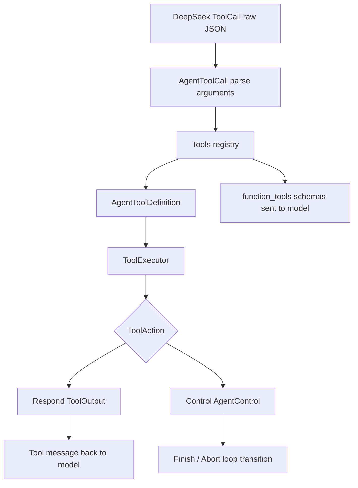
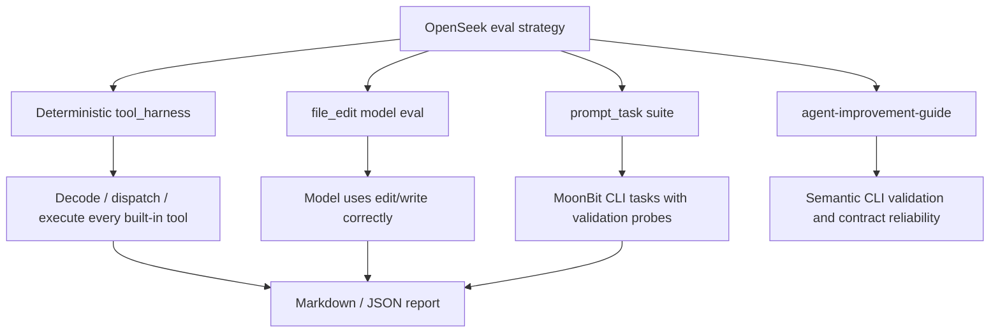
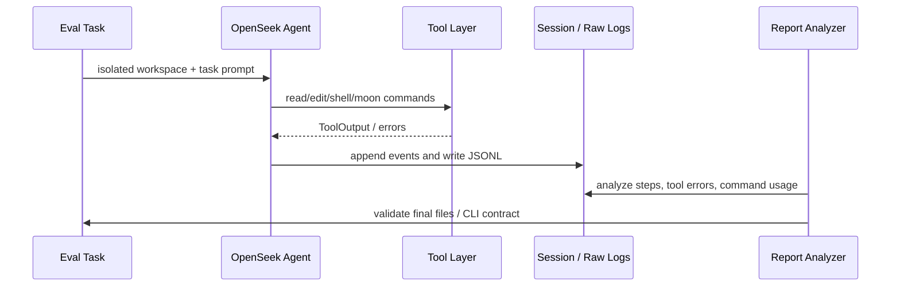

# OpenSeek 工具协议与评测体系

## 问题

Coding agent 的工具层怎么设计，才不会变成一组随便调用的本地函数？OpenSeek 给出的方向是：工具调用要有 typed registry、JSON schema、明确的 normal output / loop control 分离；可靠性不能靠 prompt 感觉，要用 deterministic harness、model-facing eval 和 CLI contract 指标持续压。

## 简答

OpenSeek 的工具协议把“模型请求工具”和“本地执行副作用”隔开：模型只看到工具 schema 和 tool result；host 负责解析参数、验证、执行、返回 `ToolOutput` 或 `AgentControl`。评测体系也分层：tool harness 测工具边界，file-edit eval 测模型能不能正确使用编辑工具，prompt-task eval 测更真实的 MoonBit CLI 任务。这个组合说明项目关注的是 agent 行为可靠性，而不是单次 demo 成功。

## 工具协议图

这里最关键的是 `ToolAction` 的拆分：普通工具失败也以 `ToolOutput(is_error=true)` 回给模型，让模型恢复；`finish` 这类控制工具才通过 `Control(Finish)` 结束 loop。

## 工具体系

- 文件工具：`read`、`edit`、`multi_edit`、`write`。
- 命令工具：`shell`、`moon_check`、`moon_cmd`。
- 控制工具：`finish`。
- Review 工具：`agent_review` 使用只读工具集和 `submit_review` structured output。
- Skill 系统：`.openseek/skills` 只把 skill 名称、description 和路径放进 prompt，正文等模型判断相关时再读。

OpenSeek 对工具边界的处理有三个明显倾向：

1. 能结构化就结构化，比如 `edit` / `multi_edit` 用 line-anchored exact replacement，而不是让 shell 生成 patch。
2. 能把错误返回给模型恢复，就不要直接让 loop 崩掉。
3. 能用稳定 schema 约束结果，就不要事后解析自然语言。`agent_review` 的 `submit_review` 就是这个方向。

## Eval 分层

`eval/tool_harness` 不调用模型，目标是定位工具层自己是否可调。`eval/file_edit` 调真实 agent，看模型能不能在隔离 workspace 中用文件编辑工具达成精确最终状态。`eval/prompt_task` 更接近端到端任务，跑 MoonBit CLI 问题、保留 raw logs、durable session logs，并支持 analyze-only 复算报告。

## 可靠性闭环

这个闭环的重点是把“看起来完成了”改成“外部行为被验证”。`agent-improvement-guide.md` 反复强调的问题不是模型不会写代码，而是 CLI contract 不可靠：文件参数、stdin/stdout、exit code、native binary 行为、debug output 污染，这些都需要结构化验收。

## 综合结论

- OpenSeek 的工具层不是薄 wrapper，而是 agent loop 的安全和恢复边界。
- `ToolOutput(is_error=true)` 仍然发送给模型，是正确方向。很多 agent 系统把工具错误当 host exception，反而丢失了模型自我修复机会。
- `Control(Finish|Abort)` 和普通 tool response 分离，避免模型把“结束任务”混在普通文本里。
- `moon_check` / `moon_cmd` 说明项目正在把 shell 中高频、可治理的命令抽成专用工具。这个方向和 [[Coding Agent Shell 与 Git 权限边界]] 一致。
- eval 设计比项目产品化更成熟：它已经在度量 tool errors、shell uses、MoonBit command usage、edit/write successes、validation pass、finish marker 等行为指标。
- 下一步最有价值的方向不是继续堆 prompt，而是 `agent-improvement-guide.md` 说的 semantic CLI validation：让 agent 证明外部命令行为，而不是只证明代码能编译。

## 证据矩阵

| 结论 | 证据来源 | 证据位置 | 置信度 / 限制 |
| --- | --- | --- | --- |
| Tool registry 是 typed boundary | 源码 | `agent_tool/agent_tool.mbt` | 高 |
| Tool error 作为输出回给模型 | 源码/README | `ToolOutput`、`execute_tool_call`、`agent_tool/README.mbt.md` | 高 |
| `finish` 是 loop control，不是普通响应 | 源码 | `ToolAction::finish`、`agent/agent.mbt` | 高 |
| deterministic tool harness 覆盖工具层 | eval 源码 | `eval/tool_harness/README.mbt.md`、`harness.mbt` | 高 |
| file-edit eval 测真实模型使用工具 | eval 文档/源码 | `eval/file_edit/README.md`、`eval/file_edit/harness/harness.mbt` | 高 |
| prompt-task eval 关注端到端 CLI 行为 | eval 文档 | `eval/prompt_task/README.md` | 高 |
| 项目当前短板是 CLI contract reliability | roadmap | `agent-improvement-guide.md` | 中高；这是项目作者的方向性总结 |
| 本次没有本地运行 eval | 本地环境限制 | 未安装 `moon` CLI | 中 |

## 当前张力 / 风险 / 未决问题

- **专用工具越多，路由越难**：`shell`、`moon_cmd`、`moon_check`、未来可能的 `moon_accept` 都需要清晰 routing，否则模型会走最宽松路径。
- **eval 仍然偏 MoonBit**：这有利于自举，但泛化到其他语言需要新的 task bundle 和工具策略。
- **工具错误可恢复，但也会污染上下文**：错误文本要足够短、足够结构化，否则会变成另一种上下文噪音。
- **CLI contract 验证还在 roadmap**：当前 eval 已经记录很多指标，但 semantic validator 还不是完整工具闭环。
- **Review mode 是强边界样本，但不是硬沙箱**：没有 edit/write 工具，shell read-only，但 build hook 仍可能产生副作用。

## 相关页面

- [[OpenSeek 项目架构总览]]
- [[OpenSeek 会话与运行时模型]]
- [[Coding Agent Shell 与 Git 权限边界]]
- [[Agent-native 生成型 CLI 的产物协议]]
- [[Skill 工程化的产物协议范式]]

## 来源指针

- `raw/sources/2026-07-01-openseek-project-architecture-review.md`
- `raw/sources/2026-07-01-openseek-shell-git-policy.md`
- `https://github.com/moonbitlang/openseek`
