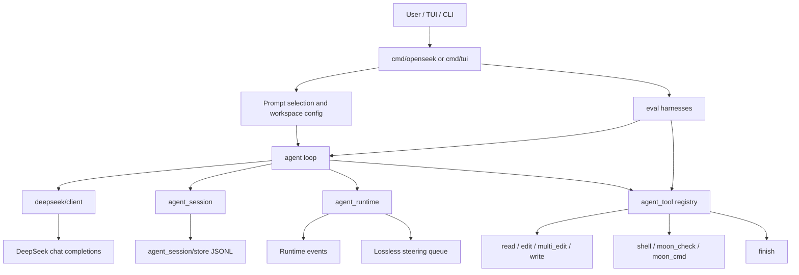
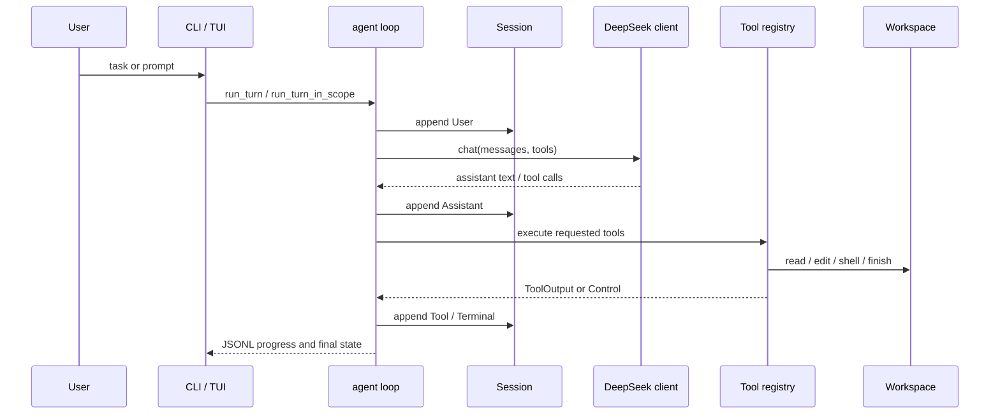

# OpenSeek 项目架构总览

## 问题

`moonbitlang/openseek` 到底是一个单点 CLI、一个 DeepSeek wrapper，还是一套 coding agent 基础设施？如果把它作为长期工程样本保存，应该保存什么层面的理解？

## 简答

OpenSeek 更像一个用 MoonBit dogfood 出来的 coding agent stack。它不是成熟到可以直接替代 Codex / Claude Code 的产品，但它把模型协议、agent loop、会话事件、运行时队列、工具协议、CLI/TUI 和 eval harness 拆得比较清楚。长期价值不在“DeepSeek 接得怎么样”，而在“一个 agent runtime 如何把副作用、会话、工具、UI 和评测做成可测试边界”。

## 系统架构图

这个分层说明 OpenSeek 的工程重心不是“一个命令跑起来”，而是把 agent 的过程拆成多条可以单独测试和替换的边界：模型协议、会话记录、工具执行、运行时状态和前端控制。

## 核心执行链路

OpenSeek 的关键是每个阶段都落入 session event，而不是只在内存里推进。这样做的结果是：TUI、session replay、compaction、eval 和后续分析都能从同一条事件流恢复事实。

## 分层职责

- `deepseek`：纯协议层，负责模型名、thinking mode、role、message、tool definition、tool call、usage 和 response decode。它不碰网络。
- `deepseek/client`： effectful transport 层，负责 HTTP、SSE streaming、retry、错误处理和 usage 聚合。
- `agent_session`： durable conversation model，存 User / Assistant / Tool / Runtime / Summary / Terminal。
- `agent_runtime`： loop-scoped runtime state，区分有损 runtime event 和无损 steering input。
- `agent_tool`：工具协议层，定义 `ToolOutput`、`ToolAction`、`AgentControl`、`Tools` registry 和 dispatch。
- `agent`：主循环，组合 model、session、runtime 和 tools。
- `cmd/openseek`：CLI、session 管理、serve mode、review mode、best-of-N 并发入口。
- `cmd/tui`：终端 UI，负责展示 transcript，并通过 JSONL 控制 serve engine。
- `eval/*`：把工具烟测、文件编辑质量、prompt task 和 CLI contract 逐步变成可重复验证对象。

## 综合结论

- OpenSeek 的架构不是“聊天壳子”，而是围绕可重放事件流组织 agent。它把每个用户输入、模型输出、工具结果、运行时更新和终止状态都变成 typed event。
- 它明显偏 MoonBit 自举场景。`moon_check`、`moon_cmd`、MoonBit manifest guard、MoonBit eval tasks 都说明项目当前主要服务 MoonBit coding agent，而不是泛语言 IDE agent。
- 它的产品成熟度还不高。仓库里有大量 eval、roadmap 和 guardrail 迭代痕迹，说明系统仍在快速打磨行为可靠性。
- 它有清楚的边界意识：纯协议和 effectful transport 分开，session model 和 TUI transcript 分开，tool result 和 loop control 分开，runtime event 和 steering input 分开。
- 它更适合作为“agent runtime 设计样本”学习，而不是作为即拿即用的工具依赖。

## 证据矩阵

| 结论 | 证据来源 | 证据位置 | 置信度 / 限制 |
| --- | --- | --- | --- |
| OpenSeek 是多层 agent stack | 仓库 README | `README.md` package table | 高；目录和 README 一致 |
| 模型协议和 HTTP transport 分离 | deepseek docs | `deepseek/README.mbt.md`、`deepseek/client/README.mbt.md` | 高；职责边界清楚 |
| 会话是 append-only event model | session 源码 | `agent_session/types.mbt`、`agent_session/projection.mbt` | 高；源码直接体现 |
| Runtime 区分 event 和 steering | runtime 源码 | `agent_runtime/runtime.mbt` | 高；queue 类型和注释明确 |
| 工具执行通过 typed registry | tool 源码 | `agent_tool/agent_tool.mbt` | 高；dispatch 和 ToolAction 明确 |
| CLI/TUI 是不同控制面 | CLI/TUI docs and code | `cmd/openseek/README.md`、`cmd/tui/README.md`、`cmd/openseek/serve.mbt` | 高；serve JSONL 协议清楚 |
| 本次没有本地跑 upstream 测试 | 本地环境限制 | `moon` CLI 不可用 | 中；源码阅读可靠，但运行验证缺失 |

## 当前张力 / 风险 / 未决问题

- **MoonBit 绑定较深**：这让项目能围绕 `moon` 工具链做深优化，但也限制了泛语言 agent 的直接复用价值。
- **会话事件很完整，但信息量会膨胀**：项目已有 compaction，但 summary 质量依赖模型，未来仍需要更强的上下文治理。
- **runtime event 是有损队列**：这对 watcher 进度合理，但如果未来工具把关键事实误放进 runtime event，就可能丢信号。
- **工具协议清楚，但行为可靠性仍要靠 eval 推进**：roadmap 已经指出 CLI contract、stdout/stderr、native binary 行为是主要短板。
- **产品层仍在成形**：TUI、serve、review、best-of-N、eval 都在，但它们更像实验性控制面集合，还不是一个统一产品体验。

## 相关页面

- [[OpenSeek 会话与运行时模型]]
- [[OpenSeek 工具协议与评测体系]]
- [[Coding Agent Shell 与 Git 权限边界]]
- [[Code Agent]]
- [[Agent-native 生成型 CLI 的产物协议]]

## 来源指针

- `raw/sources/2026-07-01-openseek-project-architecture-review.md`
- `raw/sources/2026-07-01-openseek-shell-git-policy.md`
- `https://github.com/moonbitlang/openseek`
