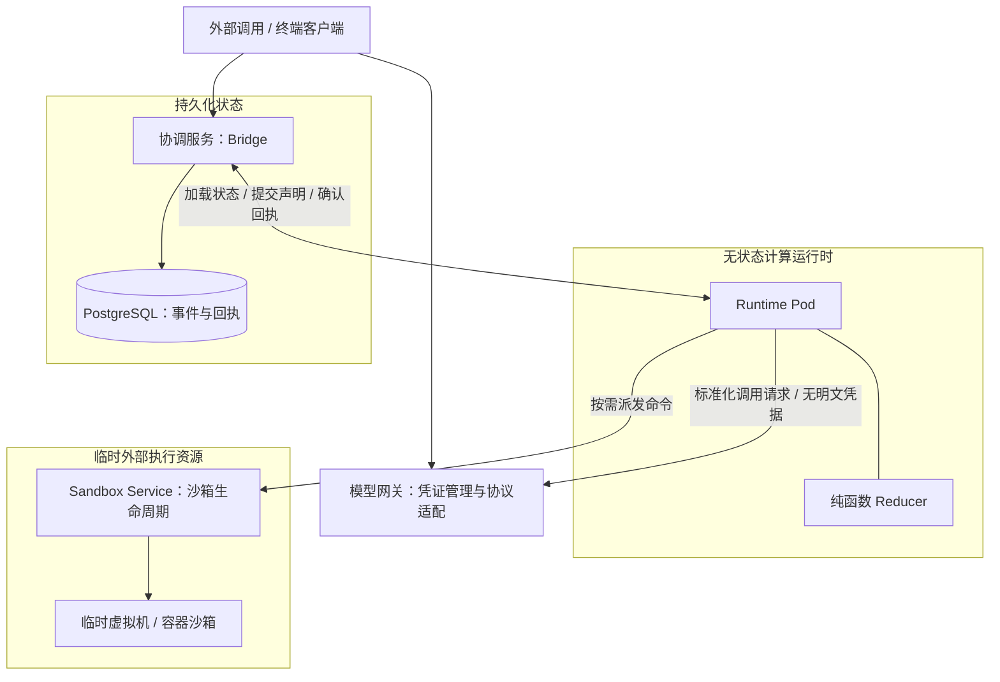

# Agent Harness 运行时架构与演进

## 问题与简答

Agent Harness 是连接基础模型与外部运行环境的软件层（包含 Prompt 拼装、工具调用、Agent Loop 与协议转换，基础定义见 [[wiki/topics/ai/agent-harness|Agent Harness]]）。

当 Agent 从单机命令行辅助工具走向长任务、多任务协同与云端托管服务时，“模型发请求、框架调工具、结果全塞回上下文”的单体循环遇到了哪些具体的工程限制？主流框架（Claude Code、OpenAI、Pi、Tetral）是如何演进架构来解决这些限制的？

**核心结论**：
1. **上下文容量受限**：不能把海量中间数据逐轮塞回上下文。演进为让模型编写脚本在代码沙箱中批量处理与并发查询，只向模型返回最终汇总结果。
2. **长任务崩溃与外部副作用不确定**：本地恢复与外部调用必须分层。库内通过检查点与单进程独占事务原子落盘；库外通过写前记录调用声明，并依赖业务端接口的幂等 Key 防重。
3. **云端沙箱常驻开销与隔离风险**：沙箱不能作为 Agent 运行时的宿主。演进为计算运行时保持无状态 Pod，沙箱降级为按需激活的外部工具，明文凭证留在外层网关。

---

## 限制一：上下文容量与逐轮往返限制

### 1. 传统单步往返的问题

传统模式下，框架将可用工具暴露给模型；模型每发起一次工具调用，框架就把完整的返回内容（例如几万行的日志、大批检索结果或复杂的 JSON 结构）全部追加进对话上下文。

这种方式在处理多数据源任务时遇到两个明显瓶颈：
- **Token 消耗与延迟过高**：每次处理数据都需要完整的模型推理与网络往返，中间临时数据大量挤占上下文窗口。
- **缺乏控制结构**：模型无法在单轮内表达循环、批量过滤或并发请求，必须逐项调用工具。

### 2. 解法：代码沙箱与程序化工具调用

现代系统（如 Pi Codemode 与 OpenAI Programmatic Tool Calling，参见 [[wiki/topics/ai/openai-programmatic-tool-calling|OpenAI Programmatic Tool Calling]]）让模型编写一段轻量脚本（JavaScript 或 Python），交给内置沙箱运行。

脚本在沙箱内部并发调用多个工具，完成循环、数据过滤与统计，仅将最终需要决策的简短结果返回给模型上下文。例如需要检查 100 个 issue 时，沙箱批量拉取并统计后，仅向上下文输入一行汇总结论，大幅降低上下文开销。

### 3. 沙箱环境的安全隔离

执行模型生成脚本的沙箱与底层操作系统环境有明确的分工：
- **轻量受控沙箱**：通常采用独立的 JavaScript 引擎（如 V8 Isolate 或 QuickJS/WASM）。该环境能调用注册的内部工具接口，但不提供宿主机网络、通用文件系统或子进程权限，防止不可信代码破坏系统。
- **高影响动作的确认边界**：数据读取、过滤和聚合适合交给沙箱脚本自动完成；而文件写入、Git 提交、权限变更、资金操作等最终修改动作，仍必须由模型显式发起单独的工具调用，保留人工确认与审计记录。

---

## 限制二：长任务崩溃与外部副作用不确定性

### 1. 崩溃恢复的难点

当任务跨越数小时且包含几十次工具调用时，运行进程随时可能因系统重启、内存超限或机器故障而中断。

恢复长任务时面临两类不同性质的可靠性问题：
- **库内状态**：对话历史、当前任务进度、模型生成参数必须能够从磁盘完整重建。
- **外部副作用**：发邮件、调第三方 API、转账或创建云资源等物理操作，外部系统无法被 Harness 自动回滚。

### 2. 库内状态的解法：检查点与原子提交

以 [[wiki/topics/ai/pi-durable|Pi Durable]] 为例，系统将运行状态拆解为两部分：面向用户的对话记录（Entry）与面向恢复的状态机检查点（Task）。

- **单进程事务**：Session 的提交队列保证状态写入严格串行化，利用本地数据库（如 SQLite）的事务机制将 Entry 追加、Task 状态推进与文档更新原子提交。
- **独占所有权约束**：存储后端必须由单个进程独占，包内部不提供跨节点分布式锁；若多个实例同时挂载同一存储，必须依赖外部宿主完成进程切换与交接。

### 3. 外部副作用的边界：写前声明与业务幂等 Key

Harness 自身的检查点机制只能保证本地存储一致，不能让外部网络系统自动具备事务特性。

如果工具调用已经发出、外部系统已处理，但返回结果尚未落盘时进程崩溃，重启后本地只有“已准备调用”记录：
- **安全工具重跑**：仅当工具明确声明为无副作用（safe）且当前策略允许时，调度器才会在恢复时重新执行。
- **写操作的防重依赖业务接口**：涉及外部写操作的工具，必须由调用方提供稳定的幂等 Key（如请求唯一 ID）或提供可查询回执接口。任务恢复时重发请求，依赖业务端服务根据 Key 去重，避免重复执行造成多次收费或数据损坏。

---

## 限制三：云端沙箱常驻的资源开销与凭证隔离

### 1. 沙箱与运行时绑定的瓶颈

在单机开发场景中，Agent 安装在开发者本人的机器或虚拟机内，沙箱既是代码执行环境，也是 Agent 进程本身的宿主。

当 Agent 走向多租户云端服务时，继续把完整 Agent 循环放进虚拟机沙箱（如早期系统在 E2B 或常驻 VM 中运行）会遇到严重的工程瓶颈：
- **调度与扩缩容压力**：虚拟机冷启动需要数秒，空闲时仍持续计费；每个并发任务都独占完整沙箱，编排成本极高。
- **凭证泄露风险**：模型 API Key 和第三方 OAuth Token 必须注入沙箱才能让 Agent 调模型，导致凭证暴露在可执行任意代码的环境中。
- **排障困难**：调试 Agent 必须登录保存有用户私有代码和文件的沙箱，侵犯数据隐私。

### 2. 解耦架构：运行时无状态化与按需沙箱

以 [[wiki/topics/ai/tetral|Tetral]] 为代表的现代云端架构，将 Agent 运行时从沙箱虚拟机中彻底剥离：

核心设计原则：**沙箱应当是 Agent 调用的外部工具，而不是 Agent 运行时的常驻宿主。**

- **无状态计算运行时（Runtime Pod）**：Agent 循环作为轻量计算 Pod 运行，内部运行纯函数 Reducer 仅基于提交的事件计算下一个状态转移。Pod 不存持久文件，随时可销毁或换机。
- **预写执行声明（Write-Ahead Execution）**：向外部沙箱派发任何命令前，协调服务（Bridge）必须先在 PostgreSQL 中登记调用声明并拿到持久化回执。沙箱 Worker 异步执行命令并将结果入库后，Reducer 才能依赖该结果推进下一步。
- **沙箱按需激活**：任务平时不占用虚拟机资源。仅当模型产出 Bash 或代码执行指令时，Sandbox Service 才异步激活虚拟机；并发请求可共享同一次环境激活。
- **凭证网关隔离**：明文 API Key 留在外层模型网关（Gateway），向计算 Pod 仅提供短效访问凭据，明文凭证绝不流入沙箱。

---

## 辅助工具的精简与任务协作演进

除上述底层系统机制外，Harness 在任务层面的交互机制也经历了重要简化：

1. **单兵辅助工具的退役**：
   - 早期为了防止模型在长任务中迷失方向，框架通常强制模型在每一步执行前后调用任务记录工具（如强制更新 `TodoWrite`）。
   - 随着模型长上下文理解与自主规划能力的增强，这种强制每步打卡的做法增加了额外的输入输出开销和提示词干扰。Claude Code 等工具随后移除了个人备忘工具，改由模型在上下文中自主规划。
2. **转向团队协作任务看板**：
   - 框架不再替单个模型微观管理每一步动作，转而提供支持多 Agent 依赖关系与状态看板的任务系统（如 Claude Code `Tasks`）。
   - 协作状态的载体也形成分工：本地 CLI 偏好通过本地文件系统或任务状态文件作为协作媒介，简单透明；全托管云端系统则偏好集中托管的会话服务。

---

## 综合设计原则

1. **中间数据在执行环境内消化，最终事实回填上下文**：批量检索和中间计算交给受控沙箱脚本完成，避免将大量无用原始数据注入模型上下文。
2. **区分内部检查点与外部业务幂等**：Harness 的崩溃恢复只能保障本地状态库的一致性；对于产生外部影响的写操作，必须显式结合业务端提供的唯一幂等 Key 或查询机制。
3. **计算运行时保持无状态，沙箱作为按需调度的工具**：在云端构建服务时，将长程状态与计算逻辑抽离出虚拟机，降低常驻成本并阻断凭据泄露通道。
4. **辅助机制随模型能力提升及时精简**：避免用静态框架逻辑过度约束新模型的推理能力，框架只提供底层执行与状态通道，把微观规划留给模型。

---

## 相关页面

- [[wiki/topics/ai/agent-harness|Agent Harness]]
- [[wiki/topics/ai/tetral|Tetral]]
- [[wiki/topics/ai/pi-durable|Pi Durable]]
- [[wiki/syntheses/ai/agent-harness-evolution-paradigm|Agent Harness 演进范式]]
- [[wiki/topics/ai/openai-programmatic-tool-calling|OpenAI Programmatic Tool Calling]]
- [[wiki/topics/ai/mcp|MCP]]
- [[wiki/syntheses/ai/agent-team-roles-and-collaboration|Agent 团队的角色分工与协作模式]]
- [[wiki/syntheses/ai/agent-loop-control-boundaries|Agent 循环工作流的控制边界]]
