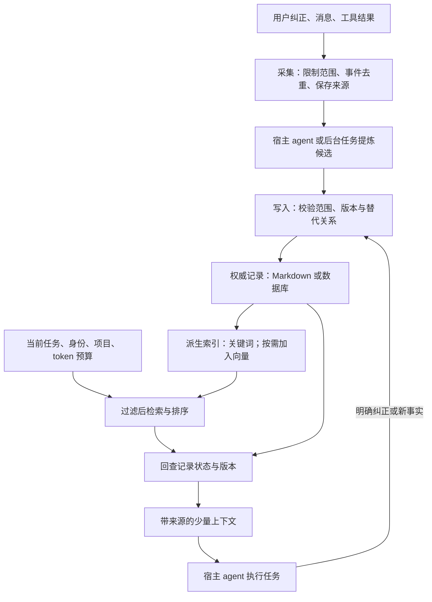

# 如何实现 Agent Memory

## 问题与综合结论

怎样让一个用户在多个 coding agent 中保留项目事实，并能追溯、纠正和撤回？先建立有来源和适用范围的权威记录，再实现有预算的召回、版本检查与完整验收；向量检索和自动提炼按实际缺口逐步加入。

本文综合 gbrain、memU、agentmemory 的固定源码快照及 Letta MemFS 文档，资料日期为 2026-10-07。各项机制的证据见文中链接与 raw 记录；下面的字段、接口和组合方式是设计建议，未实现或运行这套建议系统。产品取舍见 [[wiki/comparisons/ai/agent-memory-approaches|Agent 记忆方案对比]]。

## 1. 先确定保存的对象

将输入分成三类：会话事件记录“发生过什么”；长期事实记录“以后仍应遵守什么”；可复用步骤记录“遇到同类任务怎样做”。当前任务做到哪一步可以作为会话交接，但不要自动提升为永久规则。agentmemory 的 observation/Memory 分离、memU 的 memory/skill 分轨和 gbrain 的记忆边界分别提供了这些设计依据。[数据类型][a-types]、[memU 模型][m-models]、[记忆边界][g-boundary]

第一版可从明确的“记住这个”与用户纠正开始，等写入、纠错和召回可验证后再自动读取会话。自动提炼时先生成候选，附原始消息或工具结果位置，由宿主 agent 或后台任务决定是否写入；同一事件只处理一次。这样能复用 memU 的 prepare/commit 分离和 agentmemory 的事件去重方法。[prepare/commit][m-pipeline]、[事件采集][a-capture]

## 2. 选一份权威记录，索引从它派生

若重点是人工编辑与 Git 审阅，可以选 Markdown；若重点是多个 agent 并发写入、条件更新与过滤，可以选 SQLite 起步。无论选哪种，都要明确索引损坏后从哪里重建，以及哪些历史与撤回状态必须另外备份。文件与数据库同时参与时，不能只写“以文件为准”就省略恢复规则。[gbrain 存储说明][g-record]、[Letta MemFS](https://docs.letta.com/concepts/memfs)

这个图增加了“返回前回查记录”一步：即使索引更新滞后，也不返回已经撤回或被替代的版本。它是针对异步索引的设计建议，依据是 gbrain 撤回时同时处理事实与派生内容的做法，见 [[raw/sources/gbrain#撤回为何需要修改多个对象|gbrain 撤回链路]]。

## 3. 让每条记忆可定位、可纠正

最小记录可以包含：

| 字段组 | 用途 |
| --- | --- |
| `id`、`revision` | 稳定身份与条件更新，防止旧会话覆盖新版本 |
| `scope` | 用户、项目以及可见范围；由调用方认证结果约束 |
| `kind`、`content` | 区分偏好、项目事实、操作步骤与正文 |
| `source_refs`、`observed_at` | 找到原始依据及记录时间 |
| `status`、`supersedes` | 标明生效、被替代或撤回，以及替代了哪条记录 |
| `valid_until` | 只有确有有效期的信息才填写，不能假设所有事实永久有效 |

例如“项目 A 改用 pnpm”应带项目范围与用户纠正来源，并替代 A 中旧的 npm 记录；不能把项目 B 的 npm 约定一起失效。不同项目适用不同规则不属于冲突。版本、来源和替代关系可参考 agentmemory 的 `Memory`，范围和撤回则参考 gbrain。[Memory 定义][a-types]、[记忆边界][g-boundary]

## 4. 把写入、修订和撤回做成明确操作

建议先提供 `remember`、`recall`、`revise`、`forget` 四个操作。写入返回记录 ID 和版本；修订带预期版本，过期时先重新读取；重试带事件 ID 或请求 ID；撤回返回活动记忆已失效的结果。SQLite 方案中把记录更新与待索引任务放进同一事务，再异步生成向量，失败可以重试而不会丢掉正文。

这是对 gbrain 的持久请求与修订检查、agentmemory 的 capture inbox 的简化应用。不要为了“用向量”让记住一句明确事实必须等待外部 embedding 成功；memU 当前先 embedding 再写入的做法则适合接受这种可用性取舍的系统。[gbrain 写入边界][g-record]、[capture inbox][a-capture]、[memU 提交][m-agentic]

“忘记”还要区分停止召回与物理清除。前者让记录失效并更新索引；后者需要说明原始日志、Git 历史、远端和备份的处理范围，不能用删掉一个索引条目代替。[gbrain 边界][g-boundary]

## 5. 检索先解决范围和预算

先按身份与项目限制候选，再做关键词检索；确有同义表达漏召回时加入向量检索。合并结果后去重，去掉失效或被替代的记录，优先保留与任务相关且来源明确的内容，按 token 预算截取。结果返回记录 ID、版本、时间、正文和来源，agent 可以继续读取完整证据。[gbrain 检索][g-search]、[agentmemory 检索][a-search]

会话启动只加载少量稳定规则和最近交接；具体问题再按需检索。Letta 的常驻文件与目录索引、agentmemory 的 `mem::context` 预算组装提供了两种可借鉴的实现。不要把 top-k 当作上下文预算：五篇长文也可能挤占当前任务。[MemFS](https://docs.letta.com/concepts/memfs)、[context.ts][a-context]

## 6. 后台维护与前台工作分开

前台记住用户明确纠正的事实；后台再整理重复内容、提炼技能、处理过期记录和更新索引。后台写入也要检查版本，不能覆盖前台刚接受的纠正。文件方案可以用 Letta 的独立 worktree；数据库方案可以用待处理任务和修订号。[Letta dreaming](https://docs.letta.com/configuration/memory)、[gbrain 写入边界][g-record]

外部网页或工具输出中的指令只作为待分析内容，不应因为被保存为“记忆”就获得改变权限或工具配置的能力；自动写入范围与业务操作权限分别控制。[gbrain 记忆边界][g-boundary]

## 7. 用完整闭环验收

| 场景 | 要观察的结果 |
| --- | --- |
| 保存后开启全新会话 | 目标宿主能主动取到记录，带正确来源 |
| 用户纠正 npm 为 pnpm | 后续回答采用新值；旧记录可追溯但不再作为有效约定 |
| 同一个事件重试两次 | 不产生两条重复记忆 |
| 查询另一个项目 | 不把原项目私有事实注入上下文 |
| 撤回后重建索引 | 已撤回内容不会因旧来源重导入而恢复生效 |
| provider 不可用或后台中断 | 能说明哪些写入已持久保存、哪些任务尚未完成 |
| 导出后在隔离目录恢复 | 恢复正文、来源、修订与撤回状态，而不只是搜索结果 |

把召回证据是否齐全与最终回答是否正确分开测量，另记录无关记忆比例、上下文 token、延迟与调用成本。先做几十条贴近实际工作的案例，再决定是否需要图关系、自动技能提炼或复杂重排；agentmemory 的检索评测也说明单个 recall 数字不能覆盖完整闭环。[评测方法][a-eval]

对当前文件优先 Wiki，可以先保留正文、frontmatter、来源指针和 PR，补按需检索与来源回查；已有结构已经覆盖内容维护，不必同时接入四套记忆系统。相关设计目标见 [[wiki/syntheses/ai/auditable-local-agent-memory-architecture|可审计的本地 Agent 记忆架构]]。

## 数据边界：本地保存之后，内容还会去哪里

这是对四种方案共同数据路径的归纳，并非每种产品都启用所有箭头。gbrain 的[记忆边界][g-boundary]明确区分本地存储、云 provider 与宿主模型；memU 的 service 与 agentmemory 的 provider 配置也支持这个区分。

具体需要区分三件事：

1. **记录有来源，不等于事实正确。** 模型可能误读来源；召回时仍要核对时间、修订和适用项目。
2. **逻辑分类，不等于访问隔离。** gbrain 的 source 不能隔离共享本地文件或数据库凭据的调用者；memU 的 scope 过滤也不能替代服务认证。[gbrain 边界][g-boundary]、[memU service][m-service]
3. **撤回召回，不等于彻底删除。** 原始日志、Git 历史、远程副本和备份是独立对象；这是由各自存储方式推得的治理要求，不声称它们已经统一实现擦除。

## 设计建议与证据

| 设计建议 | 实现依据 | 限制 |
| --- | --- | --- |
| 提炼与持久提交分开，成功后再推进处理状态 | memU `prepare/commit`；[源码][m-pipeline] | 可借鉴顺序，不能据此推断整批写入具有原子性 |
| 事件去重、持久请求和修订检查分别处理 | agentmemory [capture][a-capture] 与 gbrain [存储说明][g-record] | 是跨系统综合建议，未验证统一实现 |
| 撤回同时影响正文状态与派生索引 | [[raw/sources/gbrain#撤回为何需要修改多个对象\|gbrain 撤回实现]] | 停止活动召回与物理擦除是不同结果 |
| 常驻少量规则，其他内容按需读取并限制预算 | [Letta MemFS](https://docs.letta.com/concepts/memfs)、[agentmemory context][a-context] | 实际召回质量与 token 用量需在目标宿主测量 |

## 来源与相关页面

- [[raw/sources/gbrain]]
- [[raw/sources/memu]]
- [[raw/sources/agentmemory]]
- [[raw/sources/letta-context-repositories]]
- [[wiki/comparisons/ai/agent-memory-approaches|Agent 记忆方案对比]]
- [[wiki/syntheses/ai/auditable-local-agent-memory-architecture|可审计的本地 Agent 记忆架构]]
- [[wiki/syntheses/ai/agent-proactive-context-management|Agent 主动上下文管理]]

[g-search]: https://github.com/garrytan/gbrain/blob/5b5891069413b28b2fe3a50675116d67d5a1e145/src/core/search/hybrid.ts
[g-record]: https://github.com/garrytan/gbrain/blob/5b5891069413b28b2fe3a50675116d67d5a1e145/docs/architecture/system-of-record.md
[g-boundary]: https://github.com/garrytan/gbrain/blob/5b5891069413b28b2fe3a50675116d67d5a1e145/docs/guides/memory-boundaries.md
[m-service]: https://github.com/NevaMind-AI/memU/blob/2c050bc9681a4c0aff1af211a000e73d14f33356/src/memu/app/service.py
[m-agentic]: https://github.com/NevaMind-AI/memU/blob/2c050bc9681a4c0aff1af211a000e73d14f33356/src/memu/app/agentic.py
[m-models]: https://github.com/NevaMind-AI/memU/blob/2c050bc9681a4c0aff1af211a000e73d14f33356/src/memu/database/models.py
[m-pipeline]: https://github.com/NevaMind-AI/memU/blob/2c050bc9681a4c0aff1af211a000e73d14f33356/src/memu/hosts/bridging/pipeline.py
[a-capture]: https://github.com/rohitg00/agentmemory/blob/007a1a7fe8646a03d8652eb0712400cc6f0fcca3/src/functions/capture.ts
[a-types]: https://github.com/rohitg00/agentmemory/blob/007a1a7fe8646a03d8652eb0712400cc6f0fcca3/src/types.ts
[a-search]: https://github.com/rohitg00/agentmemory/blob/007a1a7fe8646a03d8652eb0712400cc6f0fcca3/src/functions/search.ts
[a-context]: https://github.com/rohitg00/agentmemory/blob/007a1a7fe8646a03d8652eb0712400cc6f0fcca3/src/functions/context.ts
[a-eval]: https://github.com/rohitg00/agentmemory/blob/007a1a7fe8646a03d8652eb0712400cc6f0fcca3/benchmark/LONGMEMEVAL.md
