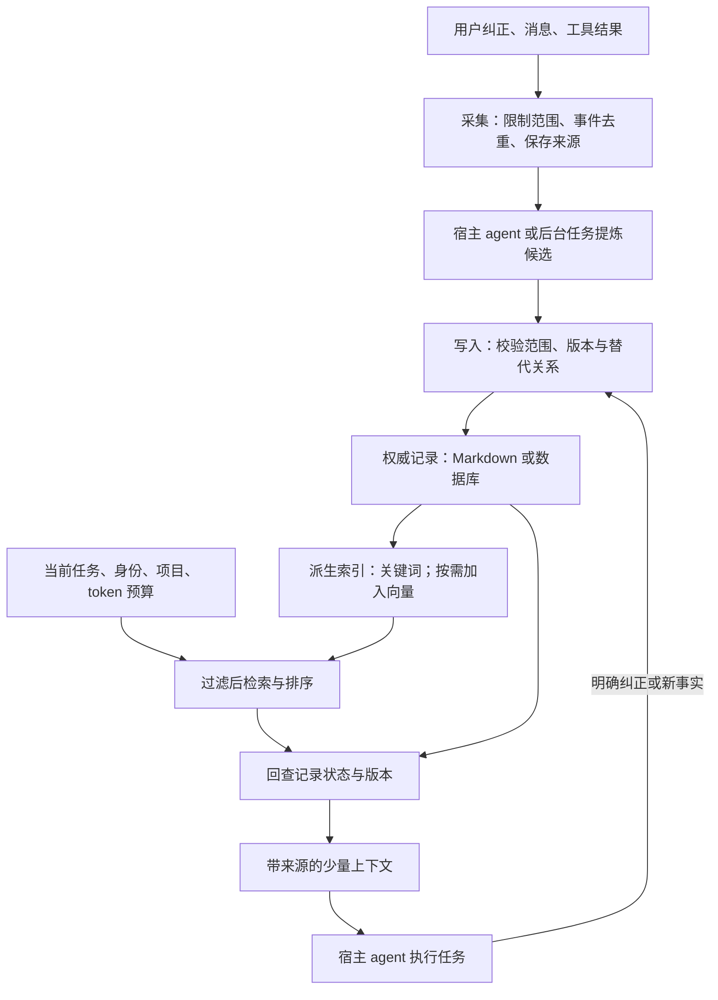
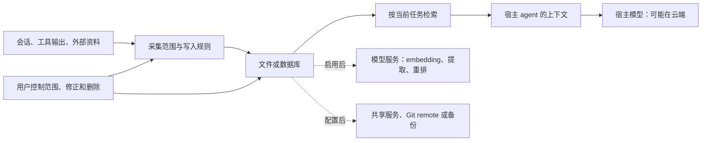

# 如何实现 Agent Memory

## 问题与综合结论

Agent Memory 的核心是让事实可追溯、可纠正，并在需要时取回。实现时先抓住三步：

1. **分开保存事实与索引。** 明确以哪份事实记录为准，保留来源和适用范围。
2. **让索引可以重建。** 关键词和向量索引都从事实记录生成，损坏后能重新生成。
3. **按 token 预算召回。** 返回内容不得超过给定预算，并在返回前核对记录是否仍然有效。

在此基础上，再实现修订、撤回和自动提炼等维护操作。

本文综合 gbrain、memU、agentmemory 的固定源码快照及 Letta MemFS 文档，资料日期为 2026-10-07。机制依据见文中链接与 raw 记录。下面的字段、接口和组合方式是设计建议，尚未实现或运行验证。产品取舍见 [[wiki/comparisons/ai/agent-memory-approaches|Agent 记忆方案对比]]。

## 1. 先确定保存的对象

将输入分成三类：

- **会话事件**：记录发生过什么，以及当前任务做到哪一步。
- **长期事实**：记录以后仍然适用的项目约定、决定和用户偏好。
- **可复用步骤**：记录遇到同类任务时怎样做。

任务进度可以用于交接，但不应自动变成永久规则。agentmemory 将过程记录与长期记忆分开，memU 将 memory 和 skill 按类别管理，gbrain 则区分长期知识与临时运行状态。[数据类型][a-types]、[memU 模型][m-models]、[记忆边界][g-boundary]

第一版可从明确的“记住这个”和用户纠正开始。验证写入、纠错和召回后，再加入自动会话提炼：

1. 从新会话中提出候选记忆，并附原始消息或工具结果的位置。
2. 由宿主 agent 或后台任务判断是否值得保存。
3. 写入时按事件身份去重，避免重试产生重复记忆。

这分别借鉴了 memU 的 prepare/commit 分离和 agentmemory 的事件去重方法。[prepare/commit][m-pipeline]、[事件采集][a-capture]

## 2. 选一份权威记录，索引从它派生

先明确以哪份数据为准，再选择存储形式：

- 重点是人工编辑与 Git 审阅，可以选 Markdown。
- 重点是多个 agent 写入、条件更新与过滤，可以从 SQLite 起步。

无论选哪种，都要说明索引损坏后从哪里重建，以及哪些历史与撤回状态需要另外备份。文件与数据库同时参与时，还要明确两者不一致后的恢复办法。[gbrain 存储说明][g-record]、[Letta MemFS](https://docs.letta.com/concepts/memfs)

这个图增加了“返回前回查记录”一步：即使索引更新滞后，也不返回已经撤回或被替代的版本。它是针对异步索引的设计建议，依据是 gbrain 撤回时同时处理事实与派生内容的做法，见 [[raw/sources/gbrain#撤回为何需要修改多个对象|gbrain 撤回链路]]。

## 3. 让每条记忆可定位、可纠正

最小记录可以包含：

| 字段组 | 用途 |
| --- | --- |
| `id`、`revision` | 稳定身份与条件更新，防止旧会话覆盖新版本 |
| `scope` | 用户、项目以及可见范围；由调用方认证结果约束 |
| `kind`、`content` | 区分偏好、项目事实、操作步骤与正文 |
| `source_refs`、`observed_at` | 找到原始依据及记录时间 |
| `status`、`supersedes` | 标明生效、被替代或撤回，以及替代了哪条记录 |
| `valid_until` | 只有确有有效期的信息才填写，不能假设所有事实永久有效 |

例如，用户说“项目 A 改用 pnpm”时：

1. 记录适用范围是项目 A，并保存这次纠正的来源。
2. 用新记录替代 A 中旧的 npm 约定。
3. 保留项目 B 的 npm 约定，不把不同项目的规则当成冲突。

版本、来源和替代关系可参考 agentmemory 的 `Memory`，范围和撤回则参考 gbrain。[Memory 定义][a-types]、[记忆边界][g-boundary]

## 4. 把写入、修订和撤回做成明确操作

建议先提供四个操作：

- `remember`：保存记忆，返回记录 ID 和版本。重试沿用事件 ID 或请求 ID，避免重复写入。
- `recall`：按当前任务和适用范围检索，返回正文与来源。
- `revise`：携带预期版本修改记录。版本已变化时，先重新读取。
- `forget`：让记录失效，并返回撤回结果，使它不再参与后续检索。

SQLite 方案可以按以下顺序保存记忆：

1. 在同一事务中写入记录和待索引任务。
2. 事务成功后，异步生成向量。
3. 向量生成失败时重试待处理任务，保留已保存的正文。

这是对 gbrain 的持久请求与修订检查、agentmemory 的 capture inbox 的简化应用。先保存正文，可以让明确的事实写入不受 embedding 服务故障影响。memU 当前采用先 embedding 再写入的顺序，选择这种方式就需要接受模型服务失败时无法完成写入的限制。[gbrain 写入边界][g-record]、[capture inbox][a-capture]、[memU 提交][m-agentic]

“忘记”需要区分两种结果：

- **停止召回**：让记录失效并更新索引。
- **物理清除**：说明原始日志、Git 历史、远端和备份分别怎样处理。只删除索引条目不能代表这些副本已经清除。

两者的区别见 [gbrain 记忆边界][g-boundary]。

## 5. 检索先解决范围和预算

检索可以按以下顺序实现：

1. 按身份与项目限制候选范围。
2. 先做关键词检索。确有同义表达漏召回时，再加入向量检索。
3. 合并结果并去重，排除失效或被替代的记录。
4. 优先保留与任务相关、来源明确的内容，按 token 预算截取。
5. 返回记录 ID、版本、时间、正文和来源，让 agent 能继续读取完整证据。

相关实现见 [gbrain 检索][g-search]、[agentmemory 检索][a-search]。

会话启动时只加载少量稳定规则和最近交接，遇到具体问题再按需检索。Letta 的常驻文件与目录索引、agentmemory 的 `mem::context` 预算组装提供了两种可借鉴的实现。[MemFS](https://docs.letta.com/concepts/memfs)、[context.ts][a-context]

不要把 top-k 当作上下文预算：五篇长文也可能挤占当前任务。

## 6. 后台维护与前台工作分开

按是否影响当前交互分配工作：

- **前台**：及时保存用户明确纠正的事实。
- **后台**：整理重复内容、提炼技能、处理过期记录和更新索引。

后台写入也要检查版本，避免覆盖前台刚接受的纠正。文件方案可以参考 Letta 的独立 worktree，数据库方案可以使用待处理任务和修订号。[Letta dreaming](https://docs.letta.com/configuration/memory)、[gbrain 写入边界][g-record]

外部网页或工具输出中的指令只作为待分析内容。系统不应因为将它们保存为记忆，就允许其修改权限或工具配置。自动写入范围与业务操作权限应分别控制。[gbrain 记忆边界][g-boundary]

## 7. 用完整闭环验收

| 场景 | 要观察的结果 |
| --- | --- |
| 保存后开启全新会话 | 目标宿主能主动取到记录，带正确来源 |
| 用户纠正 npm 为 pnpm | 后续回答采用新值；旧记录可追溯但不再作为有效约定 |
| 同一个事件重试两次 | 不产生两条重复记忆 |
| 查询另一个项目 | 不把原项目私有事实注入上下文 |
| 撤回后重建索引 | 已撤回内容不会因旧来源重导入而恢复生效 |
| 模型服务不可用或后台中断 | 能说明哪些写入已持久保存、哪些任务尚未完成 |
| 导出后在隔离目录恢复 | 恢复正文、来源、修订与撤回状态，而不只是搜索结果 |

评测分别记录三类结果：

- 召回质量：需要的证据是否齐全，无关记忆占多少。
- 回答质量：最终回答是否正确，是否采用了最新事实。
- 使用成本：占用多少上下文 token，延迟和模型调用成本是多少。

先做几十条贴近实际工作的案例，再决定是否增加图关系、自动技能提炼或复杂重排。agentmemory 的评测也说明，单个 recall 数字不能代替整条流程的验证。[评测方法][a-eval]

对当前文件优先 Wiki，可以沿用正文、frontmatter、来源指针和 PR，先补充按需检索与来源回查。已有结构已经覆盖内容维护，不必同时接入四套记忆系统。相关设计目标见 [[wiki/syntheses/ai/auditable-local-agent-memory-architecture|可审计的本地 Agent 记忆架构]]。

## 数据边界：本地保存之后，内容还会去哪里

这是对四种方案共同数据路径的归纳，并非每种产品都启用所有箭头。图中的模型服务可以在本地运行，也可以由云厂商提供。gbrain 的[记忆边界][g-boundary]区分了本地存储、云模型服务与宿主模型，memU 和 agentmemory 的配置也体现了这些不同的数据去向。

具体需要区分三件事：

1. **记录有来源，不等于事实正确。** 模型可能误读来源，召回时仍要核对时间、修订和适用项目。
2. **逻辑分类，不等于访问隔离。** gbrain 用数据源标识（source）区分知识归属，但它无法隔离共享本地文件或数据库凭据的调用者。memU 的 scope 过滤也不能替代服务认证。[gbrain 边界][g-boundary]、[memU service][m-service]
3. **停止召回，不等于彻底删除。** 原始日志、Git 历史、远程副本和备份需要分别处理。这是根据存储方式提出的要求，不代表产品已经统一实现擦除。

## 设计建议与证据

| 设计建议 | 实现依据 | 限制 |
| --- | --- | --- |
| 提炼与持久提交分开，成功后再推进处理状态 | memU `prepare/commit`；[源码][m-pipeline] | 可借鉴顺序，不能据此推断整批写入具有原子性 |
| 事件去重、持久请求和修订检查分别处理 | agentmemory [capture][a-capture] 与 gbrain [存储说明][g-record] | 是跨系统综合建议，未验证统一实现 |
| 撤回同时影响正文状态与派生索引 | [[raw/sources/gbrain#撤回为何需要修改多个对象\|gbrain 撤回实现]] | 停止后续召回与物理擦除是不同结果 |
| 常驻少量规则，其他内容按需读取并限制预算 | [Letta MemFS](https://docs.letta.com/concepts/memfs)、[agentmemory context][a-context] | 实际召回质量与 token 用量需在目标宿主测量 |

## 来源与相关页面

- [[raw/sources/gbrain]]
- [[raw/sources/memu]]
- [[raw/sources/agentmemory]]
- [[raw/sources/letta-context-repositories]]
- [[wiki/comparisons/ai/agent-memory-approaches|Agent 记忆方案对比]]
- [[wiki/syntheses/ai/auditable-local-agent-memory-architecture|可审计的本地 Agent 记忆架构]]
- [[wiki/syntheses/ai/agent-proactive-context-management|Agent 主动上下文管理]]

[g-search]: https://github.com/garrytan/gbrain/blob/5b5891069413b28b2fe3a50675116d67d5a1e145/src/core/search/hybrid.ts
[g-record]: https://github.com/garrytan/gbrain/blob/5b5891069413b28b2fe3a50675116d67d5a1e145/docs/architecture/system-of-record.md
[g-boundary]: https://github.com/garrytan/gbrain/blob/5b5891069413b28b2fe3a50675116d67d5a1e145/docs/guides/memory-boundaries.md
[m-service]: https://github.com/NevaMind-AI/memU/blob/2c050bc9681a4c0aff1af211a000e73d14f33356/src/memu/app/service.py
[m-agentic]: https://github.com/NevaMind-AI/memU/blob/2c050bc9681a4c0aff1af211a000e73d14f33356/src/memu/app/agentic.py
[m-models]: https://github.com/NevaMind-AI/memU/blob/2c050bc9681a4c0aff1af211a000e73d14f33356/src/memu/database/models.py
[m-pipeline]: https://github.com/NevaMind-AI/memU/blob/2c050bc9681a4c0aff1af211a000e73d14f33356/src/memu/hosts/bridging/pipeline.py
[a-capture]: https://github.com/rohitg00/agentmemory/blob/007a1a7fe8646a03d8652eb0712400cc6f0fcca3/src/functions/capture.ts
[a-types]: https://github.com/rohitg00/agentmemory/blob/007a1a7fe8646a03d8652eb0712400cc6f0fcca3/src/types.ts
[a-search]: https://github.com/rohitg00/agentmemory/blob/007a1a7fe8646a03d8652eb0712400cc6f0fcca3/src/functions/search.ts
[a-context]: https://github.com/rohitg00/agentmemory/blob/007a1a7fe8646a03d8652eb0712400cc6f0fcca3/src/functions/context.ts
[a-eval]: https://github.com/rohitg00/agentmemory/blob/007a1a7fe8646a03d8652eb0712400cc6f0fcca3/benchmark/LONGMEMEVAL.md
