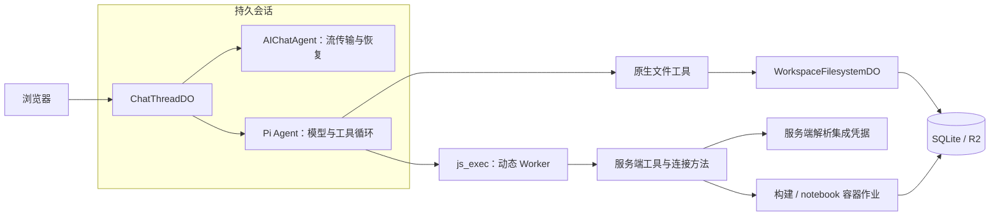
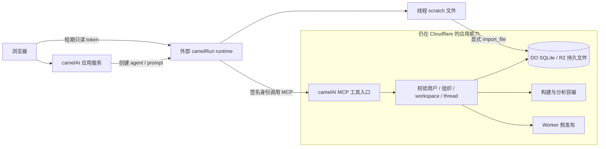
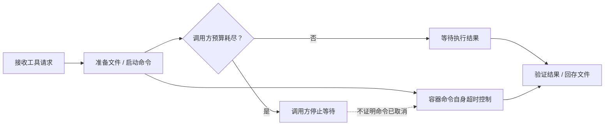

# camelAI 运行时演进：从 Durable Objects 到 camelRun

## 问题与简答

怎样让有持久文件、外部工具和发布能力的 Coding Agent 不必绑定一台常驻 VM？camelAI 的做法是分别安排 **Agent 循环、持久状态、受控工具和 Linux 作业**。这些职责可以独立迁移，不能用“有没有 VM”概括整个系统。

**时间范围很重要。** 7 月文章中的 Pi-in-Durable-Object 是历史方案。官网后续更新称已迁到 camelRun；10 月 2 日拉取的公开代码也已将聊天执行移出 `ChatThreadDO`，但仍保留 Cloudflare 文件存储、构建、分析和发布能力。[原文及更新](https://www.camelai.com/blog/our-coding-agent-runs-in-a-cloudflare-durable-object-not-a-vm)、[当前 ChatThreadDO](https://github.com/qaml-ai/camelAI/blob/07d9663ba4063bfa32573f0904b44718d966deac/workers/main/src/chat-thread-do.ts#L1-L16)。

## 阅读范围

| 对象 | 固定版本 | 能说明什么 |
| --- | --- | --- |
| 文章同期实现 | `7e9aa1b`，2026-07-28 | Pi、AIChatAgent、动态 Worker 与文件系统如何配合 |
| 当前公开源码 | `07d9663`，2026-10-02 获取 | 迁出聊天执行后，应用与外部 runtime 的职责 |
| 作者后续说明 | 2026-09-30 | 团队报告的迁移动机，不等于独立复现实验 |

两个提交都已克隆并读核心代码，未运行应用、模型或容器。X 原帖正文不可直接读取，以同作者官网文章补充；同期提交不是生产版本证明，当前仓库也不等于线上部署状态。[合并阅读记录](../../../raw/sources/2026-10-02-camelai.md)。

## 7 月方案：把循环、文件与 Linux 作业拆开

`ChatThreadDO` 继承 `AIChatAgent`，并通过 `createPiSession` 构造 Pi `Agent`。两者承担不同职责：Cloudflare 侧提供聊天流与恢复设施，Pi 侧运行模型和工具循环。同期依赖为 Pi `0.80.6`，不能将后来出现的 `pi-durable` 设计归入此实现。[继承与职责](https://github.com/qaml-ai/camelAI/blob/7e9aa1bc86cc33029d46109401ec989965e8c208/workers/main/src/chat-thread-do.ts#L574-L581)、[Pi 会话创建](https://github.com/qaml-ai/camelAI/blob/7e9aa1bc86cc33029d46109401ec989965e8c208/workers/main/src/chat-thread-do.ts#L5352-L5458)。

文件通过 `@cloudflare/shell` 的 Workspace 接入 SQLite 与 R2，应用配置的 inline threshold 为 **1,500,000 字节**。这让文件持久化与容器是否存活分开；阈值边界的具体分支属于外部库，本次未另行检验。[文件存储配置](https://github.com/qaml-ai/camelAI/blob/7e9aa1bc86cc33029d46109401ec989965e8c208/workers/main/src/workspace-filesystem-do.ts#L272-L300)。

`js_exec` 用 Worker Loader 加载生成代码，给它 TOOLS、SECURE_FETCH 等选定服务绑定。连接方法在服务端添加认证，原始集成密钥不直接注入该执行环境。但它仍有网络和业务操作能力；自定义连接还存在可配置的同源限制，不能把“看不到原始密钥”写成绝对安全保证。[动态 Worker](https://github.com/qaml-ai/camelAI/blob/7e9aa1bc86cc33029d46109401ec989965e8c208/workers/main/src/chat-thread-do.ts#L1071-L1174)、[连接认证](https://github.com/qaml-ai/camelAI/blob/7e9aa1bc86cc33029d46109401ec989965e8c208/workers/main/src/connections-runtime.ts#L1694-L1755)。

Linux 仍用于构建与 notebook。这里的“按需作业”不等于每次新建容器：构建按 org 复用，分析按 workspace/scope 保温复用；notebook 每次独立创建和清理工作目录。[构建实例选择](https://github.com/qaml-ai/camelAI/blob/7e9aa1bc86cc33029d46109401ec989965e8c208/workers/main/src/project-build-service.ts#L57-L72)、[分析实例复用](https://github.com/qaml-ai/camelAI/blob/7e9aa1bc86cc33029d46109401ec989965e8c208/workers/main/src/analysis-service.ts#L1065-L1084)。

## 后续变化：迁出循环，保留产品能力

当前 `ChatThreadDO` 是旧历史导出与迁移对象：旧 HTTP transport 返回 410，发送入口返回 moved。新的应用服务创建 runtime agent、发送 prompt，并给浏览器签发短期只读 token；新 transcript 由外部 runtime 管理。[旧入口](https://github.com/qaml-ai/camelAI/blob/07d9663ba4063bfa32573f0904b44718d966deac/workers/main/src/chat-thread-do.ts#L145-L190)、[runtime 客户端](https://github.com/qaml-ai/camelAI/blob/07d9663ba4063bfa32573f0904b44718d966deac/workers/main/src/agent-runtime/thread-runtime.ts#L221-L249)。

当前可借鉴的接口边界有三点：

1. **循环服务与业务授权分开。** MCP 入口校验 runtime 身份、tenant 和用户对线程的访问权限；删除应用等操作还走确认路径。不能仅靠给模型的提示词限制权限。[MCP 授权](https://github.com/qaml-ai/camelAI/blob/07d9663ba4063bfa32573f0904b44718d966deac/workers/main/src/routes/agent-mcp.ts#L76-L105)。
2. **同名文件目录也可能有不同寿命。** 当前调用约定中的 runtime `/workspace` 是线程 scratch；camelAI 持久 workspace 用业务工具访问，需显式导入文件。生成了文件不等于它已进入产品的持久存储。[runtime 文件约定](https://github.com/qaml-ai/camelAI/blob/07d9663ba4063bfa32573f0904b44718d966deac/workers/main/src/agent-runtime/runtime-prompt.ts#L13-L25)。
3. **Code Mode 名称没有定义完整权限。** 新约定说 `js_exec` 没有 env、connections 对象和网络，通过 MCP 调能力；旧实现则使用动态 Worker 服务绑定。通用执行器已移出本仓，不能用旧 runner 证明新实现的隔离性。[同一调用约定](https://github.com/qaml-ai/camelAI/blob/07d9663ba4063bfa32573f0904b44718d966deac/workers/main/src/agent-runtime/runtime-prompt.ts#L13-L25)。

## 长任务的代价与执行边界

作者在 9 月后续文章中将迁移动机归于重启恢复、内存压力、费用和生产诊断困难。这是该团队的经验，不能直接推广为 DO 无法承载任何长任务；原文另述的 D1 故障属于另一个项目。[后续说明](https://camelai.com/blog/should-you-build-on-cloudflare)。

平台文档可以确认更窄的事实：Workers 的 128 MB 限制按 **isolate** 计算；DO 的活跃时长和 SQLite 读写分别计费。CPU time 也不是包含等待的 wall time，不能把默认 30 秒 CPU 预算当成所有任务的总时长上限。[Workers limits](https://developers.cloudflare.com/workers/platform/limits/)、[DO pricing](https://developers.cloudflare.com/durable-objects/platform/pricing/)、[DO limits](https://developers.cloudflare.com/durable-objects/platform/limits/)。

当前工具实现还提醒我们区分几种“结束”：

`createSandboxExecDeadline` 明确只限制调用方等待，不自动取消容器命令。notebook 则先执行再验证，且失败时也可能回存已改变的文件；失败不能简化为“没有副作用”。重试前应查清原任务是否仍在执行、文件是否已写入。[deadline 语义](https://github.com/qaml-ai/camelAI/blob/07d9663ba4063bfa32573f0904b44718d966deac/workers/main/src/sandbox-exec-deadline.ts#L15-L23)、[notebook 执行与回存](https://github.com/qaml-ai/camelAI/blob/07d9663ba4063bfa32573f0904b44718d966deac/workers/main/src/analysis-service.ts#L420-L475)。

## 综合判断

- **可迁移的是职责边界。** 持久文件、业务工具和独立计算作业的分离，使 Agent 循环可以换运行位置，而不必连同所有产品能力重建。这是两代源码共同支持的设计启发，不是使用某个云产品就自动获得的性质。
- **主流程优先显式工具，同时保留受控命令执行。** 7 月作者希望用业务方法替代通用 Bash；当前仍暴露 `analysis_exec` 来运行项目内 CLI 和数据任务。应评估每个入口的范围与授权，不能将这一演进理解成完全禁止命令执行；作者对便宜模型效果更好的观察也没有独立评测支撑。[当前命令执行入口](https://github.com/qaml-ai/camelAI/blob/07d9663ba4063bfa32573f0904b44718d966deac/workers/main/src/code-mode-tools.ts#L1003-L1016)。
- **持久文件与可恢复执行是不同问题。** SQLite/R2 保存文件，不能单独保证在途工具调用不重复；外部 runtime 请求的幂等键也不能证明所有外部系统都 exactly-once。Pi durable 的具体恢复语义见 [[wiki/topics/ai/pi-durable|Pi Durable]]，本页不据此推断 camelAI 已采用它。

## 证据矩阵与未决问题

| 结论 | 主要证据 | 可信范围 |
| --- | --- | --- |
| 同期 DO 内运行 Pi | `7e9aa1b` 的 `chat-thread-do.ts` | 直接源码；不是生产部署证明 |
| 当前 DO 不再执行聊天 | `07d9663` 的 exporter 与 runtime 客户端 | 直接源码；仓库 AGENTS 中旧概述已落后 |
| 持久文件与容器仍保留 | 两个版本的 filesystem/build/analysis 实现 | 本仓实现；Workspace 外部依赖未完整审计 |
| 权限由服务端工具检查 | 当前 `agent-mcp.ts` | 已读范围；不是全面安全审计 |
| 成本或小模型效果改善 | 作者 7 月文章 | 自述；未复现实验，不给通用收益比例 |
| 当前 runtime 如何恢复 | 外部调用接口只能显示请求和幂等标识 | 未审计 `qaml-ai/run` 内部 scheduler、存储或 replay |

源码测试包含旧历史导出、runtime 请求、MCP 授权和超时分支，但本次没有执行。当前测试池还注明无法覆盖真实 named-image 容器执行，不能声称真实构建或发布已经验证。[测试配置限制](https://github.com/qaml-ai/camelAI/blob/07d9663ba4063bfa32573f0904b44718d966deac/vitest.workers.config.ts#L139-L145)。

## 相关页面

- [[wiki/topics/ai/agent-harness|Agent Harness]]
- [[wiki/topics/ai/pi-durable|Pi Durable]]
- [[wiki/syntheses/ai/persistent-agent-harness-design-patterns|持久化 Agent Harness 的设计模式]]
- [[wiki/syntheses/ai/agent-loop-control-boundaries|Agent 循环工作流的控制边界]]

## 来源指针

- [camelAI 合并阅读记录与源码位置](../../../raw/sources/2026-10-02-camelai.md)
- [用户提供的原帖](https://x.com/Vercantez/status/2082138839888589200)
- [7 月作者文章及 September update](https://www.camelai.com/blog/our-coding-agent-runs-in-a-cloudflare-durable-object-not-a-vm)
- [9 月后续迁移说明](https://camelai.com/blog/should-you-build-on-cloudflare)
- [历史源码快照](https://github.com/qaml-ai/camelAI/tree/7e9aa1bc86cc33029d46109401ec989965e8c208)、[当前源码快照](https://github.com/qaml-ai/camelAI/tree/07d9663ba4063bfa32573f0904b44718d966deac)
