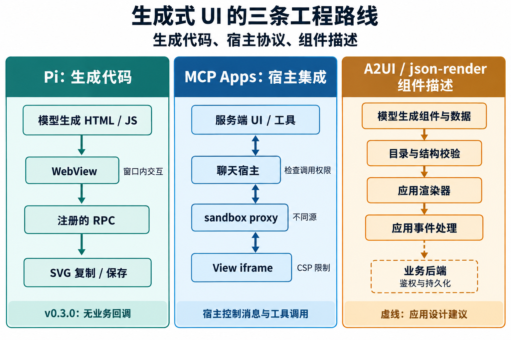

# 生成式 UI 的社区演进与工程边界

## 当前理解

Michael Liv 原文最值得复用的机制是：先通过 `read_me` 给模型提供按任务组织的设计说明，再通过 `show_widget` 接收生成的代码。两个工具的输入、返回和模块组成见 [[wiki/topics/ai/pi-generative-ui|read_me 与 show_widget 工具设计]]。

生成式 UI（用户界面）已经从“生成一段能显示的 HTML”发展出多条工程路线：自由生成代码并放进受控运行环境；为工具界面统一宿主通信；把模型输出限制为应用认识的组件、数据和动作。它们解决不同问题，不能按一条替代关系排序。

截至 2026-10-08，Michael Liv 的复现项目确有后续版本，社区也有持续发布的规范和实现。但 MCP Apps 在原文之前就已正式发布；A2UI 和 json-render 的发展也不能归因于这篇文章。[Pi 发布记录](https://github.com/Michaelliv/pi-generative-ui/releases/tag/v0.3.0)、[MCP Apps 发布公告](https://blog.modelcontextprotocol.io/posts/2026-01-26-mcp-apps/)、[A2UI 版本状态](https://a2ui.org/)、[json-render releases](https://github.com/vercel-labs/json-render/releases/tag/v0.21.0)

## 版本与进展

| 对象 | 时间或快照 | 能确认的变化 |
| --- | --- | --- |
| Claude 自生成视觉内容 | 2026-03-12 发布；公告补记 2026-04-22 加入 Cowork | 在对话中生成和修改图表。帮助文档还列出复制图片、下载 HTML/SVG、保存为 artifact 等保留方式；默认临时内容与持久产物仍有区别 |
| pi-generative-ui | 原文 2026-03-13；最新公开 release `v0.3.0`，2026-06-03 | 运行时拆分、跨平台、SVG 导出、外部脚本顺序加载；取消交互结果返回 agent，保留窗口内交互 |
| MCP Apps | 2026-01-26 规范列为 Stable；SDK 最新 release `v2.0.3`，2026-09-25 | 工具关联 `ui://` 资源，宿主通过 iframe 与消息协议承载界面。SDK 的 2.x 版本不能写成协议已发布“v2” |
| A2UI | 官网列 `v0.9.1` 为 Current，`v1.0` 为 Candidate；源码固定 `db43065` | `v0.9.1` 统一 MIME 类型并调整 surface ID 使用规则。`v1.0` 候选源码继续发展双向函数调用与组件目录组合，不能当成稳定接口 |
| json-render | 最新公开 release `v0.21.0`，2026-09-18；源码固定 `3ad3818` | 用 catalog 定义可用组件和动作，JSON 补丁流逐步构建界面；该版继续修复 React 流式渲染，并新增 TanStack Start renderer |

表中依据：[Claude 公告](https://claude.com/resources/articles/claude-builds-visuals)、[视觉内容帮助文档](https://support.claude.com/en/articles/13979539-custom-visuals-in-chat-and-cowork)、[Pi release](https://github.com/Michaelliv/pi-generative-ui/releases/tag/v0.3.0)、[MCP Apps release](https://github.com/modelcontextprotocol/ext-apps/releases/tag/v2.0.3)、[A2UI v1.0 状态](https://github.com/a2ui-project/a2ui/blob/db4306536438df46e4f0443b9c4ec0d5f1a42dc4/specification/v1_0/README.md#L1-L7)、[json-render release](https://github.com/vercel-labs/json-render/releases/tag/v0.21.0)。

## 从一张可调参数的图表看工程问题

假设用户想理解一份数据分析结果：先看图表，拖动参数重算，再把当前选择交给 agent 继续分析。这个需求包含三件独立的事：生成和显示界面、在界面内操作、把结果交回工作流。把三件事分开，才能解释为什么一个滑块能动，并不代表 agent 已经收到用户的决定。

### 1. 先决定生成代码还是组件描述

Pi 复现由模型生成 HTML/SVG/JavaScript，宿主提供 WebView 和运行时。适合临时图解，视觉表达范围大，页面脚本与依赖也需要由运行环境管理。窗口和宿主集成由扩展维护者负责，计算在页面或 Node.js 中执行，模型仍由 Pi 调用；平台依赖和工具接口会影响迁移成本。[具体实现](../../topics/ai/pi-generative-ui.md)

A2UI 让 agent 发送组件与数据消息，应用提供 renderer（渲染器）和双方认识的 catalog（组件目录）。`createSurface`、`updateComponents`、`updateDataModel`、`deleteSurface` 分别管理界面、结构、状态和删除；协议不绑定某一种传输。这样应用能复用自己的组件，但必须维护目录、版本兼容、事件处理和数据保存。[v0.9.1 协议](https://github.com/a2ui-project/a2ui/blob/db4306536438df46e4f0443b9c4ec0d5f1a42dc4/specification/v0_9_1/docs/a2ui_protocol.md#L20-L115)

json-render 也让应用声明组件、动作和函数，但它是应用内生成与渲染框架，不等于 A2UI 的另一种名称。其 SpecStream 用 JSONL（一行一个 JSON 对象）承载 JSON Patch，编译器把补丁逐步合成界面描述，再由框架组件渲染。开发者控制 catalog、实现和动作处理器，模型供应商可以另选；迁移代价主要在自定义组件、描述格式和状态绑定。[catalog](https://github.com/vercel-labs/json-render/blob/3ad381881194e7011ad3ccd6d668033495a06c29/apps/web/app/%28main%29/docs/catalog/page.mdx#L4-L18)、[流式格式](https://github.com/vercel-labs/json-render/blob/3ad381881194e7011ad3ccd6d668033495a06c29/apps/web/app/%28main%29/docs/streaming/page.mdx#L4-L105)

这里的综合判断是：有明确产品组件和提交动作的图表，采用组件描述能减少模型生成任意代码的范围；特殊图解或模拟器仍可能需要自由 HTML。组件目录缩小的是表达范围，后端仍需检查用户身份和业务权限。

### 2. 流式预览与可信执行分别处理

Pi 的 DOM 差异更新解决“内容逐步出现且少闪烁”；MCP Apps 则规定服务端 UI 怎样进入不同宿主、怎样传递参数和调用工具。前者是具体渲染实现，后者是宿主集成规范，二者不能直接当作同层替代品。

MCP Apps 由工具服务声明 HTML 资源，宿主读取它，在隔离的 iframe 中渲染，并用 JSON-RPC 消息交换数据。规范还允许发送 `tool-input-partial` 展示进度，但明确禁止依靠部分参数执行关键操作。规范开放不意味着每个宿主都支持所有能力，仍要做能力协商和宿主适配。[资源与权限定义](https://github.com/modelcontextprotocol/ext-apps/blob/82221c0c8ce7661efa6771c9d461511b1650495f/specification/2026-01-26/apps.mdx#L263-L286)、[部分参数通知](https://github.com/modelcontextprotocol/ext-apps/blob/82221c0c8ce7661efa6771c9d461511b1650495f/specification/2026-01-26/apps.mdx#L1120-L1142)

三条路线的执行位置和消息通道如下：

图的 Pi 和 MCP Apps 部分来自各自实现或规范；组件描述部分把 A2UI 的校验循环、json-render 的 catalog 与本文建议的业务权限边界合在一起，是应用设计示意。[Pi RPC](https://github.com/Michaelliv/pi-generative-ui/blob/d1abf2cb38fbf54c4b91d06677c700193d495887/.pi/extensions/generative-ui/rpc.ts#L38-L69)、[MCP Apps sandbox](https://github.com/modelcontextprotocol/ext-apps/blob/82221c0c8ce7661efa6771c9d461511b1650495f/specification/2026-01-26/apps.mdx#L470-L487)、[A2UI 校验循环](https://github.com/a2ui-project/a2ui/blob/db4306536438df46e4f0443b9c4ec0d5f1a42dc4/specification/v0_9_1/docs/a2ui_protocol.md#L781-L816)

### 3. 明确用户操作是否进入下一轮 agent 工作

图表拖动后本地重算，可以完全由页面处理；要求 agent 继续分析时才需要新消息或工具调用。`pi-generative-ui v0.3.0` 主动取消业务回调，说明“减少 agent 等待”与“建立交互工作流”是不同目标。MCP Apps 则提供 View 到宿主的工具调用、消息和上下文更新，具体调用仍由宿主控制。[Pi 交互边界](https://github.com/Michaelliv/pi-generative-ui/blob/d1abf2cb38fbf54c4b91d06677c700193d495887/.pi/extensions/generative-ui/index.ts#L146-L165)、[MCP Apps 通信概览](https://apps.extensions.modelcontextprotocol.io/api/documents/overview.html#bidirectional-communication)

A2UI 稳定版已有动作事件，候选版又在扩展双向函数调用；不能把候选版消息直接套到稳定版。其官网摘要与当前候选源码存在命名差异，涉及调用时应固定规范版本和提交，而非从介绍页复制字段。[v0.9.1 action](https://github.com/a2ui-project/a2ui/blob/db4306536438df46e4f0443b9c4ec0d5f1a42dc4/specification/v0_9_1/docs/a2ui_protocol.md#L818-L832)、[v1.0 候选演进说明](https://github.com/a2ui-project/a2ui/blob/db4306536438df46e4f0443b9c4ec0d5f1a42dc4/specification/v1_0/docs/evolution_guide.md#L5-L19)

对这张分析图表，本文建议先明确三个完成条件：界面已经显示、用户已经提交选择、后端已经接受并保存选择。它们需要各自的状态和错误处理。显示文本、消息送达或 JSON 格式正确，都不能单独证明下一阶段已经完成。

## 对应用开发的取舍

- 如果界面用于解释概念或数据，例如拖动滑块观察复利变化，可以让页面直接重算图表。开发重点是图表正常显示、加载失败时提示原因，以及关闭窗口和保存结果。需要把用户选择交给 agent 继续处理时，再增加相应的消息通道。Pi 的显示实现可作为参考，使用自由 HTML 还需处理脚本隔离和外部依赖。
- 对接多个支持 MCP Apps 的聊天宿主时，采用资源、消息和权限的公开规范，保留纯文本工具结果。服务端保管业务数据，宿主承担展示隔离和调用控制；适配成本取决于宿主支持范围，规范本身不提供统一数据存储。
- 已有产品组件和明确业务操作时，把目录与校验放在应用端。A2UI 偏向可跨传输与渲染器的消息协议，json-render 偏向应用内的描述生成与渲染；两者都要求应用维护组件实现、状态持久化和动作权限，不能仅靠提示词完成这些工作。

模型生成费用取决于具体模型和输出量，迁移成本取决于协议版本、组件实现与宿主集成。这些取舍需要结合应用需求判断。

## 相关页面

- [[wiki/topics/ai/pi-generative-ui|pi-generative-ui：read_me 与 show_widget 工具设计]]
- [[wiki/topics/ai/mcp|MCP]]
- [[wiki/syntheses/frontend/same-origin-iframe-sandbox-design|同源 iframe 沙箱设计]]
- [[wiki/syntheses/frontend/interactive-ui-accessibility-baseline|交互式 UI 的可访问性基线]]

## 来源指针

- [[raw/sources/generative-ui-community-evolution|社区版本、规范位置与证据对照表]]
- [[raw/sources/michael-liv-claude-generative-ui|原文与复现项目的证据记录]]
- [MCP Apps 规范与 SDK](https://apps.extensions.modelcontextprotocol.io/)
- [A2UI 规范版本](https://a2ui.org/)
- [json-render v0.21.0](https://github.com/vercel-labs/json-render/releases/tag/v0.21.0)
