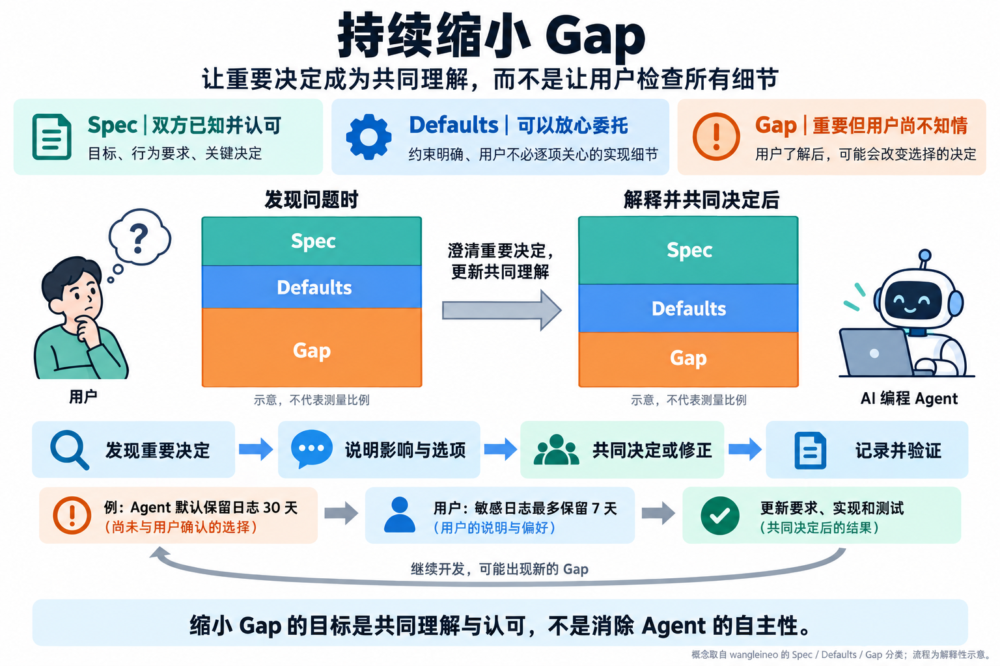

# Plan Mode：如何规划，以及哪些决定需要人参与

## 简答

规划仍然有用，但不必每次都先写一份详尽文档，等人批准后才开始实现。Ayman Nadeem 在 Nuanced 的产品总结中认为：随着模型能独立处理更多实施细节，规划可以和实现、检查、修改交替进行。真正需要保留的是人对目标、重要取舍和结果的理解。

wangleineo 的知乎文章补充了一个判断方法：区分用户与 agent 已经共同理解的决定、用户可以放心委托的细节，以及 agent 已作出但用户应该知道的决定。重点是让人参与重要选择，而不是增加需要阅读的文字。两篇文章的来源见文末。

## Nuanced 为什么没有达到预期

### 产品原本想解决什么

Nuanced 是 Nadeem 围绕规划构建的桌面编码应用。用户先在对话中说明需求，系统找出含糊之处和需要确认的选择，再生成一份可保存、可修改的规格说明（spec），批准后按说明实现。

作者想解决的问题是：agent 改代码很快，人怎样理解它改了什么、为什么这样改，以及结果是否符合自己的意图。需求没有说清的地方，agent 会自行决定；这些决定分散在许多文件中，用户很难只靠阅读聊天或代码发现所有问题。

### 作者总结的四个问题

1. **讨论怎么做，不等于需要保存一份长计划。** 团队认为充分思考和结构化文档都很有价值，但早期用户对阅读这份 spec 的兴趣不高。
2. **一些原本需要人说明的细节，模型已经能处理。** 按作者的观察，模型更擅长探索仓库和根据上下文作出合理判断后，逐项交代实现细节的必要性减少了。这是作者的产品经验，不是对所有任务的保证。
3. **文档变长，却没有让事情更清楚。** 团队又做了 Spec Tour，试图带用户阅读重点，但在这个产品中，它增加了额外的阅读和操作负担。
4. **流程要求用户太早确定方案。** 从讨论、生成 spec、审阅、批准到实现，各步骤被严格分开。用户在实现中发现新问题后，很难自然地回到前面的讨论。

### 规划与实现可以交替进行

作者更倾向于这样的过程：先理解一部分问题，尝试实现，检查结果，再澄清新问题和调整方案。规划一直存在，只是不必全部集中在开工前，也不一定每次都形成独立文档。

作者还认为，要求用户先判断任务是否值得规划、再切换 plan mode 或 build mode，会增加操作负担。因此更认可在对话中按需要讨论计划。这个判断来自他的产品经历，不意味着所有用户都不需要显式的规划模式。

### 多个 agent 同时工作时，人应该关注什么

作者没有解决的难题是：系统持续变化，人怎样保持理解。让用户读完每段对话、逐一审阅所有计划，并不能无限适用于更多并行任务。作者提出的方向是让 agent 找出最需要人判断的决定，并提供足够的背景，使人能够作出选择。

## 知乎作者的补充：哪些决定需要用户知道

wangleineo 用 Spec、Defaults、Gap 区分三类信息。这套分类来自知乎补充文章，不是 Nadeem 原文。[阅读摘记](../../../raw/sources/2026-09-28-zhihu-plan-mode-insights.md)

| 名称 | 含义 | 本页建议的处理方式 |
| --- | --- | --- |
| Spec | 用户和 agent 都知道的设计与技术决定 | 确认共同理解，必要时记录下来 |
| Defaults | agent 处理、用户无需逐项关心的实现选择 | 在明确的范围内委托，不必检查每个细节 |
| Gap | agent 已作出，但用户不知道且应该知道的决定 | 了解背景和取舍，判断是否接受 |

区分 Defaults 与 Gap 的关键是：**用户如果知道这个决定，是否可能不同意或选择另一种方案？** 模型有能力执行某个方案，不代表用户已经认可它的取舍。知乎作者认为，模型生成得更快、作出的决定更多时，这类信息差可能扩大；文章没有提供量化结果或自动识别方法。

作者也提醒，文档仍能帮助人理解关键变化。文章引用了用图和交互演示解释复杂修改的讨论，并借《Regenerative Software》提出另一个方向：把软件应保持的行为描述清楚，让不同次生成的实现仍遵守这些要求。这里依据的是知乎作者的转述，不能当作已经验证的工具能力或行为一致性保证。

## 如何用于实际开发

图中的日志保留期限是说明流程的假设示例，色块大小不代表测量结果。重要决定经过解释、确认或修正后，可以纳入双方的共同理解；可以放心委托的 Defaults 不需要全部转成逐项审批。继续开发时仍可能出现新的 Gap。

以下是本文据两篇文章整理的建议：

- **先明确哪些决定可以委托。** 例如，已经约定行为和限制的私有函数，其内部实现通常可以交给 agent；如果涉及公开行为、数据处理方式或用户尚未认可的取舍，就应说明备选方案及影响。代价高或难以撤销的决定，仍应在执行前确认。
- **让计划回答需要决定的问题。** 要求逐文件计划之前，先明确用户要用它判断什么。可以随着实现逐步确认的细节，不必为了凑齐计划而提前固定。
- **把重要决定与验证结果记录下来。** PR 说明应交代目标、具体变化、理由和验证结果。用户已认可、后续需要持续遵守的行为与约束，再保留到适合长期维护的文档中。

这些建议不要求统一取消计划、审批或文档。选择什么形式，取决于任务风险、用户需要判断的事项，以及后续维护是否需要查证。

## 限制与未决问题

- 两篇文章是一则产品总结和针对它的评论，不是两项独立评测，不能据此判断所有团队都应该采用同一种流程。
- agent 怎样可靠地区分 Defaults 与 Gap？如果错误地把重要决定当作普通细节，怎样发现并纠正？目前没有得到验证的方法。
- 当系统持续变化时，应在什么时候更新用户的理解？对话、代码差异、图和可运行原型各自适合解释哪些问题，仍需结合具体任务判断。

## 相关页面

- [[code-agent]]
- [[agent-harness]]
- [[coding-agent-edit-tools]]
- [[agent-loop-control-boundaries]]
- [[claude-5-context-engineering]]
- [[ai-slop]]
- [[prompt]]

## 来源指针

- [Plan mode is dead](https://www.aymannadeem.com/artificial/intelligence,/developer/tools/2026/09/24/plan-mode-is-dead.html)，Ayman Nadeem，2026-09-24
- [英文原文存档](../../../raw/sources/2026-09-27-plan-mode-is-dead.md)
- [Plan Mode 已经死了吗？](https://zhuanlan.zhihu.com/p/2087525914590573749)，wangleineo，2026-09-27
- [知乎文章阅读摘记](../../../raw/sources/2026-09-28-zhihu-plan-mode-insights.md)
