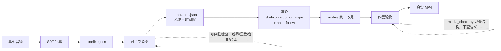
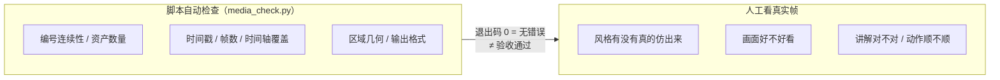

# 手绘风格与讲解视频的工程约束

## 问题

「画成某种手绘风格」与「把一幅画随讲解逐笔画出」这两件事，交给模型都会稳定跑偏。跑偏点在哪，对应的工程约束是什么？

## 简答

五组做法：把「风格」从形容词落成编号目录；用声明把参考图限制在画风层、不许影响画面内容；源图先过「能不能逐笔画得过来」的检查；两条时间轴规则写死（手不能在画面中央停住、被挡住的画面也要占满自己的时间段）；最终验收只认真实视频帧。脚本能自动判的只是结构对不对，画面好不好看、讲解对不对只能人看。

## 来源事实

两个素材来源给的是同一领域的两端，事实分开列。

**风格端（`handdraw-style-prompter`，v1.0.4，MIT）**

- 274 种风格编号（001–274，A–H 八组），权威内容是 `styles_200_reorganized.md` 里的「编号 · 原参考名称 / 生图名称 / 核心视觉特征」表格，`references/styles.json` 是脚本生成的索引。
- 118 条排版图型（`SC-` 社媒卡 / `IG-` 信息图 / `SB-` 分镜），每条一个双语提示词文件；布局管构图和文字结构，风格只管画法。
- `references/model_capabilities.json` 的 `default` 是 `name_activation: unknown` + `use_reference_image: true`；只有 `gpt-image-2` 有 137 条 style 级标定。`resolve_reference.py` 输出四种激活来源，未知模型一律要求垫图，不猜能力。
- 需要垫图时注入中英隔离声明：只抽线条、笔触、媒介、材质、色彩倾向、整体视觉语言，不得沿用参考图的主体、构图、文字或故事；用户主题是画面内容的唯一来源。
- `positive_traits()` 丢掉含「避免 / 不要 / 不准 / 禁止」的子句，只留正向特征。
- `validate_library.py`（378 行）断言编号连续性、归因来源、能力枚举、四种激活来源的样例、资产分桶、拼图覆盖与状态一致、gallery / README / 图鉴交叉引用、CLI 输出格式。
- 资产：274 张编号单图 + 217–257 的 41 张四宫格垫图 + 19 张拼图 + 118 张版式预览。

**视频端（`hand-drawn-explainer-video-nikola`，Apache-2.0 + vendor MIT）**

- 两条不可混称的路线：同一画布持续落墨的逐笔故事动画，和用 SVG/HTML/GSAP 编排流程卡片与知识图形的程序动画。画面结构（单场景 / 多幕 / 左右双语义岛）和视觉风格（自然肤色 Q 版人物 / 小黑风格 / 其他）是逐笔路线内的选项。
- 顺序：真实音频 → SRT → `timeline.json` → 可绘制源图 → `annotation.json`（`sequence` / `subtitle` / `startMs` / `durationMs` / `region` / `protectedRegions`）→ 渲染（`skeleton` + `contour-wipe` + `hand-follow 0.35`）→ 统一收尾（`finalize_stroke_video.py`，默认 `--source-overlay never`）→ 分层验收。
- 源图要求：按渠道选 9:16 / 4:3 / 16:9；20 秒以上多事件拆成每幅 4–8 秒的连续故事画面；清晰深色轮廓、有限平涂、低纹理、充足留白；避开蜡笔噪点、半调网点、密集排线、摄影纹理和大面积深色填充，因为它们会被误识别成墨迹。
- 两条写死的时间规则：`hand-follow` 只平滑手部显示位置，不改变笔迹速度；区域被完全扣空时保持画布到该区域时间窗结束，不放静止假手、不让后续提前。
- 图片模型不生成长中文、日期、法条、Logo；这些走字幕或确定性文字层，关键词 2–6 个汉字逐字显现。
- 验收：13 条含反例的 evals、四层验收（文本 / 工程 / 成片 / 内容动作）、逐笔专属 10 条、两个以上语义区域时必须看「前区完成前 0.2 秒 → 后区开始后 0.2 秒」和切点前后 3 帧；`media_check.py` 自动检查同时声明它不做语音识别、不判语义同步、不评美感。
- 上游 `srt-whiteboard-animation` 固定 commit `325c5c71` 做运行时，故意不含上游 SKILL.md，避免包内出现第二个可触发 Skill。

整条链路与自动检查位置：



## 综合结论

**一、取值域：审美的工程化形态。**
两个项目手法一致：手感、版式、风格的存在形式都是有限取值——编号、JSON 目录、逐条清单。风格切换的操作对象是编号，不是形容词。判据页里 mono-color 用六个 JSON 目录管色板与排版，这里的对应物是 274 条风格索引加 118 条版式。共同规则：目录是取值权威，散文只解释意图。

**二、要不要给模型传参考图：一个可判定问题。**
「参考图只影响画风、不污染主题」的实现由两部分组成：一是能力分层——能只凭风格名字或文字描述就稳定画出该风格的模型，不传参考图；对能力未知的模型一律把参考图一并传给（行话叫「垫图」），不留「大概能行」的中间态；二是隔离声明——提示词里固定写明「只参考参考图的线条、笔触、媒介、材质、色彩倾向和整体视觉语言，不许沿用它的主体内容、构图、文字或故事情节」。图文模式还有一条：本地路径、上传说明和这段隔离声明都不能出现在可复制给别人的提示词里，否则别人拿到的提示词自带了内部信息。

**三、可画性门槛：源图的前置约束。**
视频端的多数坑埋在生图阶段：一张图里细节太多，逐笔画完的速度就快到没法用，最终只能靠降帧率或拉长画面时长硬撑。对应手段是约束前置——纹理密度、零件数量、单幅承载的事件数都在生成源图前定好规格；人在图上框出逐块绘制的区域（annotation）后，脚本先自动查一遍区域问题：画出界、区域互相重叠、区域之间留白太小、一根该在前景的线同时穿进多个区域。检查不过时优先把内容拆成多幅画面，其次才改源图。可推广的规律：**下游存在速度、尺寸或分辨率约束的生成任务，「可处理性」属于上游输入规格，不是下游补丁。**

**四、时间轴不变量。**
逐笔动画的画面按讲解顺序逐块画成，每一块框选区域在 `timeline.json` 里分到一段固定的出场时间。有两件事没有人盯着就一定会错：一是手部移动速度和笔迹成形速度是两个参数，调节手部位置的开关不改变画线快慢；二是当一块区域被后面的区域完全挡住、在它自己的时间段里实际不可见时，渲染仍要持续到该时段结束——画面中央不能留一只停住不动的手，下一块区域也不能提前冒出来。这两条写成固定规则而不是调参经验，好处是渲染完对照边界帧就能验证。

```text
区域 A   ████████████░░░░░░░░░░░░░░░░░░  ← 后半被 B 扣空（不可见）
         ├──── A 的时间窗，仍须占满 ────┤
区域 B                          ████████████
时间     0s    1s    2s    3s    4s    5s

A 被挡住的空窗里：
  ✗ 画面中央留一只停住不动的手
  ✗ 让 B 没到点就提前冒出来
  ✓ 渲染持续到 A 的时间窗结束
```

**五、参数的职责分离。**
手挡住画面、手移动观感、笔迹成形太快是三个不同问题，各有各的参数：`--hand-height` 调手的大小（手越小遮挡越少，16:9 复杂画面建议 260–340 这个区间），`--hand-follow` 只管手移动到新位置时的平滑程度，笔迹快慢由这块区域分到的时长和线条、色块的复杂度决定。三个参数分开之后，画面不对劲时才有确定的归因路径，而不是反复调一个数字碰运气。

**六、画面与声音解耦。**
换画风只重新生成画面，不动已经确认过的配音，原音轨直接复用。配音是 TTS 单独生成的，某段没生成出来时，画面、字幕、时间轴照常做下去，但把配音列为明确的缺口项，而不是悄悄换成系统朗读或另一个 TTS 音色顶上。配套的一条成本纪律：已通过的环节不重新生成，修改只重做真正受影响的那段。

**七、两层验收：结构自动检查，语义人工看帧。**
两个项目在这点上一致且诚实：脚本能自动判的是编号连续性、资产数量、时间戳、区域几何位置、输出格式这类「结构对不对」；「风格有没有真的仿出来」「画面好不好看」「讲解对不对」脚本明确管不了，只能人打开视频看——至少看每个场景一帧，再专门看动作的高潮帧、转场帧和每一幕最后一帧；当两个绘制区域前后相接时，还要看交接点前后各 0.2 秒和切点前后 3 帧，确认前一块没有停笔、后一块没有提前冒头。视频端把这条写进了工具文档：自动检查脚本退出码 0 的意思只是「本次自动检查没发现错误」，不等于验收通过。



**八、反冒充：交付协议的组成部分。**
这个 skill 里有两条不能混称的路线：一条是真·逐笔绘制（同一块画布上，笔迹跟着讲解一笔笔落上去），另一条是用 SVG/HTML/GSAP 把现成的卡片和知识图形编排成动画。三条命名红线：后者不能叫「逐笔绘制」，SVG 动效不能冒充真实笔迹，10–15 秒的样片不能称为完整视频。这不是措辞讲究，而是交付协议——用户据此决定付不付费、要不要继续做下去。

## 对个人/项目的启发

- 审美或口味类任务，先把取值目录和逐条检查列出来，再写提示词；具体取值以目录为准，提示词只解释意图。
- 对成品有限制（速度、分辨率、时长）的生成任务，限制要写在生成之前的输入规格里，别等出了问题再补。
- 参数命名对应单一职责，一个旋钮不兼两职。
- 依赖外部付费能力（TTS、生图）时，先写好「这步做不出来时交什么、缺口怎么标」，不许悄悄用别的东西顶替。
- 自动检查脚本要写清自己不检查什么；报告里区分「没查出错误」和「人已经验收过」。

## 未决问题

- 编号风格库把真实作者的名字写进提示词，署名、许可和「像不像某人」的边界没有统一答案；两个项目一个只给了软件部分的 MIT，一个用第三方说明页划界。
- 模型能力清单需要持续实测维护：某一个模型的 137 条标定会随模型更新过期，但谁来重新测、多久测一次没有机制。
- 视频端是 Windows 优先（PowerShell 脚本、特定 ASR 版本组合），跨平台成本没有公开评估。
- 「自动检查不覆盖语义」这条在实践里依赖人的耐心：边界帧看片最容易在赶进度时被跳过。

## 相关页面

- [[Awesome Agent Skills]] — 两个 Skill 的收录条目与分级
- [[Skill 工程化的产物协议范式]] — 判据页，两个案例的完整分析在那边
- [[AI Slop]] — 反 AI 味的语义层归纳

## 来源指针

- `raw/sources/2026-09-22-handdraw-style-prompter-review.md`
- `raw/sources/2026-09-22-hand-drawn-explainer-video-nikola-review.md`
- https://github.com/yang0/handraw-style
- https://github.com/hi-nikola/hand-drawn-explainer-video-nikola
- https://github.com/geeklee/srt-whiteboard-animation
