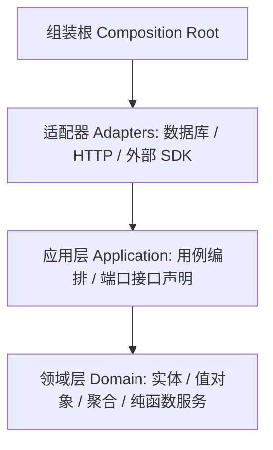
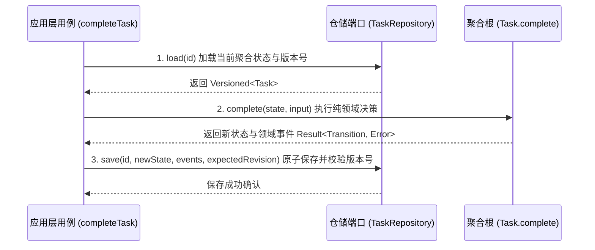

# 限界上下文、聚合与仓储

## 战略层与战术层

领域驱动设计（DDD）明确区分为战略层与战术层两个层次：

- **战略层**：确立统一语言（Ubiquitous Language）、划分限界上下文（Bounded Context），并定义上下文映射关系。核心在于先划清系统边界、统一核心词汇与语义。
- **战术层**：将业务规则沉淀进领域模型内部；利用聚合（Aggregate）划定业务一致性边界；仓储（Repository）只负责按全局唯一标识存取聚合对象。

行业中的常见误解在于：以为项目建立了 `entity`、`aggregate`、`repository` 等分层目录名，再套用某种自研或开源框架，就是在实践 DDD。实际上框架顶多能简化底层持久化的机械工作（例如字段差异比对、保存后发送事件、封装数据库事务），但业务规则究竟放置在何处、事务与一致性边界究竟画在哪里，必须由开发者根据业务需求自行裁定。

## 限界上下文是什么

**限界上下文是一个语义边界：在这个边界内，一套模型和它的统一语言保持一致，每个词只有一种含义。**

一个清晰的限界上下文主要回答三个核心问题：

1. **边界里的词是什么意思（统一语言）**：在该上下文之内，特定术语消除任何二义性。
2. **边界里的代码和数据归谁（所有权）**：上下文界定明确的代码模块责任边界与数据独占写入权。
3. **它和别的上下文怎么打交道（上下文映射）**：明确上下游协作方式，例如开放主机服务、防腐层、共享内核、客户方-供应方关系等。

例如「Agent」一词：在一个产品内部代表平台自身托管运行的 Agent 任务；而在另一个代码库里则指 Claude Code 等第三方编码 Agent（Coding Agent）。同一个词汇在不同语境下含义不同，就天然属于不同的限界上下文；通行的工程处理方式是在统一术语表中改名区分（例如将后者显式命名为 `CodingAgent`）。

### 一个限界上下文里通常有什么

| 组成部分 | 说明 |
|---|---|
| 统一语言 | 术语表，代码中的类型与方法命名严格与术语表一致 |
| 领域模型 | 聚合、实体、值对象、领域服务、领域事件；**不一定包含聚合** |
| 应用层 | 用例编排流程：加载数据、调用领域模型执行决策、持久化保存、发出事件 |
| 端口与适配器 | 仓储接口与实现、访问外部系统的防腐层、查询读模型 |
| 自己的数据 | 拥有数据的专属写入权，只有该上下文能够修改其对应的数据库表或文件 |
| 对外接口 | 门面（facade）、公布的语言（对外公开的数据传输类型与事件定义）；其他上下文只能经由这些接口协作 |

将限界上下文简单等同于「用例编排 + 聚合根」，只涵盖了上表中领域模型与应用层的一部分。这一认知漏掉了关键的三点事实：

1. **上下文可以完全没有聚合**：例如一个只负责读取外部数据的分析或报表上下文（解析外部日志、执行查询聚合统计），内部可能只有值对象、防腐层和查询用例，无需维护强一致性不变式，但它依然拥有独立的统一语言与清晰边界。
2. **有聚合不等于有上下文**：若将几百个业务实体全部堆砌在同一个无边界的庞大代码包中，即便定义了聚合根，系统本质上也只是「一个未切分的庞大上下文」。
3. **边界被破坏，多半源于模型泄漏**：典型表现是外部模块直接引入（import）某个模块的领域层内部包，把对端的内部领域对象直接作为自己的依赖。规范的做法是经由对端暴露的 facade 获取其公布的专门数据类型，或者在调用方自身内部编写防腐层进行转换。

## 聚合与限界上下文：两种边界

不要将聚合与限界上下文这两类不同维度的边界混为一谈：

| 维度 | 聚合 | 限界上下文 |
|---|---|---|
| 是什么边界 | 一致性边界：一次数据库事务只修改一个聚合，业务规则的不变式在此被原子守住 | 语义边界：一套业务领域模型和统一语言在该范围内始终有效 |
| 边界尺度 | 小粒度：一个限界上下文内部可以包含零个到多个聚合 | 大粒度：通常对应一个独立的功能模块、物理代码库或专门的交付团队 |
| 判断方法 | 哪些数据必须在同一事务内同时修改并强制满足业务规则与约束 | 同一个术语在此处是否具备唯一确定含义；代码资产是否因相同动因协同变更；数据是否归属于唯一的维护方 |

**一句话总结**：限界上下文 = 一个语义边界 + 边界内的模型、用例、端口和数据 + 对外接口；聚合根只是其中可选的一部分。对外暴露的接口才是外部调用方所看到的「一个整体」，聚合根则是内部领域知识的具体实现。

## facade：上下文的对外窗口

facade（门面）给子系统开一个简单、统一的入口，外部只通过这个入口协作，不直接碰内部细节。例如订单（Order）模块对外只声明一个接口：

```go
type OrderQueryFacade interface {
    HasUnpaidOrder(ctx context.Context, customerID string) (bool, error)
}
```

调用方不需要知道订单存在哪张表、什么状态算「未支付」、用了哪个仓储。实现放在 Order 模块内部，由它的应用服务完成；只要这个方法的行为不变，Order 模块内部怎么改都不影响外部。

facade 本质上就是限界上下文的「对外窗口」，在上下文映射中承载着开放主机服务（Open Host Service）的职能。

- **依赖注入**：解决「一个模块内部，谁来创建依赖组件、如何在运行时替换具体实现」；
- **facade**：解决「模块之间只能通过哪个受控入口进行交互协作」。

两者常一起出现：组装根把 Order 模块的 facade 实现注入给别的模块，别的模块在代码和类型上只依赖这个 facade 接口。

## 分层与依赖方向

典型的领域驱动系统分层与依赖关系如下：

```
组装根        每个运行环境一份（服务端、浏览器、单元测试），负责挑选与绑定具体实现
适配器        端口的具体实现：数据库、文件存储、HTTP 服务、外部 SDK；系统中唯一直接操作 IO 与三方库的层
应用层        用例编排：加载 → 调用领域模型 → 保存 → 发布事件；声明所需的端口抽象接口
领域层        值对象、聚合、领域事件、纯函数领域服务；不进行任何 IO 操作，不依赖任何第三方运行时框架
```

系统内部的依赖方向严格单向向内：**适配器 → 应用层 → 领域层**。



在分层体系中，防腐层（将外部数据格式转换为内部领域模型）建议实现为纯函数：输入一段文本或原始结构体载荷，直接解析返回领域对象，不掺杂任何 IO 操作。这样数据转换逻辑无需启动外部数据库或文件系统即可快速单测，且能无缝在浏览器端与 Node.js 运行时中复用。

工程中推荐使用架构测试工具（例如 Java 生态中的 ArchUnit、jMolecules、Spring Modulith，或前端与多语言的静态依赖检查规则）强制保障依赖方向。例如：领域层禁止引入任何包含文件、网络等 IO 操作的库及运行时框架；模块之间禁止直接越权引入对端的领域层和基础设施层代码。

## 聚合根不依赖仓储

常见的误解是「聚合根要通过依赖注入拿到仓储」。实际上**聚合根不依赖仓储；反过来，是仓储依赖聚合根的类型**。依赖注入发生在应用层用例和组装根，注入的对象是用例，不是聚合根。



应用层用例的标准执行生命周期始终是：**「加载（load）→ 调用模型（invoke）→ 保存（save）」**。聚合只接收当前的状态输入与执行命令，在内存中核验业务规则与不变式，返回产生的新状态与领域事件列表，聚合根内部从不自行调用 `repo.save()`。

### 基于 TypeScript 与 Effect 的用例写法示例

```ts
import { Effect, Context, Layer } from "effect"

// 领域层：纯函数或纯粹对象，不引入仓储接口，不依赖 Effect 运行时
export interface Task { readonly id: string; readonly status: "pending" | "completed" }
export interface CompleteInput { readonly operatorId: string }
export interface TaskCompletedEvent { readonly taskId: string }
export interface Transition { readonly state: Task; readonly events: readonly TaskEvent[] }

export function complete(task: Task, input: CompleteInput): Result<Transition, TransitionDenied> {
  if (task.status === "completed") return err(new TransitionDenied("已完成的任务不可重复完成"))
  return ok({
    state: { ...task, status: "completed" },
    events: [{ taskId: task.id }]
  })
}

// 端口：Context.Service 作为类型标识与注入标签
export class TaskRepository extends Context.Service<TaskRepository, {
  load(id: TaskId): Effect.Effect<Versioned<Task> | undefined, LoadError>
  save(id: TaskId, state: Task, events: readonly TaskEvent[],
       opts: { expectedRevision: number }): Effect.Effect<number, Conflict>
}>()("app/TaskRepository") {}

// 应用层用例：依赖注入发生在此处
export const completeTask = (id: TaskId, input: CompleteInput) => Effect.gen(function* () {
  const repo = yield* TaskRepository
  const current = yield* repo.load(id)
  if (!current) return yield* Effect.fail(new TaskNotFoundError())

  const t = complete(current.state, input)
  if (!t.ok) return yield* Effect.fail(t.error)

  yield* repo.save(id, t.value.state, t.value.events, { expectedRevision: current.revision })
})

// 组装根：不同环境按需绑定具体实现
const ServerLive = Layer.mergeAll(SqlTaskRepository, SystemClock)
const TestLive   = Layer.mergeAll(MemoryTaskRepository, FixedClock)
```

若在项目中不使用 Effect 框架，核心思路依然一致：通过普通函数的依赖参数传递：`completeTask({ repo, clock }, id, input)`。两者机制等价，差别仅在于是否借助工具库管理依赖容器。

### 为什么不把仓储注入进聚合根

1. **不变式可以轻松独立测试**：聚合成为纯内存逻辑，测试时只需输入已有状态与触发命令，直接断言返回的新状态或错误，无需构造复杂的 Mock 数据库或外部存取接口。
2. **事务边界由用例严格把控**：「一次事务只改一个聚合」的强一致性依靠应用层精准的「加载 → 修改 → 保存」三步原子守住；若聚合能随时自行操作仓储，跨聚合的隐式读写将失控，事务边界荡然无存。
3. **前后端可以完全共用领域逻辑**：聚合根剥离了所有数据访问依赖，能够无缝编译运行在浏览器端或边缘轻量环境中。
4. **领域逻辑彻底杜绝隐藏的 IO 风险**：杜绝聚合方法内部偷偷触发延迟加载（Lazy Loading）、发出 RPC 网络请求或产生局部网络超时的非确定性异常。

当领域逻辑确实需要依赖外部上下文的数据（例如检查唯一性、校验另一聚合的当前状态）时，工程上有两种规整的处理办法：
- 由应用层用例提前查询好所需数据，作为显式入参直接传入聚合方法；
- 编写无状态的领域服务（Domain Service），由应用层用例把查询端口显式传给它。两种办法都不让聚合根自己去拿。

## 为什么是 repo.load(id)

Eric Evans 在蓝皮书中对仓储的核心定义是：**它在概念上模拟一个放置了某类聚合根实例的内存集合**。

应用层用例为了对具体业务对象执行状态修改，传入的命令中天然携带有该实体的唯一标识。因此标准的业务处理链路永远是：**根据全局唯一标识将聚合根的全部状态完整取出 → 调用聚合上的业务方法 → 将修改后的状态完整存回**。

在不同编程语言与项目框架中，该操作仅体现为命名差异（例如 Go 语言的 `Find(ctx, id)`、TS 中的 `get(id)` 或 `load(id)`）；其中现代系统中的 `load` 方法通常额外返回聚合的当前版本号 `revision`，以支持底层的乐观并发控制。

仓储当然支持按其他业务条件进行复合查找；但如果查询仅仅是为了向客户端前端或展示层渲染只读数据列表，按照命令查询职责分离（CQRS）的架构准则，应当直接走只读模型的查询服务，而不应强行调用领域仓储把大批重型聚合实例化出来。

## 读 DDD 代码时问的六个问题

读一份自称 DDD 的代码库时，可以问这六个问题：

1. **聚合根是谁？** 它的方法是在真实表达业务规则、约束不变式与推进状态机流转，还是仅充当摆设、通篇只有 getter 和 setter？
2. **业务规则写在哪？** 核心规则内聚在模型内部是充血模型；若业务判断全散落在外部应用服务层，则本质上是事务脚本（Transaction Script）或贫血领域模型（Anemic Domain Model）。
3. **一次用例改几个聚合？** 系统的数据一致性是依靠单个聚合的不变式规则配合版本号乐观锁来守住，还是在一个外层数据库事务中大包大揽地包裹多个仓储的批量写？
4. **仓储按什么划分？** 是严格为一个聚合根对应一个仓储、按标识存取完整聚合，还是为数据库的每一张数据表都建立一个所谓的仓储（实际上只是换了名字的数据访问对象 DAO）？
5. **领域层依赖了什么？** 聚合根是否违规持有了数据库连接、仓储句柄或 RPC 客户端实例？
6. **事件由谁产生、什么时候发出、谁来消费？** 事件是聚合在状态迁移时产生，还是应用服务另外拼出来的？事件和状态是一起持久化，还是可能出现状态存了、事件丢了？

## 三种常见写法

在实际工程项目中，即使多个系统的目录结构都划分为 `domain`、`application`、`infra`，其底层的依赖注入手段、聚合设计形态和仓储接口定义往往存在巨大分歧。「分了这几层目录」绝不代表「掌握了如何落地 DDD」：

| 评估维度 | 写法 A：自研 DDD 框架 + ORM | 写法 B：模块化单体 + 反射式 DI 容器 | 写法 C：不可变聚合 + CAS + 架构测试 |
|---|---|---|---|
| 上下文边界 | 整个单体服务共用一个庞大的 `domain` 模块 | 每个业务模块对应一个上下文，跨模块调用走暴露的 facade 接口 | 严格按目录与代码包清晰划定上下文边界 |
| 依赖注入机制 | 手写组装代码（上千行构造调用）+ 包级全局单例变量 + 服务定位器 | 反射式依赖注入容器（如 uber/dig），每个模块配置专属作用域，利用 Export 调控可见性；缺少依赖直至应用启动时报错 | 带类型的端口作为工厂参数传入，由组装根组装（用 Effect 时也可以用 `Context.Service` + `Layer`）；缺少依赖在编译期报错 |
| 聚合设计形式 | 可变的对象图；框架在内存中对对象做快照，保存时自动计算字段差异并更新改动列；类方法多为数据获取，部分聚合甚至持有仓储 | 无显式聚合抽象；业务实体上挂载守卫方法（如 `EnsureEditable`、`CanShip`）；状态变更常常直接由应用层修改实体字段或调用仓储做定向更新 | 冻结的不可变数据对象；构造函数设为私有，仅允许通过 `create` 或 `restore` 实例化；状态迁移方法纯粹返回 `{ state, events }` |
| 仓储接口定义 | 泛型仓储 `Repository[T]` 负责整体保存；同时每个实体独立配有专有仓储 | 每类实体对应一个仓储；接口混杂单记录查询、批量多字段查询、计数及局部字段定向更新，本质更接近 DAO 与查询服务的混合体 | 每个聚合根对应唯一的仓储；提供 `update({ expectedRevision, transition })`，在底层使用 CAS 原子性地完成「读取 → 状态迁移 → 写回」 |
| 一致性保障机制 | 依赖外层关系型数据库本地事务强行包含多个仓储调用 | 依赖数据库本地事务配合事务后置钩子（Transaction Hooks） | 单个聚合修改 + 版本号（revision）乐观并发 CAS 校验 |
| 业务规则归属 | 核心规则大量散落在各个应用服务用例中 | 守卫校验挂在实体上，复杂状态流转与联动大多散落在应用层中 | 严格内聚在聚合方法内部 |
| 核心架构优势 | 战术层持久化工具链成熟，开发门槛低 | 战略层清晰：模块即上下文、facade 隔离、各模块自主组装 | 战术层领域模型纯粹；在静态编译期即能严密拦截依赖缺失 |

### 写法 B 的典型漏洞与隔离防线

在采用模块化单体与反射容器的写法 B 中，极易出现两类打破边界的典型漏洞：
1. 外部模块直接跨层 import 了对端模块的内部 `domain` 包；
2. 某个模块在依赖配置中误将自己内部的基础设施层组件（例如底层 DB 实例）通过 Export 暴露出去，导致其他模块绕开 facade 门面直接获取并操作对端底层基础设施。

这说明**依赖注入容器只在组装层面控制可见性，不能保证模型层面的隔离**。模块隔离要靠下面三样东西一起保证：
- **模块入口唯一暴露 facade**：模块的主导出入口（如 index/facade 文件）只暴露 facade 接口，不开放内部实现类与内部实体；
- **架构测试静态把关**：通过 ArchUnit、静态代码扫描或 linter 严密禁止跨模块导入对端的 `domain` 与 `infra` 代码，一旦违规直接阻断构建与持续集成；
- **类型系统单向约束**：跨模块依赖在类型签名上只允许指向对端导出的 facade 抽象接口。

三种写法在工程实践中均有其立足之地：
- **写法 A** 适合以数据 CRUD 操作为主、重度依赖关系型数据库、多人协作的常规业务系统；其妥协与代价是业务规则散落在各应用服务中，同一条不变式约束极易被不同用例重复实现且难以保证一致。
- **写法 C** 适合状态流转复杂、业务不变式要求极高、需要严格防范并发竞争的核心领域系统。
- 也可以组合两者：用写法 B 的战略结构（模块即上下文、facade、各模块自己组装），配写法 C 的战术模型（不可变聚合、迁移即规则、单聚合 CAS）。

## 证据对照表

| 架构结论 | 来源根据 | 位置 / 条目 | 限制与适用边界 |
|---|---|---|---|
| 限界上下文是语义边界与统一语言边界；存在统一语言分歧需划分独立上下文 | Martin Fowler | BoundedContext | 适用于具有多业务语义的系统；单体小型 CRUD 系统若语义高度单一无需过度切分 |
| 业务规则散落在用例编排层而非领域模型内部属于贫血模型反模式 | Martin Fowler | AnemicDomainModel | 贫血模型适合纯数据转发或简单报表类服务；在复杂业务规则场景会导致逻辑重复与状态漂移 |
| 聚合根不应依赖仓储与外部 IO；用例负责「加载 → 决策 → 保存」编排 | Eric Evans / Vaughn Vernon | 《Domain-Driven Design》/《Implementing DDD》 | 依赖用例处理外部数据拉取；聚合完全在纯内存运行，依赖纯函数或不可变模型设计 |
| 依赖注入放在组装根与应用层，领域模型不依赖框架 | 本页分析；Effect 文档只说明 `Context.Service` 与 `Layer` 的机制 | Requirements Management (Services & Layers) | 这是分层上的取舍，不是 Effect 文档的结论 |
| 模块边界不能仅靠依赖注入容器保障，必须引入架构测试禁止越权依赖 | ArchUnit / Spring Modulith | 架构测试文档与规范体系 | 需要团队配置并维护 CI 静态检测规则，对开发者模块封装意识有一定要求 |

## 当前张力与未决问题

1. **写法 A 的开发效率与规则散落冲突**：写法 A 契合以 CRUD 为主的企业级应用，开发门槛相对较低；但当业务变复杂后，实体沦为贫血模型，关键校验规则被各个应用服务反复重复实现，长期演进容易导致核心业务约束出现漏洞。
2. **依赖注入容器与模型隔离的错位**：DI 容器的 Scope 和 Export 机制只能管理对象实例在运行时的查找范围，无法阻止代码在源码层面直接 `import` 对端的内部领域对象。缺乏架构测试的单体模块化极易退化为大泥球。
3. **不可变纯函数模型在关系数据库映射上的适配成本**：写法 C 的不可变聚合与版本号乐观并发（CAS）模型虽然理论纯粹、极易测试，但在深度绑定大型传统 ORM（如 Hibernate/GORM 依赖脏检查与双向指针关联）的环境中映射成本偏高，通常需要团队自行编写显式数据映射层。

## 相关页面

- [[wiki/syntheses/architecture/ddd-implementation-approaches|DDD 的实现方式与取舍]]：深入解析 Seedwork、框架、架构测试与 decider 等实现流派，以及仓储约定、CQRS 与 Effect 的边界定位。
- [[wiki/topics/architecture/uber-dig|uber/dig]]：Go 语言中基于反射的依赖注入容器工作原理，类型匹配、`dig.As` 接口绑定及与 TypeScript / Effect 的机制对比。
- [[wiki/topics/architecture/ddd|DDD]]：领域驱动设计的核心概念、统一语言与战略战术建模总览。
- [[wiki/topics/architecture/dependency-injection|Dependency Injection]]：依赖注入的设计模式、实现方式与在应用组装根中的核心落地准则。

## Source Pointers

- Martin Fowler, BoundedContext: https://martinfowler.com/bliki/BoundedContext.html
- Martin Fowler, AnemicDomainModel: https://martinfowler.com/bliki/AnemicDomainModel.html
- Effect 文档（Context / Layer / 依赖注入）: https://effect.website/docs/requirements-management/services/ 与 https://effect.website/docs/requirements-management/layers/
- ArchUnit: https://www.archunit.org/
- jMolecules: https://github.com/xmolecules/jmolecules
- Spring Modulith: https://spring.io/projects/spring-modulith
- Eric Evans, Domain-Driven Design (2003)；Vaughn Vernon, Implementing Domain-Driven Design (2013)
