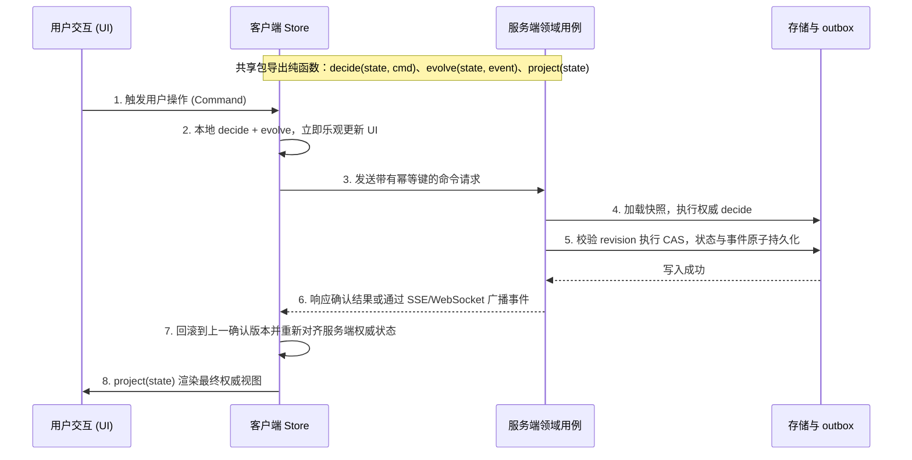

# DDD 的实现方式与取舍

## 四种做法

在不同的技术生态和工程场景中，实现 DDD 主要有四种技术做法：

| 做法 | 代表方案 | 核心内容 | 适用场景 |
|---|---|---|---|
| **Seedwork** | Microsoft eShopOnContainers 的 `SeedWork` 目录 | 提供基础抽象类与标记接口：`Entity`、`ValueObject`、空的 `IAggregateRoot` 标记接口、`IRepository<T>`、`IUnitOfWork`、`Enumeration` | 最为通用，各语言生态均可灵活借鉴 |
| **完整框架** | Java Axon（CQRS + 事件溯源）、.NET ABP、Node.js `@nestjs/cqrs`（聚合根 apply/commit + 命令/查询/事件三条总线 + saga），以及各类自研企业级框架 | 将消息总线、分布式事务、事件发布生命周期、底层持久化与快照完整打包 | 大量服务统一采用相同技术栈、标准持久化基础设施的中大型研发团队 |
| **约定 + 架构测试** | jMolecules + ArchUnit、Spring Modulith、Three Dots Labs 的 Wild Workouts（Go 语言，明确不用框架） | 不引入运行时框架，仅通过团队代码分层命名约定，辅以架构测试工具在构建期检查依赖方向与边界 | 受到很多工程团队认可的做法 |
| **函数式 / decider** | Scott Wlaschin《Domain Modeling Made Functional》；decider 模式：`decide(命令, 状态) → 事件`、`evolve(状态, 事件) → 状态`；开源库 emmett、fmodel-ts；Elm 架构的 `update(msg, model)` | 领域层完全由纯函数与不可变纯数据类型构成，不使用面向对象的复杂基类继承 | TypeScript、F#、Scala 等类型系统表达力强且使用不可变数据的语言体系 |

关于框架与 Seedwork 的本质区别，Martin Fowler 曾在专栏中援引 Michael Feathers 的观点指出：
- **框架（Framework）**本质上是一个「半成品应用」（semi-complete application），其执行流程由框架内部主导，开发者只能在框架预设的固定扩展点中填充局部业务逻辑；
- **Seedwork** 则是一组体积极小的可复用构建类与核心接口，一旦复制引入到工程中，所有权和控制权完全归业务团队所有，避免被第三方运行时框架锁定生命周期。

## CQRS 是什么、不是什么

**CQRS（Command Query Responsibility Segregation，命令查询职责分离）**的核心思想非常直接：写侧（命令）专注于聚合的状态流转与不变式校验，读侧（查询）专注于针对特定界面或报表投影读取扁平视图，两侧采用各自独立的数据模型与访问链路。

在工程落地中必须破除对 CQRS 的过度复杂化误区：
- **CQRS 不是强制要求事件总线或命令总线**：在单进程或单体应用中，引入内存命令总线往往只是增加一层抽象跳转和调用堆栈开销，直接调用应用层用例函数更加直观可靠。
- **CQRS 与事件溯源（Event Sourcing）是两回事**：CQRS 读写分离完全可以建立在普通的关系型数据库快照表之上；事件溯源（将所有历史变更以不可变事件日志全量持久化）只是写侧状态存储的一种特定选择，两者没有强绑定关系。
- 领域专家 Udi Dahan 一再提醒：绝大多数常规系统根本不需要完整复杂的全套 CQRS，仅在部分读写负载差异悬殊或视图拼装复杂的子域内做针对性读写分离即可。

### TypeScript 社区库现状

在 TypeScript 生态中，评估开源 DDD 与 CQRS 相关工具库时应保持客观审慎（截至 2026-10）：
- `@nestjs/cqrs`：设计深度绑定 NestJS 依赖注入体系与反射装饰器；
- `rich-domain` 与 `types-ddd`：依赖类继承体系，领域实体仍属于可变对象；
- `@event-driven-io/emmett`、`@castore/core`：核心前提是全面拥抱事件溯源体系，对不需要事件溯源的常规应用过重；
- `@fraktalio/fmodel-ts`：函数式 decider 理念优秀，但社区活跃度与维护状态基本处于停滞。

## 为分布式留余地：定对仓储接口

单库事务式的工作单元（Unit of Work）在单机上很方便，但系统走向分布式时反而更难迁移：**跨多个仓储的事务恰恰是分布式里做不下去、或代价很高的部分**。真正能为分布式留足演进余地的做法，不是提前引入分布式框架，而是从第一天起就定对仓储接口约定。

| 核心关注点 | 必须提前建立的接口设计约定 |
|---|---|
| **并发控制** | 统一采用乐观并发控制：仓储写方法强制要求版本号 `save(..., { expectedRevision })`，发生版本并发冲突时返回结构化 `Conflict` 错误。Postgres 版本号条件更新、Redis WATCH/Lua 脚本、etcd 的 `mod_revision`、DynamoDB 的条件写入，本质上都是 CAS（Compare-And-Swap）机制 |
| **领域事件** | 领域事件与聚合业务状态必须在同一次写入中保证落库持久化（outbox 模式）。事件至少投递一次（At-least-once），消费处理方必须具备幂等消费能力。仓储接口直接设计为接收完整载荷：`save(id, state, events, { expectedRevision })` |
| **事务边界** | 遵守「一次事务只改一个聚合」；跨聚合的数据一致性依靠异步事件驱动或 saga 机制推进；仓储层不提供跨多个仓储的全局工作单元抽象 |
| **实体标识** | 实体 ID 必须全局唯一且不依赖本地单机环境：将 `IdGenerator` 作为依赖注入，默认推荐生成 UUIDv7 或 ULID |
| **时间依赖** | 领域模型内部的不变式决策不能直接读取本地时钟；锁与超时的有效期限判定由存储端系统时间决定 |
| **数据序列化** | 聚合状态快照与领域事件必须设计为自描述的普通数据结构，显式携带 `schemaVersion` 字段；遇到无法识别的未知版本时必须返回拒绝或保留原样，避免覆盖清空已有数据 |
| **重复请求防范** | 所有能够引起状态流转的应用层用例，入口参数均显式接收 `idempotencyKey`（幂等键） |

### 仓储一致性测试清单

团队应当为仓储接口配套一套通用的一致性接口测试套件，任何新增的存储实现（无论是内存模拟、SQL 数据库还是键值存储）必须通过以下断言：
1. **版本冲突拒绝**：传入陈旧的 `expectedRevision` 时，保存请求必须被明确拒绝并抛出版本冲突错误；
2. **状态与事件原子提交**：聚合状态变更与伴随的领域事件写入必须保证原子提交，不允许出现状态成功保存而事件丢失，反之亦然；
3. **幂等键防重有效**：携带相同幂等键的重复请求，存储层必须确保逻辑只执行生效一次；
4. **版本兼容性防护**：遭遇未知或更高版本的 `schemaVersion` 时，仓储必须安全报错并拒绝写入，避免破坏性清空数据。

## 前后端共用领域模型

在全栈 TypeScript 等现代化开发中，将领域模型在前后端之间复用是一项有价值的工程实践。要达成这一目标，必须满足五个前提条件：

1. **两端同构运行**：领域层代码不 import `node:*` 等特定环境独占模块，仅使用跨端兼容的 Web 标准 API；
2. **状态纯粹是普通数据**：实体状态必须是普通结构化数据（POJO / Plain Object）。类（class）实例在经过序列化、JSON 传输、服务端渲染（SSR）注水恢复或 RPC 通信后，原型链与方法会丢失；同时 React、Solid 等前端响应式 UI 框架需要依靠不可变数据快照来进行高效的引用变更比较；
3. **服务端保持权威，客户端仅作预测**：强依赖服务端全局状态的核心不变式校验（如跨用户全局唯一性校验、数据库并发 CAS 写入）由服务端决定；前端仅在本地执行状态流转预测与乐观更新；
4. **携带版本兼容标识**：前后端应用发布节奏往往不同步，运行时可能处于不同软件版本，数据快照必须携带模式版本号；
5. **UI 仅绑定读模型，不直接绑定聚合**：前端视图层只负责绑定和渲染扁平化的投影视图（View Projection），用户的界面交互动作统一转化为结构化命令异步发送给服务端。

### 数据流转过程

社区中的典型落地案例包括：
- **Replicache / Zero**：客户端与服务端共享同一套 mutator 变更逻辑，客户端先在本地运行完成快速预测，服务端再运行一次并以它的结果为准，最后客户端对齐到服务端的状态；
- **LiveStore**：事件定义与视图物化器（materializer）在前后端两端复用；
- **TanStack DB**：在前端集合管理中内建强类型的乐观更新链路；
- **Elm 与 Foldkit**：以纯函数 `update(msg, model)` 驱动端到端状态流转；
- **Effect Atom**：在前端响应式状态管理中桥接后端的 service 依赖注入。

## Effect 在 DDD 里的位置

在 TypeScript 生态中，Effect 的核心定位是：**如何安全执行和组装带有副作用的程序**（涵盖强类型依赖注入、受控异步运行时、数据校验以及全链路追踪等能力）。Effect 并不是领域建模框架，其内部不包含聚合根、仓储或工作单元等 DDD 核心抽象，它与 DDD 战术设计是正交互补的关系：

| DDD 战术构件 | Effect 对应机制 | 契合度与评价 |
|---|---|---|
| **值对象** | `Schema` 的 brand/filter 机制、`Schema.Class` 以及 `Data` 结构相等性比较 | **强**：能够自然表达具有强类型约束、自校验且按值比对的领域值对象 |
| **聚合** | 无专门机制支持 | **不帮也不碍事**：聚合内部本就不应出现 `Effect` |
| **仓储端口** | `Context.Service` 声明抽象接口，`Layer` 负责环境实现装配 | **很强**：类型安全的依赖注入接口定义，避免运行时缺少实现的错误 |
| **应用服务** | `Effect.gen` 编排「加载 → 决策 → CAS 提交 → 抛出事件」，统一管理重试、超时与可观测追踪 | **契合度高**：编排复杂 IO 链路的合适载体 |
| **防腐层** | 利用 `Schema` 纯函数式地将外部异构载荷转换为内部强类型模型 | **强**：兼具运行时校验与类型转换能力 |

### 聚合里不该出现 Effect

**聚合里不应该出现 `Effect`**。聚合的核心职责是以同步、纯粹的方式守住核心业务规则与不变式，其逻辑中不应该包含任何不确定的 IO 副作用与并发竞争。将聚合逻辑包装在 Effect 中，会直接把领域核心绑定在特定的第三方运行时框架上。

一个实际项目里的观察：**领域层不 import Effect 的代码库，在 Effect 大版本迁移时，领域层代码不需要改动**。

引入 Effect 的工程代价同样显而易见：
- 整个应用层生态绑定 Effect 的专属概念与编程范式；
- 维护成本与认知负担较高：部分开源项目（例如 Evolu 在 6.0 版本中）正是因为整体认知复杂度高、运行时频繁变动以及异常错误堆栈不易排查等原因，最终决定移除 Effect 依赖；
- 浏览器端打包会引入额外的运行时体积负担。

因此，被大量外部应用广泛依赖的公共基础库应当保持普通纯 TypeScript 编写，仅由具体应用在自身的基础设施适配层中自行包装 Effect 集成。

## 基础库里怎么用 DDD

Eric Evans 在 DDD 战略设计中将系统的子域划分为三类：
- **核心域（Core Domain）**：业务差异化竞争力的来源，值得团队重点进行精细化领域建模；
- **支撑域（Supporting Subdomain）**：辅助核心业务运转的专门能力，进行适度建模；
- **通用子域（Generic Subdomain）**：鉴权、日志、指标收集、基础格式解析等通用基础设施，应当优先采纳成熟方案或保持极其简明的设计。

大多数基础库属于通用子域或支撑域范畴。开源社区在编写基础库时通常不会特意使用 DDD 术语，但它们的做法和 DDD 的战术模式能一一对上：

| 基础库的设计实践 | 开源优秀范例 | 对应的 DDD 架构模式 |
|---|---|---|
| 接口定义包与具体实现包严格物理拆分 | OpenTelemetry 的 `@opentelemetry/api` 与各类 `sdk-*` 实现包拆离；AI SDK 的 `@ai-sdk/provider` 独立定义带版本约束的模型接口 | 公布的语言（Published Language）、防腐层 |
| 按能力划分核心模块，平台特有逻辑交由外部依赖注入 | Effect 核心包仅声明 `FileSystem` service 抽象接口，平台实现交由 `@effect/platform-node` 等按需注入 | 端口与适配器（Hexagonal Architecture） |
| 纯函数计算内核 + 负责 IO 的外壳（Functional Core, Imperative Shell） | Gary Bernhardt 提出的经典模式：无副作用的纯计算内聚，外层封装 IO 驱动 | 领域层保持纯净无副作用 |
| 核心运行时 + 可插拔适配器（Adapter / Driver） | Vite 插件生态、unstorage 驱动机制、AI SDK 各类模型 provider | 针对各类外部系统的防腐层与适配器模式 |
| 仅在具有明确生命周期与状态转换之处专门建模 | Node.js 原生的 `FileHandle`、MCP SDK 的 `Client`、Temporal 的 `WorkflowHandle` | 聚合与一致性状态机 |

在基础库的设计中，真正值得保留的 DDD 核心要素包括：**统一语言（严谨精确的术语表）**、**防腐层思想（避免外部格式污染公开 API）**，以及**在关键有状态逻辑处建立清晰模型（不可变状态、CAS 并发校验、守卫不变式）**。至于完整的限界上下文切分、独立仓储及跨模块动态组装容器，应当留给具体的上层业务应用去决定。

## 库对外暴露：函数 + 数据，还是聚合

在设计基础库的公开 API 时，应该暴露「普通函数 + 数据结构」，还是暴露「聚合根对象」？

- **DDD 社区视角**：在限界上下文内部，聚合根是状态变更的唯一入口；但在跨越上下文边界（基础库与应用使用方之间正是这种上下游关系）时，Evans 与 Vernon 均主张采用开放主机服务与公布的语言，应用服务对外暴露扁平的 DTO 或只读模型，不直接将领域实体抛给外部调用方（共享内核模式除外）。
- **现代 TypeScript 库作者视角**：为了保障打包构建时的代码摇树优化（Tree-shaking）并缩减体积，现代前端与 Node.js 库全面将无状态操作由「类实例上的方法」重构为「纯函数 + 普通数据结构」（例如 Firebase v9 的模块化演进、AWS SDK v3 采用的 `client.send(new XxxCommand())` 架构、zod 4 推出的 `zod/mini`，以及从 moment 到 date-fns 的演进）；而对于具有长期运行生命周期的特定资源，则依然暴露带有受控方法的句柄对象（如 Node.js `FileHandle`、pg 的 `Client`、MCP SDK 的 `Client`、Temporal 的 `WorkflowHandle`）。

### API 暴露决策规则

| 待暴露的能力类型 | 推荐的 API 暴露方式 |
|---|---|
| **无状态的操作和业务查询** | 纯函数 + 普通数据结构（POJO） |
| **领域值类型（公布的语言）** | 普通数据类型定义（interface/type），配合独立的纯函数负责构造与边界校验 |
| **有生命周期、有业务不变式的聚合** | **句柄（Handle）模式**：通过工厂函数或用例创建，对外暴露精简的接口类型（Interface），底层对接安全存储，同时附加只读数据快照 |

采用句柄模式对外暴露聚合行为的核心优势：
1. **守住核心不变式**：安全凭证、令牌等敏感数据封装在闭包或内部存储中，外部无法直接伪造或随意篡改；
2. **规避 npm 依赖树多版本碰撞**：接口类型在 TypeScript 中基于结构化类型（Structural Typing）比较，若暴露的是 `class`，当用户工程的依赖树中同时打入了两个微小版本差异的库时，`instanceof` 运行时类型检查会直接失效报错；
3. **调用方测试友好**：使用方编写单元测试时只需提供一个符合接口签名的模拟对象（Fake/Stub），无需构造内部复杂的实现实例；
4. **内部实现替换平滑**：库作者在未来重构或替换底层存储引擎时，对外暴露的接口类型完全保持向后兼容。

直接对外暴露聚合 `class` 仅在一种特例下成立：即所有不变式均能在纯内存中自行完整校验，且数据的持久化和存储职责完全交由外部调用方掌控（例如 AI SDK 的 `Chat` 类支持开发者通过 `new Chat({ messages })` 直接在内存中初始化）。

## 限界上下文和 npm 包的关系

在微服务与 Monorepo 盛行的背景下，开发者容易将「限界上下文」与「npm 包」划等号。二者的划分依据存在本质差异：
- **限界上下文**按**语义维度**划分：由统一语言、领域模型边界以及数据独占权决定；
- **npm 包**按**分发维度**划分：由软件版本控制、第三方依赖拓扑、发布迭代节奏以及安装者角色决定。

在实践中需遵循以下协同规则：
1. **应用内部的限界上下文**：优先以工程目录模块进行组织，不要随意发包；若在大型 Monorepo 中为了强制代码隔离，可配置为私有的 workspace 本地依赖包；
2. **多应用复用的限界上下文**：当一个上下文需要被多个独立系统复用时，可独立发包，该 npm 包对外暴露的公开 API 集合即为其开放主机服务与公布的语言；
3. **边界映射不必是一对一**：一个 npm 包内完全可以承载多个关系紧密的上下文（通过不同的导出子路径入口分别对外暴露）；反之，一个复杂的限界上下文也可以拆分成多个协同发布的包（例如将纯净的领域模型与前后端共用类型单独抽包发布）。

### 将上下文发包时的两个典型陷阱

在将业务上下文拆分为独立 npm 包分发时，必须注意两个陷阱：
1. **单写入方假设失效**：当多个独立微服务或应用进程同时引入该 npm 包，并各自配置直连同一份底层数据存储时，传统的「单进程单写入方」事务假设不再成立。此时业务规则的不变式要求必须升级为依赖底层存储引擎的跨进程 CAS 条件写入或分布式锁协调；
2. **多版本共存导致的数据污染**：不同微服务安装的 npm 包版本更新往往存在时间差，导致旧版本代码与新版本代码同时读写同一份数据库记录。为此，持久化的聚合快照与事件载荷必须显式携带 `schemaVersion`，并且当老版本反序列化遇到未知新字段时，必须严格禁止破坏性覆盖。

## 证据对照表

| 架构结论 | 来源根据 | 位置 / 条目 | 限制与适用边界 |
|---|---|---|---|
| Seedwork 仅是一小组可复用构建基类而非框架，所有权归项目自身所有 | Martin Fowler / Microsoft | Seedwork 文档与 eShopOnContainers | 适用于不想被特定运行时框架锁定的团队；基础脚手架需团队自行维护 |
| 函数式 decider 将状态机拆解为 `decide` 与 `evolve` 纯函数 | Jérémie Chassaing / emmett | Functional Event Sourcing Decider / emmett | 最契合事件驱动与不可变数据模型架构；对于传统重度 ORM 关系映射需增加映射层 |
| 仓储接口只做单聚合 CAS，事件与状态一起写入（outbox），不提供跨仓储工作单元 | 本页分析（并发控制与 outbox 的常见做法） | 「为分布式留余地」一节 | 放弃跨表本地事务的便利，跨聚合一致性要由应用层用事件或 saga 处理 |
| 同一份变更逻辑客户端先跑做预测、服务端再跑做权威，最后对齐 | Replicache / LiveStore 文档 | mutator、事件与 materializer 的说明 | 「状态用普通数据、UI 只绑定投影」是本页据此给出的条件；乐观更新要处理预测与权威结果的对齐 |
| 聚合里不引入 Effect，领域层保持纯 TS | 本页分析 | 「Effect 在 DDD 里的位置」一节 | 领域层用普通 `Result` 或抛错，应用层再转进 Effect 的错误通道 |
| 引入 Effect 有维护代价，有项目因此移除 | Evolu 仓库 | 6.0 版本说明 | 代价因项目而异；已经全面使用 Effect 的应用，这部分代价已经付过 |

## 风险与未决问题

1. **分布式留余地与单机开发体验的权衡**：强制推行单聚合写入与 CAS 乐观并发控制，避免了分布式事务，但业务开发中需要额外编写 Outbox 扫描中继与幂等重试处理，相较于直接在单机数据库开启本地事务包住多个表，初期样板代码较多。
2. **纯函数 decider 与面向对象 ORM 的对象关系映射差异**：decider 模式在计算与测试上很纯粹，但主流企业级 ORM 框架通常依赖对象的引用跟踪和可变属性修改。在两者之间搭建物化器或持久化映射器需要额外编写适配代码。
3. **前后端共用模型时的安全与体积边界**：将领域类型完全共享至前端，虽然提升了类型与接口定义的一致性，但若划分不慎容易导致敏感的业务判定逻辑提前泄漏到客户端，或者无意间将服务端的复杂计算逻辑打包进前端产物中导致体积膨胀。

## 相关页面

- [[wiki/syntheses/architecture/ddd-bounded-context-and-aggregate|限界上下文、聚合与仓储]]：系统解析限界上下文语义边界、聚合一致性边界、facade 暴露机制以及仓储解耦。
- [[wiki/topics/architecture/uber-dig|uber/dig]]：Go 语言中基于反射的依赖注入容器工作原理，类型匹配、`dig.As` 接口绑定及与 TypeScript / Effect 的机制对比。
- [[wiki/topics/architecture/ddd|DDD]]：领域驱动设计的核心概念、统一语言与战略战术建模总览。
- [[wiki/topics/architecture/dependency-injection|Dependency Injection]]：依赖注入的核心概念、实现方式与在应用组装根中的核心落地准则。

## Source Pointers

- Martin Fowler, Seedwork: https://martinfowler.com/bliki/Seedwork.html
- Microsoft, Seedwork: https://learn.microsoft.com/en-us/dotnet/architecture/microservices/microservice-ddd-cqrs-patterns/seedwork-domain-model-base-classes-interfaces
- eShopOnContainers SeedWork: https://github.com/dotnet-architecture/eShopOnContainers/tree/main/src/Services/Ordering/Ordering.Domain/SeedWork
- Jérémie Chassaing, Functional Event Sourcing Decider: https://thinkbeforecoding.com/post/2021/12/17/functional-event-sourcing-decider
- emmett: https://event-driven-io.github.io/emmett/
- Three Dots Labs Wild Workouts: https://github.com/ThreeDotsLabs/wild-workouts-go-ddd-example
- ArchUnit: https://www.archunit.org/
- jMolecules: https://github.com/xmolecules/jmolecules
- Spring Modulith: https://spring.io/projects/spring-modulith
- Replicache: https://doc.replicache.dev/
- LiveStore: https://livestore.dev/
- Gary Bernhardt, Boundaries / Functional Core, Imperative Shell: https://www.destroyallsoftware.com/screencasts/catalog/functional-core-imperative-shell
- Evolu 移除 Effect 的说明: https://github.com/evoluhq/evolu
- Eric Evans, Domain-Driven Design (2003)；Vaughn Vernon, Implementing Domain-Driven Design (2013)
