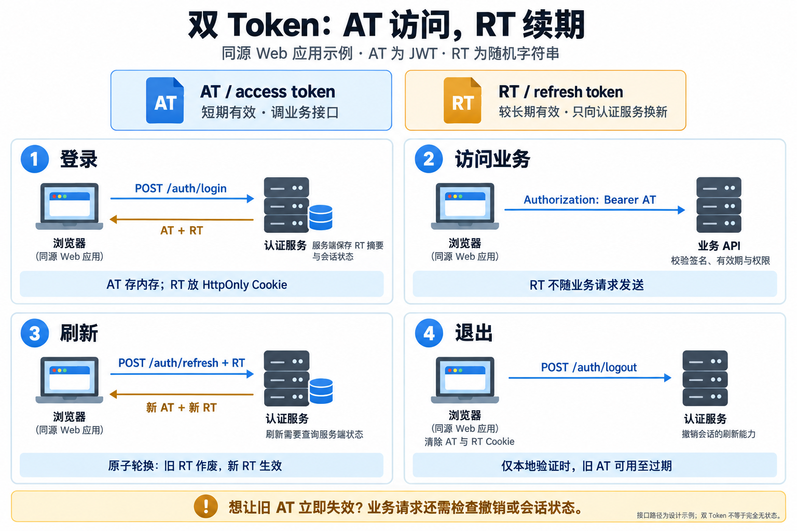
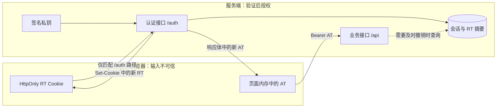
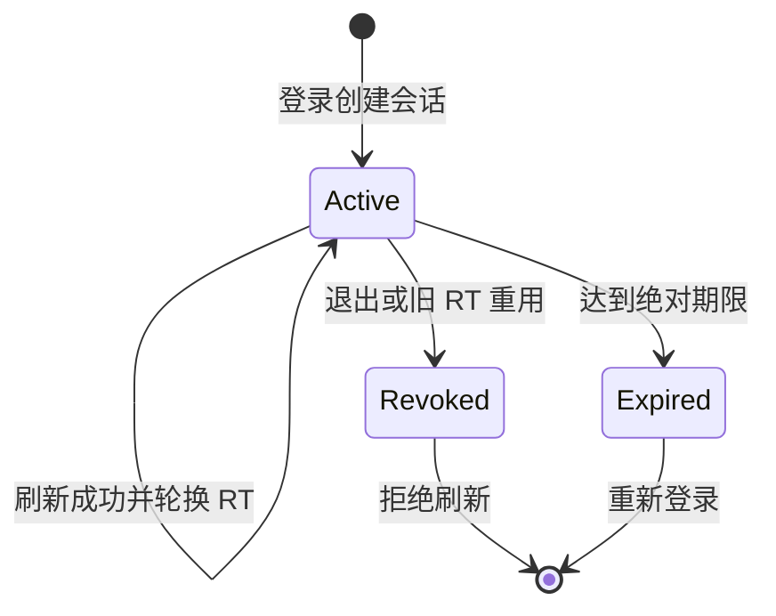

# 双 Token 登录的服务端接口设计

## 问题与范围

短期 access token（AT）负责访问，较长期 refresh token（RT）负责续期。服务端如何定义接口，并处理轮换、并发和退出？

下面是**自有同源 Web 应用的设计示例**，不是已实现的服务，也不是 OAuth 标准端点定义。浏览器通过 HTTPS 访问同一站点的 `/auth/*` 和 `/api/*`。原生 App、跨站 SPA、标准 OAuth 客户端需要另行设计存储与授权流程。

## 完整流程



图由 imagegen 生成，已核对文字与箭头；[完整提示词](../../../raw/sources/2026-09-27-dual-token-diagram-prompt.md)单独保存。“清除 RT Cookie”由服务端返回过期 Cookie 完成，页面 JS 不能直接删除 HttpOnly Cookie。

业务接口不接受 RT，刷新接口不要求 AT 尚未过期。本例允许旧 AT 在退出后继续使用到过期；需要立即失效时，要增加会话或撤销状态检查。

## 组件与信任范围



私钥只在认证服务一侧，业务服务取得公钥，校验算法、签发者、接收方和有效期后，再执行资源权限判断。JWT 中的用户 ID 不代表可以访问任意对象。[RFC 8725 §3](https://www.rfc-editor.org/rfc/rfc8725#section-3)

## 凭证与存储

| 对象 | 本例选择 | 限制 |
| --- | --- | --- |
| AT | 签名 JWT，存页面内存，有效期示例为 5 分钟 | 页面重载后通过刷新恢复 AT；内存仍可被 XSS 利用 |
| RT | 用密码学安全随机数生成，例如 32 字节后编码；放 HttpOnly Cookie | 不返回给页面 JS，不进入 URL、日志或 localStorage |
| 会话 | 每次登录创建 `session_id`，服务端保存状态与绝对过期时间 | 不同设备分别管理；同一会话中的多代 RT 关联起来 |
| RT 记录 | 保存 SHA-256 摘要及使用状态，不保存原文 | 高熵随机 RT 不同于低熵密码；摘要不能当 RT 使用 |

本例会话最长 7 天，刷新不延长这个绝对期限。新 RT 到期时间等于会话期限；AT 的 `exp` 取“当前时间 + 5 分钟”与会话期限中的较早值。**期限、随机长度和字段均是示例选择，需要按产品风险调整。**

AT 携带 `iss`、`aud`、`sub`、`iat`、`exp`，另加 `sid` 与 `auth_time`。`auth_time` 表示实际身份验证时间，不能在刷新时重置。刷新时检查账号状态，并将权限限制在原授权与当前允许范围内，不能按客户端任意提交的 scope 扩权。[RFC 9700 §4.14](https://www.rfc-editor.org/rfc/rfc9700#section-4.14)

## 服务端接口定义

下列路径、JSON 和业务错误码是本应用的接口定义。标准 OAuth token 端点有自己的请求格式与错误定义；不要混用。

| 接口 | 输入与认证 | 服务端行为 | 成功响应 |
| --- | --- | --- | --- |
| `POST /auth/login` | JSON 登录凭证，例如 username、password；启用 MFA 时先完成全部验证 | 限速、验证身份，创建会话和首个 RT；有旧 RT 时撤销被替换的浏览器会话 | `200`：AT 在响应体，RT 用 Set-Cookie 写入 |
| `GET /api/me` | `Authorization: Bearer <AT>` | 验证 AT 与资源权限，不自动延长 AT | `200`：用户信息 |
| `POST /auth/refresh` | RT Cookie，JSON `{}`，不要求 AT | 检查会话并原子轮换 RT | `200`：新 AT，覆盖 RT Cookie |
| `POST /auth/logout` | RT Cookie，JSON `{}`，允许 AT 已过期 | 撤销对应会话全部刷新能力；重复调用无额外副作用 | `204`：清除 RT Cookie；没有可识别的 RT 也清 Cookie |
| `POST /auth/logout-all` | 有效 AT，JSON `{}`；本例要求 auth_time 距今不超过 5 分钟 | 查询账号状态，撤销该用户当前全部会话；认证过旧则要求重新验证 | `204`：清当前 RT Cookie；其他设备下次刷新失败 |

退出对象来自已验证凭证，不能允许请求体中的任意 user_id 或 session_id 决定撤销对象。退出与刷新都需要访问状态存储。

### 登录和刷新响应

以下为登录成功示例，token 字符串均为占位符：

```http
HTTP/1.1 200 OK
Content-Type: application/json
Cache-Control: no-store
Pragma: no-cache
Set-Cookie: __Secure-rt=<random-token>; Path=/auth; HttpOnly; Secure; SameSite=Strict; Max-Age=604800

{"access_token":"<signed-jwt>","token_type":"Bearer","expires_in":300}
```

刷新返回相同形状，但 AT、RT 都更新；Cookie 的 Max-Age 使用**会话剩余秒数**，不重置成 7 天。expires_in 也返回本次 AT 的实际时长。不缓存敏感响应的原则见 [RFC 6749 §5.1](https://www.rfc-editor.org/rfc/rfc6749#section-5.1)。

Cookie 不设置 Domain，限定当前主机；Path 使 RT 不随本例 `/api/*` 请求发送，但不是隔离恶意同源脚本的安全机制。若改用 `__Host-` 前缀，Path 必须为 `/`，不能直接沿用上例。[MDN Cookies](https://developer.mozilla.org/en-US/docs/Web/HTTP/Guides/Cookies)

退出成功返回 `204`，并用相同名称、Path、Domain 范围设置 `Max-Age=0` 删除 RT Cookie。浏览器同时清除内存 AT。退出超时只能确认本地处理结果，不能宣称服务端已撤销；界面应提示退出尚未确认，并允许重试。

### 错误与客户端行为

示例响应：`{"error":{"code":"AT_EXPIRED","message":"Access token expired"}}`，不包含原 token 或内部敏感信息。

| 情况 | HTTP / code | 客户端处理 |
| --- | --- | --- |
| AT 过期，其余验证通过 | `401 AT_EXPIRED` | 尝试一次共享的刷新流程 |
| AT 缺失或无效 | `401 UNAUTHENTICATED` | 转登录或报告失败，不无限刷新 |
| 身份有效但权限不足 | `403 FORBIDDEN` | 不刷新；刷新不能自动获得权限 |
| RT 无效、到期、已撤销或重用 | `401 SESSION_EXPIRED`，清 RT Cookie | 停止刷新并重新登录；内部日志区分原因 |
| 请求来源不符合约定 | `403 REQUEST_ORIGIN_REJECTED` | 拒绝请求，不撤销正常会话，不修改 Cookie |
| 登录凭证错误 | `401 INVALID_CREDENTIALS` | 不区分账号不存在与密码错误 |
| 频率超限 | `429 RATE_LIMITED` | 按 Retry-After 等待 |
| 刷新存储或签名服务不可用 | `503 AUTH_UNAVAILABLE` | 不发新 token；按后文处理不确定结果 |

Bearer 接口的 401 还应附适当的 WWW-Authenticate 头，标准语义见 [RFC 6750 §3](https://www.rfc-editor.org/rfc/rfc6750#section-3)。

## 原子轮换与数据记录

建议至少记录两类数据，表名由实现决定：

- `auth_sessions`：id、user_id、status、auth_time、expires_at、revoked_at。
- `refresh_tokens`：唯一 token_hash、session_id、expires_at、used_at、replaced_by。

不要立即删除已消费 RT 的摘要，否则无法识别旧 RT 重用。保留轮换关系至少直到会话绝对到期，再按保留策略清理。[RFC 9700 §4.14.2](https://www.rfc-editor.org/rfc/rfc9700#section-4.14.2)

```text
验证来源与格式；计算 RT 摘要并定位记录
开始事务，锁定会话，再重新读取 RT 和账号状态
  会话失效或账号不可用 -> 拒绝
  RT 已消费 -> 撤销该会话，提交撤销后返回认证失败
  RT 不存在或到期 -> 拒绝
  生成新 RT、签发权限不扩大的新 AT
  标记旧 RT 已消费，写入新 RT 摘要及关系
事务提交成功 -> 返回 AT 并写入新 RT Cookie
失败 -> 不返回新 token
```

示例使用会话行锁与事务。Redis 实现须用 Lua 等等价原子操作，不能拆成 GET、判断和 SET。签发失败回滚轮换；检测到重放时，撤销必须提交，不能被随后抛出的错误一起回滚。



## 并发与响应丢失

多个业务请求可能同时返回 AT_EXPIRED。客户端应共享一个进行中的刷新请求，其他请求等待；多标签页还要跨标签页协调。客户端协调不能代替服务端原子检查。

本例采用**严格单次使用 RT**：相同 RT 并发到达时，至多一次轮换成功；后一个请求看到已消费状态后撤销该会话。因此，并发错误和“服务端已提交、响应却丢失”也可能使正常用户重新登录。服务端无法仅凭旧 RT 判断请求来自攻击者还是网络重试。

客户端无法确认刷新结果时，不盲目重发旧 RT，本例选择重新登录。如果产品必须支持无感重试，需要另行设计短期幂等结果复用、调用方绑定和受保护的结果缓存；同一操作不能再次轮换。仅有客户端提供的幂等键不证明调用方可信，也不要让旧 RT 在宽限期内任意换新。

刷新后不无条件重放支付、发帖等有副作用的原请求。只有明确在执行前因 AT 过期被拒绝，或业务本身支持幂等处理时才自动重试；最多一次，避免循环。

## 退出后的旧 AT

撤销会话让刷新失败，但只做本地校验的业务服务不知道会话已撤销。如要求退出、改密或封号后旧 AT 立即失效，业务请求须查询 sid 状态或撤销版本。缓存更新速度决定实际延迟，状态存储故障时的行为也须明确。

退出与刷新应使用同一套会话同步方式：刷新先完成，退出就须撤销新 RT；退出先完成，刷新就须失败。不能只删除客户端提交的某一代 RT。全部退出还要协调各会话的刷新，确保退出完成后，已撤销会话不能继续签发凭证。

## Cookie 接口的 CSRF 防护

本例所有 `/auth/*` POST 要求 JSON、`X-CSRF-Guard: 1`，并将 Origin 与服务端配置的完整可信源精确比较。缺失、null 或不匹配则拒绝；CORS 不向第三方源开放这些带凭证请求。登录、刷新和退出都遵守这条约定。

固定自定义头不是秘密，它依赖浏览器同源与预检限制；不能代替用户认证。SameSite 是额外限制，HttpOnly 不能阻止 XSS 代发请求。来源验证不使用域名后缀匹配，也不信不可信 Host 头推导出的允许源。[OWASP CSRF Prevention](https://cheatsheetseries.owasp.org/cheatsheets/Cross-Site_Request_Forgery_Prevention_Cheat_Sheet.html#employing-custom-request-headers-for-ajaxapi)

## 实现时的验收场景

| 场景 | 预期结果 |
| --- | --- |
| 登录、单次刷新 | AT 与 RT 按定义返回；RT 不出现在 JSON；轮换不延长绝对期限 |
| 同一 RT 并发刷新 | 至多一次轮换成功，后续按严格重用策略处理 |
| 轮换提交后响应丢失 | 不无限重试，按明确策略重新登录 |
| 存储事务失败 | 没有部分消费 RT，不返回未提交的新 token |
| 退出与刷新并发 | 退出完成后，该会话的所有 RT 都不能刷新 |
| 账号禁用或权限收回 | 不签发超出当前权限的 AT；旧 AT 遵守所选撤销策略 |
| 跨站请求 | 拒绝且不修改既有会话或 Cookie |
| 403 或业务执行结果不确定 | 不用刷新循环重试有副作用的操作 |

这些是待实现服务的验收场景，不表示本仓库运行过认证服务测试。

## 依据与未决问题

| 结论或设计 | 依据 | 限制 |
| --- | --- | --- |
| RT 换取 AT，敏感响应不缓存 | RFC 6749 §5.1、§6 | 本页端点是自定义设计 |
| RT 轮换保留关系，处理旧 RT 重用 | RFC 9700 §4.14.2 | 并发与重试体验需自行设计 |
| 验签后仍须验证 claims | RFC 8725 §3 | 资源权限由业务检查 |
| Cookie 属性与 CSRF 控制各有用途 | MDN Cookies、OWASP CSRF | 本例只适用于同源 Web |
| 期限、路径、表结构和严格重试策略 | 本页设计示例 | 尚未实现或进行负载测试 |

上线前仍需确定：旧 AT 撤销时效、重新登录的体验、MFA、密钥轮换及存储故障策略。不需要这套复杂度时仍可选择服务端 Session，见 [[wiki/comparisons/architecture/session-vs-jwt-vs-dual-token|Session vs JWT vs 双 Token]]。

## 相关页面与来源

- [[wiki/comparisons/architecture/session-vs-jwt-vs-dual-token|Session vs JWT vs 双 Token]]、[[wiki/topics/architecture/jwt|JWT]]、[[OAuth]]
- [RFC 6749](https://www.rfc-editor.org/rfc/rfc6749)
- [RFC 6750](https://www.rfc-editor.org/rfc/rfc6750)
- [RFC 9700](https://www.rfc-editor.org/rfc/rfc9700)
- [RFC 8725](https://www.rfc-editor.org/rfc/rfc8725)
- [MDN Cookies](https://developer.mozilla.org/en-US/docs/Web/HTTP/Guides/Cookies)
- [OWASP CSRF Prevention](https://cheatsheetseries.owasp.org/cheatsheets/Cross-Site_Request_Forgery_Prevention_Cheat_Sheet.html)
