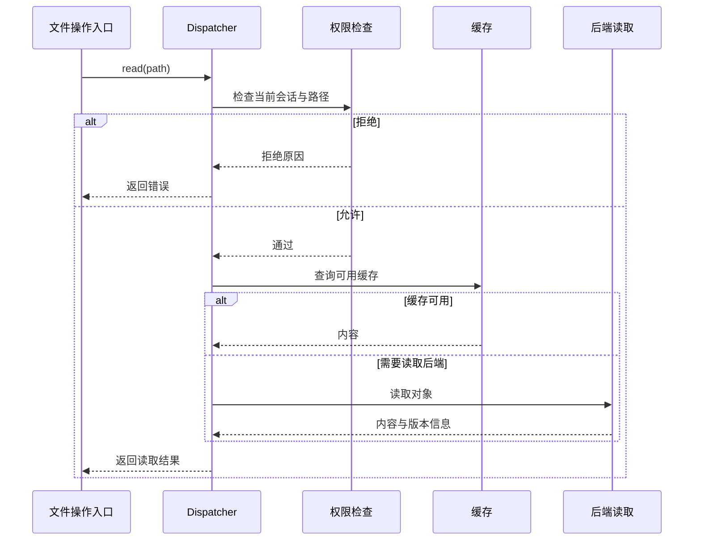
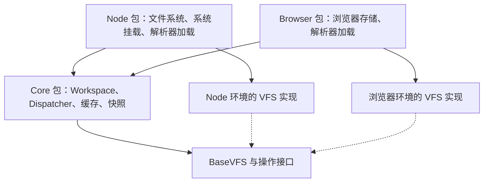
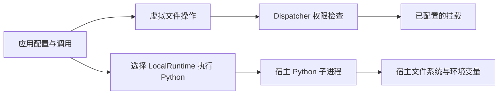

# 从 Mirage 学多后端工具的设计

## 要回答的问题

把 S3、Slack、GitHub 等服务接入同一个 agent 工具时，哪些行为应当统一，哪些差异必须保留？

本页以 Mirage 提交 `95a3a1f` 的 TypeScript 实现为主，结合已读的 Python 实现。下文先说明源码事实，再给出本页判断；未运行项目测试、浏览器构建或性能评测。工具用途和四项具体机制见 [[wiki/topics/ai/mirage|Mirage]]。

## 1. 统一调用方式，不承诺所有后端都能做同样的事

**源码事实**：`BaseVFS` 分别声明能否缓存读取结果（`cachesReads`）、能否为快照记录内容标记（`supportsSnapshot`）、能否核对缓存内容是否变化（`readRevalidatable`）等能力。对于缓存文件内容的后端，如果调用者要求核对缓存内容是否已变化（`fresh` 策略），但后端无法提供可比较的内容标记（如 `ETag`），`checkReadCapability()` 会拒绝配置。[能力定义](https://github.com/strukto-ai/mirage/blob/95a3a1f447b9f48bc8249069241e0a0fc9a6b723/typescript/packages/core/src/vfs/base.ts#L196-L251)、[配置检查](https://github.com/strukto-ai/mirage/blob/95a3a1f447b9f48bc8249069241e0a0fc9a6b723/typescript/packages/core/src/workspace/mount/read_policy.ts#L126-L149)、[对应测试](https://github.com/strukto-ai/mirage/blob/95a3a1f447b9f48bc8249069241e0a0fc9a6b723/typescript/packages/core/src/workspace/mount/read_policy.test.ts#L259-L273)

**值得借鉴**：相同的 `read` 接口不代表相同的数据保证。让调用者写同一种操作，同时明确每个后端能做到什么；满足不了调用者要求时直接报错，比悄悄改成较弱的行为更容易排查。

**适用与代价**：适合确实需要切换存储、搜索或消息服务的工具。代价是必须持续核对能力声明与实际行为；增加一个布尔字段不等于已经实现该能力。只接一个服务时，通常不需要先建完整的多后端框架。

## 2. 不同入口共用操作检查，缓存也遵守同一规则

**源码事实**：core 的 `Workspace` 把 `ws.vfs` 的操作交给 `Dispatcher`，代码说明 shell、程序调用和 FUSE 的文件操作共用这条流程；分发器先检查权限，再决定是否返回缓存。[工作区装配](https://github.com/strukto-ai/mirage/blob/95a3a1f447b9f48bc8249069241e0a0fc9a6b723/typescript/packages/core/src/workspace/workspace/workspace.ts#L418-L479)、[分发顺序](https://github.com/strukto-ai/mirage/blob/95a3a1f447b9f48bc8249069241e0a0fc9a6b723/typescript/packages/core/src/workspace/dispatcher/dispatcher.ts#L458-L584)

下面以已解析路径的一次文件读取为例，省略目录解析和输出限制：

**值得借鉴**：权限应放在实际读取、写入必经的位置，不能只在工具描述、提示词或某一个 UI 入口里检查。缓存属于取数据的优化，不应创造另一套访问规则。测试也应验证同一限制经过不同入口、有无缓存时是否仍然成立；Mirage 的测试会对比受限会话在有缓存、无缓存时的命令结果。[跨缓存状态的权限测试](https://github.com/strukto-ai/mirage/blob/95a3a1f447b9f48bc8249069241e0a0fc9a6b723/typescript/packages/core/src/workspace/state_doors.test.ts#L2557-L2590)

**适用与代价**：适合同时提供 CLI、SDK、Web API 等入口的系统。集中检查减少漏检，但分发器会承担路径解析、权限、缓存和错误处理等复杂性；本文不据此认定 Mirage 的模块大小或拆分方式就是最佳方案。

## 3. 共用核心逻辑，把环境相关实现放在各自包里

**源码事实**：Node 与浏览器的 `Workspace` 都继承 core 的工作区。Node 从文件系统加载解析器的 WASM 文件，并处理系统挂载；浏览器从打包进去的 Base64 数据构造 WASM 字节。两者都通过 `shellParserFactory` 交给核心工作区使用，各自还负责恢复本环境支持的 VFS。[Node Workspace](https://github.com/strukto-ai/mirage/blob/95a3a1f447b9f48bc8249069241e0a0fc9a6b723/typescript/packages/node/src/workspace.ts#L16-L88)、[Browser Workspace](https://github.com/strukto-ai/mirage/blob/95a3a1f447b9f48bc8249069241e0a0fc9a6b723/typescript/packages/browser/src/workspace.ts#L16-L70)

下图表示包之间的依赖，箭头不是一次请求的执行顺序：

**值得借鉴**：跨环境复用应围绕不变的行为展开，把“从哪里加载文件、怎样连接环境能力”交给外层装配。使用这种方式，可以让权限和缓存规则共用一份实现，同时让 Node、浏览器采用不同的资源加载方式。

**适用与代价**：适合已经同时需要服务端和浏览器版本的 SDK。环境差异不会因此消失：仍要维护各环境的服务支持、打包资源与测试；本次未做打包分析，不能把包的拆分直接解读为包体小或性能更好。

### 共用文件接口，不等于共用隔离范围

Node 包的 `LocalRuntime` 会调用 `spawn()` 启动本机 Python，并合并宿主环境变量。它执行代码时可接触宿主环境，不能套用虚拟文件操作的访问范围。[LocalRuntime 实现](https://github.com/strukto-ai/mirage/blob/95a3a1f447b9f48bc8249069241e0a0fc9a6b723/typescript/packages/node/src/runtime/python/local/runtime.ts#L16-L91)

本页判断：评价一个 agent 执行工具的隔离能力时，应分别检查文件操作和代码执行能访问哪里，不能因为它有“虚拟文件系统”就推断所有执行模式都已隔离。

## 4. 让快照明确说明自己能恢复到什么程度

**源码事实**：TS 的 `installDriftState()` 把有版本号的路径交给对应版本读取，把只有内容标记的路径加入变化检查；`captureFingerprints()` 会在后续修改无法提供新标记时删除旧记录。它没有把“保存了会话”当成“保存了全部远端内容”。[恢复逻辑](https://github.com/strukto-ai/mirage/blob/95a3a1f447b9f48bc8249069241e0a0fc9a6b723/typescript/packages/core/src/workspace/snapshot/drift.ts#L126-L164)、[记录更新](https://github.com/strukto-ai/mirage/blob/95a3a1f447b9f48bc8249069241e0a0fc9a6b723/typescript/packages/core/src/workspace/snapshot/drift.ts#L228-L267)

**值得借鉴**：给 agent 做恢复、重试或复现功能时，先回答三个不同的问题：任务步骤还在不在，读取的数据能否找回，已经发生的外部修改能否撤销。Mirage 这里的设计处理前两类信息的一部分；不能据此承诺第三类能力。

**适用与代价**：适合读取远端数据的长任务、调试记录和可复现分析。若真正要求离线、完整复现，就还需要保存原始输入，并考虑保存成本与敏感数据；只记录版本号仍依赖远端保留那个版本。

## 证据与限制

| 判断 | 已读证据 | 本次能确认到哪里 |
| --- | --- | --- |
| 共用接口应保留后端能力差异 | [BaseVFS](https://github.com/strukto-ai/mirage/blob/95a3a1f447b9f48bc8249069241e0a0fc9a6b723/typescript/packages/core/src/vfs/base.ts#L196-L251)、[checkReadCapability](https://github.com/strukto-ai/mirage/blob/95a3a1f447b9f48bc8249069241e0a0fc9a6b723/typescript/packages/core/src/workspace/mount/read_policy.ts#L126-L149) | 已核对字段与拒绝分支，未逐个实测后端。 |
| 权限应先于缓存返回 | [Dispatcher](https://github.com/strukto-ai/mirage/blob/95a3a1f447b9f48bc8249069241e0a0fc9a6b723/typescript/packages/core/src/workspace/dispatcher/dispatcher.ts#L458-L584)、[权限测试](https://github.com/strukto-ai/mirage/blob/95a3a1f447b9f48bc8249069241e0a0fc9a6b723/typescript/packages/core/src/workspace/state_doors.test.ts#L2557-L2590) | 已读实现和断言，未运行测试，也不是完整安全审计。 |
| 环境相关装配与核心逻辑分离 | [Node 入口](https://github.com/strukto-ai/mirage/blob/95a3a1f447b9f48bc8249069241e0a0fc9a6b723/typescript/packages/node/src/workspace.ts#L16-L88)、[浏览器入口](https://github.com/strukto-ai/mirage/blob/95a3a1f447b9f48bc8249069241e0a0fc9a6b723/typescript/packages/browser/src/workspace.ts#L16-L70) | 已核对继承和参数注入，未验证全部依赖或浏览器构建。 |
| 快照应区分变化检测与旧版本读取 | [installDriftState](https://github.com/strukto-ai/mirage/blob/95a3a1f447b9f48bc8249069241e0a0fc9a6b723/typescript/packages/core/src/workspace/snapshot/drift.ts#L126-L164)、[captureFingerprints](https://github.com/strukto-ai/mirage/blob/95a3a1f447b9f48bc8249069241e0a0fc9a6b723/typescript/packages/core/src/workspace/snapshot/drift.ts#L228-L267) | 已核对控制流程，远端旧版本仍可能过期。 |

## 当前风险与未决问题

- **统一文件表示是否适合业务操作？** 文件路径适合浏览和读取，但创建 issue、发送消息等动作仍有业务字段与权限。不能只因读取方式统一，就推断业务接口也能全部化成文件写入。
- **两种语言和多个运行环境是否始终一致？** 本次核对了四项机制及部分入口，没有验证所有命令、服务、错误处理和取消行为一致。
- **是否值得为自己的项目引入整套架构？** 若只是固定的两个 API 调用，显式调用通常更简单；只有多种入口、后端或环境确实需要共用规则时，上述拆分才有明确收益。这是本页的应用判断，不是对 Mirage 的性能评测。

## 相关页面与来源

- [[wiki/topics/ai/mirage|Mirage：用途与具体实现]]
- [[wiki/syntheses/ai/agent-native-system-interface-design|Agent Native 系统接口设计]]
- [[raw/sources/2026-10-07-mirage|Mirage 文档与源码阅读记录]]
- [固定源码提交](https://github.com/strukto-ai/mirage/tree/95a3a1f447b9f48bc8249069241e0a0fc9a6b723)
