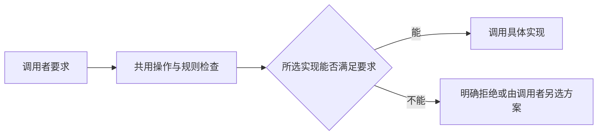

# 统一接口应该隐藏哪些差异

## 问题

把多个服务放在同一套接口后，调用者确实可以少写一些接入代码。但一个服务能取回旧版本，另一个只能读取当前内容；一个运行环境只能访问虚拟文件，另一个能启动本机进程。这些差异也应该被隐藏吗？

## 综合结论

**统一接口应隐藏完成同一件事的不同做法，保留会改变结果或使用条件的差异。** 判断两种实现能否替换，不能只看方法名和参数是否一致，还要看它们能否满足调用者对权限、数据和失败行为的要求。

[[wiki/topics/architecture/software-design|Software Design]] 用只读文档举过一个例子：工具栏真正关心的是“文档能否编辑”，不需要知道登录和权限系统如何得到这个答案。[[wiki/topics/architecture/dependency-injection|依赖注入]]则把服务的创建、选择与使用分开。两者共同说明，好的抽象是让调用者依赖自己需要的行为，而不是依赖行为背后的实现细节。

[[wiki/topics/ai/mirage|Mirage]] 的文件接口补充了另一个条件：**被隐藏的实现细节，不能变成被隐瞒的能力缺失。** `read` 可以把不同服务的请求方式藏起来，却不能让“不支持版本读取”的服务看起来具备恢复旧数据的能力。

## 接入细节可以隐藏，结果保证必须说明

Node 从文件系统加载解析器，浏览器从内嵌数据加载解析器，只要二者都能提供约定的解析功能，核心工作区就不需要知道加载方式。Mirage 通过 `shellParserFactory` 接收解析器创建函数，把这项差异留在各环境的入口。这延续了“创建与使用分开”的思路。[Node 入口](https://github.com/strukto-ai/mirage/blob/95a3a1f447b9f48bc8249069241e0a0fc9a6b723/typescript/packages/node/src/workspace.ts#L16-L88)、[浏览器入口](https://github.com/strukto-ai/mirage/blob/95a3a1f447b9f48bc8249069241e0a0fc9a6b723/typescript/packages/browser/src/workspace.ts#L16-L70)

能否核对缓存内容已经变化，则不是纯粹的接入细节。调用者要求这项能力时，后端需要提供可比较的内容标记。Mirage 对缓存文件内容却无法提供这种标记的后端，会拒绝 `fresh` 配置，而不是改用较弱的缓存策略后仍报告配置成功。[能力检查](https://github.com/strukto-ai/mirage/blob/95a3a1f447b9f48bc8249069241e0a0fc9a6b723/typescript/packages/core/src/workspace/mount/read_policy.ts#L126-L149)

这两种差异可以用一个问题区分：**替换实现后，调用者原本依赖的条件还成立吗？** 加载方式改变而解析行为不变，可以隐藏；缓存校验变成未经校验就返回数据，必须让调用者知道。

## 共用的规则应由共用的执行流程保证

当接口承诺“只能读取有权限的数据”时，这条要求应当约束每一次实际读取。若 SDK 检查权限，而 CLI 或缓存返回没有检查，同一个接口的含义就会随入口改变。

Mirage 把文件操作交给共用分发器，并在返回缓存之前检查权限。这个例子说明，统一接口的价值不只是减少调用方式，还在于让使用者依赖的规则有共同的执行位置。缓存可以改变数据从哪里取，却不能改变谁有权读取。[工作区装配](https://github.com/strukto-ai/mirage/blob/95a3a1f447b9f48bc8249069241e0a0fc9a6b723/typescript/packages/core/src/workspace/workspace/workspace.ts#L458-L479)、[权限与缓存的顺序](https://github.com/strukto-ai/mirage/blob/95a3a1f447b9f48bc8249069241e0a0fc9a6b723/typescript/packages/core/src/workspace/dispatcher/dispatcher.ts#L458-L584)

图表达的是由这些案例归纳的设计关系，不是 Mirage 的完整调用顺序。能力检查可以发生在配置阶段，权限检查则需要结合执行时的会话和路径。

## 能力要按调用者的问题拆开

“支持快照”这样的单个标签容易隐藏不同层次的能力。恢复任务记录、检查远端内容是否变化、取回旧内容、撤销已经发生的外部修改，回答的是四个不同的问题。

Mirage 在恢复时区分内容标记与版本号：前者用于检查变化，后者用于请求指定版本。这支持一个更一般的判断：**能力声明应说明能完成什么，而不只是给实现贴上一个功能名称。** 调用者需要历史内容时，仅有变化检测就不够；即使能取回历史内容，也不等于能撤销已发送的消息。[快照恢复](https://github.com/strukto-ai/mirage/blob/95a3a1f447b9f48bc8249069241e0a0fc9a6b723/typescript/packages/core/src/workspace/snapshot/drift.ts#L126-L164)

同理，“虚拟文件系统”说明的是一类文件操作如何访问数据，不能据此推断所有代码执行都受同样限制。Mirage 的 Node `LocalRuntime` 会启动宿主 Python；它的访问范围需要单独判断。[LocalRuntime](https://github.com/strukto-ai/mirage/blob/95a3a1f447b9f48bc8249069241e0a0fc9a6b723/typescript/packages/node/src/runtime/python/local/runtime.ts#L16-L91)

因此，接口设计时应先找出调用者会依赖哪些条件，再决定哪些条件由所有实现共同保证，哪些需要声明为可选能力。不应先把多个服务包装成相同的方法，再把无法对齐的差异留到运行出错时才解释。

## 适用范围与未决问题

这套判断适用于确实存在多个后端、入口或运行环境，而且希望调用代码保持稳定的系统。若只有几个固定调用，直接写明各自行为通常更简单，不必为了可替换性预建能力框架。

它也不能解决所有一致性问题。能力声明可能与实现不符；权限检查的位置正确，也不证明全部路径都无法绕过。仍需用“替换实现后结果是否符合要求”的测试来验证，包括不支持的能力、缓存命中和失败场景。

本页还没有回答统一接口的最佳粒度：文件读取适合按路径操作，创建 issue 或发送消息仍可能需要业务字段与业务命令。应统一到哪一层，要由真实任务决定，不能仅从一个项目推出通用答案。

## 依据与相关页面

| 综合判断 | 依据 | 限制 |
| --- | --- | --- |
| 隐藏创建与接入细节，保留调用者需要的行为 | [[wiki/topics/architecture/software-design\|软件设计笔记]]、[[wiki/topics/architecture/dependency-injection\|依赖注入]]、Mirage 的环境入口 | 不意味着所有实现都可任意替换。 |
| 共同保证需要共同的执行检查 | Mirage 的权限与缓存分发顺序 | 源码案例，不是完整安全审计。 |
| 能力应按实际保证拆分 | Mirage 的读取策略、快照恢复和 LocalRuntime | 已静态核对相关 Python、TS 实现；未运行 Mirage 测试。 |

- [[wiki/topics/ai/mirage|Mirage]]：项目介绍、代码位置、实现图与具体机制。
- [[raw/sources/2026-10-07-mirage|Mirage 来源记录]]：文档摘录与源码阅读范围。
