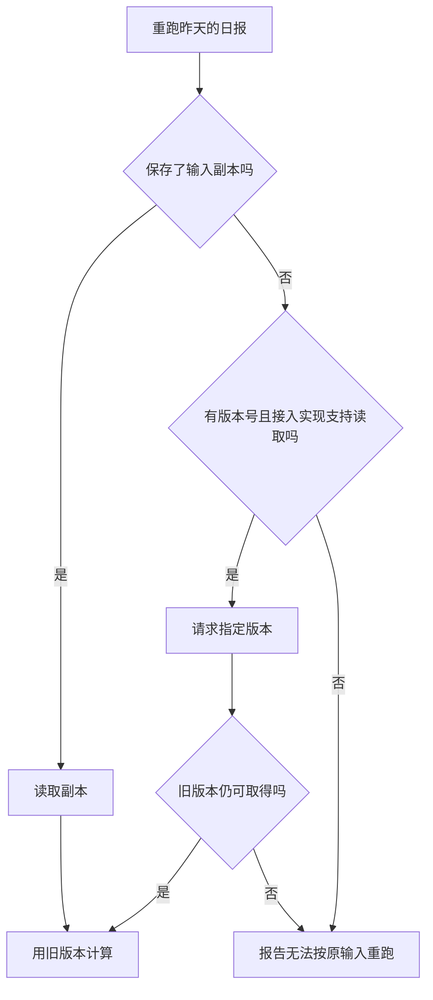

# 从 S3 或网盘读取报表：哪些代码共用，哪些检查保留

## 同一份日报，文件可能来自两个地方

假设要写一个日报程序：读取 `sales.csv`，计算当天销售额，再生成报表。有的客户把文件放在 S3，有的放在网盘。程序中途失败时，还要能用**上一次读到的那份文件**重跑，避免两次算出不同结果。

这是一个用于说明设计的例子，不是已经部署的报表系统。设定为：S3 接入能按版本号取回文件，网盘接入只实现了读取当前文件。这里说的是这两份接入代码的能力，不是说所有网盘都不支持历史版本。

可以共用销售额计算、报表生成和读取前的权限检查。S3 的 bucket、网盘的文件 ID、请求怎么发送，分别由各自的读取实现处理。但“网盘接入不能取回旧版本”必须让重跑程序知道，不能用同一个方法名把这个差异藏掉。

这个分工把 [[wiki/topics/architecture/software-design|软件设计笔记]]中“使用者只依赖自己需要的行为”和 [[wiki/topics/architecture/dependency-injection|依赖注入]]中“创建与使用分开”落实到一个具体问题：报表程序只需要文件内容，但重跑程序还需要确认这是指定版本的内容。

## 第一次生成日报：把存储选择放在启动时

如果把存储选择写进报表计算，读取、校验、重试时都可能出现 `if (source === "s3")`。可以改为在启动时选择读取实现，报表计算只接收读取函数：

```ts
// 设计示意，不是 Mirage API；省略 CSV 解析和错误处理。
type ReadSales = () => Promise<Uint8Array>;

async function buildDailyReport(readSales: ReadSales) {
  const csv = await readSales();
  return calculateSales(csv);
}

// 启动时根据客户配置，选择封装了连接信息与权限检查的实现。
const readSales = config.storage === "s3"
  ? readSalesFromS3
  : readSalesFromDrive;

await buildDailyReport(readSales);
```

这样更换存储时，销售额计算不用跟着修改。连接信息也不必一层层传给报表函数。Mirage 的 Node 与浏览器入口采用了同类分工：各自提供解析器的创建方法，核心工作区使用解析器，不负责决定从磁盘还是内嵌数据加载它。[Node 入口](https://github.com/strukto-ai/mirage/blob/95a3a1f447b9f48bc8249069241e0a0fc9a6b723/typescript/packages/node/src/workspace.ts#L16-L88)、[浏览器入口](https://github.com/strukto-ai/mirage/blob/95a3a1f447b9f48bc8249069241e0a0fc9a6b723/typescript/packages/browser/src/workspace.ts#L16-L70)

但上面这个简单接口只能表达“给我文件内容”，还没有解决重跑问题。

## 重跑昨天的日报：重新读取，不一定读到同一份文件

昨天程序读到文件后失败了，今天文件已经被更新。此时再调用 `readSales()`，即使成功拿到了 CSV，也可能是在用新数据重算昨天的报表。

重跑需要单独决定如何保存输入：

| 第一次读取时保存什么 | 重跑时怎么做 | 做不到时怎么办 |
| --- | --- | --- |
| 文件内容的副本 | 直接读取保存的副本 | 副本丢失就报告无法按原输入重跑。 |
| 文件 ID 和可用的版本号 | 请求指定版本，并要求远端仍保留该版本 | 版本不存在就报错，不改读最新版。 |
| 只有内容标记，例如 ETag | 比较当前文件是否变化 | 能发现变化，但不能仅凭标记找回旧内容。 |

Mirage 的快照恢复也区分后两种情况：有版本号时记录要读取的版本，只有内容标记时安排变化检查。S3 读取会把保存的 `VersionId` 传给对象读取请求。[恢复逻辑](https://github.com/strukto-ai/mirage/blob/95a3a1f447b9f48bc8249069241e0a0fc9a6b723/typescript/packages/core/src/workspace/snapshot/drift.ts#L126-L164)、[S3 读取](https://github.com/strukto-ai/mirage/blob/95a3a1f447b9f48bc8249069241e0a0fc9a6b723/typescript/packages/core/src/core/s3/read.ts#L46-L86)

因此，这个报表程序如果必须支持原输入重跑，就要为只读当前文件的网盘接入保存输入副本，或者明确不提供原输入重跑。**不能把“读到了文件”当成“读到了上次那份文件”。**



这是本例的重跑设计，不是 Mirage 快照的完整实现。保存副本还需要考虑存储费用、数据访问权限和删除期限。

## 缓存里已经有文件，也不能省掉权限检查

假设管理员读取过销售文件，内容已经进入缓存。随后一个没有权限的账号请求生成日报，如果程序先查缓存、命中后直接返回，就会把管理员读过的内容交给这个账号。

本例应当把当前账号和文件的权限检查放在缓存返回之前；无论请求来自定时任务、网页还是 CLI，都经过同一条读取流程。Mirage 的分发器采用了这个顺序，相关测试还比较了受限会话在有缓存、无缓存时的命令结果。[分发顺序](https://github.com/strukto-ai/mirage/blob/95a3a1f447b9f48bc8249069241e0a0fc9a6b723/typescript/packages/core/src/workspace/dispatcher/dispatcher.ts#L458-L584)、[权限测试](https://github.com/strukto-ai/mirage/blob/95a3a1f447b9f48bc8249069241e0a0fc9a6b723/typescript/packages/core/src/workspace/state_doors.test.ts#L2557-L2590)

还要区分“缓存未过期”和“远端文件没变化”。如果产品要求返回缓存前核对文件变化，接入实现就需要提供可比较的内容标记。Mirage 会拒绝无法满足这项要求的文件缓存配置。它不会把“保留缓存一段时间”悄悄当成“已经核对远端内容”。[读取策略检查](https://github.com/strukto-ai/mirage/blob/95a3a1f447b9f48bc8249069241e0a0fc9a6b723/typescript/packages/core/src/workspace/mount/read_policy.ts#L126-L149)

## 从这个例子得到的设计结论

共用代码之前，先把任务要求写成可检查的结果。本例的要求是：第一次能读到文件；重跑使用原输入；每次访问都符合当前权限。然后再决定如何拆分：

- **报表计算**只处理文件内容，不决定 bucket、文件 ID 或登录方式。
- **各存储的读取实现**处理连接与请求，并明确能否读取指定版本、能否核对文件变化。
- **共用读取流程**负责执行权限等共同要求，不能因为某条路径走了缓存就跳过。
- **重跑流程**根据保存的副本或版本信息决定如何读取；条件不满足时明确失败。

这比先规定“所有存储都实现一个 `read()`”，再碰到问题补分支更容易检查。换一个存储是否可行，也有了具体判断方法：它能否通过下面这些场景，而不只是能否编译。

| 场景 | 应检查的结果 |
| --- | --- |
| 把 S3 换成网盘读取实现 | 报表计算不需要改动，输入内容相同时计算结果一致。 |
| 第一次读取后，远端文件更新 | 原输入重跑仍使用副本或指定旧版本；无法取得时失败。 |
| 管理员预热缓存，无权限账号随后读取 | 仍然拒绝无权限账号。 |
| 配置要求核对文件变化，接入实现做不到 | 配置或调用明确报错，不悄悄返回未经校验的缓存。 |

这些是本例建议的测试场景，不表示已经实现并运行了报表程序。

## 采用前还要确定什么

重跑是否必须使用原输入，需要由产品需求决定。如果允许使用新数据重新生成，就应该明确称为重新生成，并记录使用了哪份输入，不必强行增加版本恢复功能。

如果只有一个存储，且没有更换需求，直接调用它的接口即可。这个例子不要求为每个函数建立接口或容器；它只把已经出现的两种读取实现，以及二者必须遵守的要求分开。

## 依据与相关页面

| 判断 | 来源 | 说明 |
| --- | --- | --- |
| 计算逻辑使用读取函数，启动时选择实现 | [[wiki/topics/architecture/software-design\|软件设计笔记]]、[[wiki/topics/architecture/dependency-injection\|依赖注入]]、Mirage 的环境入口 | 报表代码是为解释分工而写的示例。 |
| 版本号、内容标记、权限检查不能混为一谈 | Mirage 的快照、读取策略与分发器 | 已静态核对相关 Python、TS 实现；未运行 Mirage 测试。 |

- [[wiki/topics/ai/mirage|Mirage]]：项目介绍、代码位置和实现图。
- [[raw/sources/2026-10-07-mirage|Mirage 来源记录]]：文档摘录与源码阅读范围。
