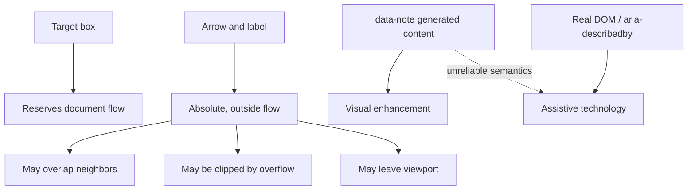
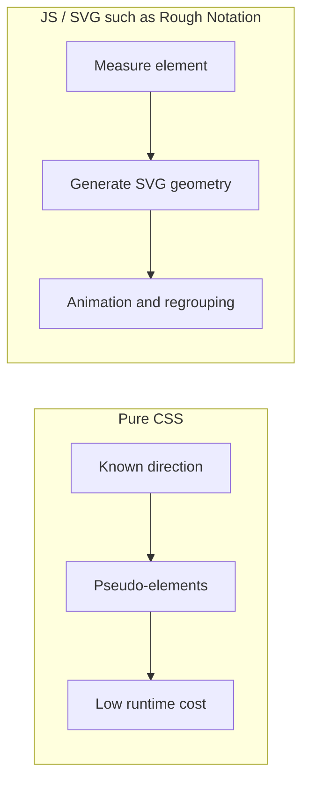

# 纯 CSS 手绘标注的实现与布局边界

## 问题

手绘箭头、标签和高亮是否能在不引入 JavaScript、DOM 测量与框架生命周期的前提下实现？这条路线在响应式、可访问性和复杂布局中会在哪里失效？

## 简答

短文本、低密度、预留空间的静态页面可以用伪元素和绝对定位得到约 1.8 KB gzip 的零 JS 标注。它的上限同样明确：CSS 无法自动感知周围可用空间、碰撞和语义，因此不应承担关键说明、动态避让、跨行标注或交互式批注。

## 实现架构

```mermaid
flowchart LR
  HTML[span.ann\ndata-note] --> Target[Inline-block target]
  HTML --> Before[::before]
  HTML --> After[::after]
  Before --> Mask[Embedded SVG mask arrow]
  After --> Label[attr(data-note) label]
  Vars[CSS variables] --> Target
  Vars --> Before
  Vars --> After
  Direction[Eight direction classes] --> Before
  Direction --> After
```

`neat-annotations` 把仅有的两个伪元素分工固定下来：箭头属于 `::before`，标签属于 `::after`。目标本身负责 marker background。这样无需额外 DOM，也意味着每层 annotation 只能稳定承载一组箭头和标签；多组标注要嵌套元素。

## 渲染生命周期

```mermaid
sequenceDiagram
  participant H as HTML/CSS
  participant C as CSS cascade
  participant L as Layout
  participant P as Paint
  H->>C: classes + data-note + variables
  C->>L: inline-block target + absolute pseudo-elements
  L->>L: target reserves space; labels do not
  L->>P: SVG mask arrow + generated label + mark
  Note over L,P: no JS measurement, collision detection or reflow correction
```

它没有 layout thrashing，也没有 resize observer；代价是布局错误无法被运行时自动纠正。

## 布局与语义边界



### 适合

- 官网卖点、文档字段、代码片段和短 badge；
- 教程、发布说明、静态视觉卡片；
- SSR、静态站和 CSP 严格、希望零 JS 的页面。

### 不适合

- 表单校验、错误状态和必读操作说明；
- 动态列表、表格、dashboard 中的大量标注；
- 长文本跨行、高密度自动避让；
- 用户可创建、拖动、保存和协作的批注系统。

## 关键工程边界

### 文档流

`.ann` 的 `inline-block` 会改变断行和 line-height；标签与箭头又不占空间。应用方必须为标注方向留出 margin，并检查祖先 overflow。小屏应通过 media/container query 切换方向或偏移，库本身不能知道哪一侧有空间。

### 可访问性

`content: attr(data-note)` 是 generated content，屏幕阅读器支持不应被视为可靠 contract。关键内容必须在真实 DOM 重复，或由 `aria-describedby` 连接。颜色和手写标签只能作为冗余视觉提示。

### 主题与兼容性

- `light-dark()` 需要宿主设置 `color-scheme`；否则通常使用 light 分支。
- OKLCH、relative color、color-mix、`@property` 和 mask 的浏览器基线比普通定位 CSS 更新。
- 面向旧 WebView / Electron 应准备静态 sRGB fallback，或在支持矩阵中明确最低版本。
- RTL 与 vertical writing mode 需要逻辑方向 API；当前 physical N/E/S/W 不会自动映射。

### 打印与截图

打印背景可能默认关闭，绝对定位内容可能跨页或被裁切。需要 `print-color-adjust`、分页测试和最终尺寸 visual regression，不能从浏览器屏幕效果推断 PDF 一致性。

## 与 JS 测量型方案的差异



| 路线 | 优势 | 代价 | 适用场景 |
| --- | --- | --- | --- |
| 纯 CSS | 零 JS、SSR 友好、体积小、无测量 | 不能避让，形状与动画有限 | 短词、静态页面、手写标签 |
| JS + SVG | 可测量、圈选、下划线、分组动画 | 运行时与生命周期更复杂 | 动态演示、复杂元素和动画 |
| 完整批注系统 | 有锚点、交互、持久化、协作 | 需要数据模型与碰撞/权限系统 | 用户生产内容与团队评审 |

## 供应链与采用建议

`neat-annotations` 官网给出的 jsDelivr URL未固定版本或 commit，项目本身也没有 release。生产环境应把 CSS vendoring 到自己的仓库，审阅后锁定，纳入 visual regression；不要运行时跟随默认分支。

采用时还应：

1. 只标注短目标并限制密度；
2. 给 class 加项目命名空间，避免 `.ann` 冲突；
3. 为 375px、桌面、Chrome、Safari、Firefox 和目标 Electron 建基线截图；
4. 显式设置 `color-scheme`；
5. 为关键语义补真实 DOM；
6. PDF/截图场景验证 print 和裁切。

## 当前张力与未决问题

- **零 JS vs 自适应布局**：不测量就无法自动选方向和避碰。
- **generated content vs 语义**：DOM 极简，但可访问 contract 弱。
- **现代 CSS vs 老运行时**：代码更小，最低浏览器版本更高。
- **绝对定位 vs 排版稳定**：视觉自由度来自脱离文档流，也带来覆盖风险。
- **无构建链 vs 发布治理**：源码易审计，但当前缺版本、CI、测试和稳定分发。
- 后续需要验证真实 assistive technology、RTL、打印分页和旧 Electron 行为。

## 证据矩阵

| 结论 | 证据来源 | 证据位置 | 置信度或限制 |
| --- | --- | --- | --- |
| 核心为纯 CSS、无运行时依赖 | 仓库源码 | `neat-annotations.css` | 高 |
| gzip 约 1.8 KB | 本地压缩 | commit `83199c8c` | 高；不含可选字体 |
| 箭头与标签不参与文档流 | 源码与 README | absolute pseudo-elements、Layout note | 高 |
| 关键语义不能只放 data-note | 项目 README 与 Web 可访问性原则 | Accessibility section | 高 |
| 暗色 mark 依赖 color-scheme | 源码与 MDN | `light-dark()` | 高 |
| 当前发布治理较弱 | GitHub 仓库 | 无 tag/release/package/CI/tests | 高；项目很新 |
| 更适合静态短文本而非动态批注 | 实现边界综合判断 | 源码、浏览器实测、Rough Notation 对照 | 中高 |

## 相关页面

- [[CSS]]
- [[SVG]]
- [[交互式 UI 的可访问性基线]]
- [[响应式]]

## 来源指针

- [[raw/sources/2026-08-02-neat-annotations|neat-annotations 调研快照（2026-08-02）]]
