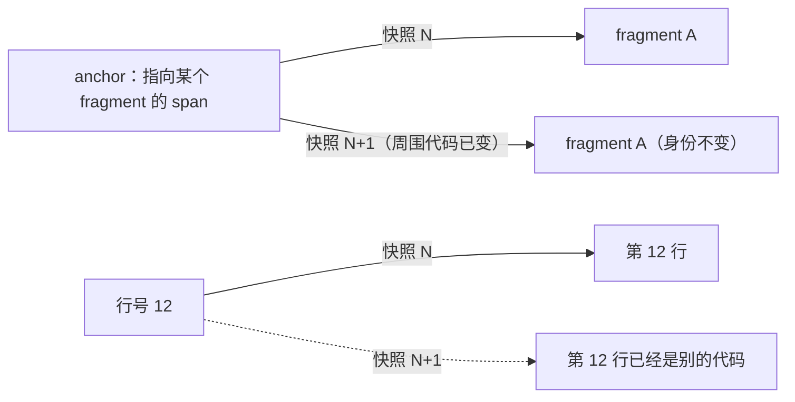
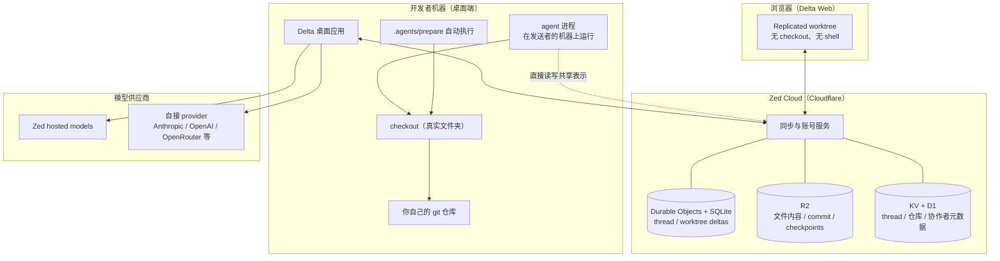
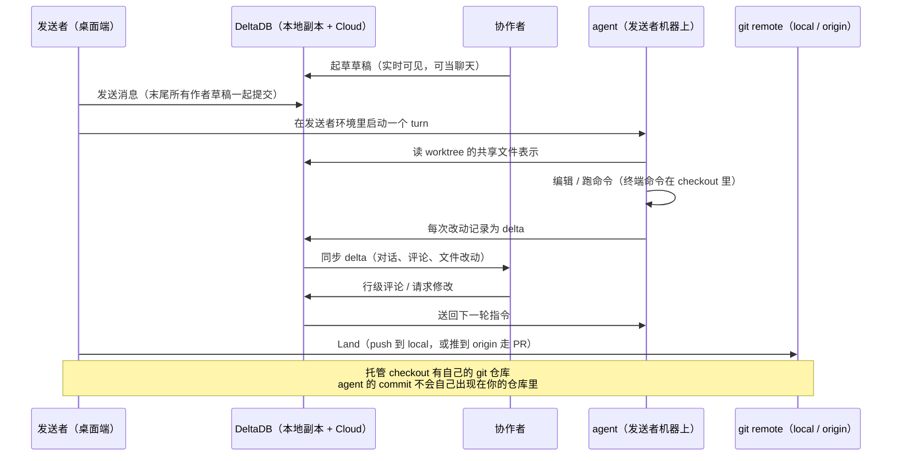
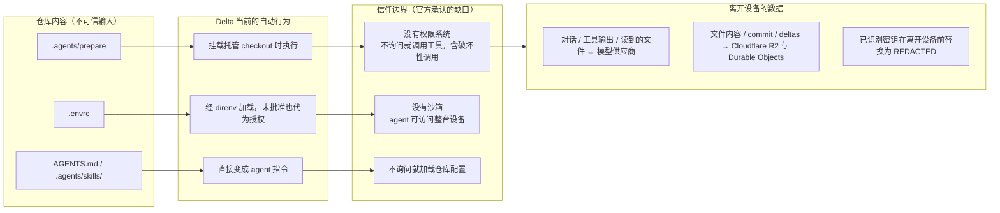

# Delta 产品与架构调研

## 问题

Zed 团队为什么要再做一个 coding agent 产品？它和已经能改代码的 CLI agent 差在哪？它的对象模型、数据流、扩展面和信任边界分别是什么，代价是什么？

本页基于 2026-09-17 抓取的 delta.dev 站点与 26 个文档页、Zed 博客上的 Delta / DeltaDB 系列文章，以及一次对 `zed-industries` 公开仓库的核查。产品处于公开 beta、版本迭代极快（首版到 0.16.0 只用了三周多），任何具体行为都可能随后变化。

一个需要说明的过程细节：第一轮只读了 delta.dev 自己的站点与文档，漏掉了 Zed 博客，因此把「并发编辑如何合并」误判为「未公开」。补上博客后已修正（DeltaDB 基于 CRDT，见下文）。这次修正也说明这家产品的**文档与博客信息密度不对等**——文档讲用法，博客讲设计依据。

## 简答

Delta 的赌注不在模型能力，而在**工作单元的定义**。它把“与 agent 的对话”和“被 agent 改动的文件副本”绑成同一个对象（thread），于是回退对话能连带回退文件，评论能锚定在改动上，同事能实时看到同一份对话加文件。为了让这件事成立，它在 git 之外自建了 DeltaDB：不记录 commit 快照，而是把每一次改动、每一条消息、每一条评论都记成有身份的 delta，用 Lamport 时间戳命名、用 CRDT 做收敛，让文件在底层是有稳定身份的 fragment 而不是字符数组。

它换来的能力很具体：审阅与协作是原生的，而不是事后套一层 PR（官方自己的说法是 “Replace PRs”，而且真的把自己仓库的 PR 关了）；代价同样具体：**目前没有权限系统、没有沙箱**，仓库内容会被自动执行，代码与历史全程进 Cloudflare，启动需要联网登录。

## 来源事实

### 一句话定位（官方原文）

- Delta app：“a multiplayer environment for coding with agents. The unit of work is a thread: the conversation with an agent and the checkout of the repository it works in, kept together as one shareable artifact.”
- DeltaDB：“Where Git captures a snapshot at each commit, DeltaDB records work as a stream of fine-grained deltas. Each delta has a stable identity, so a reference anchors to a change rather than a line number and survives as the code moves.”

### 对象模型

| 对象 | 定义 | 关键约束 |
| --- | --- | --- |
| thread | 与 agent 的对话，可独立存在，也可挂一到多个 project | 持久、可并行隔离、对话与文件一起回退、可共享 |
| project | 你打开的文件夹 | 必须是 Git 仓库的顶层目录；导入 Git 跟踪的文件（含已被 ignore 但被跟踪的）与未被 ignore 的未跟踪文件 |
| Delta worktree | thread 在某个 project 上的工作副本，历史记在 DeltaDB | 一个 thread 每个 project 一份；**不是** git worktree |
| checkout | worktree 在磁盘上的真实文件夹 | 每个参与者在各自机器上一份；终端与文件系统工具在它上面工作 |

默认配置被命名为 Isolated Workspace：agent 不在你的 project 目录里动手，改动要先带回来。

### DeltaDB 与 delta

- delta 记录“谁在什么位置改了共享状态的哪一部分”，类型包括文件编辑、文件树变化、消息、评论。它在工作发生的过程中**连续产生**，不需要 stage 或 commit。
- 每个连接的客户端持有一份数据库副本，Delta 保持副本同步；一份 worktree 有“DeltaDB 里的共享表示”和“磁盘上的 checkout”两种表示，两边保持同步。
- 与 git 的关系是**引导同步**（“Delta currently uses git as a way to bootstrap our syncing”），当前只支持配了 `origin` 的仓库。commits 仍留在 git，Delta 负责在机器之间搬运，不必绕道 origin。
- 每个托管 checkout 有**自己的 git 仓库**，agent 的 commit 落在那里；要回到你的仓库必须 push 到 `local` 或 `origin` 这类 remote。

### DeltaDB 的数据模型（来自 Zed 博客，文档里没有）

Zed 博客上那篇《Xanadu Was Waiting for Agents》把 DeltaDB 的设计依据写得很具体，而 delta.dev 文档完全没提这些：

- **命名**：“Every operation by every human and agent is named by an actor plus a Lamport timestamp, forever.”
- **状态标识**：“DeltaDB names every state between commits by the Git commit it descends from and the set of actor-and-timestamp delta IDs applied above it.”
- **收敛**：DeltaDB “embeds conflict-free replicated worktrees, many people and agents can edit the same files at once across different machines”；作者称 CRDT 是 Zed 自己过去十年的核心工作（参 `/blog/crdts`，2022）。
- **文件的底层表示不是字符数组，而是有稳定身份的 fragment**：“On screen, a file still looks like a one-dimensional string of characters but underneath, DeltaDB represents it as fragments with stable identities.” 于是“A line number can express where text appears in one snapshot, while an anchor preserves which span we mean across snapshots.”
- 保留策略：“We keep every version of everything by default.”
- 云端执行的技术基础：“Firecracker-class microVMs… Agents in Delta can provision a new isolated cloud machine mid-conversation.”

与之对应，文档给的 git 关系是“引导同步”（git as a way to bootstrap our syncing），博客给的表述更完整：“A commit remains the checkpoint you push, pull, and build from. DeltaDB retains the work between those checkpoints.”

这套「稳定身份」的差别可以用一个最小的对照表示：

### 官方博客补充的事实

- **开工时间线**：DeltaDB 概念 2026-06-11 公开，Delta private beta 首批邀请 2026-08-12，公开 beta 2026-09-16。
- **公开 beta 的硬事实**：官方在上一周关掉了自己仓库的 pull request，“We now build and collaborate on Delta entirely within Delta”；自述 33 人自那之后 land 了 570 个改动到 main。
- **为什么是独立应用**：“We could have added DeltaDB to Zed, and eventually we will. But the best possible experience required an entirely new kind of application.”（不想在几十万日活的编辑器底下换地基）
- **浏览器端是同一个 Rust 应用**：编译到 WebAssembly、用 WebGL 渲染（“Delta.dev isn't a second-class version of Delta built in JavaScript and HTML.”）。
- **第三方 harness**：博客称先接 Claude Code，“your session syncs live into a Delta thread”；但截至抓取日，delta.dev 的 26 个文档页里没有任何 Claude Code 内容（官方路线图里它还被标为 In Progress）。
- **定价表述冲突**：博客说“During the public beta, Delta is free. We'll introduce paid plans soon… There will always be a free version of Delta.”，而 `/pricing` 页展示的是 Personal $0 / Pro $10 每月（含两周试用与 $5 tokens）。两者指向不同阶段，以哪个为准需要继续跟。
- **迁移策略是渐进式的**：“You don't have to move your whole team into Delta”；`zed-industries/zed` 暂时留在 GitHub，鼓励贡献者把 Delta thread 与 PR 一起分享。

### 执行位置的规则

- 每个参与者在自己的机器上有自己的 checkout，**turn 在发送者所在的环境里跑**，不在 thread owner 的机器上。
- 浏览器 turn 用 Delta 托管的模型，**没有 checkout、没有 shell**；要用本机的工具、凭据、进程就得在桌面端跑。
- 模型接法三种：自带 API key（Anthropic / OpenAI / OpenRouter / OpenCode Zen / OpenCode Go）、已有订阅（ChatGPT / GitHub Copilot / Grok）、随 Zed 计划的 hosted models。thread 可中途换模型。
- hosted model 的用量记在**发送者**账上，不记在 thread owner 头上。

### 协作与审阅

- 共享权限三档（受邀者 / 组织内 / 有链接者），默认 Private；链接共享被官方标注为敏感。
- 草稿是共享且可见的，本身就能当聊天用；一旦有人发送，会把末尾所有作者草稿一起提交，agent 一个 turn 回应全部。
- Review thread 是独立对话，包含 agent 生成的 change guide（按最能解释改动的顺序走查），产出 Approve / Request Changes 的 verdict 并回写父 thread；review agent 在分叉的 worktree 里工作，改动要靠 `Pull Changes` 拉回。
- `Land Changes` 会在专门的 subthread 里跑你项目自己的 landing workflow（由 skill 定义检查、合并策略与发布步骤），Delta 不预设 Git 流程。

### 扩展面

- `.agents/prepare`（或 `.delta/prepare`）：每次新建/重建托管 checkout 时执行的可执行脚本，用来装依赖、设缓存、链 hook。官方要求它快且可重复。
- `.agents/linked`：把 `.env` 之类本机文件在各 checkout 之间做硬链接共享。
- `.agents/skills/`、`~/.agents/skills/`：技能目录，`<name>/SKILL.md` + YAML frontmatter（`name`、`description`、可选 `user-invocable`、`disable-model-invocation`）；同名时项目技能优先。
- `AGENTS.md`、`profiles/*.toml`（subagent 的模型、thinking effort、`prompt`/`system_prompt`、`worktree = isolated | shared`）、`settings.json`、`~/.config/delta/.env`。
- Subagent 预算：每父 thread 4 个并发、整个进程 8 个；Worker/Reviewer 默认隔离副本、成功自动合并，Scout 直接用父 thread 的 checkout。

这套约定与 Zed 生态其它工具一致——本项目自己的 `.agents/skills/` 就是同一套布局，写好的技能不需要改就能被 Delta 读。

## 系统架构图

## 核心数据流

## 扩展面与信任边界

## 综合结论

**1. 真正的变量是工作单元，不是 agent 能力。** 主流 CLI agent 的单位是“一次会话 + 一个工作目录”，会话结束后对话留在模型侧、改动留在 git 里，两者之间只有一条时间线能对齐。Delta 让 thread 同时持有对话与工作副本，于是三类此前很难做到的操作变成默认能力：整体回退、就地评论、实时共享。

**2. DeltaDB 是在为“引用”找稳定锚点，而为找到这个锚点，它把文件拆成了 fragment。** 官方那句 “a reference anchors to a change rather than a line number and survives as the code moves” 说的是同一件在别处反复被讨论的事：行号是脆弱的标识。[[Coding Agent 编辑工具]] 里各家 patch 格式去掉行号、改用上下文匹配，是同一个问题在编辑层的解法；Delta 把它下沉到版本控制层（文件在底层是有稳定身份的 fragment，见《Xanadu》一文），代价是要自己造一套存储与收敛机制。

**3. 这是“替掉 GitHub”叙事的第一个交付物，不是又一个 agent 客户端。** 官方把 PR 称作“the first part of the GitHub workflow we're leaving behind”，并把 thread 立为软件开发的基本单位（“continuous engineering”）。但它同时明确了自己不能一步到位：thread 也是 git 分支、git 仓库照常用、团队可以只让部分人搬进来。这种“激进叙事 + 渐进落地”的组合是它在同类产品里比较少见的地方。

**4. 多人在场的规则定义得比能力更细。** 谁在跑（发送者的机器）、谁付钱（发送者）、谁能看见草稿（所有参与者）、谁能改权限（owner），文档都给了明确答案，也坦白了“没有只发给协作者的通道”。这套规则是产品的主体，模型反而是可换的部件。

**4. 与本地 CLI agent 的位置差异。**

| 维度 | 本地 CLI agent | Delta |
| --- | --- | --- |
| 工作单元 | 会话 + 工作目录 | thread（对话 + 工作副本，可共享） |
| 改动落点 | 直接改你的工作目录 | 默认隔离 checkout，改动要带回来 |
| 历史 | git commit + 会话记录分离 | DeltaDB 连续 delta，对话与改动同轨 |
| 回退粒度 | commit / stash | 任意点回退，对话与文件一起 |
| 协作 | 靠 PR 与外部工具 | 原生实时共享、行级评论、review thread |
| 运行位置 | 你的机器 | 发送者所在环境；浏览器 turn 无 shell |
| 数据边界 | 只经模型供应商 | 模型供应商 + Cloudflare 全量存储 |

**5. 生态选择是“沿用约定、闭源本体”。** 技能目录、`AGENTS.md` 这些约定与 Zed 生态其它工具一致，接入成本低；但 Delta 本体在 `zed-industries` 的 131 个公开仓库中找不到对应仓库，文档也没有开源声明（这只是一次仓库检索的**观察**，不是官方说法）。不过数据面没那么神秘：博客把 DeltaDB 的依赖树讲得很清楚（Lamport 时间戳 + Merkle 命名 + CRDT 收敛），足以判断它的技术路线。生态策略上还有两条值得记：一是官方把“接入别人的 harness”当路线（先接 Claude Code，把会话同步进 thread），而不是只做自家 agent；二是把 DeltaDB 当独立产品线继续推（`/deltadb` 还在收集 early access 候补），并明确“DeltaDB will come to Zed”。

## 证据矩阵

| 结论 | 证据来源 | 证据位置 | 置信度 / 限制 |
| --- | --- | --- | --- |
| thread 同时持有对话与工作副本，可整体回退 | 官方文档 | `/docs/concepts/core-concepts` | 高（原文明确） |
| DeltaDB 以连续 delta 取代 commit 快照 | 官方文档 + 首页 + 博客 | `/docs/concepts/delta-and-git`、首页、`/blog/introducing-deltadb` | 高 |
| 并发编辑由 CRDT 收敛（conflict-free replicated worktrees） | Zed 博客 | `/blog/introducing-deltadb`、`/blog/agentic-xanadu` | 高（博客原话）——但 **delta.dev 文档未提及**，只凭文档会得出错误结论 |
| 文件底层是带稳定身份的 fragment，而不是字符数组；引用用 anchor 而非行号 | Zed 博客 | `/blog/agentic-xanadu` | 高（博客原话） |
| delta 用 actor + Lamport 时间戳命名，状态用「所属 git commit + 其上应用的 delta 集合」命名 | Zed 博客 | `/blog/agentic-xanadu` | 高 |
| git 仍是 push / pull / build 的检查点，DeltaDB 保存检查点之间的工作 | Zed 博客 | `/blog/delta-public-beta`、`/blog/introducing-delta` | 高 |
| Delta worktree 不是 git worktree | 官方文档 | `/docs/concepts/core-concepts`、`/docs/concepts/worktrees` | 高（文档专门澄清） |
| 托管 checkout 有自己的 git 仓库，commit 不会自动出现在你的仓库 | 官方文档 | `/docs/troubleshooting`、`/docs/agents/review-and-sync` | 高 |
| turn 在发送者环境里跑，浏览器 turn 无 shell | 官方文档 | `/docs/collaboration/collaborate-thread`、`/docs/collaboration/delta-on-the-web` | 高 |
| 可在会话中途开出隔离云机器跑 agent | Zed 博客 | `/blog/agentic-xanadu`、`/blog/introducing-delta` | 中高（博客描述，文档未展开） |
| Web 是同一个 Rust 应用编到 WebAssembly / WebGL | Zed 博客 | `/blog/introducing-delta` | 中（官方自述，本次未独立验证） |
| 没有权限系统、没有沙箱、不询问就加载仓库配置 | 官方文档（自述缺口） | `/docs/privacy-and-security/agentic-safety` | 高（官方自陈） |
| 仓库、commit、deltas 存在 Cloudflare R2 / Durable Objects / KV / D1 | 官方文档 | `/docs/privacy-and-security/data-storage` | 高 |
| 密钥在离开设备前被识别并脱敏，但有明确限制 | 官方文档 | `/docs/privacy-and-security/security` | 高（限制也由官方列出） |
| 启动需登录、联网，且需有 beta 权限 | 官方文档 | `/docs/troubleshooting`、`/docs/installation` | 高 |
| 官方已关掉自己仓库的 PR，33 人 land 了 570 个改动 | Zed 博客（自述数字） | `/blog/delta-public-beta` | 中（自报数据，无法外部核验） |
| 协作者的草稿会由发送者机器上的 agent 一并在同一个 turn 执行 | 由两条官方规则推导：草稿一起提交 + turn 在发送者环境运行 | `/docs/collaboration/collaborate-thread` | 中（**判断**，文档未直接这样表述） |
| MCP 与沙箱尚未落地 | 官方路线图 | `/roadmap` | 中（路线图自称可能变化） |
| Delta 本体闭源 | 本次 GitHub 核查：`zed-industries` 131 个公开仓库中无对应仓库，README/文档无开源声明 | `raw/sources/2026-09-17-delta-dev.md` | 中（观察，非官方声明） |
| 定价口径不一致（博客“beta 期间免费” vs 定价页 Pro $10/月） | 博客与定价页同日抓取对比 | `/blog/delta-public-beta`、`/pricing` | 高（两边原话都在），但**矛盾原因未公开** |

## 当前张力、风险与未决问题

1. **安全模型与协作能力不匹配。** 官方自述没有权限系统、没有沙箱，而产品核心是多人在场。把两条规则放在一起——协作者的草稿会在同一个 turn 里被一起提交、turn 又跑在发送者的机器上——意味着队友写下的内容会由你机器上的、无沙箱的 agent 执行。文档没有把这两件事联系起来讨论，这是我认为最需要在采用前确认的一点。
2. **仓库本身是可信输入。** `.agents/prepare` 会被执行、`.envrc` 会被代为授权、`AGENTS.md` 与技能会变成指令，而 Delta 不会先问你要不要加载它们。共享 thread 会把你带进别人的仓库配置里。官方把“worktree trust”列为 roadmap 项。
3. **云端强绑定。** 开工作区要在线且登录；归档三天后本地历史会被清掉，重开需要重新下载；文件内容与 commit 都在 R2。这既是协作能力的前提，也是最主要的锁定与可用性风险。
4. **心智模型摩擦已体现在官方 troubleshooting 里。** “我 commit 了但仓库里没有”“同名分支没有带过来改动”“worktree 历史不可用”都来自同一个根源：Delta worktree、checkout、git worktree 三者名字相近但语义不同。
5. **产品太新。** 三周多从 0.1.1 到 0.16.0，存在同日多版本；路线图里 MCP、沙箱、WSL、conversation branching 都还没到。把它当稳定基础设施还为时过早。
6. **定价与商业化路径两边口径不一致。** 博客说 beta 期间免费、付费计划“soon”、且“always a free version”，定价页却已经列了 Pro $10/月（含试用）。两者可能只是阶段不同（博客写于公开 beta 当天），但在没有官方口径说明前，无法据此估算长期成本。
7. **“替掉 GitHub”这个自我叙事本身是风险项。** 官方把 thread 立为基本单位，并已在自己仓库关掉 PR——这是很强的表态。但对外部团队来说，把协作、审阅与代码历史全搬进一个闭源云端产品的代价很大；反过来，它“thread 也是 git 分支、团队可以只搬一部分”的设计又在降低这个代价。这两面需要一起看。
8. **文档与博客信息密度不对等，会直接误导调研。** 本次第一轮只读文档，就把“并发合并”误判成未公开；同样，Claude Code 接入、云 runner、WebAssembly 这几件事都只在博客里有，文档里找不到。跨团队推广时会变成“官方文档不足以回答关键技术问题”的成本。

### 未决问题

- 是否支持自托管没有提及；启动必须联网+登录（见风险 3）。
- CRDT 收敛与 troubleshooting 里「分叉后保留本地副本、让人选保留还是丢弃」的恢复流程如何共存，两边都没解释。
- 博客提到的 Claude Code 接入与路线图里的 Claude Code plugin 是同一件事的哪个阶段，未说清。
- 首页展示的 Local / Cloud 切换与路线图 Remote runtime 的重叠关系，文档没有正式说明。
- Jujutsu 支持官方自称不完整。
- 本次未看官方视频演示（博客里的 walkthrough）与外部报道/评测，可能存在我漏掉的细节。

## 相关页面

- [[Coding Agent 编辑工具]]
- [[Coding Agent Shell 与 Git 权限边界]]
- [[Git 与 Agent 协作的摩擦点和演进方向]]
- [[CRDT 数据压缩策略]]（DeltaDB 默认保留所有版本，代价压力就在这一类问题上）
- [[Agent Harness]]
- [[Code Agent]]
- [[持久化 Agent Harness 的设计模式]]

## 来源指针

- `raw/sources/2026-09-17-delta-dev.md`（本次抓取的逐页事实，含原文引用）
- https://delta.dev/ ｜ https://delta.dev/docs/concepts/core-concepts ｜ https://delta.dev/docs/concepts/delta-and-git ｜ https://delta.dev/docs/concepts/worktrees
- https://delta.dev/docs/agents/subagents ｜ https://delta.dev/docs/agents/skills ｜ https://delta.dev/docs/agents/review-and-sync
- https://delta.dev/docs/collaboration/collaborate-thread ｜ https://delta.dev/docs/collaboration/delta-on-the-web
- https://delta.dev/docs/privacy-and-security/agentic-safety ｜ https://delta.dev/docs/privacy-and-security/data-storage ｜ https://delta.dev/docs/privacy-and-security/security
- https://delta.dev/docs/whats-in-the-latest ｜ https://delta.dev/roadmap ｜ https://delta.dev/pricing ｜ https://delta.dev/deltadb
- Zed 博客：https://zed.dev/blog/delta-public-beta ｜ https://zed.dev/blog/introducing-delta ｜ https://zed.dev/blog/agentic-xanadu ｜ https://zed.dev/blog/introducing-deltadb ｜（背景）https://zed.dev/blog/crdts
