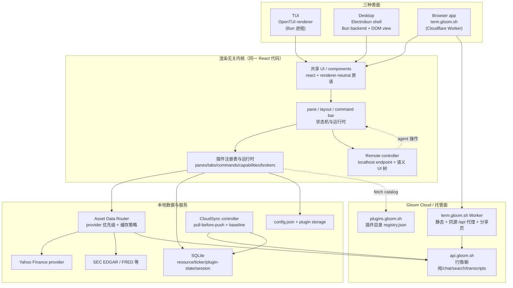
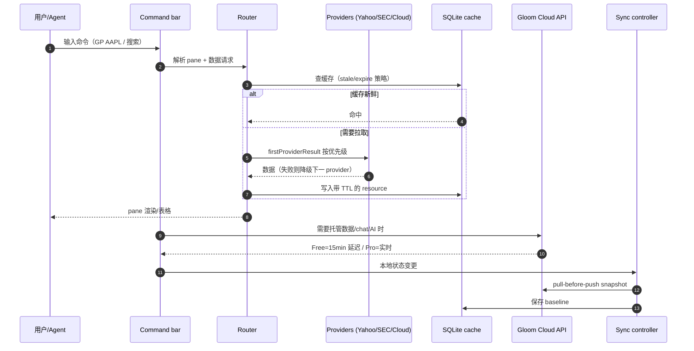
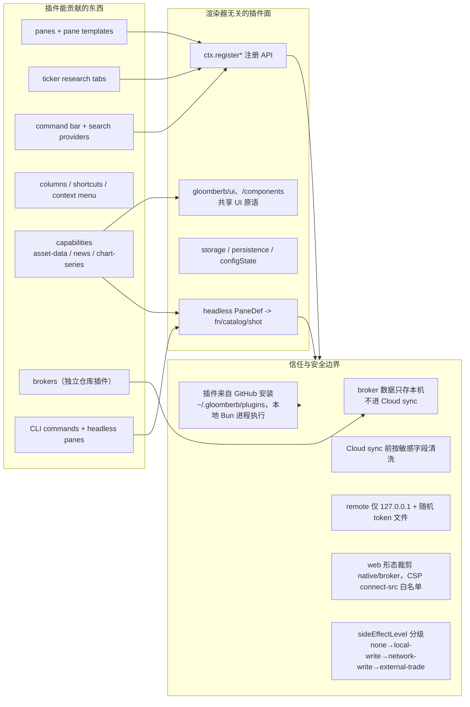

# Gloomberb 调研

## 问题

Gloomberb（gloom.sh）是一个什么产品？它的「TUI / 桌面 / 浏览器」三形态、插件系统、数据来源、本地与云的分层分别是如何实现的？开源终端本体与付费数据产品之间的边界画在哪里？

## 简答

Gloomberb 是一个开源、MIT 许可、键盘优先的**市场研究终端（research terminal）**，主打 Bloomberg Terminal 的平民替代：报价、图表、财报、SEC filings、新闻、earnings call 文稿、宏观数据、组合跟踪与插件扩展，跑在**终端 TUI、桌面应用和浏览器**三种表面上。三种表面共享同一套 React 编写的渲染无关内核、命令语言和插件系统；桌面与 TUI 是本地优先应用，浏览器形态（term.gloom.sh）则需要 Gloom Cloud 账号。

商业化分层非常清晰：**终端本体免费开源，Gloom Cloud 是可选托管数据/账号服务**——免费账号拿 15 分钟延迟行情与基础同步/聊天，Pro（$50/月）升级到实时行情、新闻线、earnings 文稿等研究层。本文基于 2026-09-07 的官网与仓库快照（`gloom-sh/gloomberb@946ab2c`，版本 v0.13.2）拆解。

## 事实层（快照）

来自官网与 GitHub（2026-09-07 观察，仓库迭代快，以下数字随版本漂移）：

- GitHub `gloom-sh/gloomberb`：约 **2,049 stars**，TypeScript 为主（约 11.4MB TS），MIT，创建于 2026-03-25；最近 release v0.13.2（2026-09-05）。
- 主要贡献者 `vincelwt`（856 commits）；Electrobun 桌面配置的 app identifier 为 `com.vincelwt.gloomberb`。
- 官网定位：「The open-source research terminal.」「Charts, financials, news and earnings calls. One workspace, from your first ticker to your next thesis.」
- 三形态：web `term.gloom.sh`（beta，需账号）、desktop（macOS/Windows）、TUI（macOS/Linux/Windows，推荐 Kitty 兼容终端）。
- 安装：desktop 走 `brew install --cask vincelwt/tap/gloomberb` 或 `curl -fsSL gloom.sh/install | bash`；纯终端 `bun install -g gloomberb`。
- 价格：终端免费；Cloud Free 无卡；Pro **$50/月**（官网以「Bloomberg seat 约 $2500/月」作参照）；7 天免费试用。
- 技术栈：Bun + OpenTUI（TUI 渲染）、Electrobun（桌面壳，Bun 后端 + DOM view）、React 19、TypeBox、rxjs、hls.js；web 形态部署在 Cloudflare Workers。
- 内置插件覆盖组合、研究、新闻、宏观、所有权/filings、预测市场、经纪人等约 50+ 产品区；同一仓库另有 7 个官方插件仓库（Hacker News、Substack、IBKR×2、Public、Robinhood、SimpleFIN）。

## 领域模型

| 概念 | 职责 | 主要证据 |
| --- | --- | --- |
| Pane | 一个有焦点上下文的工作单元：组合、图表、新闻流、交易单、笔记或插件视图；可 docked / floating / 桌面 pop-out | `README.md`、`src/types/plugin.ts` 的 `PaneDef` |
| Layout | 保存的 pane 排列，服务某个重复工作流；可发布为 `term.gloom.sh/l/...` 分享链接 | `README.md`、`src/plugins/layout-manager`、`src/remote/schema.ts` 的 `app://layout/current` |
| Command bar | 主导航与动作面（`Ctrl+P` / `Cmd+K`），ticker 搜索用反引号独立入口 | `README.md`、`src/remote/schema.ts` |
| Ticker / TickerRecord | 统一标的模型（元数据 + financials + 缓存），跨供应商归一 | `src/tickers/`、`src/data/ticker-store.ts` |
| GloomPlugin | 一切产品区的统一扩展单元：pane、tab、column、command、broker、capability、shortcut、CLI 命令 | `PLUGINS.md`、`src/types/plugin.ts` |
| Capability | 无头数据/服务契约：`asset-data`、`news`、`chart-series`、`plugin-service` | `PLUGINS.md`、`src/capabilities/` |
| Resource store | SQLite 上的带 TTL/陈旧策略的缓存层（quote、financials 等） | `src/data/resource-store.ts`、`src/data/sqlite/` |
| Cloud snapshot | 同步用的 contributor 快照 + revision，推送前按敏感字段白名单清洗 | `src/sync/types.ts`、`src/sync/core-contributors.ts` |
| Remote endpoint | 运行中 app 暴露的 localhost 控制面（port + token 文件），供 agent/CLI 操作 | `src/remote/server.ts`、`src/remote/types.ts` |

## 系统架构图

这张图的关键点：**三种表面是同一内核的渲染器适配层**，仓库用 `src/architecture/import-boundaries.test.ts` 强制执行边界——`@opentui/*`、`electrobun/*`、`react-dom` 只允许出现在各自的 renderer 目录，core/react 层不允许直接依赖渲染器包。桌面与 TUI 共享内核与本地数据；浏览器形态按安全边界裁剪掉 native/经纪商等能力。

## 核心数据流

1. 用户在任一表面输入命令（`GP NVDA`、反引号搜 ticker、`AI <prompt>`），Command bar 解析为 pane/模板动作。
2. Pane/headless 模型通过插件注册的 capability 或 `AssetDataRouter` 发起数据请求。
3. Router 按 provider 优先级遍历（Yahoo、SEC EDGAR、Cloud 等），`firstProviderResult` 命中即止；结果按 `cachePolicy`（staleMs/expireMs）写入 SQLite Resource store。
4. 桌面/TUI 本地请求失败或需要托管数据（实时行情、新闻线、transcripts）时路由到 Gloom Cloud `api.gloom.sh`；Free 与 Pro 在云端做延迟/权限分层。
5. 本地状态（布局、组合、watchlist、profile analytics）由 `CloudSyncController` 周期性推送：**总是先 pull 再 push**，以本地 baseline 保护离线编辑，推送前按敏感字段模式过滤（token/secret/password/credential 等绝不离开设备）。
6. Agent/自动化（含内置 `AGENT` 面板、`gloomberb remote` CLI）通过 localhost remote endpoint 读取 `app://snapshot`、`ui://tree` 等语义资源并调用 operation。

## 扩展面与信任边界

插件模型是 renderer-neutral 的：官方插件尽量 import `gloomberb/ui`、`gloomberb/components`，不直接 import OpenTUI/Electrobun/DOM。带 native 一半的插件（开 socket 的 broker）提供 `index.browser.ts` 第二入口供 view/browser 编译，网络调用由 Bun 进程执行并经 RPC 到视图。`headless` pane 定义让同一数据模型可被 CLI（`gloomberb fn`）、目录（`catalog`）、截图（`shot`）与未来 host 复用，是「agent 可读 CLI」路线的关键设计。

## 分层结论

- **本地优先，Cloud 可选**：pane/layout/plugin/notes/portfolios/watchlists/兼容 provider 全部本地可用、无账号可跑；Cloud 是账号 + 托管数据 + 研究层（sync、chat、AI command bar、transcripts、实时行情）。「免费开源终端 + 按数据卖钱」是核心商业模式。
- **浏览器是受约束的第三表面**：`term.gloom.sh` 的 Worker 只把同源 `/api` 代理到固定 `api.gloom.sh`（非任意代理），CSP 的 `connect-src` 只白名单 api.github.com、api.fiscaldata.treasury.gov、plugins.gloom.sh；浏览器构建**故意省略** brokers/native 集成、文件系统 notes、本地 AI、外部插件、updater 等；分享页（`/s/:id`、`/l/:id`）是独立 slim bundle、无需账号但 `noindex`。
- **插件是产品区也是安全面**：组合列表到经纪商接入「everything is a plugin」；外部插件从 GitHub 安装后在本地 Bun 进程执行，等于把信任问题交给用户判断安装来源。官方把经纪商拆成独立仓库/独立更新，说明插件升级线独立于主 app。
- **Agent 是一等公民**：CLI 有人类可读默认输出与 `--json/--csv/--ndjson` 结构化输出；运行中的 app 暴露 localhost remote endpoint（`app://snapshot`、`ui://tree`、`commandBar.activateResult`、`ui.invokeMatching`、batch 顺序执行），内置 `AGENT` 面板即通过该协议操作 app。它把「终端」同时做成 agent 可操作的语义 UI，而不是像素坐标脚本。
- **AI 能力分层在 provider 之上**：命令辅助（账号验证即可）、AI screener（`AI <prompt>`）、Ask AI ticker tab、`AGENT` 持久本地线程、headless `gloomberb ai`；模型走 Pi runtime，provider 含 Anthropic / OpenAI Codex / OpenAI / Google / GitHub Copilot / xAI / OpenRouter。

## 证据矩阵

| 结论 | 证据来源 | 证据位置 | 置信度 / 限制 |
| --- | --- | --- | --- |
| MIT 开源、~2k stars、TS 为主、v0.13.2 | GitHub API + release | `api.github.com/repos/gloom-sh/gloomberb` | 高；数字是 2026-09-07 时点 |
| 三表面共享同一 React 内核、渲染器隔离有测试强制 | 仓库结构与源码 | `src/renderers/{opentui,electrobun,browser,share,cloudflare}`、`src/architecture/import-boundaries.test.ts` | 高；直接读代码 |
| 一切产品区都是插件，含 broker | README / PLUGINS.md / catalog | `src/plugins/catalog.ts`、`src/plugins/builtin/*` | 高 |
| headless pane → CLI fn/catalog/shot | PLUGINS.md + 代码 | `PLUGINS.md` 的 Headless pane models 段、`src/plugins/builtin/research/*-headless.ts` | 高 |
| 本地 SQLite 缓存带 stale/expire 策略 | 源码测试 | `src/data/resource-store.ts`、`src/data/sqlite/cache.test.ts` | 高 |
| Cloud sync 先 pull 后 push + baseline 保护本地编辑 | 源码注释与实现 | `src/sync/controller.ts`（`syncOnce`） | 高 |
| sync 推送前按敏感字段清洗，portfolio 不含 positions | 源码 | `src/sync/core-contributors.ts`（`SENSITIVE_KEY_PATTERN`、`sanitizePortfolio`） | 高 |
| 浏览器 Worker 只代理固定 API origin，非任意代理 | 源码 | `src/renderers/cloudflare/worker.ts`（`API_ORIGIN`） | 高 |
| remote 仅 localhost + token 文件 | 源码 | `src/remote/server.ts`、`src/remote/types.ts` | 高 |
| Free 15 分钟延迟 / Pro 实时 / $50 月费 | 官网 pricing 与文档 | `gloom.sh/cloud`、`gloom.sh/docs/cloud-market-data` | 中；定价与计划边界随产品变更 |
| Bloomberg 对标叙事（$2500/月） | 官网 | `gloom.sh/cloud` | 高（营销事实）；「替代 Bloomberg」的完整度是开放判断 |

## 当前张力 / 风险 / 未决问题

- **开源内核 vs 闭源数据/账号服务的演进风险**：仓库代码里 README、docs 与源码三者表述高度一致（web 免费是 delayed 数据），说明产品把「本地免费」当成长期承诺在维护；但依赖 Yahoo Finance 这类免费数据源本身有稳定性风险，Cloud provider 的存在说明官方也在对冲数据源单一化。
- **浏览器形态的「研究入口」定位矛盾**：web 免费计划是 rate-limited + 15 分钟延迟 + 必须登录（sign-in panel 不可 dismiss），这与「no account needed」的本地叙事有张力；分享页可匿名但只是快照。web 更像获客漏斗与 Pro 转化器，而非开源承诺的一部分。
- **插件安全面随规模扩大**：外部插件本地执行（Bun 进程内、可访问 `node:net`/文件系统），当前信任模型基本是「安装即信任 + 用户自行判断来源」。目录（registry.json）是中心化的，但**没有看到签名/沙箱/权限声明在安装时强制**；sideEffectLevel 只是描述性元数据。这是 plugin marketplace 做大后的首要治理问题。
- **TUI 形态的依赖风险**：TUI 大量依赖 Kitty 图形协议（charts/TV），README 自己注明「不要用关掉 kitty renderer 的方式修 bug」；对终端生态的强耦合是把双刃剑。
- **时效性**：仓库月级发布、周级迭代（v0.12→v0.13 只隔数天），本页的领域模型稳定但具体命令/插件清单/价格会快速漂移；看代码时应以最新 commit 为准。

## 相关页面

- [[wiki/topics/tooling/ai-cli|ai-cli]]
- [[wiki/syntheses/tooling/聚合型 Agent CLI 的架构设计观察|聚合型 Agent CLI 的架构设计观察]]
- [[wiki/syntheses/ai/Agent-native 生成型 CLI 的产物协议|Agent-native 生成型 CLI 的产物协议]]

## 来源指针

- `gloom-sh/gloomberb@946ab2cdb4a02b9504de9ef8a596e75957167a09`（2026-09-06 HEAD，v0.13.2 附近）
- `README.md`、`README.zh-CN.md`、`PLUGINS.md`、`AGENTS.md`、`electrobun.config.ts`、`package.json`
- `src/renderers/`、`src/architecture/import-boundaries.test.ts`、`src/sync/`、`src/remote/`、`src/plugins/`、`src/sources/`、`src/data/`
- `https://gloom.sh/`、`https://gloom.sh/cloud`、`https://gloom.sh/docs/cloud-market-data`、`https://gloom.sh/docs/agents`
- GitHub API：repo 元数据、releases、contributors、org repos（2026-09-07 抓取）
