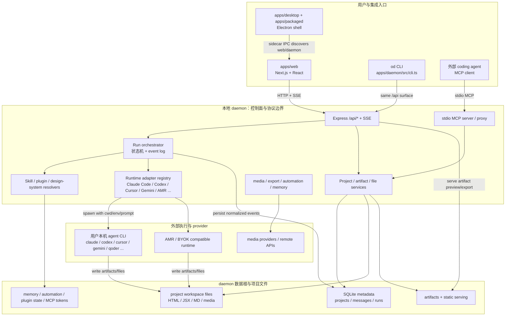
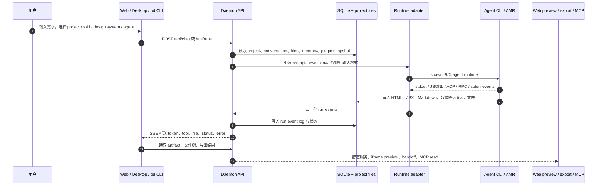
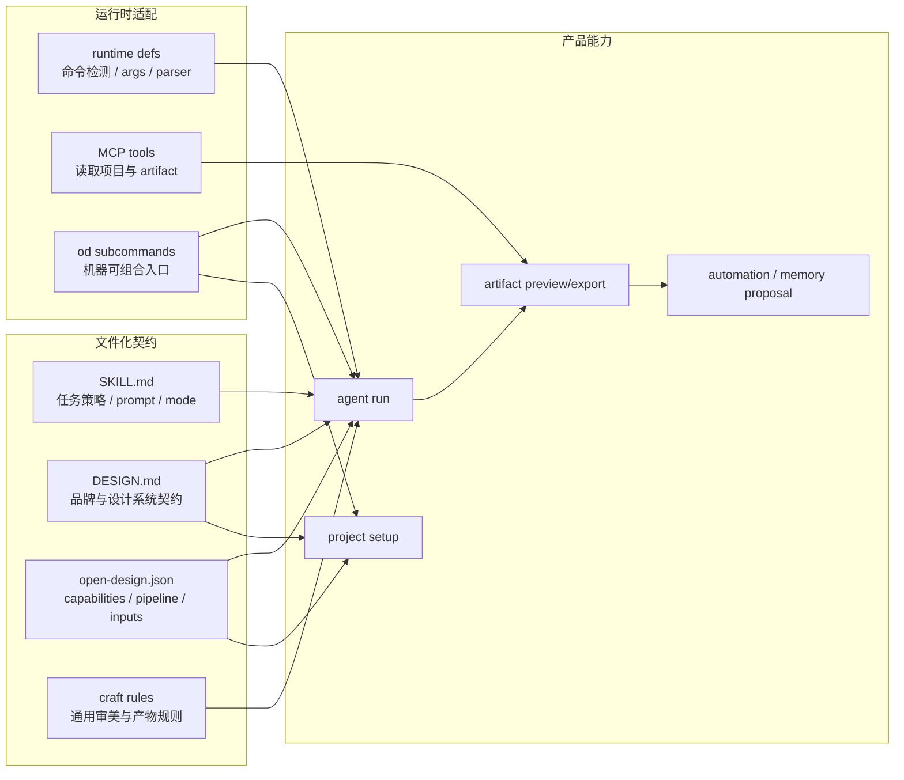

# OpenDesign 实现调研

## 问题

OpenDesign 是怎样实现“开源 Claude Design 替代方案”的？它的领域对象、运行时边界、数据流和扩展点分别是什么？

## 简答

OpenDesign 的核心不是再造一个模型或封闭设计产品，而是把“设计产物生成”拆成一个本地优先的 agent 工作台：前端负责项目、聊天、文件与预览体验；本地 daemon 负责数据、权限、agent 启动、SSE 流、插件、设计系统、MCP、媒体与导出；真实生成能力交给用户已有的 coding-agent CLI、AMR 或 BYOK 兼容端点。它的长期壁垒更接近“可版本化的技能、插件、设计系统与本地运行时”，而不是单次 prompt 生成质量。

本页基于 `nexu-io/open-design` 在 `20c61f7732fa65ff656d3636327d99d6f7560f2d` 的源码快照和官方文档调研；仓库迭代很快，具体数字和路线图可能随后变化。

## 系统架构图

这张图的关键点是：OpenDesign 的 daemon 是产品控制面，agent CLI / AMR 是执行面，项目文件和 SQLite 是事实记录。Web、desktop、CLI、MCP 都不应绕过 daemon 直接拥有自己的业务协议；它们只是同一组项目、run 和 artifact 能力的不同入口。

## 领域模型

| 概念 | 职责 | 主要证据 |
| --- | --- | --- |
| Project | 用户工作空间，持有入口文件、元数据、skill/design-system/plugin 绑定。导入本地目录时可直接指向外部 `baseDir`。 | `apps/daemon/src/db.ts`、`apps/daemon/src/routes/project/` |
| Conversation / Message | 项目内的聊天上下文、assistant 输出、附件、产物和反馈。 | `apps/daemon/src/db.ts` |
| Run | 一次 agent 执行。daemon 创建 run、写事件日志、维护状态、通过 SSE 回放事件。 | `apps/daemon/src/runtimes/runs.ts`、`apps/daemon/src/routes/runs.ts` |
| Artifact | agent 写出的 HTML、JSX、Markdown、媒体或设计文件。Web 侧负责预览，daemon 侧负责保存、导出、lint、静态服务。 | `apps/daemon/src/artifacts/`、`apps/web/src/artifacts/` |
| Runtime Agent | Claude Code、Codex、Cursor、Gemini、Qoder、Hermes、Kimi、AMR 等外部运行时定义。OpenDesign 只负责检测、拼 prompt、传 cwd、解析流。 | `apps/daemon/src/runtimes/registry.ts`、`apps/daemon/src/runtimes/defs/` |
| Skill | 以 `SKILL.md` 为核心的 agent 指令包，可声明 mode、surface、craft、design-system 依赖和示例 prompt。 | `apps/daemon/src/skills.ts`、`docs/skills-protocol.md` |
| Plugin | 在 skill 之上增加 marketplace、输入、pipeline、能力声明和 GenUI 的可分发工作流包。 | `plugins/spec/SPEC.md`、`packages/plugin-runtime/` |
| Design System | 以 `DESIGN.md` 为核心的品牌契约，可解析颜色、字体、组件、preview、来源证据和修订状态。 | `apps/daemon/src/design-systems/index.ts`、`docs/design-systems.md` |
| Automation / Memory | 把外部来源、运行结果和人工确认沉淀为 memory、skill、design-system 或 automation proposal。 | `specs/current/automation-self-evolution.md`、`apps/daemon/src/routes/automation.ts` |
| MCP | 让其他 coding agent 通过 stdio MCP 读取 OpenDesign 项目、文件、artifact，并创建文件。 | `apps/daemon/src/mcp.ts`、`apps/daemon/src/mcp-routes.ts` |

## 运行时分层

- `apps/web`：Next.js 16 + React 18。负责 entry view、project studio、chat、file workspace、sandboxed iframe preview、settings、plugins、design systems、automations 等 UI。
- `apps/daemon`：Node 24 + Express + `better-sqlite3`。负责 `/api/*`、SSE、agent spawn、SQLite metadata、project files、skills、plugins、MCP、media、memory、automation、export。
- `apps/desktop` / `apps/packaged`：Electron shell 与 packaged runtime。它们不承载业务规则，主要通过 sidecar IPC 发现 web/daemon 状态并启动/包装运行时。
- `packages/contracts`：web/daemon 共享契约，避免 UI 与 daemon 私有实现直接耦合。
- `packages/plugin-runtime`、`packages/sidecar`、`packages/platform`：分别承载插件解析/校验、sidecar 协议和 OS 进程原语。
- `tools/dev`、`tools/pack`、`tools/serve`：开发生命周期、打包发布和 fixture service 控制面。

这个分层说明 OpenDesign 已经不是早期文档里的“仅 web + daemon 原型”。当前 README 和包结构显示它已经包括 desktop/packaged sidecar、AMR、插件市场、媒体与自动化等更大的产品面。

## 核心数据流

1. 用户在 Web/Electron 中创建项目，选择产物类型、skill、design system、plugin 和 agent。
2. Web 通过 `/api/projects`、`/api/runs`、`/api/chat` 等 daemon API 创建项目、消息和 run。
3. Daemon 从 SQLite 和项目文件系统读取上下文，解析有效的 skill、design system、plugin snapshot、memory、media policy 和 MCP 配置。
4. Daemon 根据 agent definition 组装命令参数、环境变量、工作目录和 prompt 输入方式，然后 spawn 用户机器上的 CLI 或 AMR runtime。
5. CLI 的 stdout/stderr/ACP/RPC/JSONL 被解析为统一事件，daemon 写入 run event log，并通过 SSE 推给 Web。
6. Agent 写出的文件落在项目目录，Web 的 file workspace 和 iframe preview 读取同一份产物。导出、handoff、MCP 读取和后续 refinement 都围绕这些文件继续。

这个链路解释了 OpenDesign 为什么同时需要 HTTP API、SSE、project filesystem 和 run event log：HTTP 负责命令入口，SSE 负责实时体验，文件系统承载可交付结果，event log 承载可回放和诊断。

## 扩展面地图

OpenDesign 的扩展策略不是单点 plugin API，而是几类不同生命周期的文本契约共同工作：`SKILL.md` 影响 agent 如何做事，`DESIGN.md` 影响产物风格和约束，`open-design.json` 把工作流产品化，runtime defs 把不同 CLI 接入同一事件模型，MCP / CLI 则把结果暴露给外部自动化。

## 架构判断

- **控制面和执行面分离**：daemon 统一管理项目、权限、上下文、状态与事件；真实模型调用和 tool loop 交给外部 agent。这降低了 OpenDesign 自研模型编排的负担，但把可靠性风险转移到 adapter conformance。
- **文件系统是交付边界**：artifact 不是只存在于聊天记录里的 blob，而是项目目录中的文件。这让 Git、PR、MCP、导出和后续 agent refinement 都能复用同一份结果。
- **设计系统被 Git 化**：Claude Design 把 design system 做成组织内托管资产；OpenDesign 把它做成 `DESIGN.md`。这更适合审阅和复用，但需要更强的质量校验、source evidence 和人工 review。
- **本地优先不是完全离线**：daemon、SQLite、项目文件和插件状态默认本地；但 agent CLI、AMR、BYOK、media provider、connector 和 MCP 都可能联网。真实隐私边界取决于用户选择的 runtime 和 provider。
- **架构复杂度来自“多入口一致性”**：Web、desktop、CLI、MCP、plugin、automation 都要指向同一套 daemon 能力。OpenDesign 的长期维护难点不只是 UI，而是保持这些入口的 contract、权限和事件语义一致。

## 实现特征

- **Agent loop 外包**：OpenDesign 明确不重写 Claude Code、Codex、Cursor 等 agent 的 tool loop，而是让各 CLI 保持自己的模型调用、工具调用、权限和上下文管理。OpenDesign 的复杂度集中在 detection、prompt composition、cwd/sandbox、stream parser 和能力降级。
- **文件优先扩展**：`SKILL.md`、`DESIGN.md`、`open-design.json` 都是可审阅文本文件。团队可以用 Git 管理设计系统和工作流，而不是把规则埋进产品数据库。
- **UI / CLI / MCP 三轨闭环**：同一能力通常要同时有 Web UI、`od` CLI 和 MCP 访问面。这样外部 agent 可以不打开 UI 也能查询 artifact、运行 plugin 或读取设计系统。
- **本地数据根边界严格**：root `AGENTS.md` 把 daemon 数据根定义成唯一 truth source，daemon-owned SQLite、artifact、memory、MCP token、plugin state 等都必须从 `RUNTIME_DATA_DIR` 派生。文档不能随意写具体示例路径。
- **多产物类型**：默认产物不只是网页原型，还包括 deck、live artifact、image、video、HyperFrames、audio、PDF/PPTX/MP4 等。它更像 agent-native creative workspace，而不是单一 UI generator。
- **质量与自演进方向**：Critique Theater / Design Jury、artifact lint、automation proposals、memory tree、skill crystallization 等设计说明，OpenDesign 想把“每次成功运行”反哺为未来上下文，而不是只停留在一次性生成。

## 当前张力

- `server.ts` 仍是非常重的装配层。虽然 routes、runtime defs、plugins、design-systems 等模块已经拆开，但启动和依赖组装仍然集中，理解成本高。
- Adapter 面覆盖很广，但每个 CLI 的 stream schema、权限参数、登录状态和 prompt 输入方式都可能漂移。这个层是运行可靠性的高风险面。
- README 的产品叙述比早期 `docs/spec.md` 更先进。早期 spec 里曾写过“不做 desktop app”和“不做 model router”，但当前实现已经包含 Electron packaged runtime 和 AMR。做判断时应优先看当前 README、package 和代码。
- 插件与 skill 的能力模型带来开放性，也带来信任边界问题。`open-design.json` 的 capabilities、pipeline 和 connector 声明是治理起点，但用户仍需理解“安装一个 plugin 等于允许 agent 读取/写入/联网/调用外部工具”的含义。

## 未决问题

- OpenDesign 的“local-first + AMR”定位如何平衡：AMR 降低上手成本，但会让“完全 BYO agent / BYOK”叙事变得不那么纯。
- Design-system extraction 是否能稳定产出高质量、可复用的 `DESIGN.md`，取决于 source evidence、token contract、preview 和人工 review 的闭环质量。
- 插件市场规模扩大后，能力授权、签名、版本 pinning、验证和 rollback 会成为比单个 skill 质量更重要的工程问题。

## 相关页面

- [[wiki/comparisons/product/OpenDesign vs Claude Design|OpenDesign vs Claude Design]]

## 来源指针

- `nexu-io/open-design@20c61f7732fa65ff656d3636327d99d6f7560f2d`
- `README.md`
- `AGENTS.md`
- `docs/architecture.md`
- `docs/agent-adapters.md`
- `docs/skills-protocol.md`
- `plugins/spec/SPEC.md`
- `specs/current/automation-self-evolution.md`
