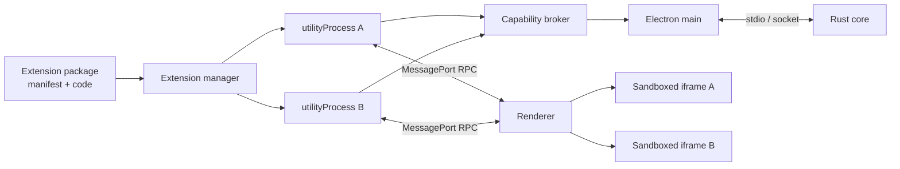
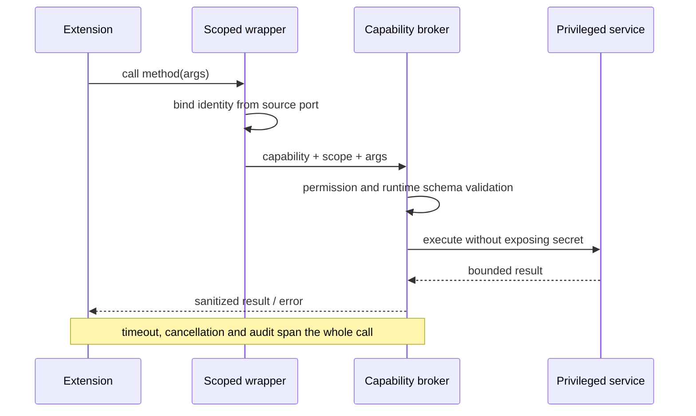
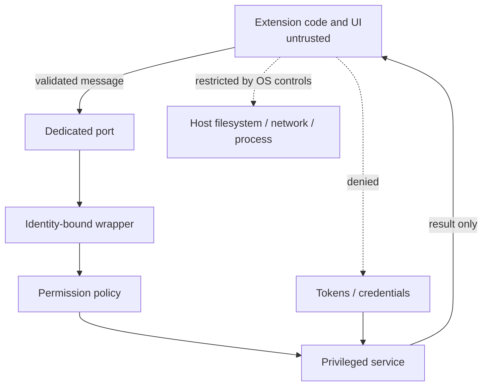

# Electron 扩展系统的隔离与通信边界

## 问题

Electron App 如何让第三方扩展同时拥有 Node、本地 CLI 和定制 UI，又不把主进程凭据、宿主 DOM 与全部系统权限直接交给扩展？

## 简答

扩展系统首先是权限与数据流系统，其次才是模块加载系统。稳妥的基线是：每个扩展一个独立 `utilityProcess`；MessagePort 既是通信通道也是身份 capability；所有特权操作经 broker 重新授权；UI 放入 sandboxed iframe；manifest、RPC、资源协议和生命周期都必须可校验、可撤销、可审计。

## 基础架构

独立进程解决的是扩展之间的内存、事件循环和故障隔离。它不自动限制扩展进程对宿主 OS 的文件、环境变量、网络和子进程访问。

## 调用生命周期

消息中自报的 extension ID 不应参与授权。身份来自宿主分配的 port；授权还必须检查 capability、资源 scope、生命周期和方向。

## Trust model

进程边界不是完整 sandbox。真正开放第三方生态时，还要清理 `env`、限制 `cwd`、控制网络和子进程，并按平台考虑低权限账号或 OS sandbox。

## 关键设计判断

### MessagePort 作为 capability

- main process 负责创建 extension host、分配 port 和回收生命周期。
- renderer 与 extension host 可直接通信，避免所有 UI 消息都经 main 转发。
- port ownership 能提供可信身份来源；同进程多个 context 不能提供同等强度的扩展隔离。

### RPC 必须从 demo 升级为协议

`call-method` / `method-result` 足够启动第一版，但生产环境至少需要：

- method allowlist、协议版本与兼容策略；
- runtime schema validation、消息大小和深度限制；
- timeout、cancellation、backpressure 和流式传输；
- crash 后 reject pending calls；
- event unsubscribe、reload / disable / upgrade disposal；
- error 序列化与敏感堆栈清理；
- heartbeat、卡死检测和审计日志。

### UI 隔离与资源协议

- iframe 比 Electron `<webview>` 更接近 Web 标准，使用 `sandbox` 只开放必要能力。
- 自定义 scheme 应按 extension ID 分 origin；资源路由要做 realpath、根目录、MIME 和 symlink 校验。
- shell iframe 可以统一注入主题变量和封装消息，但若与扩展页同源，访问能力是双向的；不能在 shell 中放置扩展不应直接访问的 secret 或高权限对象。
- 所有 `postMessage` 必须同时验证 `origin`、`source` 和 payload schema。

### Manifest 与供应链

`package.json` 可以承载 contributions 和 permissions，但仍需要：

- 固定扩展 ID、版本、host API range 和入口；
- 安装签名、来源证明、hash 与更新完整性；
- 权限新增 diff 和重新授权；
- disable / uninstall 后清理数据和 capability；
- CommonJS 到 ESM 的加载兼容边界。

## iframe keep-alive

`moveBefore()` 可以在 DOM 内移动 iframe 而不触发卸载，从而保留 loading state。它是有效优化，但不应成为唯一正确路径：React reconciliation 可能与手工 DOM 所有权冲突，隐藏 iframe 仍消耗内存、连接和计时器。扩展多时需要 LRU suspend / destroy，并提供不支持 `moveBefore()` 时的 reload 降级。

## 当前张力与未决问题

- **隔离强度 vs 资源成本**：每扩展一进程更安全，但内存与启动成本随扩展数增加。
- **直接 MessagePort vs 中央审计**：绕过 main 转发性能更好，审计与策略必须落在可复用 wrapper/broker。
- **完整 Node 能力 vs 不可信扩展**：执行 CLI 方便，也扩大宿主攻击面。
- **同源主题注入 vs UI 越权**：同源 shell 简化样式同步，却削弱 DOM 边界。
- **静态 contributions vs 动态扩展性**：静态 manifest 降低攻击面，动态注册更灵活。
- 仍需验证多平台 OS sandbox、签名更新、扩展崩溃恢复和大规模扩展资源水位。

## 证据矩阵

| 结论 | 证据来源 | 证据位置 | 置信度或限制 |
| --- | --- | --- | --- |
| utilityProcess 提供 Node 与 MessagePort | Electron 官方文档 | `utilityProcess` API | 高 |
| port 可在 main 与 utility process 间转移 | Electron 官方文档 | `postMessage(message, transfer)` | 高 |
| iframe 应启用 sandbox，webview 不宜默认使用 | Electron 官方文档 | Web Embeds、Security | 高 |
| 进程隔离不等于限制 Node 的宿主权限 | 官方 sandbox 文档与架构推断 | Process Sandboxing | 高；OS 细节依平台 |
| 来源 port 适合作为扩展身份 capability | 主文实现与安全模型综合 | 文章“安全边界”“Wire Protocol” | 中高；仍依赖宿主正确保管 port |
| 同源 shell 可能产生双向 DOM 访问 | Web 同源模型推断 | 主文“宿主样式注入” | 高；具体风险取决于 sandbox flags |
| moveBefore 可保留 iframe 状态 | MDN | `Element.moveBefore()` | 高；旧 Electron 需降级 |

## 相关页面

- [[Electron]]
- [[同源 iframe 沙箱设计]]
- [[线程级隔离 vs 进程级隔离]]
- [[Secure ECMAScript]]

## 来源指针

- [[raw/sources/2026-08-02-electron-extension-system|Electron 扩展系统调研快照（2026-08-02）]]
