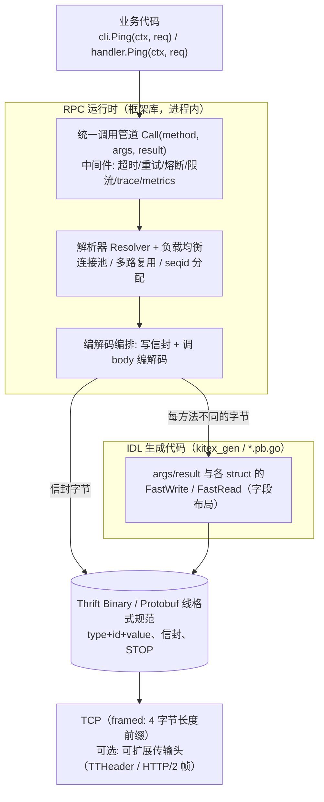
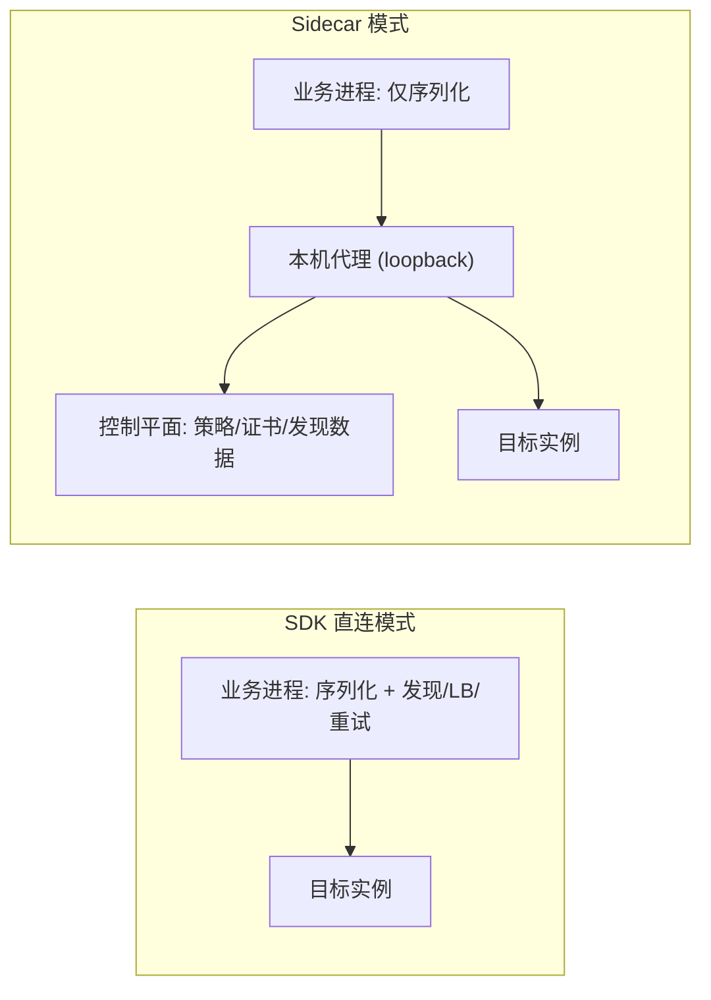

# RPC 框架中代码生成与运行时的边界

## 问题

以 Thrift/Kitex（或 protobuf/gRPC）为代表的 RPC 栈里，IDL 编译器、生成代码、运行时框架三者各自负责什么？特别是：请求字节里的方法名和序列号，到底是"生成的代码写的"还是"框架写的"？为什么现代 RPC 框架要这样划分？

## 简答

一次 RPC 请求在线上是 `[传输帧] [消息信封: 方法名/类型/seqid] [消息体: 参数 struct]`。**消息体由 IDL 生成器为每个 struct 生成的编解码代码产出；消息信封由运行时在统一调用管道中用通用库函数写入**。经典 Apache Thrift 曾把信封内联在每个生成的 client 方法里，现代框架（Kitex/gRPC 等）把它收进运行时的 `Call(method, args, result)` 单一入口，以便挂载中间件、替换编解码引擎、复用连接并支持泛化调用。线格式本身不变——它只由协议规范决定。

## 综合结论

### 1. 线上一帧长什么样（实证）

对 IDL 方法 `Ping(PingRequest{1: string Msg})` 传入 `Msg="hi"`，TCP 上实际抓到 34 字节：

```
00 00 00 1e                                  ← framed transport：payload 长度 = 30
80 01 00 01  00 00 00 04  "Ping"  00 00 00 01  ← 消息信封（strict binary）
0c 00 01  0b 00 01  00 00 00 02 "hi"  00  00   ← 消息体（嵌套两个 struct）
```

消息体逐字段是 Thrift Binary 的 `type(1B) + field-id(2B, 大端) + value`：

| 字节 | 含义 |
| --- | --- |
| `0c 00 01` | type=12 STRUCT，field 1：args.req |
| `0b 00 01` | type=11 STRING，field 1：PingRequest.Msg |
| `00 00 00 02 68 69` | 字符串长度 2 + "hi" |
| `00` ×2 | 内层 struct、args struct 各自的 STOP 结束符 |

信封是协议自带的（不是框架自定义的 meta）：`0x8001` 是 strict protocol version 1 标记，低 8 位是消息类型（CALL=1 / REPLY=2 / EXCEPTION=3），其后是方法名和 seqid。零依赖按规范手写编码器可以逐字节复现同一帧（见来源中的实验记录），证明**线格式只属于协议规范，不属于任何实现**。

### 2. 一次方法调用先被建模成两个 struct

IDL 编译器在背后把每个方法展开为参数结构和结果结构：

```
PingArgs   { 1: PingRequest req }
PingResult { 0: PingResponse success }   // 注意成功返回固定是 field 0
```

于是"发起一次 RPC"在框架内部退化成两件正交的事：

1. 把 args/result struct 编解码成字节（随方法的字段布局变化）；
2. 在字节外写/读信封并在方法表上路由（与具体方法无关）。

server 端持有 `map[方法名] MethodHandler`，从信封读到 `"Ping"` 后查表、解出 args、调用业务 handler、把返回值装进 result。client 端用 seqid 把回来的 REPLY 对回并发连接上的原调用。

### 3. 分层架构



关键边界只有一个：**"把这个 struct 编成字节 / 把字节解回来"**。边界以上是框架与连接策略，边界以下是字段布局。

### 4. 信封为什么必须在运行时，而不是生成进每个方法

经典 Apache Thrift 编译器生成的 client 把 `WriteMessageBegin("Ping", CALL, seqId)` 内联在每个方法里。现代框架把它上移到运行时的统一入口（开源 Kitex 的 fast 路径里，信封与 body 在同一个函数中并排，来源清晰）：

```go
// cloudwego/kitex pkg/remote/codec/thrift/codec_fast.go（节录）
offset := thrift.Binary.WriteMessageBegin(buf, methodName, msgType, seqID) // 信封: 运行时通用库
_ = msg.FastWriteNocopy(buf[offset:], nw)                                  // body: 生成代码
```

这一划分带来五个结构性能力：

| 能力 | 信封内联在生成代码里 | 信封收进运行时统一 Call |
| --- | --- | --- |
| 中间件（重试/熔断/trace/限流） | 没有统一挂点，改能力要改生成模板并重新生成 | 包一层 Call 即可，所有方法生效 |
| 换编解码引擎 | 与信封焊死，换引擎必须重新生成 | body 是可插拔接口；同一份信封下可切生成代码 / JIT（frugal）/ 动态编码 |
| seqid 与多路复用 | 生成代码不拥有连接，无法分配 | 拥有连接的运行时天然管理未完成请求表 |
| 修复协议相关缺陷 | 所有服务重新跑代码生成 | 升级运行时库即可 |
| 泛化调用 / 网关代理 | 方法名写死，结构上不可能 | `Call("方法名字符串", 动态codec)` 即可无 IDL 转发 |

历史补注：Thrift 的 server 端从一开始就是运行时 map 分发，只有 client 端把信封内联——这是个不对称设计，因为 2007 年不存在"客户端在不知道 IDL 时转发请求"的网关形态。可观测性、service mesh、API gateway 都是后来的需求。Thrift 自身后续演进（fbthrift 的 Header transport、interceptor）和 gRPC 走的是同一方向；而 2007 年定死的 Binary 线格式至今逐字节可用，说明协议规范与调用管道是两个变化速率完全不同的层。

### 5. 边界向外延伸：发现、路由与治理也是可替换的运行时接口

统一入口让"治理能力放哪儿"成为部署选择，而不是框架选择：

- **服务发现**：`Call` 之前，解析器把"服务名 + 机房/集群/环境标签"解析成带权重的实例列表，负载均衡器挑一个，连接池取连接。结果在进程内缓存、按心跳 TTL 增量摘除；静态 host:port 直连只是一个退化的解析器。它与 DNS 的区别在于带元数据、秒级故障感知和缓存推送。
- **Service mesh / sidecar**：把发现、负载均衡、重试熔断、mTLS 等治理能力从多语言 SDK 抽到每实例同机部署的独立代理（数据平面），由控制平面统一下发策略；应用仍负责序列化，只把字节发往本地代理，真实目标写在可扩展传输头里。**代理由部署平台注入，框架只负责探测到本地代理后把解析器实现换成"指向本地"**；业务接口不变，什么环境都不配置时回落到直连。



### 6. 心智模型：类比 protobuf 与 gRPC

protobuf 只定义消息和线格式，gRPC 是基于它的 RPC 运行时；thriftgo（生成 struct 编解码）对应 protoc，Kitex 对应 gRPC。区别只是 Apache Thrift 当年把"序列化 + RPC 栈 + 多语言生成"打包发布，容易让人以为三者不可分割。判断任何类似栈时问三个问题：字节布局谁定的（协议规范）、每方法不同的代码谁生成的（生成器）、与连接和策略有关的事谁在运行时做（框架）。

## 证据矩阵

| 结论 | 证据 | 位置 | 置信度/限制 |
| --- | --- | --- | --- |
| 线上帧为 4B 长度 + strict 信封 + args/result 嵌套 struct | 本地 TCP 抓包 34 字节 | raw/sources/2026-09-22-thrift-binary-wire-lab.md | 高：另用零依赖手写编码逐字节复现 |
| 信封由运行时通用函数写、body 由生成代码写 | 开源 Kitex v0.16.3 `pkg/remote/codec/thrift/codec_fast.go` | github.com/cloudwego/kitex | 高：源码直引；版本演进可能移动文件位置，不影响结论 |
| 编解码引擎可在生成代码 / JIT / apache 慢路径间切换 | 同目录 codec_fast.go / codec_frugal.go / codec_apache.go | 同上 | 高：三实现并列存在；具体默认策略随版本变化 |
| 方法调用被建模为 args/result 两个 struct，success 为 field 0 | thriftgo 生成代码 + Apache Thrift 规范 | github.com/cloudwego/thriftgo；thrift 规范 | 高：Thrift 各语言生成器的一致行为 |
| 信封内联是经典 Apache Thrift 生成风格 | Apache Thrift 各语言编译器生成代码 | github.com/apache/thrift | 中高：基于生成器长期形态，非单一版本断言 |
| Sidecar 只承担治理、序列化仍在应用，框架靠环境探测切换 | 公开 Kitex/Istio 文档描述的通用模式 | 各自官方文档 | 中：不同 mesh 实现的切分细节有差异（如有的下沉序列化） |

## 当前张力 / 未决问题

- **下沉的边界在继续移动**：部分 mesh 实现讨论把序列化/协议协商也搬进代理（sidecar 或 ambient / 无 sidecar 节点代理），"留在应用里的最小集合"未来可能只剩系统调用。本页结论描述的是当前主流切分，不是终态。
- **性能与可运维性的权衡**：统一管道带来的每跳 loopback 开销、额外容器成本，与升级解耦收益之间的取舍随网络栈（eBPV、共享内存、UDS）演进变化。
- **多协议并存**：Thrift framed / TTHeader / HTTP+JSON / gRPC 共存时，"信封"的位置和形态不同，但"生成器管字段、运行时管调用"的分工仍然成立；值得后续补一页跨协议对照。
- 本页证据来自一次单方法的最小服务实验；流式（streaming）调用的生命周期与信封语义不同，未覆盖。

## 相关页面

- [[Computer Network]]

## 来源指针

- 实验记录（抓包字节、零依赖复现、源码节录）：`raw/sources/2026-09-22-thrift-binary-wire-lab.md`
- Thrift Binary protocol 规范：<https://github.com/apache/thrift/blob/master/doc/specs/thrift-binary-protocol.md>
- CloudWeGo Kitex（开源 RPC 框架）：<https://github.com/cloudwego/kitex>
- thriftgo（Thrift 生成器）：<https://github.com/cloudwego/thriftgo>
- Istio 概念（数据平面/控制平面、sidecar 注入）：<https://istio.io/latest/docs/ops/deployment/architecture/>
