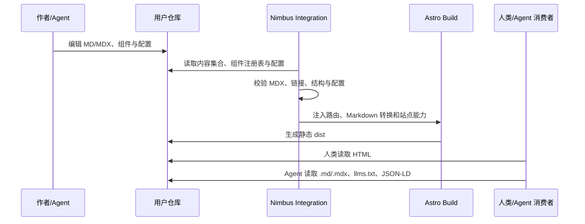
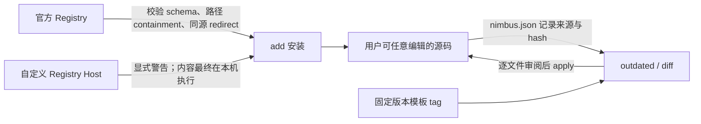

# Cloudflare Nimbus 文档框架架构与成熟度判断

## 调研范围

调研对象为 Cloudflare `cloudflare/nimbus`，源码快照为 `main` 分支
`d14cddd`（2026-07-24），调研时间为 2026-07-26。证据以仓库源码、官方文档、
包 changelog、GitHub/NPM 元数据和本地构建测试为主。

## 简答

Nimbus 不是普通的 Astro 文档主题。它的关键设计是把文档站拆成“用户拥有的可编辑
源码、包管理器维护的稳定机制、按需复制的 Registry 扩展”三层，并默认同时产出
HTML、Markdown/MDX twin、`llms.txt` 和结构化元数据，让人和 Agent 读取同一份
内容。

这个方向值得关注，尤其适合重视源码所有权、静态部署和 Agent 可读性的技术文档。
但截至快照时它仍是一个发布不足两周、pre-1.0、维护者高度集中的新项目。结论应是：
**可用于低风险新站试点，不适合未经验证就替换成熟生产文档平台。**

## 它解决的核心矛盾

传统文档框架通常落在两个极端：

- 主题/平台托管大量 UI 与行为，升级方便，但深度定制容易受抽象和版本约束。
- 把主题源码完整 fork 到项目，所有权清楚，但上游修复和升级容易断裂。

Nimbus 试图把“审美和布局”留给用户，把“只有一个正确答案的机制”留在框架包，
再通过 Registry 分发并不需要首日安装的组件和功能。这不是消除维护成本，而是明确
维护成本由谁承担。

## 系统架构

```mermaid
flowchart TB
    C[create-nimbus-docs CLI] -->|拉取固定 templates-v 版本| S[用户仓库中的 Starter 源码]
    S --> UI[布局、组件、样式、内容]
    P[@cloudflare/nimbus-docs] -->|Astro integration 与 helpers| S
    R[Nimbus Registry] -->|add 后复制源码或交付 Agent recipe| S
    UI --> A[Astro 7 + Sätteri + Tailwind v4]
    A --> O[静态站点 dist]
    O --> H[HTML / 搜索 / OG / Sitemap]
    O --> M[每页 .md 与 .mdx twin]
    O --> L[llms.txt / llms-full.txt]
```

三层边界如下：

- **Starter 源码**：布局、Tailwind class、主题 token、可见组件都进入用户仓库；
  用户可以直接改，也因此承担合并上游改动的责任。
- **`@cloudflare/nimbus-docs`**：Astro 集成、内容 schema、侧栏/面包屑/分页算法、
  Markdown 转换、校验器和 CLI 等“机制”。
- **Registry**：按需分发 UI、utility 和 feature。快照实测生成 50 个条目：
  29 个组件、3 个库、18 个 feature。

## 内容构建与 Agent 读取链路



Agent surface 的实质不是放一个 `AGENTS.md` 就结束，而是构建期生成：

- 每个页面的可读 `.md` twin 和原始 `.mdx` twin；
- 站点级与分区级 `llms.txt`；
- 可复现的 `llms-full.txt` 全量语料；
- JSON-LD、sitemap、robots 和 canonical/version 元数据；
- 脚手架中的 `AGENTS.md` 审计说明。

这使 Agent 不必从复杂 DOM 中反向抽取正文。不过 `llms-full.txt` 的全量聚合会随
站点规模增长，是否适合大型文档库仍需实际测量上下文、传输和索引成本。

## 所有权、升级与信任边界



升级设计比简单复制模板完整：

- 脚手架按自身版本拉取不可变 `templates-v<version>` tag，避免“同一版本今天和
  明天生成不同代码”。
- `nimbus.json` 记录 starter 和 registry 文件状态。
- `outdated`、`diff`、`diff --apply` 提供逐文件升级，而不是自动三方合并。
- `add --yes` 不覆盖用户文件，必须显式 `--overwrite` 才会替换。
- Registry 对路径穿越、跨域重定向、无效 JSON、危险依赖名有测试。

代价也很清楚：所谓“拥有源码”意味着上游 UI 改进不会无成本进入项目。逐文件 diff
比黑盒主题更可控，但长期定制越深，升级审阅成本越高。Registry 或 feature recipe
最终会把代码写进仓库并执行，仍需把 Registry host 当作软件供应链信任根。

## 工程质量与成熟度

### 正面证据

- 本地运行 509 个测试全部通过：`nimbus-docs` 497 个、脚手架 7 个、Registry
  invariant 5 个。
- framework 与 scaffolder 构建通过；两个 Astro 站点 typecheck 无错误；
  starter 和官网均完成静态构建。
- starter 构建实际产出 HTML、Pagefind 索引、OG 图片、sitemap、
  `llms.txt`、`llms-full.txt` 和 `.md/.mdx` twin。
- 发布链路使用 Changesets、NPM Trusted Publishing/OIDC、provenance、
  固定 action SHA、不可变 template tag、发布后全模板 smoke test。
- Registry 有路径 containment 和 trust-boundary 测试，体现了对“复制并执行外部
  代码”这一风险的明确认识。

### 风险证据

- GitHub 仓库创建于 2026-07-09，首个公开提交为 2026-07-15；115 个提交全部
  集中在 2026 年 7 月，历史太短。
- 当前版本分别为 framework `0.8.2`、scaffolder `0.6.3`，README 明确标注
  pre-1.0、public surface 可能在 minor release 发生变化。
- 115 个提交里绝大部分来自同一位核心维护者的多个邮箱身份；有效 bus factor
  仍接近 1。
- 支持面依赖较新技术栈：Node `>=22.12`、Astro 7、Tailwind 4，迁移旧站的兼容
  成本不低。
- 默认 Sätteri Markdown 管线下，常规 remark plugin 会静默失效。框架内部通过
  content-pass 绕开，但用户侧 Mermaid、数学公式和自定义 remark/rehype 生态并非
  无摩擦接入。
- 包在一周内有约 2537（framework）和 1358（scaffolder）次 NPM 下载，说明已有
  早期兴趣，但下载数不能等同于生产采用量。

## 采用建议

### 适合

- 新建的开发者文档站，内容以 Markdown/MDX 为主；
- 希望部署为纯静态文件，并保留 Cloudflare Workers/Pages 之外的迁移自由；
- 重视组件、布局和样式源码所有权；
- 明确需要 Agent 可读页面、`llms.txt`、原始 MDX twin；
- 团队可以 pin 版本并接受逐文件审阅升级。

### 暂不适合

- 已有成熟 Docusaurus、Starlight、Mintlify 或企业文档平台，且没有明确迁移动机；
- 依赖大量 remark/rehype 插件、复杂国际化、权限、审批或站内协作能力；
- 要求稳定 API、长期兼容和多维护者保障的关键生产系统；
- 不愿维护脚手架生成的 UI 源码，只想升级一个主题依赖就获得所有改进。

### 推荐验证路径

1. 选 20—50 页非关键文档做独立试点，不直接迁主站。
2. 固定 Nimbus、Astro 和 Node 版本，记录一次真实升级的 diff 与人工耗时。
3. 验证现有 Markdown 扩展、链接规则、搜索、多语言和部署环境。
4. 用实际 Agent 测试 `.md` twin、`llms.txt` 与 `llms-full.txt` 的检索质量，
   不只检查“文件存在”。
5. 观察至少两个 release 周期，再决定是否进入正式技术栈。

## 证据矩阵

| 结论 | 证据 | 位置 | 置信度 / 限制 |
| --- | --- | --- | --- |
| Nimbus 采用三层所有权模型 | 官方架构说明与源码目录 | `CLAUDE.md`、`packages/`、`apps/www/registry/` | 高 |
| Agent surface 是构建产物而非宣传标签 | 本地构建生成 twin、llms、元数据 | starter 与 www 的 `dist/` | 高 |
| 升级强调可审阅、非自动覆盖 | CLI changelog 与相关测试 | `packages/nimbus-docs/test/cli-*` | 高 |
| 供应链边界有主动防护 | Registry trust/containment 测试及发布 workflow | `registry-*.test.ts`、`.github/workflows/` | 高；不代表无漏洞 |
| 工程实现已有较强测试基础 | 509 个测试、typecheck、build 实测 | 2026-07-26 本地快照 | 高；仅覆盖当前环境 |
| 项目仍处早期阶段 | 创建日期、提交历史、0.x 声明 | GitHub API、git log、README | 高 |
| 生态采用尚未得到证明 | NPM 周下载量与极短公开历史 | NPM Downloads API | 中；下载量不是用户数 |
| 维护者集中是持续性风险 | git shortlog | 当前提交历史 | 中高；未来可快速变化 |

## 当前张力与未决问题

- “源码归用户”与“上游持续演进”之间的合并成本，尚无多年项目数据验证。
- Agent-friendly 输出是否真正提升代码 Agent 的正确率，需要任务级评测，而不是
  只看 `llms.txt` 是否存在。
- `llms-full.txt` 在大型、多版本文档站的体积、缓存和索引策略仍需观察。
- Sätteri 带来的性能收益与 Markdown 插件兼容损失如何平衡，可能随 Astro 生态变化。
- Cloudflare 是否会投入多维护者、长期稳定承诺和迁移工具，当前不能从品牌归属直接
  推断。

## 来源指针

- [cloudflare/nimbus](https://github.com/cloudflare/nimbus)
- [Nimbus 官方文档](https://nimbus-docs.com)
- [README](https://github.com/cloudflare/nimbus/blob/main/README.md)
- [Agent architecture context](https://github.com/cloudflare/nimbus/blob/main/CLAUDE.md)
- [Framework changelog](https://github.com/cloudflare/nimbus/blob/main/packages/nimbus-docs/CHANGELOG.md)
- [Scaffolder changelog](https://github.com/cloudflare/nimbus/blob/main/packages/create-nimbus-docs/CHANGELOG.md)
- [NPM: @cloudflare/nimbus-docs](https://www.npmjs.com/package/@cloudflare/nimbus-docs)
- [NPM: @cloudflare/create-nimbus-docs](https://www.npmjs.com/package/@cloudflare/create-nimbus-docs)
