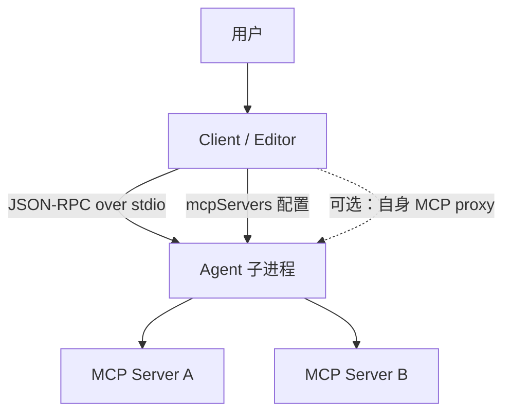
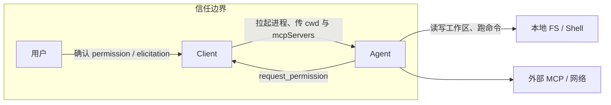
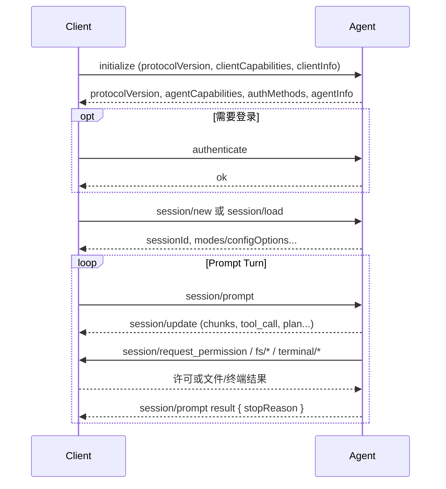
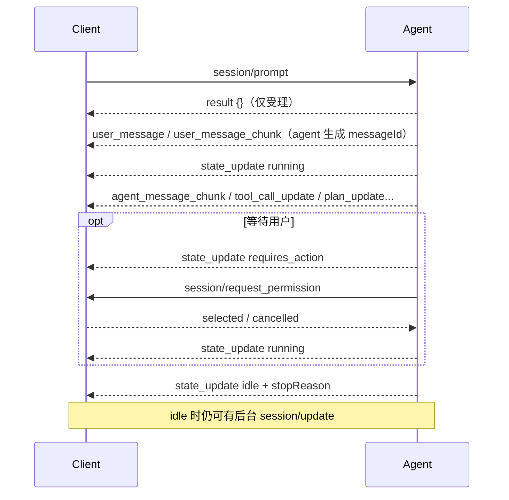
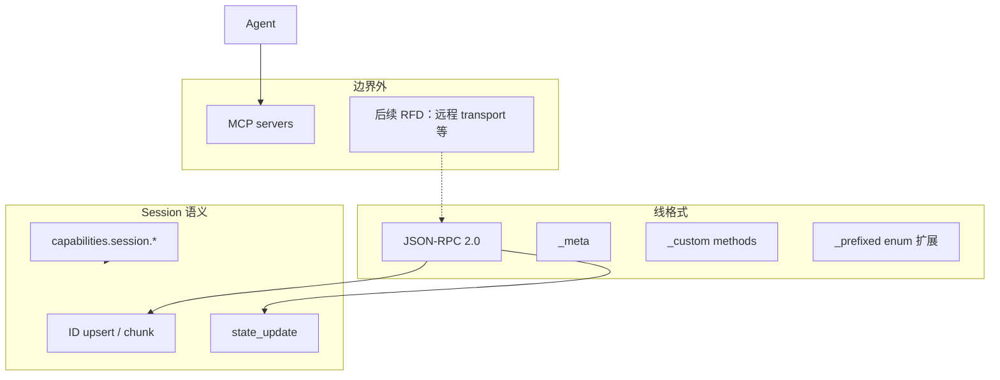

# Agent Client Protocol

## 摘要

Agent Client Protocol（ACP）标准化 **code editor / IDE（Client）** 与 **coding agent（Agent）** 之间的通信，角色类似 LSP 之于语言服务器：Agent 实现一次 ACP，即可接入兼容 Client；Client 支持 ACP，即可接入生态中的 Agent。

协议基于 **JSON-RPC 2.0**。本地场景下 Client 按需拉起 Agent 子进程，经 **stdio** 通信；远程 transport（Streamable HTTP / WebSocket）仍在 RFD 中，尚未进入核心稳定面。内容类型尽量复用 [[MCP]] 的 JSON 表示，并额外定义 coding UX 所需的 diff、plan、permission 等类型。默认面向用户的文本是 Markdown。

当前主线：

| 版本 | 状态 | 心智模型 |
| --- | --- | --- |
| **v1** | 稳定，生态主力 | 用户发起的 **prompt turn**：`session/prompt` 挂起整轮，响应携带 `stopReason` |
| **v2** | Draft（约 2026-07-20 起可测） | **session 生命周期**：prompt 只表示受理；进度与结束靠 `state_update`；消息/tool/plan 按 ID upsert |

实现方应 **v1 / v2 并存**：按 `initialize` 协商版本，v2 用 feature flag 闸住，不要默认砍掉 v1。

## ACP 不是什么

- **不是** Agent 框架：不负责规划算法、记忆、多 Agent 编排。
- **不是** [[MCP]]：MCP 连接 Host 与外部工具/数据；ACP 连接 editor 与 coding agent。二者常同时出现——Client 把用户配置的 MCP server 通过 `mcpServers` 交给 Agent。
- **不是** 模型 API（Chat Completions / Responses / Messages）：那些是应用与模型提供方的协议；ACP 是 UI 与 agent 进程之间的协议。
- **不自动保证安全**：信任模型是“用户在自己的 editor 里使用可信 agent”；仍有 permission、工具边界，但本地文件与 MCP 的暴露由 Client/部署决定。

## 基本架构

| 角色 | 典型形态 | 职责 |
| --- | --- | --- |
| **Client** | IDE、编辑器、agent UI | 用户体验、会话展示、权限确认、环境（cwd、MCP 配置） |
| **Agent** | coding agent 子进程 / 远程 agent | 模型推理、工具执行、流式 `session/update`、拥有 session 历史身份 |

一条连接可承载多个并发 session。通信模型：

- **Methods**：请求/响应（`initialize`、`session/prompt`、`session/request_permission` 等）
- **Notifications**：单向（`session/update`、`session/cancel` 等）

约定：路径必须是绝对路径；行号 1-based；对象键 `camelCase`，判别字段字符串值 `snake_case`。

## 信任与边界

设计哲学（官方 architecture）：

1. **MCP-friendly**：JSON-RPC + 复用 MCP 内容类型，避免再造一套 blob/text 表示。
2. **UX-first**：足够表达 agent 意图（流式消息、diff、plan、tool 状态），但不做过度抽象。
3. **Trusted**：面向“在 editor 里使用可信 agent”；v2 进一步把 **Client 侧 fs/terminal 执行面移除**，Agent 自有执行路径，Client 侧能力优先经 MCP 暴露。

## v1：Prompt Turn 模型

### 连接与会话

v1 核心语义：**`session/prompt` 在整轮工作期间保持 pending**；Agent 期间推送 `session/update`；最终响应用 `stopReason`（`end_turn`、`max_tokens`、`cancelled` 等）结束 turn。

### v1 能力与方法（要点）

- **Agent 基线**：`initialize`、`authenticate`（若需要）、`session/new`、`session/prompt`
- **Agent 可选**：`session/load`、`logout`、`session/set_mode`、list/resume/close（经 capability）、`session/delete` 等
- **Client 基线**：`session/request_permission`
- **Client 可选**：`fs/read_text_file`、`fs/write_text_file`、`terminal/*`、`elicitation/*`

Capability 协商原则（仍适用于 v2 精神）：

- `initialize` 声明的 capability **可选**；
- 新 capability 引入 **不应** 视为 breaking change；
- 对端未声明的 capability 按 **不支持** 处理。

v1 通过 RFD 持续加法（message ID、session list/resume/close/delete、config options、elicitation、usage、registry 等），证明协议可在不大迁的前提下演进；v2 则集中处理 v1 难表达的 **breaking 核心语义**。

### v1 的张力

- Turn 与“后台仍在更新”冲突：排队、steering、多 Client 观察同一 session、非用户发起的工作，都很难和“prompt 响应 = turn 结束”对齐。
- `tool_call` 创建 vs `tool_call_update` 修改分裂收益低；message ID 在 v1 后期才可选稳定。
- Diff 仅 `oldText`/`newText`，难表达 delete/rename/copy/binary。
- Permission 文案常塞进 tool call `title`，污染展示状态。
- Client fs/terminal 实现参差；Agent 往往已有自己的执行路径。

## v2 Draft：Session 生命周期与统一 upsert

**状态**：Draft（公告约 2026-07-20）。schema 有稳定基线 `schema/v2/schema.json` 与 unstable 叠加层；**协商 `protocolVersion: 2` 不等于开启全部 draft 特性**。落地前用版本协商 + feature flag；生产默认勿强切。

### 五大主题

1. **超越 turn**：`session/update` 可在 session 任意时刻发送；`session/prompt` 响应只表示 **受理**；结束与可接收输入由 `state_update` 表达。
2. **统一 patch / upsert**：消息、tool call、terminal、plan 按稳定 ID 更新；省略=不变，`null`=清空，有值=替换，chunk=追加。
3. **Diff 重做**：结构化 `changes`（add/delete/modify/move/copy + fileType）+ 可选 `git_patch`。
4. **Permission 解耦**：必填 `title`、可选 `description`、可扩展 `subject`（`tool_call` / `command` 等）。
5. **默认前向兼容**：enum / tagged union 接受未知值；`_` 前缀留给实现扩展，无 `_` 前缀留给未来 ACP。

### v2 Prompt 生命周期

| 前景信号 | v1 | v2 |
| --- | --- | --- |
| Prompt 已受理 | 隐含 | `session/prompt` → `{}` |
| 用户消息进历史 | 隐含（请求本身） | `user_message`（agent 拥有 `messageId`） |
| 前景工作中 | prompt 仍 pending | `state_update: running` |
| 等用户 | 隐含（permission pending） | `state_update: requires_action` |
| 前景结束 | prompt 响应 + `stopReason` | `state_update: idle` + `stopReason` |
| 取消确认 | prompt 响应 `cancelled` | idle + `stopReason: cancelled` |

`stopReason` 取值与 v1 相同，只是位置从 prompt 响应挪到 idle 的 `state_update`。

### 方法与 surface 对照（迁移要点）

| 区域 | v1 | v2 |
| --- | --- | --- |
| 初始化字段 | `clientCapabilities` / `agentCapabilities`，info 可选 | 双向统一 `capabilities` + **必填** `info` |
| 能力标记 | bool 与 `{}` 混用 | **一律对象**；有 key/`{}`=支持，省略/`null`=不支持 |
| Session 能力 | 分散 + list/resume/close 可选 marker | 嵌套 `capabilities.session`；一声明则 **基线方法必实现** |
| 认证 | `authenticate` / `logout` | `auth/login` / `auth/logout`；有 `authMethods` 则两者都要 |
| 加载会话 | `session/load` + `session/resume` | 仅 `session/resume` + 可选 `replayFrom` |
| 模式 | `session/set_mode`、`current_mode_update` | 并入 config options（`category: mode` 等） |
| Client fs/terminal | 可选执行面 | **删除**；Client 工具走 MCP；展示用 Agent-owned terminal |
| Tool 通知 | `tool_call` + `tool_call_update` | 仅 `tool_call_update`（首见即创建）+ `tool_call_content_chunk` |
| Plan | `plan` 无 ID | `plan_update` + `planId` + type 判别 |
| Diff | `oldText`/`newText` | `changes` + 可选 `patch.git_patch` |
| MCP 配置 | stdio 可无 `type`；可有 SSE | 必填 `type`；**去掉 SSE**；stdio/http 分 capability |

Session 基线方法（v2 声明 `capabilities.session` 即承诺）：`session/new`、`session/list`、`session/resume`、`session/close`、`session/prompt`、`session/cancel`、`session/update`。`session/delete` 等仍可选。

### 扩展面

- **`_meta`**：实现元数据；在 upsert 上同样遵循 omit / null / value。
- **自定义 method**：名称 `_` 前缀（与 v1 相同）。
- **Open enum**：未知值应尽量透传；无 `_` 前缀勿擅自占用。
- **stdio batch**：v2 明确 JSON-RPC 2.0 batch；生命周期敏感消息（`initialize`、`auth/login`、`session/new|resume|prompt`）不要 batch。

## 与 MCP、Code Agent 的关系

| 协议/层 | 连接谁 | 解决什么 |
| --- | --- | --- |
| [[MCP]] | Host/Client ↔ 外部工具与数据 | 发现与调用外部能力、授权与资源 |
| **ACP** | Editor ↔ Coding Agent | 会话、流式 UX、权限提示、diff/plan、能力协商 |
| [[Code Agent]] / `AGENTS.md` | 仓库与 agent 行为 | 仓库内权限、流程、输出约定 |

Client 常见模式：把用户配置的 MCP 与“编辑器自暴露的 MCP proxy”一并放进 `mcpServers`，让 Agent 用统一工具面访问，而不是在 ACP 套接字上再混跑 MCP。

## 实现建议

1. **双版本**：共享业务逻辑，协议层 v1/v2 分面；`initialize` 后按协商版本选 surface。
2. **v2 闸门**：`protocolVersion: 2` + 独立 feature flag；unstable schema 特性再单独闸。
3. **三态字段**：SDK 必须区分 omitted / `null` / concrete，不能压成普通 optional。
4. **历史所有权**：`messageId` 等由 Agent 生成；Client 以 update 为真相来源（含 replay）。
5. **不要把 v2 展示 terminal 当成 Client 执行 API**：无 input/kill/wait；执行与工具走 Agent 自身或 MCP。

## 证据矩阵

| 结论 | 证据 | 位置 | 置信度 |
| --- | --- | --- | --- |
| ACP 标准化 editor 与 coding agent 通信，类比 LSP | 官方 Introduction | [introduction](https://agentclientprotocol.com/get-started/introduction) | 高 |
| 本地 stdio 子进程；可多 session；JSON-RPC 双向 | Architecture | [architecture](https://agentclientprotocol.com/get-started/architecture) | 高 |
| v1 以 prompt turn 为中心，响应带 stopReason | v1 Overview | [v1 overview](https://agentclientprotocol.com/protocol/v1/overview) | 高 |
| v2 为 Draft；应双版本 + feature flag | v2 Draft 公告、Migration | [announcement](https://agentclientprotocol.com/announcements/acp-v2-draft)、[migration](https://agentclientprotocol.com/protocol/v2/migration) | 高 |
| prompt 响应仅受理；结束靠 state_update | Migration「new prompt lifecycle」 | 同上 | 高 |
| Client fs/terminal 在 v2 移除，改走 MCP | Migration「Client file system and terminal execution removed」 | 同上 | 高 |
| Diff 改为 changes + 可选 git_patch | Migration「Diff content」 | 同上 | 高 |
| 远程 HTTP/WS transport 不在 v2 核心面 | Migration「Transports」+ transport RFD | 同上；[transport RFD](https://agentclientprotocol.com/rfds/streamable-http-websocket-transport) | 高（进度会变） |
| v2 细节在稳定前仍可能改 | Draft 公告明确说明 | announcement | 高 |

## 当前张力 / 风险 / 未决

- **v2 仍是 Draft**：字段与语义可能在稳定前调整；过早默认开启会伤用户。
- **双栈成本**：Agent/Client/SDK 需长期同时维护 v1 与 v2。
- **执行面迁移**：去掉 Client fs/terminal 后，依赖该路径的 IDE 集成必须改造成 MCP 或 Agent 本地执行，短期兼容摩擦大。
- **远程 transport**：核心 v2 仍以 stdio 为主；云托管 agent 的标准远程面取决于独立 RFD。
- **多 Client / 排队 / agent 主动消息**：v2 生命周期为此铺路，但产品级队列与冲突策略仍多在实现层。
- **与 MCP 边界**：MCP-over-ACP 等 RFD 存在，边界产品化程度随生态变化。

## 相关页面

- [[Code Agent]]
- [[Agent]]
- [[MCP]]
- [[MCP Client]]

## 来源指针

- [Introduction](https://agentclientprotocol.com/get-started/introduction)
- [Architecture](https://agentclientprotocol.com/get-started/architecture)
- [v1 Overview](https://agentclientprotocol.com/protocol/v1/overview)
- [v2 Overview](https://agentclientprotocol.com/protocol/v2/overview)
- [Migrating from v1](https://agentclientprotocol.com/protocol/v2/migration)
- [ACP v2 Draft 公告](https://agentclientprotocol.com/announcements/acp-v2-draft)
- [v2 Prompt Lifecycle RFD](https://agentclientprotocol.com/rfds/v2/prompt)
- 文档索引：[llms.txt](https://agentclientprotocol.com/llms.txt)
